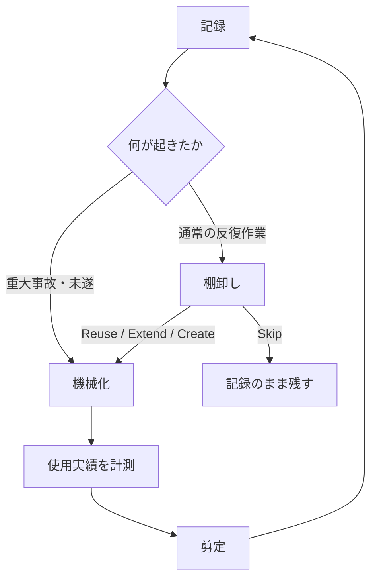

:::message
**この記事で得られること**

- AIエージェントの自己改善を、モデルの学習ではなく「実行環境の改善」として設計する方法
- 記録 → 棚卸し → 機械化 → 剪定を、リスクに応じて分岐させる判断基準
- Skillsやルールを増やしすぎず、古くなったガードを安全に減らす運用
:::

## はじめに：環境を整備するほど、エージェントは劣化した

Claude CodeやCodexと協働するリポジトリで、学びの記録、Skills、コマンド、ガードを1年近く育ててきました。

学びがあればドキュメントに追記する。繰り返す作業があれば再利用できる形にする。事故が起きたらガードを足す。どれも、その時点では正しい改善です。

ところが、セットアップ全体を棚卸しすると、次の状態になっていました。

- Skills一覧は約250エントリ。`description`など切り詰め前のメタデータを独自集計すると、Skill一覧に割り当てられる文字数予算の約4〜5倍
- 累計622セッションで1〜2回しか使われていないSkillsが19個常駐
- 同じ目的のSkillsが3系統に重複
- 別プロジェクト用のGitHubアカウント切替ガードがユーザーレベルに残り、このリポジトリでは正しいアカウントを誤りとして扱いかねない状態

Claude Codeは、利用可能なSkill名と説明の一覧をコンテキストへ読み込みます。一覧が文字数予算を超えると説明が短縮され、呼び出し判断に必要なキーワードが失われる可能性があります。これは[公式ドキュメント](https://docs.anthropic.com/en/docs/claude-code/skills)にも記載されています。上記の倍率は `/context` の表示値ではなく、棚卸し時に切り詰め前のメタデータを独自集計した概算です。具体的な予算や切り詰め方はバージョンによって変わるため、固定値は運用基準にしていません。

うちの環境では、一覧の肥大化とルールの陳腐化により、「あるはずのSkillが選ばれない」「古いガードが現在の運用と衝突する」という問題が実際に起きていました。

AIエージェントの環境は、足すだけでは資産になりません。使われない部品はコンテキストを圧迫し、古いガードは将来の操作を誤誘導します。

この記事では、その反省から運用している自己改善ループを紹介します。

## この記事でいう「自己改善」

ここでいう自己改善は、モデルの重みを更新することでも、AIに無制限な自己書き換えを許すことでもありません。

セッションで得た学びを記録し、必要なものだけをSkills・コマンド・Hooks・CIへ昇格させ、使われなくなった部品を削る。つまり、**AIエージェントが働く実行環境（ハーネス）を、実績に基づいて更新すること**を指します。

改善対象は、たとえば次のものです。

- lessons-learnedファイルとmemory
- Skills、コマンド、テンプレート
- Git hooksとClaude Code Hooks
- チェッカー、CIゲート、承認フロー
- エージェントへ渡すルールとコンテキスト

AIが改善案を抽出したり変更案を作ったりしても、公開・マージ・削除のような影響の大きい操作には人間の承認を残します。「自己改善」と「自己決定」は分けて設計します。

## 4段階ではなく、4つの機能として考える

自己改善を、次の4つの機能に分けています。

| 機能 | 何をするか | 主な頻度 | アウトプット |
| --- | --- | --- | --- |
| 記録 | 学び・失敗と根拠を残す | 即時 | lessons learned、memory |
| 棚卸し | 反復実績から再利用方法を決める | 月次 | Reuse / Extend / Create / Skip |
| 機械化 | 注意力頼みのルールを実行時制御へ移す | 事故・未遂時／棚卸し時 | Hooks、チェッカー、CI |
| 剪定 | 未使用・重複・矛盾した部品を減らす | 週次〜月次 | 削除、統合、無効化 |

便宜上4つに分けていますが、常に「記録 → 棚卸し → 機械化 → 剪定」と直列に進むわけではありません。

通常の作業は回数を見てから部品化します。一方、不可逆な事故や大きな損失につながる操作は、回数を待たずに機械化します。作ったものはすべて、後から剪定される前提です。

## 1. 記録：部品化を判断せず、その場で書く

学びは `AGENT_LEARNINGS.md` に集約しています。現在は約70エントリです。非自明な落とし穴や成功パターンを見つけたら、そのセッション中に追記します。

この段階で決めることは、次の2点です。

- **部品化するかは決めない。** Skillsやコマンドへ昇格する判断は月次棚卸しに送る
- **推測で断定しない。** PR番号、エラーメッセージ、再現手順などの根拠を添える

記録時点で再利用方法まで設計しようとすると、記録のコストが上がり、続かなくなります。一方、根拠のない「学び」は、次のセッションで誤った前提として再利用されます。

保存先は、知識の適用範囲と用途で分けます。

| 知識 | Claude Codeでの保存先 |
| --- | --- |
| リポジトリ固有の事実・失敗・再現手順 | リポジトリ内のlessons-learnedファイル |
| Claude Codeがそのリポジトリで再利用する発見 | auto memory |
| 全プロジェクトで守らせたい個人ルール | ユーザースコープの `CLAUDE.md` |
| チームで共有するルール | リポジトリ内または管理対象の `CLAUDE.md` |

Claude Codeのauto memoryはリポジトリ単位で、worktree間では共有されますが、全リポジトリ共通の記憶ではありません。また、`CLAUDE.md`とauto memoryはいずれもモデルへ渡すコンテキストであり、操作を強制するガードではありません。Codexなど別のエージェントでは、同じ分類をそれぞれの保存先と読み込み範囲へ対応づけます。詳しい仕様は[Claude Codeのmemory](https://code.claude.com/docs/en/memory)を参照してください。

- [AIエージェントの学びを腐らせない AGENT_LEARNINGS.md の運用](https://zenn.dev/minewo/articles/agent-learnings-md-operation)
- [AIエージェントの自律性とmemoryの境界](https://zenn.dev/minewo/articles/ai-agent-autonomy-boundary-with-memory)

## 2. 棚卸し：反復した作業だけを部品化候補にする

月次で直近30日のセッションログ、memory、既存のSkills・エージェント・ワークフローを突き合わせます。

便利にする部品は、**同型の作業が2回以上繰り返された場合だけ**棚卸し対象にします。

| 判定 | 意味 | 対応 |
| --- | --- | --- |
| Reuse | 既存部品で対応できる | 新しく作らず、既存部品を使う |
| Extend | 既存部品に不足がある | 適用範囲を確認して最小限拡張する |
| Create | 既存部品では対応できない | 最小構成で新規作成する |
| Skip | 反復しているが費用対効果が低い | 記録だけ残し、部品化しない |

AIを使えば、Skillのひな形は数分で作れます。しかし本当のコストは作成時ではありません。

- 一覧へ常駐し続けるコンテキスト費用
- 仕様変更への追随
- 重複部品の探索と選択
- 陳腐化した手順が将来のセッションを誤誘導するリスク

直近の棚卸しでは、次の実績がありました。

- 長時間タスク中に人間が「続き」と入力した回数：30日で55件 → 反復駆動コマンドへ置換（Create）
- セルフレビューと外部AIによる多視点検証を生プロンプトで依頼した回数：28件 → 既存の多視点レビューへ統合（Reuse）

部品化の根拠は「便利そう」ではなく、実際に繰り返した操作です。

### 2回ルールと3回ルール

対象によって、待つ回数を変えます。

| 対象 | 判断基準 | 待つ回数 |
| --- | --- | --- |
| 棚卸し候補 | 同型作業の反復 | 2回 |
| 通常のSkill・テンプレート | 2回以上かつReuse / Extend不可 | 棚卸し後に作成 |
| 危険操作のコマンド化 | 手順と承認点が安定している | 手順書で3回完走 |
| 重大事故を防ぐガード | 期待損失と可逆性 | 待たない |

ZennとQiitaの公開パイプラインは、npm scriptと手順書で3サイクルずつ完走してからコマンド化しました。毎回同じ部分だけを自動化し、公開とマージには人間の承認ゲートを残しています。

## 3. 機械化：自然言語のルールを、実行時ガードへ移す

「学びとして書いてあるのに、また同じ事故を起こした」場合は、注意書きではなく機械化を検討します。

ただし、すべてを同じHookで止められるわけではありません。実行場所と強制範囲を分けて考えます。

| 仕組み | 主な実行場所 | 向いている用途 | 限界 |
| --- | --- | --- | --- |
| Git hook | ローカルのGit操作 | commit前の混入防止 | `--no-verify`や未導入環境で回避可能 |
| Claude Code `PreToolUse` Hook | Claude Codeのツール実行前 | エージェント操作の検証・ブロック | Claude Code以外の操作には効かない |
| 独自チェッカー | ローカル／CI | 複数条件をまとめた状態検証 | 呼び出し経路への組み込みが必要 |
| CIゲート | GitHub Actionsなど | リモートでの最終検証 | Branch protection等の設定が必要 |

Claude Code Hooksは、特定のライフサイクルイベントで処理を実行する仕組みです。自然言語の指示より決定的な制御に向きますが、発火するイベントと実行環境の範囲を超えては強制できません。`PreToolUse`で操作を止める場合、単なる `exit 1` は通常ブロックを意味しないため、`exit 2`または構造化JSONによる拒否を使います。詳細は[Hooksガイド](https://docs.anthropic.com/en/docs/claude-code/hooks-guide)と[Hooksリファレンス](https://code.claude.com/docs/en/hooks)を参照してください。

実際に機械化した例です。

- mainへの直接commit → Git pre-commit hookでブロック
- CLI専用キャッシュや一時ブロックの混入 → Git pre-commit hookでブロック
- 古いPRがmainの変更を巻き戻す事故 → fetch、state確認、mergeシミュレーションを行うチェッカーで検知
- レビュー必須指摘が未解決のまま公開 → CIゲートで検知

可能なら判定ロジックは独自チェッカーへ集約し、Git hook、Claude Code Hook、CIから同じチェッカーを呼び出します。チェッカーが非ゼロで終了したとき、CIやラッパーコマンドはそのまま失敗させ、Claude Codeの `PreToolUse` Hookでは結果を `exit 2`へ変換します。レイヤーごとに同じ条件を実装し直さずに済み、判定のずれを抑えられます。

ローカルのHookは、事故を完全に防ぐものではありません。目的は、**ルールを破るために明示的な操作が必要な状態へ変えること**です。最終防衛は、CIとBranch protectionのようなリモート側の検証と組み合わせます。

また、公開・マージ・削除・権限変更のような操作は、機械化しても承認まで自動化しません。手順の自動化と、実行権限の委譲は別の判断です。

- [セッションの振り返りを改善フローにつなげる方法](https://zenn.dev/minewo/articles/engineering-process-improvement-skill)

## 4. 剪定：使用回数だけで削らない

記録・棚卸し・機械化だけを回すと、改善のたびに環境が重くなる片道ループになります。作った部品は、すべて剪定対象です。

私の環境では、Claude Codeがローカルに保持する情報とセッションログを点検時に集計し、累計使用回数や最終使用時期を確認しています。本記事では、Skillが明示的または自動的にロードされたセッションを「使用」として数えています。ただし、これはSkill単位の利用分析を保証する公式機能でも、製品間で比較できる標準指標でもありません。保存場所や集計粒度はバージョンと構成に依存するため、622セッションという数字を含め、自分の環境で観測した参考値として扱っています。

同じカウンタが取得できない場合も、次の方法で代替できます。

- セッションログからSkillやコマンドの呼び出しを数える
- 追加commit以降の参照履歴を調べる
- 月次棚卸しで、直近の利用有無を確認する

重要なのは精密な計測基盤ではなく、使用実績と現在の正しさを定期的に問い直すことです。

### 剪定の判断基準

使用回数が少ないだけでは削除しません。低頻度でも、損失の大きい事故を防ぐガードには価値があります。

| 観点 | 剪定候補 | 残す・見直す例外 |
| --- | --- | --- |
| 最終使用時期 | 長期間使われていない | 低頻度だが重大事故を防ぐ |
| 使用回数 | 導入後1〜2回 | 季節・公開・復旧など低頻度の定型作業 |
| 重複 | 同目的の部品が複数ある | 実行環境や権限境界が異なる |
| 正確性 | 現在の環境と矛盾する | 原則として修正または無効化 |
| コンテキスト費用 | 長い説明が常駐する | オンデマンド化できない基盤ルール |
| 可逆性 | 削除しても容易に復元できる | 復元困難なら無効化から始める |

直近では、次の剪定を行いました。

- 累計622セッション中、使用1〜2回のSkills 19個を、役割とリスクを確認したうえで無効化
- 同一機能のSkills 3系統を1つへ統合
- 累計3回しか使われず、代替可能だったプラグインを無効化
- ハーネスが自動提示する一覧と重複していたツール表を削除

無効化を優先するのは、剪定そのものを可逆にするためです。一定期間問題がなければ削除へ進めます。

### 古いガードは「無害な余分」ではない

剪定で最も危険だった発見は、別プロジェクト用のGitHubアカウント切替ガードでした。

:::message alert
ユーザーレベルに常駐していたガードの期待アカウントが別プロジェクトの値だった。このリポジトリで発動すると、正しいアカウントを誤りと判断し、逆方向へ切り替えようとする状態だった。
:::

ガードは作った時点の環境を固定化します。環境が変われば、安全策だったものが逆ガードになり得ます。

そのため、ガードは使用回数だけでなく、次の観点で優先的に点検します。

- 適用スコープは現在も正しいか
- 期待値をハードコードしていないか
- 失敗時に安全側へ倒れるか
- 誤検知したときに何を変更するか
- 現在の認証・ブランチ・公開フローと矛盾しないか

memoryも同様に、週次で重複・矛盾・陳腐化を検出し、人間確認後に統合または削除します。うちではこの定期クリーニングを `memory-dream` と呼んでいます。

## 実際に回している運用カレンダー

- **即時**：学び・失敗と根拠を記録する
- **重大事故・未遂の発生時**：回数を待たず、実行時ガードへ移せないか検討する
- **週次**：memoryと高リスクなガードの矛盾・陳腐化を点検する
- **月次**：30日分の反復作業をReuse / Extend / Create / Skipに分類し、既存部品を剪定する

月次棚卸しの入出力は次のとおりです。

| | 項目 |
| --- | --- |
| 入力 | 反復作業と回数、事故・未遂、既存部品、最終使用時期、使用回数、適用スコープ |
| 出力 | Reuse / Extend / Create / Skip、機械化候補、無効化・統合・削除候補、承認が必要な変更 |

運用結果を残すときは、「何を追加したか」だけでなく、何を作らなかったか、何を減らしたかも記録します。追加件数だけを改善指標にすると、環境の肥大化が成果に見えてしまうためです。

## 自動化してよい範囲、承認を残す範囲

自己改善ループでは、AIが改善候補の抽出から変更案の作成、検証まで進められます。ただし、すべてを自動実行させる必要はありません。

| 処理 | 基本方針 |
| --- | --- |
| ログ集計・重複検出 | 自動化する |
| Reuse / Extend / Create / Skipの提案 | AIに提案させる |
| Skill・ルールの変更案作成 | AIに実施させる |
| テスト・静的検証 | 自動化する |
| ユーザーレベル設定の変更 | 人間が確認する |
| ガードの削除・権限変更 | 人間が確認する |
| 公開・マージ | 人間が承認する |

自動化するのは、観測、提案、可逆な変更、検証までです。影響範囲が広い変更と不可逆な操作には、明示的な承認を残します。

## おわりに：成長させるより、変化を統制する

この自己改善ループで重要なのは、AIが自動的に賢くなることではありません。

- 記録があるから、棚卸しを印象論にしない
- 棚卸しがあるから、反復していない作業を部品化しない
- 機械化があるから、重要なルールを注意力だけに任せない
- 剪定があるから、記録と改善を続けても環境を太らせ続けない
- 承認ゲートがあるから、AIの改善能力と実行権限を分離できる

モデルの性能が上がるほど、Skillsや自動化を作るコストは下がります。その結果、ボトルネックは「作れるか」から「何を残し、何を強制し、何を捨てるか」へ移ります。

自己改善に必要なのは、追加の速度ではなく、**変化を観測し、昇格を遅らせ、危険だけを早く止め、定期的に減らす仕組み**です。

うちの基準もまだ発展途上です。特に、剪定までの期間や低頻度・高リスクなガードの評価方法は、今後も実績を見ながら更新していきます。
