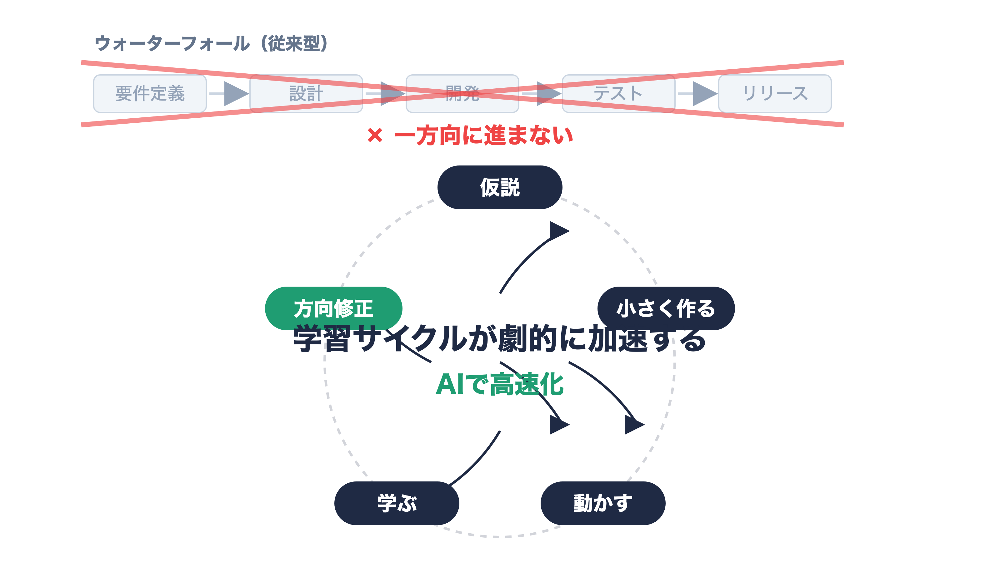
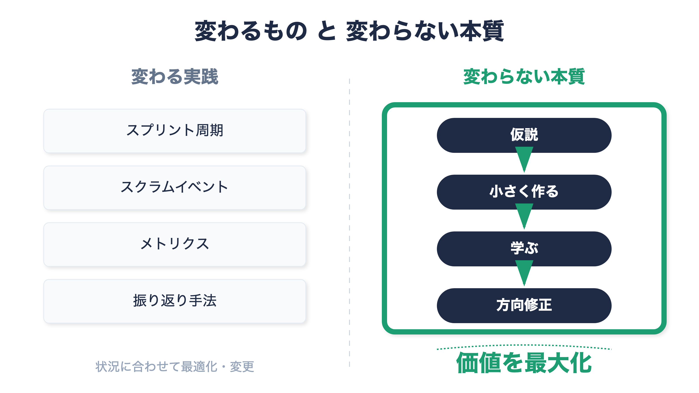

:::message
**想定読者**: スクラム/アジャイルで開発しているエンジニア・スクラムマスター・テックリードで、「AIで開発がウォーターフォールに戻るのでは」という議論が気になっている人

**この記事で得られること**
- 「要件・制約が重要になる」ことと「ウォーターフォール回帰」が別物である理由
- AIが変えるのは実装速度より\*\*仮説検証の速度\*\*だという視点
- スプリント/デイリー/レトロ/メトリクスを AI 時代にどう問い直すかの具体論点
:::

## TL;DR

- AIで要件定義・設計の重要性は増すが、それは「最初に全部固める」ウォーターフォール回帰ではない
- AIは実装・テスト・修正のコストを下げる → 短いフィードバックループを回すアジャイルの価値はむしろ高まる
- 変わるのは実践の形（スプリント周期・スクラムイベント・メトリクス）。変わらないのは「仮説→小さく作る→学ぶ→方向修正」の本質
- 「速く作れる」≠「正しく作れる」。設計・ドメイン理解・判断の責任は人間側に一層残る

「AIによって、ソフトウェア開発は再びウォーターフォール型に戻る。」

そんな意見を見かけることが増えてきました。

その問題提起には、とても共感しています。AIをうまく活用するには、要件や制約、前提条件を明確にすることが重要だからです。

一方で、そこから導かれる結論については、自分の考えは少し違います。

私は、AIによって開発が再びウォーターフォール化するのではなく、むしろアジャイルの価値はこれまで以上に高まると考えています。

## 要件や制約が重要になることと、ウォーターフォールに戻ることは違う

確かに、AIを活用した開発では、曖昧な指示はそのまま曖昧な成果物につながります。

AIに期待する振る舞いを明確にするには、次のような情報が必要です。

- 何を実現したいのか
- どの制約を守るべきか
- どの品質基準を満たすべきか
- どの設計方針に従うべきか
- どこまでをAIに任せ、どこからを人が判断するのか

この意味で、要件定義や設計の重要性は間違いなく増しています。

ただし、それは「最初にすべてを固めて、あとは計画通りに作る」という従来型のウォーターフォールに戻ることを意味しません。

むしろ逆です。

AIによって実装・テスト・修正のコストが劇的に下がることで、短いフィードバックループを高速に回すアジャイルの価値は、これまで以上に高まるはずです。

## アジャイルの本質は、最初にすべてを決めることではない

アジャイルの本質は、最初に完璧な計画を立てることではありません。

本質は、短いフィードバックループを通じて学習し、継続的に価値を最大化していくことにあります。

- 仮説を立てる
- 小さく作る
- 実際に動かす
- フィードバックを得る
- 学びをもとに方向修正する

このサイクルを繰り返すことで、顧客やユーザーにとって本当に価値のあるものに近づいていく。

私はここに、アジャイル開発の本質があると考えています。

## AIは学習サイクルを加速する

AIの大きなインパクトは、単に「コードを書く速度が上がる」ことだけではありません。

より重要なのは、仮説検証の速度が上がることです。

たとえば、AIによって次のようなことがやりやすくなりました。

- アイデアをすぐにプロトタイプ化できる
- テストコードを高速に生成できる
- バグ修正のリードタイムを短縮できる
- 複数の実装案を低コストで比較できる
- リファクタリングを素早く試せる

つまり、変更のコストが下がっています。

そして、変更のコストが下がるほど、仮説検証を繰り返すアジャイルの強みは大きくなります。

## 速く作れることは、正しく作れることを意味しない

一方で、AIを使えば何でもよくなるわけではありません。

現場では、次のような感覚もあります。

> 作るスピードは上がるが、壊すスピードも上がる。

AIは実装を高速化します。しかし、システム全体の整合性や設計の妥当性を自動的に保証してくれるわけではありません。

だからこそ、設計原則やアーキテクチャ理解、ドメイン理解の重要性はむしろ高まります。

AIによって「作ること」は容易になります。

しかし、「何を作るべきか」「どのような構造で作るべきか」「どの変更を受け入れるべきか」を判断する責任は、これまで以上に人間側に残ります。

## AI時代のスクラムは、実践の形そのものを問い直す

AIによって、実装・テスト・修正のサイクルは劇的に高速化しています。

その結果、これまで当たり前とされてきたスクラムの実践についても、改めて問い直す必要があると感じています。

- これまで通りの1〜2週間のスプリント周期は、本当に最適なのか
- デイリースクラムは、進捗確認中心のままでよいのか
- レトロスペクティブでは、AI活用そのものを振り返る必要があるのではないか
- ベロシティのような従来の指標は、引き続き有効なのか
- AIによる生産性向上や学習速度を、どのように計測・評価すべきか

気になることは多くあります。

まだ、業界全体として確立された答えがあるわけではありません。

だからこそ今は、AI駆動開発をアジャイル開発やスクラムにどう取り込むべきかを、現場で試行錯誤しながら探っていく面白い時期だと感じています。

ただし、実践の形は変わっても、アジャイル開発における本質の部分は変わらずにそこにあると考えています。

アジャイルの本質は、計画を固定することではありません。

短いフィードバックループを通じて学習し、継続的に価値を最大化していくことです。

AIは、この学習サイクルをこれまで以上に高速に回すための強力な技術です。

その結果、スプリントの長さ、スクラムイベントの進め方、振り返りの観点、メトリクスの設計は大きく変わるかもしれません。

しかし、「仮説を立て、小さく作り、学び、方向修正する」という根本思想そのものは、むしろこれまで以上に重要になるはずです。

## これから見直したい論点

個人的には、AI時代のアジャイル実践では、少なくとも次の論点を見直す必要があると考えています。

| 論点 | これまで | AI時代に考えたいこと |
|---|---|---|
| スプリント周期 | 1〜2週間が一般的 | 価値検証の速度に応じて、より短い周期や柔軟な区切りを検討する |
| デイリースクラム | 進捗・障害の共有 | AI活用状況、生成物のリスク、意思決定の共有を重視する |
| レトロスペクティブ | プロセス改善 | AIとの協働方法、プロンプト、レビュー観点、学習の質を振り返る |
| メトリクス | ベロシティ、消化量、完了数 | 学習速度、仮説検証数、リードタイム、価値提供の質を見る |
| チームスキル | 実装力中心 | 設計力、判断力、AIへの指示力、レビュー力がより重要になる |

AI時代においては、「どれだけ速く作ったか」だけでは不十分です。

むしろ重要なのは、どれだけ速く学べたか、どれだけ価値ある方向修正ができたかです。

## スクラムの価値はむしろ高まる

スクラムは、開発速度が遅い時代のための手法ではありません。

変化が大きく、不確実性が高い環境で、チームが学習しながら価値を届けるためのフレームワークです。

AIによって変化の速度が上がるなら、スクラムの価値は下がるのではなく、むしろ高まります。

- スプリントで仮説検証を高速に回す
- スプリントレビューで成果物を早く評価する
- レトロスペクティブでAI活用方法を改善する
- プロダクトバックログの優先順位を柔軟に見直す
- チームとしての学習を可視化する

AIはスクラムを不要にするものではありません。

むしろ、スクラムの各イベントをより学習志向に変えていくきっかけになると考えています。

## まとめ

AIによって、要件定義や設計の重要性は増しています。

しかし、それはウォーターフォールへの回帰を意味するものではありません。

AIによって、実装・テスト・修正のコストは下がります。

その結果、短いフィードバックループを通じて学習するアジャイルの価値は、これまで以上に高まります。

もちろん、スプリントの周期、振り返りの手法、計測・評価の仕方は変わっていくはずです。

変わるべき実践は多くあります。

一方で、変わらない本質もあります。

それは、仮説を立て、小さく作り、学び、方向修正しながら、継続的に価値を最大化することです。

AIはアジャイルを置き換える技術ではありません。

AIは、アジャイルの実践をこれまで以上に高速かつ強力にする技術だと考えています。
