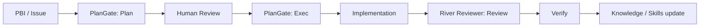

:::message
この記事は、私が運営している [Growth Lab](https://the3396.com/articles) の検証ログと、[PlanGate](https://github.com/s977043/plangate/) / [River Reviewer](https://github.com/s977043/river-reviewer/) の公開リポジトリをもとに、AI駆動開発を実務で回すための設計を整理したものです。
:::

:::message
**この記事で得られること**

- PlanGate と River Reviewer の役割の違い
- 実装前と実装後でガードを分ける考え方
- 小さく始める導入順と、運用に載せるときの見方
:::

AI コーディングは、手を動かす速度を一気に上げてくれます。
一方で、速度が上がるほど次の問題が目立ちます。

- いつの間にかスコープが広がる
- 実装は進むのに、計画が曖昧なまま残る
- レビュー指摘が人によってぶれる
- セッションが変わると、判断の根拠が消える

この問題に対して、私は「AIにもっと頑張らせる」のではなく、**止める場所と進める場所を先に設計する**のが本質だと考えています。

その役割分担をかなりきれいに切り分けたのが、PlanGate と River Reviewer です。

## TL;DR

この2つは、役割が違います。

| 役割 | PlanGate | River Reviewer |
| --- | --- | --- |
| 主な対象 | 実装前 | レビュー時 |
| 目的 | 計画が通るまでコードを書かせない | 暗黙知のあるレビューを再現可能にする |
| 出力 | Plan / Todo / Test Cases / Review | Agent Skills ベースのレビュー / Verify |
| 強み | ゲート設計 | 再現性と学習可能性 |

ざっくり言うと、

- **PlanGate** は「いつ書いていいか」を制御する
- **River Reviewer** は「どう見ればいいか」を標準化する
- **実装前** と **実装後** のガードを分けると、AI の自由度と安全性を両立しやすい

AI 駆動開発で難しいのは、実は実装そのものよりも、**進行の統制**と**レビューの統一**です。
この2つを分けると、運用がかなり安定します。

もう少し実務寄りに言うと、PlanGate と River Reviewer は「AIに何をさせるか」ではなく、「人間がどこで判断するか」を整理するための道具です。
AIエージェントを増やすほど、実装速度よりも判断の置き場所が重要になります。

| 判断したいこと | 置く場所 | 理由 |
| --- | --- | --- |
| この変更を始めてよいか | PlanGate | 実装前なら手戻りが小さい |
| この変更は期待通りか | River Reviewer | 差分を見て評価できる |
| 次回から何を直すか | Skills / Knowledge | 失敗を運用知識に戻せる |

この3つを混ぜると、AIに「計画も実装もレビューも改善も全部よろしく」と投げる形になります。
短期的には速く見えますが、チームで回すほど再現性が落ちます。

---

## PlanGate は「実装前の安全装置」

PlanGate の考え方は、とてもシンプルです。

> 計画を承認しないと AI は 1 行もコードを書けない

ここで重要なのは、AI を縛ることではありません。
**人間が確認すべきポイントを、実装の前に固定すること**です。

PlanGate が扱う流れは、次の3段階です。

1. `plan` で変更計画を作る
2. 人間がレビューする
3. `exec` で実装に進む

この流れの良さは、AI に自由に走らせる前に、少なくとも次の3点を揃えられることです。

- 何をやるか
- 何をやらないか
- どうなったら終わりか

実務では、この3つが曖昧なまま実装に入ると、あとから修正コストが跳ね上がります。
PlanGate は、その手戻りを前で止めるために、AI 駆動開発の「着手条件」を明確にします。

スプリントで PBI を回す現場や、TDD を先に置きたい場面では特に馴染みやすいです。**スピードを落とす仕組みではなく、手戻りを減らす仕組み**として見るのが正確です。

### Planで見たい項目

PlanGateを使うとき、計画に何を書かせるかが重要です。
私は最低限、次の項目を見たいです。

```markdown
# Plan

## Goal
何を達成するか

## Non-goals
今回はやらないこと

## Files likely to change
変更されそうなファイル

## Test plan
実行するテスト、追加するテスト

## Risks
壊れやすい箇所、確認が必要な前提

## Acceptance criteria
完了条件
```

特に効くのは `Non-goals` と `Risks` です。
AIは親切なので、関連しそうな改善をつい広げがちです。
「今回はやらないこと」を明示すると、スコープ膨張を止めやすくなります。

また、リスクを書かせると、人間のレビュー観点が前倒しされます。
実装が終わってから「ここ危ないよね」と気づくより、計画段階で確認したほうが軽いです。

---

## River Reviewer は「レビュー知識の再現装置」

River Reviewer は、暗黙知を再現可能な `Agent Skills` に変えることを目指した AI コードレビューのフレームワークです。

ポイントは、レビューを「その場の勘」から切り離すことです。

レビューがぶれるのは、レビュアーの能力不足というより、次の情報が散らばっているからです。

- 何を重視するか
- 何を禁止するか
- どこで止めるか
- 何で検証するか

River Reviewer では、これをスキルとして明示化し、GitHub Actions や CLI などで再利用できる形に寄せています。

中心にあるのは、リスクに応じて AI の自由度を設計し、`Plan / Validate / Verify` でレビュー運用を分ける考え方です。人間の承認点を残したまま AI の再現性を上げられるので、レビューを単なるコメント生成ではなく、**組織の知識を育てる工程**として扱えます。

### Skillに落とすときの粒度

River Reviewer 的な運用で大事なのは、レビュー観点を大きくしすぎないことです。
「良いコードかレビューして」では、毎回違う指摘になります。

たとえば、次のように分けます。

```text
skills/
├── nextjs-app-router-review.md
├── auth-security-review.md
├── database-migration-review.md
└── article-quality-review.md
```

それぞれのスキルには、見る観点と止める条件を書きます。

```markdown
# auth-security-review

## 見る観点

- 認証と認可が混ざっていないか
- UIだけでアクセス制御していないか
- エラーメッセージからユーザー存在有無が漏れないか

## 止める条件

- 権限チェックなしで保護リソースにアクセスできる
- secret がログやレスポンスに出る
- セッション検証を迂回する変更がある

## Verify

- npm run test:auth
- 関連するE2Eを実行する
```

この粒度なら、人間の暗黙知をAIが使いやすい形にできます。
レビューコメントの文面を自動化するというより、レビュー時に見るべき地図を固定するイメージです。

---

## 2つをつなぐと何が起きるか

PlanGate と River Reviewer を別々に使うだけでも意味はあります。
でも、両方をつなぐと運用の質が一段上がります。



この流れの良さは、AI の役割が曖昧にならないことです。

- PlanGate は「着手前」の制御
- River Reviewer は「変更後」の評価

ここで大事なのは、PlanGate の成果物を River Reviewer の入力として扱えることです。

- PlanGate の `目的` は、レビュー時の「この変更で何を守るか」になる
- PlanGate の `スコープ外` は、余計な変更を検知する観点になる
- PlanGate の `テスト観点` は、River Reviewer の Verify に接続できる
- PlanGate の `リスク` は、次回から Agent Skills に戻せる

これにより、AI に任せる範囲が広がっても、レビュー品質と意思決定の履歴が残ります。計画、実装、レビュー、学習が別々の作業ではなく、同じ運用ループとしてつながります。

### 2層に分ける理由

PlanGate と River Reviewer を1つの巨大なAIワークフローにまとめたくなるかもしれません。
でも、私は分けたほうがよいと考えています。

理由は、判断の種類が違うからです。

| フェーズ | 判断 | 失敗したときの影響 |
| --- | --- | --- |
| 実装前 | そもそも着手してよいか | スコープ逸脱、不要な実装 |
| 実装後 | 変更が安全か | バグ混入、レビュー漏れ |
| 改善時 | 次回のルールに戻すか | 同じ失敗の再発 |

実装前の判断は、まだコードがない状態で行います。
実装後の判断は、差分とテスト結果を見て行います。
同じ「レビュー」という言葉でも、必要な材料が違います。

だから、PlanGate は計画の承認に集中し、River Reviewer は差分の評価に集中させる。
この分離があると、どこで止まったのか、次に何を直すべきかが追いやすくなります。

---

## 実務で効く使い分け

実務では、PlanGate で決めた基準を River Reviewer で確認し、失敗したら次の計画やスキルに戻す、という3つの局面で分けると扱いやすくなります。

### 1. 変更を始める前

PlanGate を通して、最低限これを固定します。

- 目的
- スコープ
- テスト観点
- リスク
- 受入条件

この段階で曖昧さが残るなら、実装に進まない。
それが PlanGate の価値です。

### 2. 変更が入った後

River Reviewer で、変更内容をスキルベースで評価します。

- この変更で壊れやすい箇所はどこか
- 既知の注意点に触れていないか
- 検証コマンドは何か
- 人間が確認すべきポイントは何か

レビューを文章芸にしないで、**検証可能な単位に落とす**のがコツです。

### 3. 失敗した後

失敗ログを次回のスキルや計画に反映します。

ここまで回すと、AI は「毎回それっぽく賢い」存在ではなく、**チームの運用知識を積み上げる装置**になります。

失敗ログは、長く書く必要はありません。
次の3点だけで十分です。

```markdown
## Failure Log

- 起きたこと: 認可チェックの追加漏れがレビュー後に見つかった
- 原因: auth領域のレビュー観点がSkillに入っていなかった
- 次回ルール: auth変更時は `auth-security-review` を必ず適用する
```

このログをPlanGate側に戻すなら、次回から計画に「auth変更の有無」を書かせます。
River Reviewer側に戻すなら、スキルに止める条件を追加します。
失敗をどちらへ戻すかを分けられるのも、2層にしておく利点です。

---

## 小さく始めるならこの順番

いきなり両方を本格導入しなくても大丈夫です。

おすすめはこの順番です。

1. まず PlanGate で「計画なし実装」を止める
2. 次に River Reviewer でレビュー観点を固定する
3. 最後に Verify とスキル更新を回す

最初から完璧な運用を目指すと、設計コストが重くなります。
なので、最初は**1つの PBI で試す**くらいがちょうどいいです。

### 最初の1週間の導入例

小さく始めるなら、次のくらいで十分です。

| 日 | やること | 成果物 |
| --- | --- | --- |
| 1日目 | 既存のIssueを1つ選ぶ | 対象PBI |
| 2日目 | PlanGate相当のPlanテンプレートを使う | Plan / Non-goals / Test plan |
| 3日目 | 人間がPlanだけレビューする | 承認済みPlan |
| 4日目 | AIに実装させる | PR |
| 5日目 | River Reviewer相当の観点でレビューする | Review結果 / Verify |
| 6日目 | 失敗や不足を1つだけSkillへ戻す | 更新されたレビュー観点 |

最初からGitHub Actionsまで組み込まなくても、考え方は試せます。
まずは「計画で止める」「差分で見る」「失敗を戻す」の3点を手動で回すだけでも、運用の感触が分かります。

---

## どちらを先に入れるべきか

迷うなら、私は PlanGate から入れます。

理由は単純で、**着手前の曖昧さのほうが事故りやすい**からです。

- PlanGate は「進む前」に止める
- River Reviewer は「進んだ後」に整える

順番としては、まず止め方を決め、その次に見方を揃えるのが自然です。

ただし、例外もあります。
すでに開発フローは安定していて、レビュー観点だけが属人化しているチームなら、River Reviewer から入る価値があります。

目安は次の通りです。

| 状況 | 先に入れるもの |
| --- | --- |
| AIが勝手にスコープを広げる | PlanGate |
| 実装前の合意が曖昧 | PlanGate |
| レビュー指摘が人によって違う | River Reviewer |
| 毎回同じレビュー漏れがある | River Reviewer |
| セッションごとに判断が消える | 両方 |

自分たちのボトルネックが「着手前」か「レビュー後」かを見ると、導入順を決めやすいです。

---

## 自社メディアでの位置づけ

Growth Lab では、AI エージェント開発、記事制作フロー、SEO 運用を、検証ログと公開ドキュメントとして整理しています。

この記事の位置づけとしては、

- **PlanGate** = AI 駆動開発の入り口を整える
- **River Reviewer** = AI 駆動開発のレビュー品質を整える
- **Growth Lab** = その運用知見を公開し続けるハブ

という関係です。

この手の運用記事は、ツール紹介だけで終わると現場に残りません。
実際に効くのは、ツール名よりも次の問いです。

- どの時点で人間が承認するか
- AIに自由にさせる範囲はどこまでか
- レビュー観点はどこに保存するか
- 失敗したとき、次回のどのルールを更新するか

この問いに答えられる形でPlanGateとRiver Reviewerを見ると、単なる便利ツールではなく、AI駆動開発の運用部品として扱いやすくなります。

---

## まとめ

AI 駆動開発で本当に難しいのは、AI の能力不足ではありません。
難しいのは、**どこで止めるか、どこで進めるか、どこで学習させるか**を設計することです。

PlanGate は着手前のゲートを作り、River Reviewer はレビューの再現性を高めます。
この2つを組み合わせると、AI は「投げっぱなしの実装者」ではなく、**運用可能なチームメイト**に近づきます。

もし最初の一歩を選ぶなら、私は **PlanGate から先に入れる** のを勧めます。
止める条件を先に決めるほうが、レビュー整備より先に効きやすいからです。

### 参考リンク

- [Growth Lab](https://the3396.com/articles)
- [PlanGate](https://github.com/s977043/plangate/)
- [River Reviewer](https://github.com/s977043/river-reviewer/)
- [River Reviewer Docs](https://river-reviewer.the3396.com/)

### 関連記事

:::message
- [アジャイルでAI駆動開発をどう回すか: PlanGateの考え方とテンプレート](https://zenn.dev/minewo/articles/plangate-ai-coding-workflow)
- [AIエージェントを"投げっぱなし"にしない：Agent Skillsと自由度の設計で実現する「評価駆動の開発エコシステム」](https://zenn.dev/minewo/articles/zenn-river-reviewer-architecture)
- [Next.js App Router時代のAI-driven TDD：実践的な最小ループと具体的な実装パターン](https://zenn.dev/minewo/articles/ai-driven-tdd-nextjs)
:::
