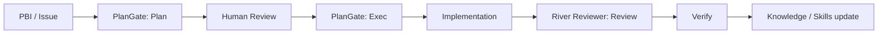

:::message
この記事は、私が運営している [Growth Lab](https://the3396.com/articles) の検証ログと、[PlanGate](https://github.com/s977043/plangate/) / [River Reviewer](https://github.com/s977043/river-reviewer/) の公開リポジトリをもとに、AI駆動開発を実務で回すための設計を整理したものです。
:::

:::message
**この記事で得られること**

- PlanGate と River Reviewer の役割の違い
- 実装前と実装後でガードを分ける考え方
- 小さく始める導入順と、運用に載せるときの見方
:::

AI コーディングは、手を動かす速度を一気に上げてくれます。
一方で、速度が上がるほど次の問題が目立ちます。

- いつの間にかスコープが広がる
- 実装は進むのに、計画が曖昧なまま残る
- レビュー指摘が人によってぶれる
- セッションが変わると、判断の根拠が消える

この問題に対して、私は「AIにもっと頑張らせる」のではなく、**止める場所と進める場所を先に設計する**のが本質だと考えています。

その役割分担をかなりきれいに切り分けたのが、PlanGate と River Reviewer です。

## TL;DR

この2つは、役割が違います。

| 役割 | PlanGate | River Reviewer |
| --- | --- | --- |
| 主な対象 | 実装前 | レビュー時 |
| 目的 | 計画が通るまでコードを書かせない | 暗黙知のあるレビューを再現可能にする |
| 出力 | Plan / Todo / Test Cases / Review | Agent Skills ベースのレビュー / Verify |
| 強み | ゲート設計 | 再現性と学習可能性 |

ざっくり言うと、

- **PlanGate** は「いつ書いていいか」を制御する
- **River Reviewer** は「どう見ればいいか」を標準化する
- **実装前** と **実装後** のガードを分けると、AI の自由度と安全性を両立しやすい

AI 駆動開発で難しいのは、実は実装そのものよりも、**進行の統制**と**レビューの統一**です。
この2つを分けると、運用がかなり安定します。

---

## PlanGate は「実装前の安全装置」

PlanGate の考え方は、とてもシンプルです。

> 計画を承認しないと AI は 1 行もコードを書けない

ここで重要なのは、AI を縛ることではありません。
**人間が確認すべきポイントを、実装の前に固定すること**です。

PlanGate が扱う流れは、次の3段階です。

1. `plan` で変更計画を作る
2. 人間がレビューする
3. `exec` で実装に進む

この流れの良さは、AI に自由に走らせる前に、少なくとも次の3点を揃えられることです。

- 何をやるか
- 何をやらないか
- どうなったら終わりか

実務では、この3つが曖昧なまま実装に入ると、あとから修正コストが跳ね上がります。
PlanGate は、その手戻りを前で止めるための仕組みです。

### PlanGate が向いている場面

- スプリント単位で PBI を回している
- AI に実装を任せたいが、暴走が怖い
- TDD を先に置きたい
- 仕様の抜け漏れを人間が確認したい

PlanGate は、AI 駆動開発の「着手条件」を明確にします。
だから、**スピードを落とす仕組みではなく、手戻りを減らす仕組み**として見るのが正確です。

---

## River Reviewer は「レビュー知識の再現装置」

River Reviewer は、暗黙知を再現可能な `Agent Skills` に変えることを目指した AI コードレビューのフレームワークです。

ポイントは、レビューを「その場の勘」から切り離すことです。

レビューがぶれるのは、レビュアーの能力不足というより、次の情報が散らばっているからです。

- 何を重視するか
- 何を禁止するか
- どこで止めるか
- 何で検証するか

River Reviewer では、これをスキルとして明示化し、GitHub Actions や CLI などで再利用できる形に寄せています。

### River Reviewer の中心思想

- 暗黙知をスキルとして外出しする
- リスクに応じて自由度を設計する
- `Plan / Validate / Verify` でレビュー運用を分ける
- 人間の承認点を残したまま、AI の再現性を上げる

これが効くのは、レビューを単なるコメント生成ではなく、**組織の知識を育てる工程**として扱えるからです。

---

## 2つをつなぐと何が起きるか

PlanGate と River Reviewer を別々に使うだけでも意味はあります。
でも、両方をつなぐと運用の質が一段上がります。

この流れの良さは、AI の役割が曖昧にならないことです。

- PlanGate は「着手前」の制御
- River Reviewer は「変更後」の評価

つまり、**実装の前後でガードを分ける**わけです。

これにより、AI に任せる範囲が広がっても、レビュー品質と意思決定の履歴が残ります。

---

## 実務で効く使い分け

私なら、次のように分けます。

### 1. 変更を始める前

PlanGate を通して、最低限これを固定します。

- 目的
- スコープ
- テスト観点
- リスク
- 受入条件

この段階で曖昧さが残るなら、実装に進まない。
それが PlanGate の価値です。

### 2. 変更が入った後

River Reviewer で、変更内容をスキルベースで評価します。

- この変更で壊れやすい箇所はどこか
- 既知の注意点に触れていないか
- 検証コマンドは何か
- 人間が確認すべきポイントは何か

レビューを文章芸にしないで、**検証可能な単位に落とす**のがコツです。

### 3. 失敗した後

失敗ログを次回のスキルや計画に反映します。

ここまで回すと、AI は「毎回それっぽく賢い」存在ではなく、**チームの運用知識を積み上げる装置**になります。

---

## 小さく始めるならこの順番

いきなり両方を本格導入しなくても大丈夫です。

おすすめはこの順番です。

1. まず PlanGate で「計画なし実装」を止める
2. 次に River Reviewer でレビュー観点を固定する
3. 最後に Verify とスキル更新を回す

最初から完璧な運用を目指すと、設計コストが重くなります。
なので、最初は**1つの PBI で試す**くらいがちょうどいいです。

---

## どちらを先に入れるべきか

迷うなら、私は PlanGate から入れます。

理由は単純で、**着手前の曖昧さのほうが事故りやすい**からです。

- PlanGate は「進む前」に止める
- River Reviewer は「進んだ後」に整える

順番としては、まず止め方を決め、その次に見方を揃えるのが自然です。

---

## 自社メディアでの位置づけ

Growth Lab では、AI エージェント開発、記事制作フロー、SEO 運用を、検証ログと公開ドキュメントとして整理しています。

この記事の位置づけとしては、

- **PlanGate** = AI 駆動開発の入り口を整える
- **River Reviewer** = AI 駆動開発のレビュー品質を整える
- **Growth Lab** = その運用知見を公開し続けるハブ

という関係です。

---

## まとめ

AI 駆動開発で本当に難しいのは、AI の能力不足ではありません。
難しいのは、**どこで止めるか、どこで進めるか、どこで学習させるか**を設計することです。

PlanGate は着手前のゲートを作り、River Reviewer はレビューの再現性を高めます。
この2つを組み合わせると、AI は「投げっぱなしの実装者」ではなく、**運用可能なチームメイト**に近づきます。

もし最初の一歩を選ぶなら、私は **PlanGate から先に入れる** のを勧めます。
止める条件を先に決めるほうが、レビュー整備より先に効きやすいからです。

### 参考リンク

- [Growth Lab](https://the3396.com/articles)
- [PlanGate](https://github.com/s977043/plangate/)
- [River Reviewer](https://github.com/s977043/river-reviewer/)
- [River Reviewer Docs](https://river-reviewer.the3396.com/)

### 関連記事

:::message
- [アジャイルでAI駆動開発をどう回すか: PlanGateの考え方とテンプレート](https://zenn.dev/minewo/articles/plangate-ai-coding-workflow)
- [AIエージェントを"投げっぱなし"にしない：Agent Skillsと自由度の設計で実現する「評価駆動の開発エコシステム」](https://zenn.dev/minewo/articles/zenn-river-reviewer-architecture)
- [Next.js App Router時代のAI-driven TDD：実践的な最小ループと具体的な実装パターン](https://zenn.dev/minewo/articles/ai-driven-tdd-nextjs)
:::
