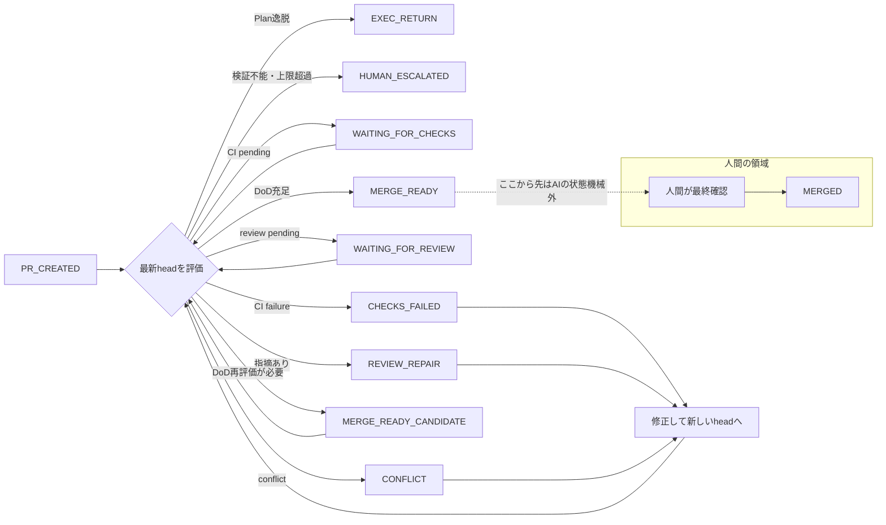

**AIにPRの修正を任せるなら、どこまでをAIの責任にするべきでしょうか。**

CIが失敗したら原因を調べて修正する。レビューで指摘されたらコードを直す。コンフリクトが起きたら解消する。ここまでは、AIコーディングエージェントへ任せられる範囲が広がっています。

では、すべてのチェックを通過した後、そのPRをマージするところまでAIに任せるべきでしょうか。

PlanGateでは、次の境界を置きました。

> **PRをマージ可能な状態まで収束させるのは自動化する。  
> ただし、マージするかを判断し、実際にマージするのは人間に残す。**

この境界を、プロンプトに「マージしないでください」と書くだけで守るのは不十分です。

PlanGateでは、AIが制御する状態機械を `MERGE_READY` で停止させ、外部作用をallowlist（許可リスト）で制限し、不確実な入力を人間へ戻すことで、この責務分界をコードとして表現しています。この記事では、その設計と、実装を通して見えてきた限界を紹介します。

:::message
**想定読者**

- AIコーディングエージェントにPR運用を任せる設計に関心がある方
- GitHubのPR / CI / `gh` CLIの基本と、AIエージェントがPRを操作する運用を把握している方

**この記事で得られること**

- 「マージ可能」と「マージする」を分離する理由
- `MERGE_READY` で止まる状態機械、fail-closed、allowlist、intent／receiptの設計

PlanGateは、筆者が開発しているAIコーディングエージェント向けの軽量ガバナンス基盤（OSS）です。
:::

## 「マージ可能」と「マージする」は別の判断である

PRの状態を単純化すると、次のように見えます。

```text
PRを作る
  ↓
CIとレビューを通す
  ↓
マージする
```

しかし、実際には最後の2段階に異なる責任があります。

```text
機械的な確認をすべて通過した
  ↓
この変更を取り込むと人間が判断した
```

前者では、比較的明確な条件を扱えます。

- 最新コミットのCIが成功している
- 最新コミットへのレビュー判定が揃っている
- レビュー指摘に対応記録がある
- コンフリクトがない
- 計画外のファイルを変更していない

一方、後者には、機械的な条件だけでは判断しきれない要素が含まれます。

- 今、この変更を対象ブランチへ取り込むべきか
- 仕様として本当に正しいか
- 不採用にしたレビュー指摘の根拠は妥当か
- マージに連動するデプロイや運用への影響は問題ないか
- 他の変更と同時に取り込む必要がないか

そのためPlanGateでは、機械的な条件を通過した状態を `MERGE_READY` と呼んでいます。

`MERGE_READY` は「マージしてよい」という命令ではありません。**人間が最終判断を行えるところまで、必要な情報と状態が揃った**という意味です。

## AIが動かす状態機械にMERGEDへの遷移を置かない

PlanGate全体では、Deliveryの状態として `PR_CREATED`、`MERGE_READY`、`MERGED` を扱います。

ただし、AIが担当するのは `PR_CREATED` から `MERGE_READY` までです。その区間を制御する内部状態機械には、`MERGED` への遷移を置いていません。

主な内部状態とexitは次のとおりです。`PR_CREATED` は入口、`MERGED` はAIの状態機械外です。

| 種別 | 状態 / exit | 意味 |
|---|---|---|
| 入口 | `PR_CREATED` | AIが担当を開始する起点 |
| 中間 | `WAITING_FOR_CHECKS` | 最新コミットのCI結果を待っている |
| 中間 | `WAITING_FOR_REVIEW` | 最新コミットに対するレビューを待っている |
| 中間 | `CHECKS_FAILED` | CIが失敗し、修正が必要 |
| 中間 | `REVIEW_REPAIR` | レビュー指摘への対応が必要 |
| 中間 | `CONFLICT` | コンフリクトの解消が必要 |
| 中間 | `MERGE_READY_CANDIDATE` | 条件はほぼ揃い、`MERGE_READY`確定前に完了条件を再評価する |
| 終端 | `MERGE_READY` | 機械ゲートを通過し、人間の最終判断を待つ |
| exit | `HUMAN_ESCALATED` | 検証不能、上限超過、不可逆操作などを人間へ返す |
| exit | `EXEC_RETURN` | 計画外の変更を実行工程へ差し戻す |
| exit | `ERROR` / `STOP` | snapshotの必須フィールド欠落など、判定入力自体が不正で評価を続行できない |

実装では、正常終了地点を `MERGE_READY` と定義し、そこから先の遷移を空にしています。

```python
TERMINAL = "MERGE_READY"

TRANSITIONS["MERGE_READY"] = []
```

全体の流れを簡略化すると、次のようになります。



破線から先（`人間が最終確認` と `MERGED`）は、AIが担当する状態機械の外側です。AI側は `MERGE_READY` で正常終了し、`MERGED` への遷移を実装から持ちません。

「AIへマージしないよう指示した」のではなく、**AIが担当する状態機械の正常終了地点を、マージの一つ手前に置いた**のが設計上のポイントです。

さらにE2Eテストでは、状態機械の契約に `MERGED` が含まれていないことや、判定器がマージコマンド、ネットワーク通信、外部プロセス起動の経路を持っていないことを検査しています。「してはいけない」と文章で指示するのではなく、その経路を実装からなくし、テストで固定しています。

## 1本のPRがMERGE_READYへ進むまで

抽象的な状態名だけでは動きが見えにくいため、1本のPRを例に追います。

1. AIがPRを作成し、最新のhead SHAを含むsnapshot（判定入力）を作る
2. CI失敗を検出して `CHECKS_FAILED` へ進み、修正actionを要求する
3. AIが修正をpushするとhead SHAが変わり、古いCI結果とレビュー承認をstale（古くなって現在のコードに対応しない状態）として除外する
4. 新しいheadへのCIとレビューを再評価し、未解決の指摘があれば `REVIEW_REPAIR` へ戻す
5. 指摘への対応記録が揃った後、`MERGE_READY_CANDIDATE` で完了条件を再評価する
6. 条件を満たしたら `MERGE_READY` recordを残し、人間へ最終判断を渡す

`MERGE_READY_CANDIDATE` を独立した状態として挟むのは、全ゲート通過の判定と、head SHAが評価の途中で更新されていないか等の再確認を分けるためです。評価中に新しいコミットが入った場合の取りこぼしを防ぐよう、確定前にもう一度だけ完了条件を照合します。

この流れでは、AIは失敗を修正して前進できますが、古い証跡を使い回せず、最終的なマージにも進めません。

## MERGE_READYで人間へ何を引き渡すか

`MERGE_READY` は、単なる真偽値ではありません。PlanGateでは、最終判断を支える最小限の情報をrecordへ残します。

| フィールド | 内容 |
|---|---|
| `pr_number` | 対象PR |
| `head_sha` | 判定対象となった最新コミット |
| `check_summary` | CI名と結果の対応 |
| `review_disposition` | 各レビュー指摘を採用・不採用にした記録 |
| `round` | 修正ループの回数 |
| `plan_hash` | 承認済み計画との対応 |

人間は「AIが大丈夫と言った」という結論だけを受け取るのではなく、**どのコミットを、どの証跡で、何回修正して `MERGE_READY` と判定したか**を追跡できます。

ただし、recordが保証するのは、レビュー指摘に対する採用・不採用の記録が存在することまでです。不採用根拠が本当に妥当か、参照先の証跡が主張を支えているかは、人間が差分や実測結果を読んで確認します。`MERGE_READY` recordは最終レビューを置き換えるものではありません。

## 修正後の古い承認を使わない

AIにPRの修正を任せると、PRのhead SHAは何度も変わります。

たとえば、次のような流れです。

1. AIがPRを作る
2. CIが成功する
3. レビューで承認される
4. 追加の指摘を受けてAIが修正する
5. 新しいコミットがpushされる

このとき、手順3の承認は、手順5のコードに対する承認ではありません。それにもかかわらず、「PRにはAPPROVEDが付いている」という情報だけを見れば、古い承認を新しいコードへ流用してしまいます。

PlanGateでは、CI結果とレビュー結果を現在のhead SHAへ束縛します。

```text
現在のhead SHA
    =
CI結果が対象とするSHA
    =
レビューが対象とするSHA
```

一致しない結果はstaleとして扱い、成功条件には含めません。修正コミットが追加されたら、状態は再び `WAITING_FOR_CHECKS` や `WAITING_FOR_REVIEW` に戻ります。

GitHubにも、新しいコミットがpushされたときに古い承認を却下するbranch protection設定があります。PlanGateのhead SHA束縛は、その代替ではありません。リポジトリ設定にかかわらず、PlanGate自身の判定入力が「どのコミットに対するCI・レビューなのか」を確認するための内部整合性チェックです。

この設計により、「一度通ったから、その後も通ったことにする」という状態の使い回しを防ぎます。

## 不確実性は成功ではなく、人間へ倒す

自動化では、失敗よりも「何が起きているか分からない状態」の扱いが重要です。

たとえば、次の状態が考えられます。

- Git履歴上の祖先関係を確認できない
- 未知のCI conclusionが返された
- CI失敗の分類ができない
- required check（マージ前に成功が必須と設定されたCI）の集合を取得できない
- snapshotの必須フィールドが欠けている
- 外部作用の記録に不整合がある

これらを「おそらく問題ない」と解釈すると、PRを誤って `MERGE_READY` へ進める可能性があります。反対に、すべてを「待機中」と解釈すると、状態が永久に進まないlivelock（遷移は試みるのに前進しない膠着）が起こります。

PlanGateでは、不確実な入力を優先的に評価し、人間へ返します。概念的には次の順序です。

```python
# 疑似コード: 評価順序を示す（真偽値フラグや定数returnは実装名ではない）
if snapshot_is_invalid:
    stop_with_error()

if plan_is_deviated:
    return EXEC_RETURN

if input_is_unverifiable:
    return HUMAN_ESCALATED

if repair_limit_is_exceeded:
    return HUMAN_ESCALATED

if ci_has_failed:
    return CHECKS_FAILED

if review_has_findings:
    return REVIEW_REPAIR

if checks_are_pending:
    return WAITING_FOR_CHECKS

if completion_needs_recheck:
    return MERGE_READY_CANDIDATE

if all_gates_passed:
    return MERGE_READY
```

ポイントは、`MERGE_READY` の条件を先に探すのではなく、**成功として扱ってはいけない条件を先に除外する**ことです。これがfail-closed（検証できないときは成功側へ進めない設計）です。

ただし、fail-closedは「何でも止めれば安全」という意味ではありません。停止理由を記録し、人間が次に何を確認すればよいか分かる形にする必要があります。

## 外部作用はallowlistへ閉じ込める

状態機械からマージ遷移を消しても、別のコードが自由にGitHub CLIを実行できれば、AIはそちらからマージできます。

そこでPlanGateでは、GitHub CLIとGitの実行経路を一つのモジュール（後述するExecutor）へまとめ、外部作用をそこへ集約します。

この実行境界では、禁止コマンドを一つずつ列挙するのではなく、**実行してよいコマンドだけをallowlistへ登録**します。

たとえば、次の操作は許可対象になり得ます。

- PR情報の取得
- CI結果の取得
- レビューコメントの取得
- PR headへの非force push
- コメントや証跡の記録

一方、次の操作はallowlistに存在しないため拒否されます。

- `gh pr merge`
- `gh pr review --approve`
- `gh pr close`
- force push
- ブランチ削除
- GraphQL経由の直接マージ

禁止リスト方式では、新しいコマンドや迂回経路を見落とす可能性があります。allowlist方式なら、未定義の操作は既定で拒否されます。

さらに静的検査によって、実行境界以外のモジュールが `subprocess` や `os.system` などの外部実行能力を持っていないかをCIで検査しています。

## allowlistだけでは、AIのマージを完全には防げない

このallowlistが守れるのは、**定義したExecutor経路を通る処理だけ**です。同じセッションから直接Bashを実行し、次のコマンドを呼び出せるなら、in-processのallowlistでは防げません。

```bash
gh pr merge 123
```

また、静的検査もsandboxではありません。新しい迂回方法が将来見つからないことまでは保証できません。この仕組みを「AIが絶対にマージできない完全なsandbox」と表現するのは不正確です。

| 層 | 守ること | 守れないこと |
|---|---|---|
| Delivery状態機械 | `MERGE_READY` で正常終了する | 状態機械外の直接操作 |
| Executorのallowlist | 標準経路の未許可コマンドを拒否する | 別Bash・別プロセスからの操作 |
| 静的検査 | 外部実行能力の偶発的な追加を検出する | 未知の回避方法や意図的な迂回 |
| 人間の最終確認 | マージ判断と証跡内容を確認する | 認証情報そのものの権限制御 |

これは**責務境界**であり、それだけで強制的な**権限境界**になるわけではありません。AIが利用する認証情報にマージ権限が残っていれば、標準経路の外から越境できる余地は残ります。

GitHubのfine-grained tokenでは、操作ごとに必要な権限が異なります。たとえば、PRレビューやレビューコメントの作成には `Pull requests: write`、REST APIによるPRマージには `Contents: write` が必要です（各エンドポイントの必要権限は[GitHub REST API公式リファレンス](https://docs.github.com/en/rest/pulls)の各「Fine-grained access tokens for this endpoint」節に記載があります）。

一方、AIにPR headへのpushを許可する認証情報は、リポジトリ内容への書き込み能力を持ちます。REST APIによるマージにも `Contents: write` が必要なため、同じ認証情報のまま「pushは許可するが、マージは禁止する」という境界をトークンスコープだけで作るのは困難です。

そのため、単一の防御で完全性を主張するのではなく、標準実行経路のallowlistに加え、GitHubの実行主体や権限の分離、ruleset、required review、branch protection、人間が所有する最終操作を組み合わせます。

なお、**本記事執筆時点（2026年8月）**のPlanGateリポジトリでは、required approving reviewを防衛線としてまだ利用していません（今後追加する可能性があります）。この記事で説明している中心的な境界は、状態機械、標準実行経路のallowlist、人間による最終確認です。

## 判定と外部作用を分離する

Delivery層の判定器は、ネットワークや外部プロセスを直接呼びません。入力として受け取るのは、PRの状態をまとめたsnapshotと、過去の実行記録です。

```text
snapshot + record
        ↓
   純粋な状態判定
        ↓
 state + requested actions
```

実際の修正、push、コメントなどは別のExecutorが担当します。

この分離には次の利点があります。

- 同じ入力から同じ判定を再現できる
- 判定ロジックを外部APIなしでテストできる
- dry-runしやすい
- 中断後に状態を復元しやすい
- 外部作用を行えるコードを狭い範囲に閉じ込められる

AIエージェントの処理では、判断と実行を一つのプロンプトへまとめがちです。しかし、安全境界を作る場合は、**何をすべきかを決める層と、実際に副作用を起こす層を分ける**方が制御しやすくなります。

## intentとreceiptで中断後に再開する

外部作用には、処理中断の問題があります。たとえば、AIへレビュー指摘の修正を依頼するとします。

```text
修正要求を作る
  ↓
AIが修正する
  ↓
コミットをpushする
  ↓
完了記録を書く
```

途中でプロセスが終了すると、次の実行時に「どこまで完了したか」を判断できません。

PlanGateでは、外部作用を実行する前後に、intent（要求記録）とreceipt（完了記録）を残します。

```text
intent
  外部作用を要求した記録

receipt
  外部作用が完了した記録
```

各actionには、入力内容から計算したstableな `action_id` を付けます。同じhead SHA、同じ修正ラウンド、同じ指摘に対するactionなら、再評価しても同じIDになります。

再開時にはintentとreceiptを照合します。

| 記録状態 | 扱い |
|---|---|
| intentなし・receiptなし | 未要求 |
| intentあり・receiptなし | 未完了として再要求され得る |
| intentあり・receiptあり | 完了済みとしてExecutorへ渡さない |
| intentなし・receiptあり | 記録なき実行として人間へエスカレーション |

これにより、receiptが記録済みのactionを誤って二度実行することを防げます。

ただし、intent／receiptだけで厳密なexactly-once（各操作をちょうど1回だけ実行する保証）を実現できるわけではありません。外部作用が成功した直後、receiptを書き込む前にプロセスが停止すると、再実行される可能性があります。

より強い保証を得るには、次のいずれかが必要です。

- 外部操作そのものを冪等にする
- GitHub上の実状態を再取得して、すでに適用済みか確認する
- action IDを外部側にも保存する
- 重複実行しても安全な操作へ限定する

**どの中断点で重複の可能性が残るかを把握し、再観測可能な設計にすること**が重要です。

## 実装から得た3つの設計原則

ここまでの各章を、PlanGate固有の状態名やファイル構成を外して一般原則へ畳むと、今回の設計は次の3原則に整理できます（原則を一般化した形。次章はこの原則を自リポジトリへ導入するときのチェックリストです）。

### 1. 「禁止する」より「経路を持たない」

プロンプトに禁止事項を書くことは必要ですが、それだけでは安全境界になりません。

- AI側の状態機械にマージ遷移を置かない
- 外部作用を一つの境界へ集約する
- 許可操作だけをallowlistへ載せる
- 禁止経路が増えていないことをテストする

望ましくない操作を、注意事項ではなく構造として表現します。

### 2. 不確実性を成功扱いしない

未知の値、欠落した証跡、古い承認、検証できない入力を、都合よく成功へ解釈しないことが重要です。ただし、無条件に待ち続けるのでもなく、理由付きで人間へ返します。

```text
検証できる失敗
  → AIが修正する

検証できない状態
  → 人間へ返す
```

この区別が、無限修正ループと誤った自動承認の両方を防ぎます。

### 3. 判断と外部作用を分離する

状態判定を純粋なロジックにし、副作用を狭いExecutorへ閉じ込めます。さらに、stable action ID、intent、receipt、外部状態の再観測を組み合わせ、中断後も処理を再開できるようにします。

自律性を高めるほど、エージェントの賢さよりも、**途中から正しく再開できる構造**が重要になります。

## 自分の環境へ転用するときの確認項目

前章の3原則を実際の作業手順へ落とすと、自分のリポジトリへ導入するときは次を確認します。

- AIが担当する状態機械の正常終了地点を定義したか
- `MERGED` に相当する不可逆操作が、AI側の遷移やコマンドに残っていないか
- CI・レビュー・証跡を最新のhead SHAへ束縛しているか
- 検証不能な入力を待機や成功ではなく、理由付きの人間判断へ戻しているか
- 外部作用を少数のExecutorへ集約し、未許可操作を既定拒否しているか
- 中断点ごとの再実行リスクを洗い出し、冪等化または外部状態の再観測を設計したか
- ワークフロー上の責務境界とは別に、リポジトリ側の権限・ruleset・branch protectionを設計したか

すべてを一度に実装する必要はありません。最初に「AIはどこで止まるのか」を決め、次に最新headへの証跡束縛と外部作用の集約を進めると、境界を段階的に強くできます。

## まとめ

AIコーディングエージェントへ任せられる作業は、コード生成からPR運用へ広がっています。しかし、自動化できることと、自動化すべきことは同じではありません。

PlanGateでは、AIの責任を次の地点までとしました。

> CI、レビュー、コンフリクト、完了条件を処理し、  
> 人間が最終判断できる `MERGE_READY` までPRを運ぶ。

その先の「本当にマージするか」は人間へ残します。人間をすべての途中判断へ介入させるのが目的ではありません。**機械が処理できる収束作業は機械へ任せ、不可逆な最終判断だけを人間へ残すこと**が狙いです。

AIエージェントの自律性を高める設計では、「何をできるようにするか」だけでなく、次の問いが必要になります。

> **どこで必ず止まるようにするか。**

自律性の設計は、能力を追加する設計であると同時に、終了地点を決める設計でもあります。

本記事で示した状態機械、allowlist、判定と外部作用の分離は、Claude Code / Codex CLIなど特定のAIコーディングエージェントに依存しません。

## 実装への参照

- [Delivery状態機械](https://github.com/s977043/PlanGate/blob/main/docs/workflows/ai-loop/delivery-state-machine.md)
- [純粋な状態判定器 delivery.py](https://github.com/s977043/PlanGate/blob/main/scripts/ai-loop/delivery.py)
- [GitHub CLI実行境界 gh_exec.py](https://github.com/s977043/PlanGate/blob/main/scripts/ai-loop/gh_exec.py)
- [実行境界の静的検査](https://github.com/s977043/PlanGate/blob/main/scripts/ai-loop/check_exec_boundary.py)
- [intent／receiptの突合処理](https://github.com/s977043/PlanGate/blob/main/scripts/ai-loop/reconciler.py)
- [状態機械のE2Eテスト](https://github.com/s977043/PlanGate/blob/main/tests/extras/ta-56-delivery.sh)

## 関連記事

- [アジャイルでAI駆動開発をどう回すか：PlanGateの考え方とテンプレート](https://zenn.dev/minewo/articles/plangate-ai-coding-workflow)
- [PlanGate v3からv8.6までの設計変遷](https://zenn.dev/minewo/articles/plangate-design-evolution-v3-to-v8)
- [AIコーディングを「比較で改善」できる土台にする：PlanGate v8.6.0のMetrics v1とGovernance](https://zenn.dev/minewo/articles/plangate-v86-hook-enforcement)