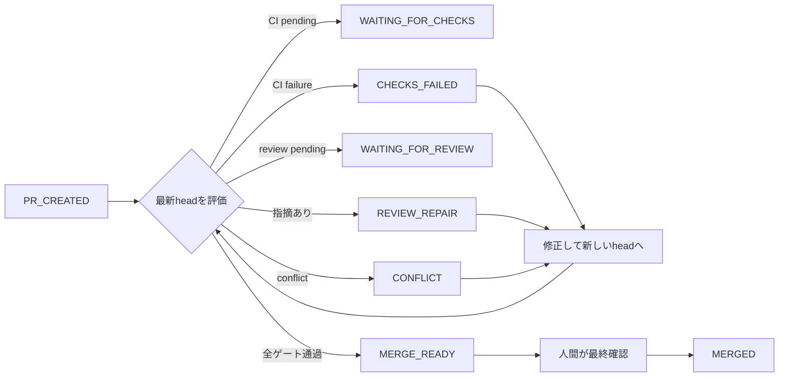

**AIにPRの修正を任せるなら、どこまでをAIの責任にするべきでしょうか。**

CIが失敗したら原因を調べて修正する。レビューで指摘されたらコードを直す。コンフリクトが起きたら解消する。

ここまでは、AIコーディングエージェントへ任せられる範囲が広がっています。

では、すべてのチェックを通過した後、そのPRをマージするところまでAIに任せるべきでしょうか。

私が開発しているPlanGateでは、次の境界を置きました。

> **PRをマージ可能な状態まで収束させるのは自動化する。  
> ただし、マージするかを判断し、実際にマージするのは人間に残す。**

この境界を、プロンプトに「マージしないでください」と書くだけで守るのは不十分です。

PlanGateでは、AIが制御する状態機械を `MERGE_READY` で停止させ、外部作用をallowlistで制限し、不確実な入力を人間へ戻すことで、この責務分界をコードとして表現しています。

この記事では、その設計と、実装を通して見えてきた限界を紹介します。

:::message
**この記事で得られること**

- 「マージ可能」と「マージする」を分離する理由
- AIが制御する状態機械を `MERGE_READY` で止める設計
- 不確実な入力を成功扱いしないfail-closed
- 外部コマンドをallowlistで制限する方法と、その限界
- 中断後も処理を再開できるintent／receipt設計
:::

## 「マージ可能」と「マージする」は別の判断である

PRの状態を単純化すると、次のように見えます。

```text
PRを作る
  ↓
CIとレビューを通す
  ↓
マージする
```

しかし、実際には最後の2段階に異なる責任があります。

```text
機械的な確認をすべて通過した
  ↓
この変更を取り込むと人間が判断した
```

前者では、比較的明確な条件を扱えます。

- 最新コミットのCIが成功している
- 必須レビューが完了している
- レビュー指摘に対応記録がある
- コンフリクトがない
- 計画外のファイルを変更していない

一方、後者には、機械的な条件だけでは判断しきれない要素が含まれます。

- 今、この変更をリリースするべきか
- 仕様として本当に正しいか
- 不採用にしたレビュー指摘の根拠は妥当か
- 事業上のタイミングに問題がないか
- 他の変更と同時に出す必要がないか

そのためPlanGateでは、機械的な条件を通過した状態を `MERGE_READY` と呼んでいます。

`MERGE_READY` は「マージしてよい」という命令ではありません。

**人間が最終判断を行えるところまで、必要な情報と状態が揃った**という意味です。

## AIが動かす状態機械にMERGEDへの遷移を置かない

PlanGate全体では、Deliveryの状態として `PR_CREATED`、`MERGE_READY`、`MERGED` を扱います。

ただし、AIが担当するのは `PR_CREATED` から `MERGE_READY` までです。その区間を制御する内部状態機械には、`MERGED` への遷移を置いていません。

主な内部状態は次のとおりです。

| 状態 | 意味 |
|---|---|
| `WAITING_FOR_CHECKS` | 最新コミットのCI結果を待っている |
| `WAITING_FOR_REVIEW` | 最新コミットに対するレビューを待っている |
| `CHECKS_FAILED` | CIが失敗し、修正が必要 |
| `REVIEW_REPAIR` | レビュー指摘への対応が必要 |
| `CONFLICT` | コンフリクトの解消が必要 |
| `MERGE_READY_CANDIDATE` | 条件はほぼ揃ったが、完了条件の再評価が必要 |
| `MERGE_READY` | 機械ゲートを通過し、人間の最終判断を待つ |

実装では、正常終了地点を `MERGE_READY` と定義し、そこから先の遷移を空にしています。

```python
TERMINAL = "MERGE_READY"

TRANSITIONS["MERGE_READY"] = []
```

全体の流れは次のようになります。



ここで大切なのは、「AIへマージしないよう指示した」ことではありません。

**AIが担当する状態機械の正常終了地点を、マージの一つ手前に置いた**ことです。

さらにE2Eテストでは、状態機械の契約に `MERGED` が含まれていないことや、判定器がマージコマンド、ネットワーク通信、外部プロセス起動の経路を持っていないことを検査しています。

「してはいけない」と文章で指示するのではなく、**その経路を実装からなくし、テストで固定する**方針です。

## 修正後の古い承認を使わない

AIにPRの修正を任せると、PRのhead SHAは何度も変わります。

たとえば、次のような流れです。

1. AIがPRを作る
2. CIが成功する
3. レビューで承認される
4. 追加の指摘を受けてAIが修正する
5. 新しいコミットがpushされる

このとき、手順3の承認は、手順5のコードに対する承認ではありません。

それにもかかわらず、「PRにはAPPROVEDが付いている」という情報だけを見れば、古い承認を新しいコードへ流用してしまいます。

PlanGateでは、CI結果とレビュー結果を現在のhead SHAへ束縛します。

```text
現在のhead SHA
    =
CI結果が対象とするSHA
    =
レビューが対象とするSHA
```

一致しない結果はstaleとして扱い、成功条件には含めません。

修正コミットが追加されたら、状態は再び `WAITING_FOR_CHECKS` や `WAITING_FOR_REVIEW` に戻ります。

この設計により、「一度通ったから、その後も通ったことにする」という状態の使い回しを防ぎます。

## 不確実性は成功ではなく、人間へ倒す

自動化では、失敗よりも「何が起きているか分からない状態」の扱いが重要です。

たとえば、次の状態が考えられます。

- Git履歴上の祖先関係を確認できない
- 未知のCI conclusionが返された
- CI失敗の分類ができない
- required checkの集合を取得できない
- snapshotの必須フィールドが欠けている
- 外部作用の記録に不整合がある

これらを「おそらく問題ない」と解釈すると、PRを誤って `MERGE_READY` へ進める可能性があります。

反対に、すべてを「待機中」と解釈すると、状態が永久に進まないlivelockが起こります。

PlanGateでは、不確実な入力を優先的に評価し、人間へ返します。

概念的には次の順序です。

```python
if snapshot_is_invalid:
    stop_with_error()

if plan_is_deviated:
    return EXEC_RETURN

if input_is_unverifiable:
    return HUMAN_ESCALATED

if repair_limit_is_exceeded:
    return HUMAN_ESCALATED

if ci_has_failed:
    return CHECKS_FAILED

if review_has_findings:
    return REVIEW_REPAIR

if checks_are_pending:
    return WAITING_FOR_CHECKS

if all_gates_passed:
    return MERGE_READY
```

ポイントは、`MERGE_READY` の条件を先に探すのではなく、**成功として扱ってはいけない条件を先に除外する**ことです。

これがfail-closedです。

ただし、fail-closedは「何でも止めれば安全」という意味ではありません。

停止理由を記録し、人間が次に何を確認すればよいか分かる形にする必要があります。

## 外部作用はallowlistへ閉じ込める

状態機械からマージ遷移を消しても、別のコードが自由にGitHub CLIを実行できれば、AIはそちらからマージできます。

そこでPlanGateでは、GitHub CLIとGitの実行経路を一つのモジュールへ集約しています。

この実行境界では、禁止コマンドを一つずつ列挙するのではなく、**実行してよいコマンドだけをallowlistへ登録**します。

たとえば、次の操作は許可対象になり得ます。

- PR情報の取得
- CI結果の取得
- レビューコメントの取得
- 修正結果のpush
- コメントや証跡の記録

一方、次の操作はallowlistに存在しないため拒否されます。

- `gh pr merge`
- `gh pr review --approve`
- `gh pr close`
- force push
- ブランチ削除
- GraphQL経由の直接マージ

禁止リスト方式では、新しいコマンドや迂回経路を見落とす可能性があります。

allowlist方式なら、未定義の操作は既定で拒否されます。

さらに静的検査によって、実行境界以外のモジュールが `subprocess` や `os.system` などの外部実行能力を持っていないかをCIで検査しています。

## allowlistだけでは、AIのマージを完全には防げない

ここには重要な限界があります。

このallowlistが守れるのは、**定義したExecutor経路を通る処理だけ**です。

同じセッションから直接Bashを実行し、次のコマンドを呼び出せるなら、in-processのallowlistでは防げません。

```bash
gh pr merge 123
```

また、静的検査もsandboxではありません。

新しい迂回方法が将来見つからないことまでは保証できません。

したがって、この仕組みを「AIが絶対にマージできない完全なsandbox」と表現するのは不正確です。

PlanGateが保証しようとしている範囲は、次のようになります。

```text
AIが制御するDelivery状態機械
    └─ MERGE_READYで停止する

標準の外部作用経路
    └─ allowlistにない操作を拒否する

実装コード
    └─ 外部実行能力の増加をCIで検査する

プロセス外の直接操作
    └─ 完全には防げない

最終判断とマージ
    └─ 人間が担当する
```

つまり、単一の防御で完全性を主張するのではなく、複数の層で偶発的な越境を防ぎ、残る限界を明示しています。

導入先では、これにGitHubの権限分離、required review、branch protectionなどを組み合わせる必要があります。

なお、PlanGateの現在のリポジトリ設定ではrequired approving reviewを防衛線としてまだ利用していません。この記事で説明している中心的な境界は、あくまで状態機械、標準実行経路のallowlist、人間による最終確認です。

## 判定と外部作用を分離する

Delivery層の判定器は、ネットワークや外部プロセスを直接呼び出しません。

入力として受け取るのは、PRの状態をまとめたsnapshotと、過去の実行記録です。

```text
snapshot + record
        ↓
   純粋な状態判定
        ↓
 state + requested actions
```

実際の修正、push、コメントなどは別のExecutorが担当します。

この分離には次の利点があります。

- 同じ入力から同じ判定を再現できる
- 判定ロジックを外部APIなしでテストできる
- dry-runしやすい
- 中断後に状態を復元しやすい
- 外部作用を行えるコードを狭い範囲に閉じ込められる

AIエージェントの処理では、判断と実行を一つのプロンプトへまとめがちです。

しかし、安全境界を作る場合は、**何をすべきかを決める層と、実際に副作用を起こす層を分ける**方が制御しやすくなります。

## intentとreceiptで中断後に再開する

外部作用には、処理中断の問題があります。

たとえば、AIへレビュー指摘の修正を依頼するとします。

```text
修正要求を作る
  ↓
AIが修正する
  ↓
コミットをpushする
  ↓
完了記録を書く
```

途中でプロセスが終了すると、次の実行時に「どこまで完了したか」を判断できません。

PlanGateでは、外部作用を実行する前後に記録を残します。

```text
intent
  外部作用を要求した記録

receipt
  外部作用が完了した記録
```

各actionには、入力内容から計算したstableな `action_id` を付けます。

同じhead SHA、同じ修正ラウンド、同じ指摘に対するactionなら、再評価しても同じIDになります。

再開時にはintentとreceiptを照合します。

| 記録状態 | 扱い |
|---|---|
| intentなし・receiptなし | 未要求 |
| intentあり・receiptなし | 未完了として再評価 |
| intentあり・receiptあり | 完了済みとしてExecutorへ渡さない |
| intentなし・receiptあり | 記録なき実行として人間へエスカレーション |

これにより、receiptが記録済みのactionを誤って二度実行することを防げます。

ただし、intent／receiptだけで厳密なexactly-onceを保証できるわけではありません。

外部作用が成功した直後、receiptを書き込む前にプロセスが停止すると、再実行される可能性があります。

より強い保証を得るには、次のいずれかが必要です。

- 外部操作そのものを冪等にする
- GitHub上の実状態を再取得して、すでに適用済みか確認する
- action IDを外部側にも保存する
- 重複実行しても安全な操作へ限定する

重要なのは、「一度だけ実行できる」と安易に断言することではありません。

**どの中断点で重複の可能性が残るかを把握し、再観測可能な設計にすること**です。

## 実装から得た3つの設計原則

PlanGate固有の状態名やファイル構成を外すと、今回の設計は次の3原則に整理できます。

### 1. 「禁止する」より「経路を持たない」

プロンプトに禁止事項を書くことは必要ですが、それだけでは安全境界になりません。

- AI側の状態機械にマージ遷移を置かない
- 外部作用を一つの境界へ集約する
- 許可操作だけをallowlistへ載せる
- 禁止経路が増えていないことをテストする

望ましくない操作を、注意事項ではなく構造として表現します。

### 2. 不確実性を成功扱いしない

未知の値、欠落した証跡、古い承認、検証できない入力を、都合よく成功へ解釈しないことが重要です。

ただし、無条件に待ち続けるのでもなく、理由付きで人間へ返します。

```text
検証できる失敗
  → AIが修正する

検証できない状態
  → 人間へ返す
```

この区別が、無限修正ループと誤った自動承認の両方を防ぎます。

### 3. 判断と外部作用を分離する

状態判定を純粋なロジックにし、副作用を狭いExecutorへ閉じ込めます。

さらに、stable action ID、intent、receipt、外部状態の再観測を組み合わせ、中断後も処理を再開できるようにします。

自律性を高めるほど、エージェントの賢さよりも、**途中から正しく再開できる構造**が重要になります。

## まとめ

AIコーディングエージェントへ任せられる作業は、コード生成からPR運用へ広がっています。

しかし、自動化できることと、自動化すべきことは同じではありません。

PlanGateでは、AIの責任を次の地点までとしました。

> CI、レビュー、コンフリクト、完了条件を処理し、  
> 人間が最終判断できる `MERGE_READY` までPRを運ぶ。

そして、その先の「本当にマージするか」は人間へ残します。

重要なのは、人間をすべての途中判断へ介入させることではありません。

**機械が処理できる収束作業は機械へ任せ、不可逆な最終判断だけを人間へ残すこと**です。

AIエージェントの自律性を高める設計では、「何をできるようにするか」だけでなく、次の問いが必要になります。

> **どこで必ず止まるようにするか。**

自律性の設計は、能力を追加する設計であると同時に、終了地点を決める設計でもあります。

## 実装への参照

- [Delivery状態機械](https://github.com/s977043/PlanGate/blob/main/docs/workflows/ai-loop/delivery-state-machine.md)
- [純粋な状態判定器 delivery.py](https://github.com/s977043/PlanGate/blob/main/scripts/ai-loop/delivery.py)
- [GitHub CLI実行境界 gh_exec.py](https://github.com/s977043/PlanGate/blob/main/scripts/ai-loop/gh_exec.py)
- [実行境界の静的検査](https://github.com/s977043/PlanGate/blob/main/scripts/ai-loop/check_exec_boundary.py)
- [intent／receiptの突合処理](https://github.com/s977043/PlanGate/blob/main/scripts/ai-loop/reconciler.py)
- [状態機械のE2Eテスト](https://github.com/s977043/PlanGate/blob/main/tests/extras/ta-56-delivery.sh)

## 関連記事

- [アジャイルでAI駆動開発をどう回すか：PlanGateの考え方とテンプレート](https://zenn.dev/minewo/articles/plangate-ai-coding-workflow)
- [PlanGate v3からv8.6までの設計変遷](https://zenn.dev/minewo/articles/plangate-design-evolution-v3-to-v8)
- [AIコーディングを「比較で改善」できる土台にする：PlanGate v8.6.0のMetrics v1とGovernance](https://zenn.dev/minewo/articles/plangate-v86-hook-enforcement)
