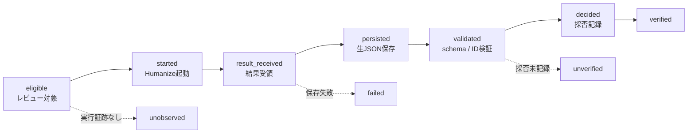

:::message
**この記事で得られること**

- 品質ゲートは「効くかどうか」の前に、対象・起動・結果・記録・判断を観測できる必要がある、という視点
- 「実行記録がない」と「実行されていない」は同じではない、という計測上の注意
- 公開を止めない品質活動を続けるための「採否は自由。記録されるまで verified にしない」という設計

**想定読者**: AIコーディングエージェントを日常運用し、レビューや検査の仕組みを自分で組んでいる人  
**この記事の規模**: 2026-07-17〜08-18 の約1か月。記事8本を変更し、Humanizeレビューの実行証跡を確認できたのは2本。現行成果物から追える findings は6件で、別の3件は現在の成果物には残らず Git 履歴からのみ追跡できます  
**この記事が扱うもの**: リリースを止めるゲートではなく、公開を止めない「観測用のゲート」です。AI生成判定器でも品質保証器でもなく、34パターンによるヒューリスティックな検出です
:::

## はじめに：検出は動いた。ただ、呼ばれたかを測れていなかった

AIに技術記事を書かせると、独特の定型感が残ります。同じ接続詞が段落頭に並ぶ。文末が揃う。根拠のないまま「重要です」で締める。

私が避けたかったのは、この「AIっぽさ」を消すために本文を自動で書き換えることでした。技術記事でそれをやると、文体を直したいだけなのに、主張・数値・コード・引用まで動く可能性があります。

そこで2026年7月17日、**検出だけして本文を書き換えない Humanize レビュー**を作りました。実際に、根拠の薄い数値を1件見つけ、私の判断へ差し戻したこともあります。

1か月後、運用状況を数えました。

**この間に変更した記事は8本。そのうち、Humanizeレビューを実行した証跡を確認できたのは2本でした。**

最初は「8本中2本しか呼ばれていなかった」と考えました。しかし、それも言い過ぎでした。私が数えていたのはレビュー成果物です。成果物がないことから、実行そのものがなかったとは証明できません。

つまり、本当に分かったのは次のことです。

> **私は、この品質ゲートが何回呼ばれたかを測れる仕組みを持っていませんでした。**

この記事は、その失敗を分解した記録です。

---

## 検出と修正を分離した。しかし、権限制約までできていると思い込んだ

出発点の仮説は「**文体の改善は、主張の改変と地続きになる**」でした。「この段落は冗長です」という指摘に従って書き直すと、削られた部分に主張が含まれていることがあります。

そこで、Humanizeレビューには3つのルールを置きました。

**1. 保護リスト**

Front Matter、コードブロック、URL、引用、数値・日付・バージョン、製品名やAPI名、記事の主張、筆者の実体験を保護します。文体上の問題が保護領域を含む文にある場合も、保護要素そのものは変えません。

**2. リスク昇格**

保護領域に触れる可能性がある指摘は `high` へ引き上げます。`high` は自動修正の対象にせず、著者の判断へ戻します。

**3. review-only のツール設定**

Skillには次の設定を置きました。

```yaml
allowed-tools:
  - Read
  - Grep
  - Glob
```

当初、私はこれを「`Edit` / `Write` / `Bash` を持たせない排他的な権限制限」だと理解していました。

**これは誤りでした。**

Claude CodeのSkillにおける `allowed-tools` は、列挙したツールを事前承認する設定です。列挙されていないツールを利用不能にするものではなく、それらは通常のpermission settingsに従います。公式ドキュメントにも、`allowed-tools` は利用可能なツールを制限しないと明記されています。

- [Claude Code: Extend Claude with skills](https://code.claude.com/docs/en/skills#pre-approve-tools-for-a-skill)

つまり現在のHumanize Skillは、自然言語では `Edit` / `Write` / `Bash` を禁止していますが、**Skill単体の設定だけで書き込み能力を排除できているわけではありません。**

静的チェックも `allowed-tools` の宣言内容を確認していただけで、「実行時に書き込み能力が存在しないこと」を検証していませんでした。

```bash
npm run check:article-humanizer   # Skill定義の静的チェック
npm run test:article-humanizer    # 検査器そのものの自己テスト
```

本当にread-onlyの実行境界を作るなら、たとえばCustom Subagentの `tools` を排他的なallowlistとして使えます。Claude Codeの公式ドキュメントでは、`tools: Read, Grep, Glob` のように指定すると、それ以外のツールを使えない構成にできます。

- [Claude Code: Create custom subagents](https://code.claude.com/docs/en/subagents#available-tools)

```yaml
---
name: article-humanizer-ja
description: 日本語技術記事のreview-only Humanizeレビュー
tools: Read, Grep, Glob
---
```

ここで得た教訓は、「指示より権限が強い」ではありません。

> **権限で守ったつもりでも、その設定が本当に能力を削っているかを検証しなければ、ガードレールは存在したことにならない。**

この誤認も、後で出てくる「器はあるが配線がない」と同じ構造でした。

---

## 止めるか、止めないかで考えていた

もう一つ、当時決めたことがあります。

**このレビューで `high` の指摘が出ても、記事の公開はブロックしない。**

AIの文体判定が人間の主張を却下する構造にはしたくなかったからです。「この段落は根拠が薄い」という判定だけで公開が止まるなら、それは文体レビューの責務を超えます。

この判断自体は、今でも変えていません。

ただし、私は「止めるか、止めないか」の二択で考えていました。第三の状態が必要でした。

> **採否は自由。記録されるまで verified にしない。**

指摘を受け入れるかどうかは著者が決める。公開も止めない。しかし、確認した記録がなければレビュー済みとは扱わない。

```text
publication: allowed
review_state: unverified
```

これなら、非ブロッキングと「確認を必須にしたい」という要求を分離できます。

---

## 1か月後に数えたら、8本中2本にしか証跡がなかった

計測範囲は **2026-07-17（ゲート導入日）から 2026-08-18 まで**。この記事のドラフト自身は母集団に含めません。

まず、この期間に変更した記事を数えました。

```bash
git log --since=2026-07-17 --until=2026-08-19 --name-only --pretty=format: -- articles/ \
  | grep -v '^$' | sort -u
```

8本ありました。新規執筆も、既存記事の改稿も含みます。

次に、Humanizeを含むレビュー成果物を確認しました。

```bash
git log --since=2026-07-17 --until=2026-08-19 --name-only --pretty=format: -- reviews/zenn/ \
  | grep -v '^$' | sort -u
```

Humanizeの実行証跡を確認できた記事は **2本** でした。2本のうち1本は `passed: false` で、`high` の指摘を修正して解消しています。ここで数えているのは合格数ではありません。

したがって、再現可能な数字は **実行証跡カバレッジ25%** です。

ここで重要なのは、残り6本をそのまま「未実行」と数えないことです。成果物がない以上、少なくとも現在のリポジトリだけでは次の2つを区別できません。

- Humanizeを実行していない
- Humanizeを実行したが、成果物が残っていない

6本のうち1本は、3周のレビューを回しながらHumanize工程だけを飛ばしていたことを別の記録から確認できました。少なくとも1件の迂回は実在します。しかし残り5本の実行有無は、この計測から断定しません。

ここで言えることと、言えないことを分けます。

- **言えること**: 8本中、Humanizeの実行証跡を確認できたのは2本だった
- **言えること**: 少なくとも1本はHumanizeを迂回していた
- **言えないこと**: 残り6本すべてでHumanizeが実行されなかった
- **言えないこと**: Humanizeに品質改善効果があるか（証跡2本では判定できない）

「呼ばれなかった」のではなく、**呼ばれたかを後から判定できる観測設計がなかった**。こちらが問題の中心でした。

---

## ゲートは工程ごとに別々に観測不能になる

ゲートを一続きの工程として並べると、どこで情報が失われるかが見えます。

| 工程 | 観測したいもの | 現在確認できるもの |
|---|---|---|
| 1. 対象になる | レビュー対象の記事変更 | 8本 |
| 2. 起動する | Humanizeを開始した記事 | 証跡あり2本 / 残りは不明 |
| 3. 結果を受け取る | 結果が返った記事 | 証跡あり2本 / 残りは不明 |
| 4. 生結果を永続化する | 構造化JSONをそのまま保存した記事 | 0本 |
| 5. 形式を検証する | 識別子・スキーマを機械検証した記事 | 0本 |
| 6. 採否を記録する | findingsの採否判断が完了した記事 | 0本 |

この表は「8 → 2 → 2 → 0」という真の実行ファネルではありません。工程2以降の分母を独立に記録していないため、**観測できた件数のファネル**です。

この区別を入れると、問題がより明確になります。私は品質ゲートだけを作り、ゲートの外側に「対象になった」という事実を残す仕組みを作っていませんでした。

### 工程4が落ちる：生の結果が残らない

ある実行では、レビュー結果をMarkdownへ書き出す工程がモデルの利用上限に達して失敗しました。結果自体は返っていたため、成果物を手で作り直しました。

このとき失ったのは、レビューの存在そのものではありません。**モデルが返した生の構造化データと、現在状態からの再現性**です。

現行の成果物から追える findings は6件です。別の3件は現在の成果物には残っておらず、Git履歴を掘れば追跡できます。「完全に失われた」と言うのも正確ではありません。

重要なのは、現在の成果物だけを見た人が同じ集計を再現できないことです。

### 工程5が落ちる：識別子が集計キーにならない

検出パターンには `F01`〜`F05`、`S01`〜`S14`、`T01`〜`T15` の34個の識別子を定義しています。

実際の記録では、次の形式が混在しました。

- `T04` / `F05` / `S08` — 定義どおりの識別子
- `S12-recurring-importance-closer` / `S10-list-intro-template` — 識別子＋自由文スラッグ
- `F-table-header-empty-cell` — レジストリに存在しない形

当初は「スキーマで列挙型を指定しなかったから、モデルが値を創作した」と考えました。しかし、Skillの出力例自身が次の形式を教えていました。

```json
"pattern": "S01-repeated-connectors"
```

正本のパターン表は裸の識別子なのに、例は識別子＋スラッグでした。仕様が自己矛盾しています。

さらに、`S12` の定義と実際の指摘内容が一致しないケースもありました。形式だけでなく、識別子の意味まで検証する必要があります。

そして根本には、**StructuredOutputのJSONを決定論的に永続化する経路がない**という問題があります。現在は生JSONをモデルへ渡し、「読みやすいMarkdownにしてください」と依頼しています。正しい値が返っても、転記工程で変われば集計できません。

:::message
**一般化の限度について**

「制約を張らない列は必ず壊れる」とは言えません。正しくは「**制約のない列は drift し得る**」です。今回はスキーマ制約の不足だけでなく、仕様例の不整合と、非決定的な転記工程が重なっています。統制された対照実験ではなく、自然観察です。
:::

### 工程6が落ちる：採否が記録されない

別の実行では `low` の指摘が2件出ました。「章の締めの語彙が単調」「箇条書きの導入が同じ鋳型で反復」というものです。

対象記事には、指摘された表現が現在も残っています。

```bash
grep -c "重要です\|重要になります" articles/ai-merge-ready-state-machine.md
# → 4
grep -c "たとえば、次の" articles/ai-merge-ready-state-machine.md
# → 3
```

残っていること自体は問題ではありません。`low` は任意の推敲だからです。

問題は、**検討して見送ったのか、そもそも読んでいないのかを区別できない**ことでした。

---

## なぜ1か月気づかなかったか

原因は一つではありません。

- Humanizeが他のレビュー工程と接続されておらず、迂回できた
- 生JSONを永続化する経路がなかった
- モデルの利用上限でRecord工程が失敗した
- パターン定義と出力例が矛盾していた
- findingsの採否責任を状態として持っていなかった
- `allowed-tools` を排他的な権限制限だと誤認していた

そして、**「数えていなかったこと」はこれらの直接原因ではありません。** 数えれば導線が生えるわけでも、権限設定が変わるわけでもありません。

数えていなかったことで失ったのは、異常を早く見つける機会でした。

> **どの工程も、「期待した状態」と「実際に観測した状態」の差を検出する仕組みを持っていませんでした。**

- 実行証跡を数えていない → 証跡カバレッジ25%に気づかない
- 生結果の永続化を検査していない → Record失敗を事故として扱わない
- 出力形式を検証していない → 識別子の drift が見えない
- 採否状態を持っていない → 未確認と見送りを区別できない
- 実効権限を検証していない → 「read-onlyのつもり」を制約と誤認する

### 器は用意してあった

記録の場所自体は最初からありました。

Skill定義書には「誤検知・過剰指摘」という記録欄があります。誤検知を書き、パターン調整に使う想定でした。

しかし、その形式で書かれた成果物は1本もありません。

記録工程のプロンプトが検出結果しか要求しておらず、誤検知欄へ流し込む処理がなかったからです。

**置き場所があることと、情報が流れることは別です。**

### 空の器を機能させる最小条件

| 空の器 | 埋まらない理由 | 機能させる最小条件 |
|---|---|---|
| ふりかえりのアクション欄 | 実行しなくても次が回る | 次回を前回アクションの結果から始める |
| 品質レビューの記録欄 | 無視しても公開できる | 未記録を `unverified` として残す |
| チェックリスト | 判定根拠を誰も確認しない | 自動検証するか、確認責任を決める |
| Skillの `allowed-tools` | 宣言を能力制限だと思い込む | 実効権限をテストする |

共通するのは、器そのものではありません。**誰が、いつ、何を生成し、何と照合し、どの状態へ遷移させるか**まで決めて初めて運用になります。

### 経験主義の三本柱として見ると

この構造は、スクラムの経験主義（透明性・検査・適応）をレンズにすると理解しやすくなります。透明性が不十分なら検査の対象が歪み、検査から適応へつながりません。

- [The Scrum Guide](https://scrumguides.org/scrum-guide.html)

ここでスクラムを厳密に適用しているわけではありません。この運用は設計者・実行者・記録者がすべて私です。人数を増やせば解決するとも考えていません。可視化されていなければ、チームでも同じように見逃せます。

測る手段のない完了条件は、条件ではなく願望です。

### 次に作る状態遷移

ここまでの失敗を状態として表すと、次に何を観測すべきかが整理できます。重要なのは、Humanizeが起動する前に `eligible` を作り、正常系だけでなく未観測・保存失敗・未確認も状態として残すことです。



この図の左端にある `eligible` をゲートの外側で生成できれば、「呼ばれなかった」と「呼ばれたが途中で失敗した」を初めて別々に測れます。

---

## 次に変える8点 — 分母をゲートの外に置く

最優先で直すのはHumanizeの判定ロジックではありません。**観測の分母を、Humanize自身から独立させます。**

### 透明性

1. **記事変更から `eligible` を独立に記録する**  
   `articles/**` の対象変更をCIや決定論的スクリプトで検出し、レビュー対象のrevisionを先に台帳へ残します。ゲートが一度も起動しなくてもレコードが存在することが重要です。

2. **read-only境界を実際の能力制限として実装する**  
   Skillの `allowed-tools` に依存せず、Custom Subagentの `tools` allowlistやpermission denyを使い、書き込み能力が存在しないことをテストします。

3. **StructuredOutputの生JSONを直接永続化する**  
   モデルによるMarkdown転記を正本にしません。Human-readableな成果物は生JSONから派生生成します。

4. **識別子を制約し、仕様例も同時に直す**  
   スキーマだけ直すと、現在の例に忠実な出力が弾かれます。正本・例・schemaを同じレジストリから生成できる形が理想です。

5. **出力側を静的チェックする**  
   現在はSkill定義側のチェックが中心です。保存された結果について、schema・pattern ID・target revisionを機械検証します。

### 検査

6. **`eligible` と実行結果を同じrevisionで照合する**  
   「変更した記事」を分母にしたなら、同じrevisionをキーに結果をleft joinします。結果がなければ `not_started` と即断せず、まず `unobserved` として扱います。

### 適応

7. **閾値と見直し条件を測定前に決める**  
   初期閾値、分母、判定者、見直し時期を先に書きます。測った後で都合のよい線を引かないためです。

### 状態設計

8. **採否は自由。ただし記録されるまで `unverified` にする**  
   公開は止めません。指摘の採否も強制しません。しかし、採否記録がない状態をレビュー済みとは呼びません。

### 何を記録するか

ポイントは、Humanizeが起動しなかった場合でも最初のレコードが存在することです。

```json
{
  "target_revision": "対象の記事とそのrevision",
  "eligible_at": "レビュー対象になった時刻",
  "review": {
    "started_at": null,
    "result_received_at": null,
    "record_status": "missing",
    "schema_valid": null
  },
  "decision": {
    "status": "unrecorded",
    "reason": null
  },
  "verification_state": "unverified"
}
```

この初期レコードはHumanize自身ではなく、対象記事の変更を検出する側が生成します。

Humanizeが起動すれば `started_at` が入り、結果を受け取れば `result_received_at` が入る。永続化に失敗すれば `record_status: failed`、schemaが壊れれば `schema_valid: false`、採否未記録なら `verification_state: unverified` のままです。

これで初めて、**「ゲートが呼ばれなかった」と「呼ばれたが記録に失敗した」を別々に数えられます。**

:::message alert
**チームに持ち込むときの注意**

これらの数字は、プロセスと成果物を検査するためのものです。個人評価や査定に使うと、数字を良く見せるインセンティブが生まれ、透明性を壊します。
:::

---

## おわりに：終わっているのは、失敗を見つけたところまで

Humanizeレビューの検出ロジックは、実際に根拠の薄い数値を1件見つけました。しかし、だからといって品質ゲート全体が機能していたとは言えません。

1か月後に再現できたのは、変更した8本に対して実行証跡を確認できたのが2本、**証跡カバレッジ25%** だったという事実です。残り6本すべてが未実行だったとは、現在の記録からは言えません。

さらに調べると、生JSONの非永続化、識別子の drift、採否状態の欠如に加えて、`allowed-tools` を権限制限だと誤認していたことまで分かりました。

品質ゲートの失敗を「守らなかった人」や「弱いルール」の問題にすると、改善点を取り逃がします。

> **必要なのは、ゲートを作ることではなく、対象・実行・結果・判断・実効制約をそれぞれ独立に観測できることです。**

この記事の時点で終わっているのは、適応ではありません。失敗を再定義し、次に測るべき状態を決めたところまでです。

次は、分母をゲートの外側に置き、read-only境界と生JSON永続化を実装します。その結果が数字として戻ってきて、初めて透明性から適応までが一周します。

---

## 関連記事

- [AIエージェントを勝手に成長させない — 記録・棚卸し・機械化・剪定の自己改善ループ](https://zenn.dev/minewo/articles/ai-agent-self-improvement-loop-design)
- [AIにマージさせない。PRをMERGE_READYまで運ぶ状態機械の設計](https://zenn.dev/minewo/articles/ai-merge-ready-state-machine)