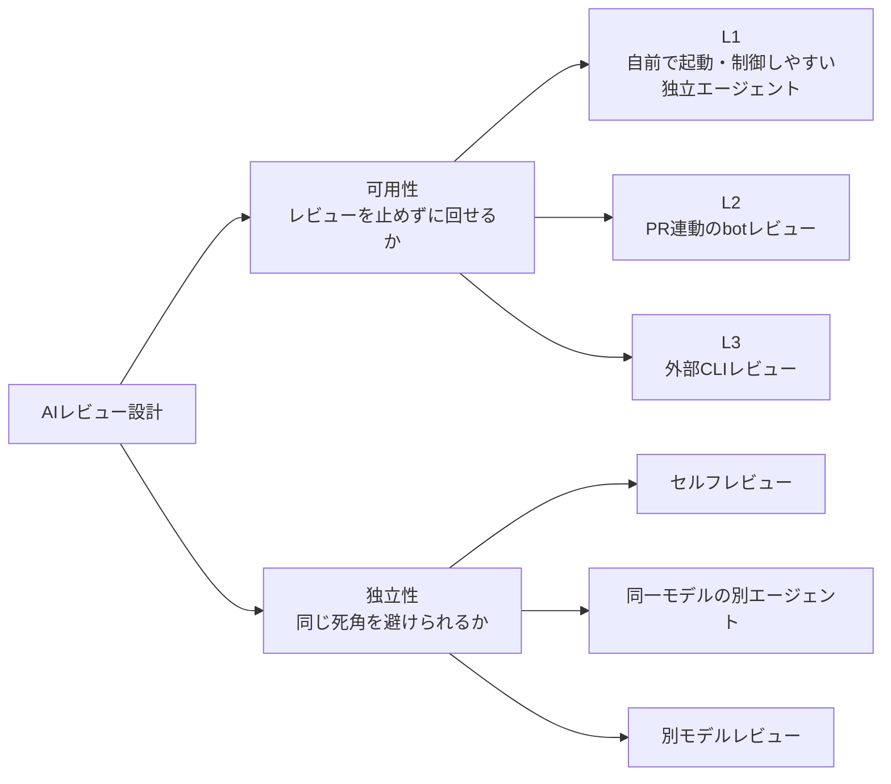

## はじめに

AI にコードや記事をレビューさせるのは、もう珍しくありません。ただ 1 体に任せるだけだと見落としやバイアスが残るので、「複数の AI に見てもらえばいい」と考えます。ところが実際にやってみると、レビューの中身にたどり着く前に別の壁にぶつかります。**レート制限（429）です。**

Codex CLI や Gemini CLI のような外部 AI レビュー CLI を複数つないで多視点レビューを回そうとすると、429・認証エラー・trusted-directory 系のエラーで、あっけなく止まります。この記事では、実際にこの詰まりを踏んだ経験をもとに、**レート制限で止まらない AI レビューの可用性設計**をまとめます。

:::message
**想定読者**：Claude Code・PR 連動の bot レビュー（GitHub Copilot review / Gemini Code Assist 等）・外部 CLI（Codex / Gemini CLI）のいずれかを触ったことがあり、AI レビューを日々の開発に組み込みたい人。
:::

## 結論

AI レビューは、精度だけでなく**可用性**で設計する必要があります。要点は次の通りです。

:::message
- 外部 AI レビュー CLI（Codex CLI / Gemini CLI）を**唯一の主経路**にしない
- レビュアーを **L1 / L2 / L3** の層に分ける
- L1 は自前で起動・制御しやすい独立エージェントにする
- L2 は PR 連動の bot レビューにする
- L3 は外部 CLI による補助レビューにする
- L3 が 429 や認証エラーで落ちても、レビュー全体を止めない
:::

つまり、**「賢い 1 体」ではなく「落ちても回る複数体」**として AI レビューを設計します。

## この記事で扱う 2 つの軸

この記事では、AI レビューを 2 つの軸で整理します。1 つ目は**可用性**で、レビューが落ちずに回るか、落ちても判断を止めずに済むかを見ます。2 つ目は**独立性**で、同じ見落としや同じバイアスを避けられるかを見ます。似ていますが、別物です。

| 軸 | 見るもの |
|---|---|
| 可用性 | レビューを止めずに回せるか |
| 独立性 | 同じ死角を避けられるか |



本記事の L1 / L2 / L3 は、**可用性の分類**です。

一方で、セルフレビュー、同一モデルの別エージェント、別モデルレビューは、**独立性の分類**です。

ここを分けておくと、AI レビューの設計がかなり考えやすくなります。

## 多視点 AI レビューとは

多視点 AI レビューとは、同じ対象を複数の AI 視点でレビューし、所見を突き合わせる方法です。

1 体の AI だけに頼ると、見落とし、思い込み、幻覚がそのまま通ります。一方で、複数の独立した視点で見ると、次のように判断しやすくなります。

| 所見 | 扱い |
|---|---|
| 複数視点で一致した指摘 | 高確度の指摘として優先 |
| 1 つの視点だけが出した指摘 | 内容を確認して人間が判断 |
| 視点によって割れた指摘 | 設計判断・前提確認が必要 |

実際、あるスクリプトのレビューで、1 つの独立 AI だけが致命的な穴を実証付きで指摘したことがありました。自分のセルフレビューでは気づけなかった穴です。この経験以来、AI レビューでは賢さよりも**独立した視点をどう作るか**を重視しています。とはいえ独立性を求めて外部 AI を増やすほど、今度は可用性が問題になります。

## 実際に起きたこと

ある変更を、複数の AI でレビューしようとしたときのことです。対象はあるガードスクリプトで、自分のレビューに加えて Claude・Codex・Gemini の複数視点で確認するつもりでした。ところが、順番に詰まっていきました。

- Gemini CLI は `429 You have exhausted your capacity on this model` で停止
- 非対話実行では trusted-directory 系のエラーも発生
- `flash` 系モデルに切り替えると動くが、所見が浅くなるだけでなく、存在しない記述への言及など的外れな指摘も混じる
- Codex CLI も使用制限に到達
- 結果として、手元の外部 CLI レビューが揃わない

このとき比較的安定して使えたのは、PR に紐づく bot レビューだけでした。ここで痛感したのは、**外部 CLI を品質ゲートの主経路に置くと、レビューの中身以前の理由で止まる**ということです。レビューは品質ゲートのはずなのに、外部サービスのレート制限や認証状態でゲートが開かなくなるなら、それは品質保証ではなく運用リスクです。

## L1 / L2 / L3 の定義

そこで、AI レビュアーを可用性の高い順に 3 層に分けます。

| 層 | 実体 | 位置づけ | 落ちたとき |
|---|---|---|---|
| L1 | 自前で起動・制御しやすい独立エージェント | 必須の主経路 | 止める |
| L2 | PR 連動の bot レビュー | 設定済みなら使いやすい補助経路 | PR がなければ skip |
| L3 | Codex CLI / Gemini CLI などの外部 CLI | 別モデル視点を得るための補助経路 | 429 や認証エラーなら即 skip |

私の環境では、次のように割り当てています。

| 層 | 具体例 |
|---|---|
| L1 | Claude Code のセルフレビュー + 観点別サブエージェント |
| L2 | GitHub Copilot review / Gemini Code Assist bot |
| L3 | Codex CLI / Gemini CLI |

重要なのは、L3 を「落ちたら困る主経路」にしないことです。

L3 の価値は、別モデルの視点を得られることです。ただし、可用性は低い。だから、**回れば強いが、落ちても止めない補助枠**として扱います。

:::message
レビューの可否を、最も不安定な層である外部 CLI に握らせない。
:::

## L1 は観点別エージェントチームにする

L1 は 1 体に限定する必要はありません。

Claude Code のサブエージェントを使えば、観点別のレビューエージェントを並列で動かせます。

たとえば、次のように分けます。

| エージェント | 観点 |
|---|---|
| correctness | ロジックの正しさ、境界条件、バグ |
| security | 入力検証、権限、秘密情報、外部入力 |
| design | 責務分割、拡張性、可読性 |
| testability | テスト容易性、テストケース不足 |

各エージェントには、他のエージェントの所見を渡しません。自分の所見も渡しません。

対象ファイルとレビュー観点だけを渡し、白紙で検証させます。

これにより、追認バイアスを避けやすくなります。

```text
対象: target.js
役割: correctness reviewer

このファイルのロジックの正しさだけを検証してください。
バグ、境界条件、例外処理の抜けを中心に指摘してください。
他のレビュアーの所見は見ずに、独立して判断してください。
```

L1 も Claude 側の利用制限から完全に自由ではありません。

ただし、外部 CLI 固有の trusted-directory、認証、モデル切替、CLI 別の容量制限に比べると、自分の開発環境に組み込みやすく、運用上の制御性が高い層として扱えます。

## L2 は PR 連動の安定枠として使う

L2 には、GitHub 上で動く bot レビューを置きます。

たとえば、GitHub Copilot review や Gemini Code Assist bot のような PR 連動レビューです。

L2 の良いところは、開発フローと自然に接続できることです。

- PR を作る
- bot レビューが走る
- コメントが PR に残る
- 人間のレビューと同じ場所で確認できる

手元の CLI よりも、PR に紐づく bot レビューの方が安定して使える場面があります。

ただし、L2 も万能ではありません。プラン、組織設定、リポジトリ設定、権限、サービス側の状態に依存します。

そのため、L2 は「常に安定」ではなく、**PR 運用と相性がよい補助経路**として扱うのが現実的です。

## L3 は即フォールバックする

L3 には、Codex CLI や Gemini CLI などの外部 CLI を置きます。

L3 は強力です。別モデルの視点を入れられるため、同じモデルでは見落とす死角を拾える可能性があります。

一方で、可用性は読みにくいです。

- 429 で止まる
- 認証が切れる
- trusted-directory で止まる
- モデルが使えない
- 上位モデルが使えず、下位モデルに逃がすと指摘が浅くなる

なお `trusted-directory` 系のエラーは、非対話実行では信頼確認をスキップして回避できる場合があります。手元の `gemini-cli` v0.42 では `--skip-trust` フラグか `GEMINI_CLI_TRUST_WORKSPACE=true` 環境変数で通りました（フラグ名・要否はバージョン依存なので公式ドキュメント要確認）。

そのため、L3 は次のルールで扱います。

```text
L3 が 429・認証エラー・trusted-directory 系エラーで落ちたら、その回は即 skip する。
リトライで粘らない。
L3 の回復を待ってレビュー全体を止めない。
```

これは諦めではありません。L3 は「使えたら強い」枠として設計する、ということです。

## 判断ルール

私の運用では、次のように判断します。

| 状況 | 判断 |
|---|---|
| L1 が落ちた | 止める |
| L1 OK / L2 OK / L3 skip | 進めてよい |
| L1 OK / PR なしで L2 skip / L3 skip | 軽微変更なら進める。重要変更なら PR を作るか L3 回復を待つ |
| L1 OK / L2 で重大指摘あり | 人間が確認する |
| L1 と L2 の指摘が一致 | 高優先で対応する |
| L1 と L2 の指摘が割れる | 前提を確認し、人間が判断する |

原則はシンプルです。

**レビューの可否を、最も不安定な層である外部 CLI に握らせない。**

## どの変更でどの層まで使うか

すべての変更に、すべての層を使う必要はありません。

変更のリスクに応じて、レビュー層を増やします。

| 変更種別 | 推奨レビュー層 |
|---|---|
| typo / README / 軽微な文言修正 | L1 |
| 通常の機能追加 | L1 + L2 |
| DB migration / 認証 / 権限 / 課金 | L1 + L2 + L3 + 人間レビュー |
| セキュリティ影響がある変更 | L1 + L2 + セキュリティスキャン + 人間レビュー |
| 設計方針の変更 | L1 + L3 + ADR / design review |

AI レビューは便利ですが、全部を AI に任せるものではありません。リスクが高い変更では、人間のレビュー、静的解析、依存関係スキャン、シークレット検出と併用します。

:::message alert
AI レビューは、静的解析・依存関係スキャン・シークレット検出・人間のレビューの代替ではありません。
特にセキュリティ観点では、AI レビューは補助として扱い、静的解析やテストなどの機械的な検査と併用するべきです。
:::

## レビュー結果には skip ログを残す

もう 1 つ重要なのは、どの層が走り、どの層が skip されたかを明記することです。

無音で skip すると、読者やレビュアーは「全視点でレビュー済み」と誤解します。

たとえば、次のように残します。

| 層 | 結果 | 備考 |
|---|---|---|
| L1 correctness | OK | 境界条件の指摘あり |
| L1 security | OK | 重大指摘なし |
| L1 design | OK | 責務分割の改善提案あり |
| L2 GitHub bot | OK | 1 件の修正提案 |
| L3 Gemini CLI (pro) | SKIP | 429 |
| L3 Gemini CLI (flash) | DEGRADED | 浅い・的外れ混じり。参考扱い |
| L3 Codex CLI | SKIP | usage limit |

`SKIP`（その層が走らなかった）と `DEGRADED`（下位モデルに逃がして所見の質が落ちた）を分けて残すと、後から「どこまで信用できるレビューだったか」を判断しやすくなります。

このログがあると、判断の透明性が上がります。

大事なのは、AI レビューの結果そのものよりも、**どの前提で判断したか**を残すことです。

## まとめ

多視点 AI レビューは強力ですが、外部 CLI を主経路にするとレート制限や認証エラーで簡単に止まります。だから、可用性で多重化した L1 / L2 / L3 のうち **L1 + L2 が揃えば L3 を待たずに判断できる**ようにし、L3 は落ちる前提で扱う。そして **skip / DEGRADED ログを残し、どこまで信用できるレビューだったかを明確にする**。この 3 点が運用のキモです。

AI レビューで大事なのは、賢いモデルを 1 つ選ぶことだけではありません。

**落ちても回るレビュー体制を作ること。**

実務で AI レビューを運用に乗せるなら、精度だけでなく、可用性と独立性を分けて設計する必要があります。

「賢い 1 体」より「落ちても回る複数体」。

これが、AI レビューを日常運用に入れてみて得た一番大きな学びです。

## FAQ

:::details Q. なぜ単一の賢い AI 1 体ではダメなのですか？
1 体だけだと、見落とし、バイアス、幻覚がそのまま通ります。

もちろん、単一 AI でもレビューしないよりは良いです。ただ、重要変更では複数視点で確認した方が安全です。

特に、別モデルや別観点のレビューでしか出てこない指摘があります。
:::

:::details Q. 同じモデルのサブエージェントを並列にして意味がありますか？
あります。

観点を分けて独立に検証させれば、同じモデルでもレビューの粒度は上がります。

ただし、同じモデルなら同じ死角を共有する可能性は残ります。その死角を減らすために、L3 で別モデルの第三者レビューを入れます。
:::

:::details Q. L3 がよく落ちるなら、もう不要ではありませんか？
不要ではありません。

L3 の価値は、可用性ではなくモデルの多様性です。回ったときには、L1 や L2 とは違う指摘が出る可能性があります。

ただし、主経路にはしません。「使えたら強いが、落ちても止めない」補助枠として扱います。
:::

:::details Q. AI レビューが全員一致したら安全ですか？
安全とは限りません。

一致は確度を上げますが、過信は禁物です。同じモデル、同じプロンプト、同じ前提で一致しているだけなら、同じ死角を共有している可能性があります。

一致を見るときは、どれだけ独立した視点で一致したかを確認します。
:::

:::details Q. レビューが増えてコストや時間が膨らみませんか？
膨らみます。

だから、すべての変更に全層レビューをかける必要はありません。

軽微な変更は L1 だけ。通常の機能追加は L1 + L2。認証、権限、課金、DB migration、セキュリティ影響がある変更だけ L3 や人間レビューを厚くします。

リスクに応じて層を足すのが現実的です。
:::

## 参考

- [Claude Code subagents](https://docs.anthropic.com/en/docs/claude-code/sub-agents)
- [GitHub Copilot code review](https://docs.github.com/en/copilot/using-github-copilot/code-review/using-copilot-code-review)
- [Gemini CLI Trusted Folders](https://google-gemini.github.io/gemini-cli/docs/cli/trusted-folders.html)
