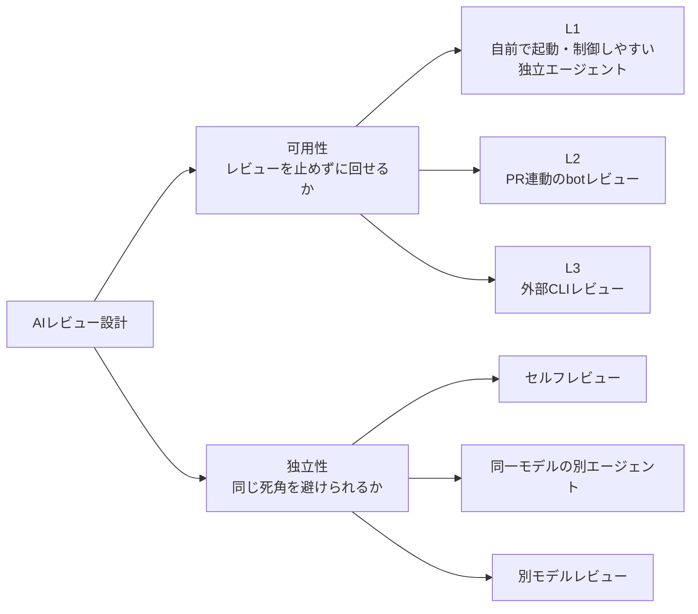

## はじめに

AI にコードや記事をレビューさせるのは、もう普通のことです。
ですが「1 体より多視点だろう」と外部 AI を複数つないだ瞬間、壁にぶつかります。**レート制限（429）です。**

先に結論を書きます。

:::message
**結論（先出し）**

- **外部 AI レビュー CLI（Codex / Gemini CLI）を“主経路”にしてはいけない**。レート制限で簡単に止まる。
- レビュアーを**層（L1 / L2 / L3）で多重化**し、可用性の高い順に並べる:
  - **L1（必須）= 自前の独立 Claude サブエージェント**（最も可用・白紙で検証してバイアス回避）
  - **L2 = GitHub 上の bot レビュー**（PR 連動で安定）
  - **L3（補助）= CLI（Codex / Gemini）**（落ちてもブロックしない）
- **最低 L1 ＋（PRがあれば L2）の 2 視点が揃えば判断可**。L3 が 429 / 認証エラーで落ちても止めない。

（各層 L1 / L2 / L3 の定義は §1.5 を参照）
:::

複数 AI でレビューを回していたら、ある日**手元のCLIが全部詰まりました**。そのとき組み直した「可用性を前提にしたレビュー多重化」の設計を共有します。

:::message
**想定読者・前提**

- **想定読者**: AI レビューを CI や個人開発の運用に組み込みたい開発者。
- **前提**: Claude Code（サブエージェント）／ PR 連動の bot レビュー（GitHub Copilot review・Gemini Code Assist 等）／外部 CLI（Codex・Gemini CLI）のいずれかを触ったことがある。
:::

:::message
**そもそも「多視点AIレビュー」とは**

同じ対象（コード・記事・設計）を、**互いに独立した複数の AI の目でレビューし、所見を突き合わせて確度を上げる**手法です。1 体の賢い AI に頼ると見落とし・バイアス・幻覚が残りますが、**互いに知らない複数の視点**で見ると「**一致した指摘＝高確度**」「**割れた指摘＝要検討**」と仕分けできます。

実際このアプローチで、あるスクリプトの致命的な穴を**1 つの独立 AI だけが実証付きで発見**したことがありました（自分のセルフレビューでは気づけなかった）。大事なのは賢さより**独立性**です。

本記事のテーマは、この「多視点」を**レート制限で止めずに回す**ための可用性設計（L1/L2/L3）です。
:::

私は今、関わる**すべてのプロジェクトで**この多視点レビューを標準運用にしています。やり方は、**独立性を 3 段階で上げる**ことです。

1. **セルフレビュー** — 自分（メインのエージェント）の視点で見直す。
2. **Claude Code のエージェントチーム** — **同じモデル**の独立サブエージェントを並列で走らせる。視点は増えるが、モデルは同じ。
3. **別エージェント・別モデルの第三者レビュー** — Codex や Gemini など、**モデルそのものを変える**。ここで初めて、モデル固有のクセ（死角）まで打ち消せる。

①→③へ進むほど「自分との独立性」が上がります。②までは“同じ頭で考え方を変える”レベルですが、③で**そもそも違う頭**を入れる。この 3 段を、レート制限で止めずに回すための可用性設計が L1 / L2 / L3 です。対応は ② → L1、③ → L2 / L3。①セルフは独立性の段階としては別物ですが、自前環境で完結する入口なので L1 に含めて扱います。

### 整理：AIレビューは「可用性 × 独立性」の2軸で考える

ここまでに **L1/L2/L3** と **独立性の3段**という 2 つの分類が出てきました。混同しやすいので、軸を分けておきます。

| 軸 | 見るもの | 分類 |
|---|---|---|
| **可用性** | レビューを止めずに回せるか | L1 / L2 / L3 |
| **独立性** | 同じ死角を避けられるか | セルフ / 同一モデルの別エージェント / 別モデル |



本記事が主に扱うのは**可用性（L1/L2/L3）**の方です。独立性は「②同一モデル → ③別モデル」と上げるほど死角が減りますが、③ほど可用性が落ちる、という綱引きの関係になります。

## 1. 何が起きたか：多視点レビューの最中に外部CLIが全滅した

ある変更（CI のガードスクリプト）を「自分 + 独立 AI + 外部 AI」の複数視点でレビューしようとしたときのことです。順に詰まりました。

- **Gemini CLI**: `pro` モデルが `429 You have exhausted your capacity on this model`。さらに、非対話実行が `trusted-directory` エラーで弾かれる（`gemini-cli` v0.42 では `--skip-trust` フラグか `GEMINI_CLI_TRUST_WORKSPACE=true` の環境変数で回避できた。フラグ名・要否はバージョン依存なので公式ドキュメント要確認）。`flash` に切り替えると動くが、所見が浅く・的外れな指摘（存在しない記述への言及）も混じる。
- **Codex CLI**: セッション序盤で使用制限に到達（「○時に解除」と表示）。
- **結局救われたのは GitHub 連動の bot レビュー**（PR を作ると自動でレビューが付くタイプ）。PR にひも付くので安定して動き、具体的な指摘まで返してくれた。

つまり、**手元の CLI に頼った多視点レビューは「運が良ければ揃う」程度の信頼性**しかありませんでした。レート制限は待っても確率的にしか回復しないので、「リトライで粘る」のは時間の無駄です。

## 1.5 用語：L1 / L2 / L3 とは

本記事では、レビュアーを**可用性の高い順に 3 つの層**として扱います。

- **L1**: 自分の環境で完結する独立 AI（例: Claude Code のサブエージェント）。外部 API 制限の影響を受けにくく、最も可用。
- **L2**: GitHub などに常駐し、PR に連動して動く bot レビュー。PR を作れば安定して走る。
- **L3**: 手元の外部 CLI（Codex / Gemini CLI 等）。強力だが可用性が読めない補助枠。

## 2. なぜ CLI を主経路にしてはいけないか

外部 AI レビュー CLI には、構造的に「主経路に据えにくい」理由があります。

- **レート制限が不可避**: 無料/個人枠は容量が小さく、少し回すとすぐ 429。回復タイミングは読めない。
- **環境依存のエラー**: 信頼ディレクトリ・認証・モデル可用性など、レビュー内容以前のところで落ちる。
- **モデル選択のジレンマ**: 上位モデルは容量制限が厳しく、下位モデル（`flash` 等）に逃がすと**所見が浅くなり多視点の意味が薄れる**。

レビューは「品質ゲート」です。**外部サービスの気まぐれでゲートが開かなくなる**なら、それはもう品質ゲートではなく運用リスクです。

## 3. 設計：レビュアーを可用性で多重化する

「単一の賢い AI に頼る」のではなく、**可用性の階層**でレビュアーを並べます。

| 層 | 担当 | 位置づけ | 落ちた時 |
|---|---|---|---|
| **L1（必須）** | 自前の独立 Claude サブエージェント | 最も可用。外部 API 制限の影響を受けにくい | — |
| **L2** | GitHub 連動の bot レビュー | PR 連動で安定。具体指摘が返る | PR が無ければ skip |
| **L3（補助）** | CLI（Codex / Gemini CLI） | 強力だが可用性が読めない | 429 / 認証エラーは**即 skip** |

設計のポイントは3つです。

1. **L1 を主軸にする**。自前のサブエージェントは外部レート制限の影響を受けにくい。「白紙で（自分の所見を渡さず）検証させる」ことでバイアスも避けられる。
2. **L2 を“安定枠”として活用する**。皮肉なことに、手元の CLI より **PR に紐づく bot のほうが安定して動いた**。PR を作る運用なら L2 はほぼ常に使える。
3. **L3 は落ちる前提**。429 / trust エラーは**リトライで粘らず即フォールバック**。L3 が無くても L1+L2 で判断を止めない。

### L1 は「エージェントチーム」にできる（最も可用性が高い）

L1 は 1 体に限りません。**Claude Code のサブエージェントを観点別に並列起動すれば、L1 の中だけで多視点チームが組めます**。

- 例: `correctness`（正しさ）/ `security`（安全性）/ `design`（設計）の専門サブエージェントを**並列で起動**し、所見を突き合わせる。
- これは **外部 CLI（L3）固有のレート制限（429）・trust・認証エラーの影響を受けない** → 実務上**最も可用性の高い多視点**になる。
  - 厳密には L1 も Claude API を使う以上、API 自体の制限が無関係なわけではありません。ただし CLI 経由（L3）のような**ツール単位の容量枠で突然 429 になる**事象が起きにくく、手元の運用では最も安定して回ります。
- 各エージェントには**自分の所見も他エージェントの所見も渡さず**、観点と対象だけ与えて独立に検証させる（バイアスと相互汚染を避ける）。

> つまり L3（外部 CLI）が全滅しても、**Claude Code のエージェントチームだけで多視点 AI レビューは完結できる**。可用性を突き詰めると、多視点の主役は外部 AI ではなく「自前の独立エージェント群」になる。

### degradation を許容する（一部が落ちても判断を止めない）

重要なのは「全部揃わないと判断できない」設計にしないことです。

> **最低 L1 ＋（PRがあれば L2）の 2 視点が揃えば公開/マージ判断は可能** とする。L3 はあくまでボーナス。

こうしておくと、外部 CLI が全滅しても**レビューパイプライン自体は止まりません**。

### 私の環境での L1 / L2 / L3

参考までに、自分の手元では各層を次のように割り当てています。

| 層 | 実体 |
|---|---|
| **L1** | Claude Code のセルフレビュー＋観点別サブエージェント（`correctness` / `security` / `design` を並列起動） |
| **L2** | GitHub Copilot review / Gemini Code Assist bot（どちらも PR 連動で自動起動） |
| **L3** | Codex CLI / Gemini CLI（強力だが 429・trust エラーで落ちる前提の補助枠） |

要は、**L1 を自前の Claude Code で完結させ、L2 を PR 連動の安定枠、L3 を「回ればラッキー」の補助枠**に振り分けているだけです。L3 が両方落ちても判断は止めません（前節の degradation の通り）。

## 4. 実装のキモ

### 4-1. L1（独立サブエージェント）は「白紙」で起動する

L1 に自分の所見を渡すと、追認バイアスで「同じ穴」を見逃します。**対象と観点だけ渡し、所見は伏せて**独立に検証させます。バックグラウンド起動した場合は、**統合の前に必ず完了を待って結果を回収**します（待たずに統合フェーズへ進むと L1 の所見が抜ける）。

:::details 自環境での最小運用例（観点別サブエージェントを並列起動）

観点別に独立サブエージェントを 3 体、並列でバックグラウンド起動します。各体には**自分の所見も他体の所見も渡さず**、対象ファイルと観点だけを与えます（指示テンプレは 1 行ずつ）。

- `correctness`: 「`target.js` のロジックの正しさだけを検証して。バグ・境界条件・抜けを指摘して」
- `security`: 「`target.js` のセキュリティ観点だけを検証して。入力検証・権限・秘密情報の扱いを指摘して」
- `design`: 「`target.js` の設計観点だけを検証して。責務分割・拡張性・可読性を指摘して」

3 体すべての**完了を待ってから**所見を回収し、統合フェーズで突き合わせます（1 体でも未完了のまま統合に進むとその観点が抜ける）。
:::

### 4-2. L3（CLI）は「即フォールバック」を徹底する

```bash
# Gemini CLI の非対話実行（実務 Tips。最小再現形）
# - 非対話では信頼確認をスキップする必要がある環境がある
#   （v0.42 では --skip-trust か GEMINI_CLI_TRUST_WORKSPACE=true。フラグ名はバージョン依存なので公式ドキュメントで確認すること）
# - pro が 429 のときは flash に逃がす（ただし所見は浅くなる前提）
# - レビュー指示と対象ファイルを ``` で囲んで stdin に流すだけ
( cat review-instructions.md; echo '```'; cat target.js; echo '```' ) \
  | GEMINI_CLI_TRUST_WORKSPACE=true gemini -m gemini-2.5-flash
```

`429` や `trusted-directory` 系のエラーが出たら、**そのツールはこの回は即 skip（フォールバック）する**。待ち時間を回復に賭けない。

### 4-3. 統合は「一致＝高確度」で読む

各層の所見を突き合わせ、**複数の層が同じ指摘をしたら確度が高い**ものとして優先します。割れた点は両論を残して人間が判断します。最後に、もう一点だけ大事なことがあります。

> **どの層が走って、どの層を skip したかを必ず明記する**。無音で skip すると「全視点でレビュー済み」という誤った安心を生みます。

## 5. 判断チェックリスト

| 状況 | 判断 |
|---|---|
| L1 が落ちた | **止める**（最低限の独立視点が無い） |
| L1 OK・L2 OK・L3 落ち | **進めてよい**（2視点で確度十分、L3 はボーナス） |
| L1 OK・PR 無し（L2 skip）・L3 落ち | L1 のみ。重要変更なら L3 の回復を待つか、PR を作って L2 を足す |
| 全 CLI が 429 | **L1+L2 で判断**。CLI の回復は待たない |

**原則**: レビューの可否を「最も不安定な層（CLI）」に握らせない。

## 6. まとめ

- 多視点 AI レビューは強力だが、**外部 CLI を主経路にすると可用性で詰む**。
- レビュアーを **L1（自前の独立 AI）→ L2（PR連動 bot）→ L3（CLI）** の可用性順に多重化する。
- **最低 L1+L2 で判断可**とし、L3 は落ちる前提（429/認証エラーは即 skip）。
- 統合は「一致＝高確度」、**どの層を skip したか明記**して誤った安心を防ぐ。

「賢い 1 体」より「落ちても回る複数体」。AI レビューを**運用に乗せる**なら、賢さより可用性の設計が効きます。

## FAQ

:::details Q. なぜ単一の賢いAI 1体ではダメなのですか？
1体だと見落とし・バイアス・幻覚がそのまま通ります。独立した複数視点で見ると「一致＝高確度」「相違＝要検討」と仕分けでき、特に**自分が気づけなかった穴**を別視点が拾います。
:::

:::details Q. 同じモデルのサブエージェントを並列にして（L1チーム）意味がありますか？
あります。観点を分けて独立に検証させれば視点は増えます。ただし**同じモデルなら同じ死角を共有する**ので、モデル固有のクセは残ります。そこを消すのが第3段（別モデルの第三者）です。
:::

:::details Q. レビューが全員一致したら安全と考えてよいですか？
一致は確度を上げますが、過信は禁物です。むしろ**別モデルが出してくる「不一致」**にこそ見落としのヒントが隠れていることが多く、全員一致は「別モデルを入れていない（＝死角が見えていない）」サインのこともあります。
:::

:::details Q. L3（外部CLI）がいつも落ちるなら、もう要らないのでは？
落ちる前提で「あれば使う」のが正解です。L3 の価値は**モデルの多様性（別の頭）**で死角を消すこと。可用性は低くても、回ったときの独立性は最も高い。だから「主経路にしない・落ちても止めない」という扱いにします。
:::

:::details Q. レビューが増えてコスト・時間が膨らみませんか？
L1/L2 は並列化できるので時間は抑えられます。L3 は重要変更に絞る、段階適用にする等で制御します。「全変更に全層」ではなく「リスクに応じて層を足す」運用が現実的です。
:::

## 参考

- 各 AI レビューツールの公式ドキュメント（レート制限・非対話実行の仕様は各ツールのバージョンに依存）
