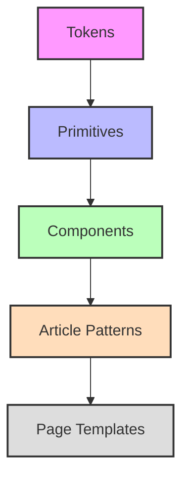

## TL;DR

- `DESIGN.md` は、AI と人間が同じ判断基準で UI を実装するための入口ドキュメント
- 重要なのはルールを増やすことではなく、`どこを正本にするか`、`どの対応関係を参照するか`、`どう検証するか` を固定すること
- Growth Lab では `DESIGN.md` を軽量な index とし、詳細をデザインシステム関連のドキュメント群に委譲する構成で運用している
- この方式により、トークン、コンポーネントの対応関係、外部 UI 語彙の正規化、Penpot と React の整合確認を一つの流れで扱いやすくなった

## この記事はこんな人向けです

- AI を使って UI 実装を進めているエンジニア
- デザインレビューの判断基準をチームで揃えたい人
- 公開画面や管理画面の UI 一貫性を、テキストで運用したい人

## はじめに

AI で UI 実装を進めやすくなった一方で、画面ごとの見た目や部品の使い方は、以前より少しずつずれやすくなった感覚がありました。

同じプロダクトのはずなのに、ページごとに余白が違う、ボタンの角丸が揺れる、フォームの密度がばらつく、といったズレは少しずつ蓄積します。しかも厄介なのは、そのズレが 1 回の大事故ではなく、日々の小さな実装判断の積み重ねとして起きることです。

Figma や Penpot のようなデザインツールはもちろん必要です。ただ、それだけでは実装時の判断基準や、AI への指示の入口、レビュー時の確認観点までは揃えにくい場面がありました。

そこで、自分たちは `DESIGN.md` を入口にする形へ寄せていきました。

## DESIGN.md とは

自分たちが `DESIGN.md` と呼んでいるのは、UI 実装のときに見るべきルールや参照順を、AI と人の両方が読める形で置いておく Markdown の入口ファイルです。

ここでいう `DESIGN.md` は、Figma や Penpot の代替ではありません。役割はあくまで、実装の入口として「何を正本として参照するか」を短く示すことです。

今回の構成では、ルートの `DESIGN.md` を軽量な index として置き、詳細はデザインシステム関連のドキュメント群へ委譲しています。実際の `DESIGN.md` には、次のような役割だけを持たせています。

- 読む順番の提示
- token SSoT の明示
- コンポーネントの対応関係を参照する方針
- `pnpm penpot:verify` を含む最小チェック手順

全部入りの巨大ドキュメントにするのではなく、設計と運用への入口に絞っているわけです。

## なぜ DESIGN.md が必要なのか

`DESIGN.md` がない状態でも UI 実装は進められます。ただし、次の問題が起きやすくなります。

- 画面ごとに余白やタイポグラフィの判断がぶれる
- ボタンやカードの見た目が、実装者やタイミングによって少しずつ変わる
- 公開画面と管理画面で必要なトーンの違いが整理されない
- AI に毎回同じデザイン前提を説明する必要がある
- レビュー時に「何が正しいか」が人によって変わる

`DESIGN.md` は便利メモというより、実装の再現性を上げるための設計資産です。

特に AI 実装を前提にすると、「雰囲気としてこうしてほしい」では足りません。どのルールを優先し、どの語彙を内部名に変換し、どのファイルが一次情報かを明文化しておく必要があります。

## DESIGN.md には何を書くのか

`DESIGN.md` 自体にすべてを書かなくて構いません。大事なのは、必要な情報への導線を明確にすることです。

自分たちのケースでは、詳細を次のように分けています。

### Foundations

- token の正本となる JSON 群
- semantic token
- component token
- token 契約を説明するドキュメント

### Components

- コンポーネント責務と命名ルール
- variant 対応表
- Penpot と React の対応関係をまとめたファイル

### Layout / Patterns

- LP 構造
- 記事構造
- テンプレート仕様

### Content / Copy / Prompt

- 外部 UI 語彙の正規化ルール
- AI へのデザイン指示テンプレート

### Operation

- 日常運用と検証順

この分け方のポイントは、`DESIGN.md` を説明書の全文ではなく、読む順番を制御するファイルとして使っていることです。

### 最小の `DESIGN.md` サンプル

初期導入では、まずこれくらいの薄い入口で十分です。

```md
# DESIGN.md

## Read first

1. design-tokens
2. component-architecture
3. component mapping
4. operation guide

## Source of truth

- Tokens SSoT: design tokens in JSON
- Component mapping: design-to-code mapping file

## Rules

- Do not introduce external UI vocabulary directly
- Normalize requested UI patterns before implementation
- Verify design-related changes with `pnpm penpot:verify`
```

重要なのは、ここに詳細を書き込みすぎないことです。`DESIGN.md` は辞書や図鑑ではなく、入口と参照順を固定するためのファイルとして扱うほうが運用しやすくなります。

## 公開側 / 管理画面側でどう分けるか

一般論として、公開側と管理画面側は同じルールだけでは運用しづらいです。

公開側では、信頼感、可読性、訴求、回遊の設計が重要になります。一方、管理画面側では、一覧性、入力効率、安全な操作、破壊的アクションの明確さが優先されます。

そのため、別リポジトリでこれから導入するなら、次のような構成が扱いやすいと思います。

```text
/
├─ DESIGN.md
├─ design/
│  ├─ common.md
│  ├─ public.md
│  └─ admin.md
└─ apps/
   ├─ public-web/
   └─ admin-web/
```

共通の color、typography、spacing、radius は `common` に置き、公開側と管理画面側の差分だけを分離する構成です。

Growth Lab は記事メディア中心のため `public/admin` 分割ではなく、`tokens -> primitives -> components -> article patterns -> page templates` の 5 層モデルで整理しています。この考え方は公開側のみのプロダクトにも応用しやすいです。



## 実際の導入手順

自分たちが実際に取った流れを、別リポジトリでも再利用しやすい形でまとめると次の順番になります。

1. デザインツールを決める
2. token の正本を決める
3. コンポーネント命名と対応関係を決める
4. 外部 UI 語彙を内部語彙へ変換するルールを作る
5. 運用と検証手順を `DESIGN.md` から辿れる形にする

Growth Lab では、まず Penpot Cloud の採用を決めました。共同編集しやすく、SVG ベースで AI と相性がよく、運用オーバーヘッドが低かったためです。

そのうえで、`DESIGN.md` はあえて軽量に保ち、以下を実運用の中心にしました。

- token SSoT は JSON で持つ
- スタイル定義は実装側へ投影する
- デザイン名、React export、tokens、variants の対応関係をファイルで持つ
- 外部語彙の正規化ルールと AI 指示テンプレートを分けて持つ
- 同期、検証、レビューの流れを runbook 化する

ここでいう対応関係とは、デザインツール・実装・レビューのあいだで、名前と責務の対応を固定する公開された約束事です。

この構成にしたことで、実装者や AI がいきなり見た目を増やすのではなく、まず既存の前提と対応関係を確認する流れに寄せられました。

なお、ここで扱っている考え方は Penpot 専用ではありません。Figma など別のデザインツールを使う場合でも、入口、正本、対応関係、検証を分けて管理する発想自体はそのまま使えます。

## このリポジトリでの導入実績

以下は、Growth Lab のリポジトリ内で確認できる構成や更新履歴、それと公開しているデザインシステムの内容をもとに整理したものです。
定量的な効果測定はまだ十分ではないため、ここでは主に構成上の変化と運用上の意味を中心にまとめます。

### 導入の流れを時系列で見る

Growth Lab では、デザインシステムを 1 回で完成させたわけではありません。確認できる範囲でも、少なくとも次の段階を踏んでいます。

| 時期       | 変化                                                             | 意味                                                                     |
| ---------- | ---------------------------------------------------------------- | ------------------------------------------------------------------------ |
| v0.6.0     | Penpot 統合、デザイントークン CI、コンポーネントマッピングを強化 | デザインツールと実装の接続を作り始めた段階                               |
| v0.12.0    | 記事向けデザインシステムを拡張                                   | 汎用 UI だけでなく、記事体験に必要な部品を第一級市民として扱い始めた段階 |
| v0.17.0    | デザインシステム運用と AI デザイン指示テンプレートを全面更新     | AI に前提を渡す入口と運用導線を整えた段階                                |
| 2026-03-22 | `DESIGN.md` を入口として整備                                     | 「正本・対応関係・運用」の参照順を明確にした段階                         |

この時系列で見ると、`DESIGN.md` は最初の一歩というより、既に進んでいた運用を整理して入口化したものだと分かります。

### 1. 入口としての `DESIGN.md` を導入した

実運用では、デザインシステムの入口ドキュメントと運用導線を整える段階がありました。

この時点で満たしたかった条件は次の 3 つです。

- ルートに `DESIGN.md` が存在する
- AI 向けのデザイン検証導線が現行の運用と一致する
- 別の仕様ドキュメントからも `DESIGN.md` を入口として参照できる

つまり、`DESIGN.md` は単体で完結する資料ではなく、仕様、運用、AI 指示をつなぐ入口として導入されています。

### 2. token の正本を Markdown ではなく JSON に固定した

自分たちの運用では、token の正本は Markdown ではなく JSON 側に置いています。

説明用のドキュメントは要約であり、正本そのものではありません。また、同期処理も JSON の互換データを扱うためのもので、設計の正本を自動上書きしない方針にしています。

この設計により、説明用ドキュメントと実装契約の役割分担が明確になり、ズレを抑えやすい構成になっています。

### 3. Penpot と React の対応をまとめた

このリポジトリでは、コンポーネント名の対応関係を人の記憶に頼っていません。

対応関係をまとめたファイルには、少なくとも次の情報を持たせています。

- Penpot 側の名前
- React 側のファイルと export 名
- 利用する token
- variant と prop の対応

これにより、デザインツール、コード、レビューが同じ名前で会話しやすくなりました。

### 4. 外部 UI 語彙をそのまま実装に流さない運用を作った

Growth Lab では、`App Bar`、`Drawer`、`Tabs` のような外部語彙を、そのまま内部コンポーネント名に採用しないルールを置いています。

代わりに、外部 UI 語彙を正規化するルールを使い、最低でも次を明示する運用にしています。

- Requested phrase
- Normalized pattern
- Matched parts
- Matched components
- Gap

このルールは、AI 実装だけでなく、人間同士のレビューでも効きます。見た目の模倣ではなく、構造、責務、状態管理で会話しやすくなるためです。

### 5. `/design-system` を見本帳ではなく確認ページとして扱っている

このリポジトリでは、公開している `/design-system` を単なる UI カタログではなく、実装や運用の確認ページとして扱っています。

記事向けの主要コンポーネント群や AI プロンプトテンプレートを公開ページで確認できるようにし、ドキュメントと実装を離しすぎない構成です。

### 6. 検証コマンドを導入して drift を抑えている

運用上の特徴として大きいのは、`pnpm penpot:verify` が存在することです。

このコマンドは少なくとも次の整合を検証します。

- token JSON と実装側のスタイル定義
- コンポーネント対応ファイルの token 参照
- 派生アセットの契約

たとえば、token JSON は更新されたのにスタイル定義側の反映が追いついていない場合や、コンポーネント対応ファイルで参照している token 名が実際の定義とずれている場合には、こうした drift を早い段階で検出しやすくなります。

ルールを書くだけでなく、検証コマンドまで含めているのが、このリポジトリでの導入実績として重要な点です。

### 7. AI 向けの入口が運用ルールとつながっている

`DESIGN.md` を置いただけでは、AI は自動でそれを守ってくれません。

Growth Lab では、AI 側にも次の方針を明記しています。

- 外部 UI 語彙をそのまま実装せず、パターン / パーツ / コンポーネントへ正規化する
- UI 語彙のテンプレートと用語対応表を参照する
- 運用フローに従う
- token、component mapping、variant の整合を `pnpm penpot:verify` で確認する

つまり、`DESIGN.md` は人間向けの説明ファイルではなく、AI の行動方針とも接続された入口になっています。

## 導入前後で何が変わったか

Growth Lab での変化を、読者にとっての実利が見えやすい形で整理すると、次の 4 つに集約できます。

### AI への指示が短くなった

以前は、画面実装のたびに前提をプロンプトで説明する必要がありました。`DESIGN.md` と関連ドキュメントの入口が整ったことで、AI に毎回長い背景説明を渡さなくても、参照先を固定しやすくなりました。

### レビュー観点が揃った

見た目のレビューは、正本と対応関係が曖昧だと人によって論点がずれます。`DESIGN.md`、token JSON、component mapping、verify コマンドの関係が整理されたことで、「どこを基準に見るか」を共有しやすくなりました。

### Penpot と React の差分を追いやすくなった

Penpot 側の名前と React 実装の対応がファイルに集約されたことで、デザインと実装のズレを追いやすくなりました。名前の変換を人の記憶だけに頼らず追えるようになった点は、運用上の改善として大きいと考えています。

### UI 語彙のブレを抑えやすくなった

外部 UI 語彙をそのまま内部実装に持ち込まないルールがあることで、AI も人間も「見た目が似ているから採用する」のではなく、「既存コンポーネント責務にどう割り当てるか」で考えやすくなりました。

定量評価はまだ十分に蓄積されていないため、ここは今後の追記対象です。ただし、少なくとも「どこを見ればよいか分からない」状態から、「入口、正本、対応関係、検証」が分かれた状態には移行できています。

別の言い方をすると、導入によって増えたのはルールの量ではなく、判断の順番です。

1. **まず `DESIGN.md` を見る**
2. **正本は token JSON と component mapping だと分かる**
3. **外部語彙は UI パターンの正規化ルールで内部語彙へ直す**
4. **実装後は `pnpm penpot:verify` で drift を確認する**

少なくとも、参照順が明示されているぶん、レビューと追加実装の論点は整理しやすくなります。

## うまくいかなかったこと

`DESIGN.md` を導入すれば、それだけで一貫性が自動で手に入るわけではありません。

Growth Lab の構成から見ても、つまずきやすい点はあります。

- `DESIGN.md` 自体に情報を詰め込みすぎると、入口ではなく重複ドキュメントになる
- token の説明資料と正本を分けないと、実装契約が曖昧になる
- 外部語彙の正規化ルールがないと、AI が毎回別の見た目を持ち込みやすい
- コンポーネントの対応関係をまとめたファイルがないと、デザイン名と実装名のズレを人力で吸収することになる
- verify コマンドがないと、運用が善意依存になりやすい

実際、こうした構成では次のようなズレが起こりやすいはずです。

- token 説明資料だけ更新され、JSON 側の契約が更新されない
- Penpot 上の呼び名と React export 名がずれ、レビューで参照先が食い違う
- `Drawer` や `Tabs` のような外部語彙をそのまま採用し、既存コンポーネント責務と衝突する

このあたりは、「ドキュメントを書いたか」よりも「更新と検証の導線を作れたか」のほうが重要です。

## 運用ルール

別リポジトリで `DESIGN.md` を導入するなら、最低限次のルールを決めておくと運用しやすくなります。

1. 正本はどこか
2. `DESIGN.md` には何を書くか
3. デザインルールの変更時にどのファイルを更新するか
4. 実装とルールがずれたとき、どちらを先に直すか
5. AI が最初に読むファイルはどれか

自分たちの運用では、次のように整理しています。

- `DESIGN.md`: 軽量な入口
- token JSON: 設計 SSoT
- 各種ドキュメント: 説明と運用
- component mapping: デザインと実装の対応関係
- AI 向けガイド: AI が従う運用ルール

## 導入実績ログのテンプレート

この記事は更新型で運用したいので、導入実績は同じ形式で追記できるようにしておくと便利です。

| Repository | Scope                  | Stage   | Outcome                              | Notes                          |
| ---------- | ---------------------- | ------- | ------------------------------------ | ------------------------------ |
| growth-lab | public + design-system | adopted | 入口、SSoT、対応関係、検証導線を整備 | Penpot / React / AI 運用を接続 |

### 追記テンプレート

- リポジトリ名:
- 対象:
- 導入時期:
- 導入範囲:
- 期待していた効果:
- 実際の変化:
- うまくいった点:
- つまずいた点:
- 次に直したい点:

## 最小導入の3ステップ

まずは、次の 3 ステップだけで十分です。

1. ルートに `DESIGN.md` を置き、参照順を書く
2. token の正本と component の対応ファイルを決める
3. AI とレビューが最初に見るファイルを固定する

最初の段階では、完璧なルール集を作る必要はありません。
重要なのは、見た目のルールを増やすことよりも、判断の入口と参照順を固定することです。

## まずはここから始める

最初から全部を揃える必要はありません。

まずは次の 4 つがあれば十分です。

- `DESIGN.md`
- color / typography / spacing の基礎ルール
- button / form / card の最小ルール
- AI やレビューが参照する順番

もし余力があれば、その次に追加したいのは次の 3 つです。

- コンポーネント対応表
- 外部 UI 語彙の正規化ルール
- 検証コマンド

## まとめ

`DESIGN.md` の価値は、デザインツールの代わりになることではありません。

価値があるのは、AI と人間の両方に対して「どこを見て、どのルールに従い、どう検証するか」を共有できることです。

Growth Lab では、`DESIGN.md` を軽量な入口に絞り、詳細を関連ドキュメント群、対応関係を component mapping、検証を `pnpm penpot:verify` に分ける構成を採用しました。結果として、デザインシステムを説明だけで終わらせず、日々の実装と結びつけやすくなっています。

`DESIGN.md` はルール集ではなく、AI と人間の判断順序を固定するための入口です。

別リポジトリで始めるなら、まずは小さく導入し、導入実績を同じ記事に積み増していく運用がおすすめです。

## 関連ページ

- Growth Lab デザインシステム: https://the3396.com/design-system

---

## 【追加】DESIGN.md 導入のFAQ（2026-04-05追記）

### Q. DESIGN.md の導入はどのタイミングが最適？

A. プロジェクト初期でなくても問題ありません。既存プロダクトでも「判断基準が曖昧」「AIや人のレビュー観点が揃わない」と感じた時点で導入効果があります。

### Q. どのくらい軽量に始めてよい？

A. 最初は「参照順」と「正本の場所」だけでも十分です。詳細ルールや運用は後から積み増せます。

### Q. DESIGN.md の内容が増えすぎたら？

A. 詳細は別ファイル化し、DESIGN.md には入口・参照順・正本の場所だけを残すのが運用しやすいです。

### Q. AI 向けの記述と人間向けの記述は分けるべき？

A. 基本は同じでOKですが、AI向けには「どのファイルを最初に読むか」「どのルールを必ず守るか」を明記すると効果的です。

### Q. 導入効果をどう測る？

A. レビュー観点の揃い方、AIプロンプトの短縮、実装とデザインのズレ検出頻度など、定性的な変化を記録しておくと良いです。
