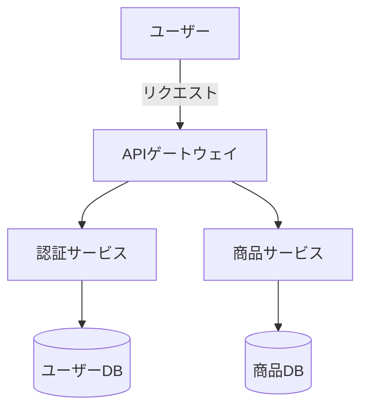

:::message
**この記事で得られること**

- **Markdown で設計書を書くメリット・デメリット**の整理
- **実際に使えるテンプレート**と記法ガイド
- **チームへの段階的な導入プロセス**と躓きポイント
- **CI/CD との統合**によるドキュメント品質の自動維持

**対象読者**: 設計書の管理方法に課題を感じているエンジニア・テックリード
:::

## はじめに

「設計書が古くて実態と合っていない」「Word ファイルが散在していてどれが最新かわからない」――こうした課題を抱えているチームは少なくありません。

本記事では、設計書を **Markdown で管理する** という選択肢について、導入方法から実際の運用まで、チームへの導入ログとともに解説します。

---

## なぜ設計書を Markdown で書くのか

### 1. バージョン管理との親和性

Markdown はプレーンテキストなので、**Git で差分管理**できます。

- **誰が・いつ・何を変更したか**が明確になる
- コードレビューと同様に **PR ベースでの設計レビュー**が可能
- 設計変更とコード変更を **同一コミット**で紐づけられる

### 2. コードとの共存

エンジニアにとって最大のメリットは、**コードと同じリポジトリで管理**できることです。

```
project/
├── src/
│   └── features/
│       └── auth/
│           ├── auth.ts
│           └── README.md  ← 認証機能の設計書
├── docs/
│   ├── architecture.md    ← システム全体のアーキテクチャ
│   └── api-design.md      ← API 設計書
```

### 3. ツールの充実

Zenn、GitHub、GitLab、Notion など、**Markdown のレンダリング環境**はすでに整っています。Mermaid によるダイアグラム描画も標準的にサポートされており、**別途 UML ツールを用意する必要がありません**。



### 注意すべきデメリット

一方で、すべてのケースに適しているわけではありません。

| デメリット | 対策 |
| --- | --- |
| 複雑なレイアウト（表・図）が苦手 | Mermaid / 外部ツールへのリンクで補完 |
| 非エンジニアの学習コストが高い | プレビューツールの整備・テンプレートの統一 |
| 画像の管理が煩雑 | `docs/images/` ディレクトリに集約 |

---

## Markdown 設計書の基本構造

設計書には複数の種類がありますが、どの種類でも共通して持つべき項目があります。

### 共通フロントマター

```markdown
---
title: "○○機能 設計書"
version: "1.0.0"
status: "draft" # draft / review / approved / deprecated
author: "@yourname"
last_updated: "2025-11-01"
---
```

フロントマターを設けることで、**ドキュメントの状態管理**が容易になります。

### 機能設計書テンプレート

```markdown
# ○○機能 設計書

## 概要

- **目的**: ○○を実現するため
- **対象システム**: ○○サービス
- **関連 Issue/PR**: #123

---

## 要件

### 機能要件

- [ ] ユーザーは○○できる
- [ ] 管理者は○○を確認できる

### 非機能要件

- レスポンスタイム: 200ms 以内
- 可用性: 99.9%

---

## 設計

### データモデル

\`\`\`typescript
interface User {
  id: string;
  email: string;
  createdAt: Date;
}
\`\`\`

### シーケンス図

\`\`\`mermaid
sequenceDiagram
  Client->>API: POST /auth/login
  API->>DB: SELECT user WHERE email = ?
  DB-->>API: User
  API-->>Client: JWT Token
\`\`\`

---

## テスト方針

- 単体テスト: ○○のロジックを網羅
- 統合テスト: ○○のエンドポイントを確認

---

## 変更履歴

| バージョン | 日付 | 変更内容 | 担当者 |
| --- | --- | --- | --- |
| 1.0.0 | 2025-11-01 | 初版作成 | @yourname |
```

---

## チームへの導入ログ

ここからは、実際にチームへ Markdown 設計書を導入した際の記録です。

### フェーズ 1：パイロット導入（1〜2 週間）

#### 取り組んだこと

- 既存の Word/Confluence 設計書の中から**新規機能の設計書 1 本**を選び、Markdown で書き直す
- `docs/` ディレクトリ構成と命名規則を決定する

#### 躓いたこと

最初の壁は**ダイアグラムの描き方**でした。

これまで PowerPoint で描いていたフローチャートを Mermaid に移行しようとしましたが、慣れていないメンバーが「書けない」「プレビューが出ない」と詰まるケースが続出。

**対策**: まず `flowchart TD` の基本構文だけ覚えてもらい、複雑なケースは draw.io リンクを貼る方針に切り替えました。

#### 得られた知見

- Mermaid は **「シーケンス図」が最も費用対効果が高い**（コードとの対応が分かりやすいため）
- テンプレートを先に作ることで「何を書けばいいかわからない」問題が解消した

---

### フェーズ 2：PR レビュー文化の構築（3〜4 週間）

#### 取り組んだこと

- 設計書の変更を**必ず PR 経由**にするルールを制定
- PR テンプレートに「設計書更新確認チェックボックス」を追加

```markdown
## チェックリスト

- [ ] コード変更に対応した設計書を更新した
- [ ] 設計書の `version` と `last_updated` を更新した
- [ ] レビュアーは設計書の内容とコードの整合性を確認した
```

#### 躓いたこと

**「設計書を先に書く文化」への移行**が思ったより時間がかかりました。

エンジニアの自然な動線は「実装 → ドキュメント後回し」です。PR テンプレートのチェックボックスは効果的でしたが、「実装後に後付けで設計書を書く」という運用に陥りがちでした。

**対策**: チケット起票時に「設計書ドラフト」の作成を必須タスクとして追加。設計書を **「思考の整理ツール」** として位置づけ直しました。

#### 得られた知見

- 設計書を「成果物」ではなく「思考プロセスの記録」と捉えると書くハードルが下がる
- `status: draft` から始めることで「完璧でないといけない」プレッシャーを軽減できる

---

### フェーズ 3：CI/CD との統合（5〜6 週間）

#### 取り組んだこと

- [markdownlint](https://github.com/DavidAnson/markdownlint) を CI に追加してフォーマットを自動チェック
- `status: deprecated` になった設計書を定期的に検出するスクリプトを導入

**.markdownlint.json の設定例**:

```json
{
  "MD013": false,
  "MD033": false,
  "MD041": false
}
```

**GitHub Actions 設定例**:

```yaml
name: Lint Docs
on:
  pull_request:
    paths:
      - "docs/**/*.md"

jobs:
  lint:
    runs-on: ubuntu-latest
    steps:
      - uses: actions/checkout@v4
      - name: markdownlint
        uses: DavidAnson/markdownlint-cli2-action@v16
        with:
          globs: "docs/**/*.md"
```

#### 躓いたこと

`MD013`（1 行 80 文字制限）のルールが日本語に向いていないため、序盤にメンバーから「日本語のドキュメントに英語のルールを適用するのは無理がある」という声が上がりました。

**対策**: 行長制限は無効化し、見出し構造・コードブロックの言語指定・リンク形式に絞ってルールを適用しました。

#### 得られた知見

- CI の目的は**一貫性の強制**ではなく**最低限の品質担保**
- ルールは段階的に追加する（最初から厳しくしすぎない）

---

## 3 ヶ月後の現状

導入から 3 ヶ月が経過した時点での評価です。

### できるようになったこと

- **設計レビューが非同期**でできるようになった（会議を削減）
- 新メンバーが「この機能どう動くの？」と聞いてきたとき、**設計書を見てもらえばわかる**状態になった
- コードと設計書の乖離が **PR レビューで指摘される**文化ができた

### まだ課題として残っていること

- 古い設計書（`status: deprecated` 未更新）の整理が追いついていない
- 非エンジニア（デザイナー・PdM）は Markdown を直接編集することに抵抗がある
- ダイアグラムの**保守コスト**（実装変更に合わせた図の更新）は依然として高い

---

## まとめ

Markdown 設計書の導入は、**「いきなり全部移行する」のではなく「少しずつ文化をつくる」** アプローチが成功のカギです。

| フェーズ | 期間 | ポイント |
| --- | --- | --- |
| パイロット導入 | 1〜2 週間 | テンプレートを作り、1 本書いてみる |
| PR レビュー文化 | 3〜4 週間 | 設計書変更を PR 必須に |
| CI/CD 統合 | 5〜6 週間 | markdownlint でフォーマット自動チェック |

設計書を「生きたドキュメント」として維持するために、**ツールと文化の両面からアプローチ**することが重要です。

まずは新規機能 1 本の設計書を Markdown で書いてみるところから始めてみてください。

---

## 参考リンク

- [markdownlint 公式](https://github.com/DavidAnson/markdownlint)
- [Mermaid 公式ドキュメント](https://mermaid.js.org/)
- [GitHub Flavored Markdown Spec](https://github.github.com/gfm/)
