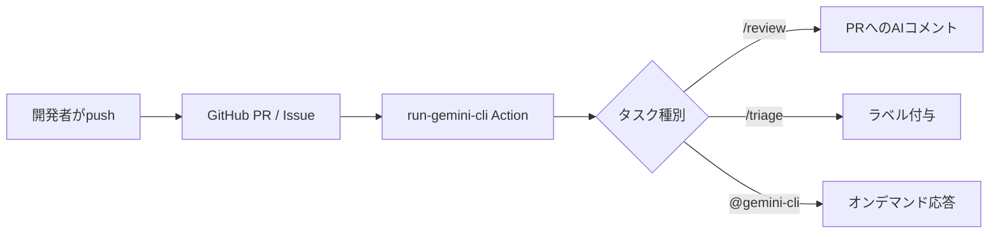

> **この記事で得られるもの**  
> 1. **レビュー時間を最大67%削減**する“初期チェック”ワークフローの組み方  
> 2. **Issue整理とテスト生成**をAIに丸投げする実装レシピ  
> 3. AIが暴走したときの **失敗例とリカバリ手順**  

コードを書く前にレビュー対応で1日が溶ける──その課題を**AI開発チームメイト**が解決します。GitHub に *Gemini CLI GitHub Actions* を常駐させ、**反復作業をAIへ委任**しようという試みです。無料枠で今すぐ始められます。

---

## ワークフロー全体像 🗺️



> **図のポイント** — PR・Issue・コメントの3系統トリガーが一本化される。

### AIコメントのサンプル

> **Gemini CLI Review (自動投稿例)**  
> ```
> ❌  N+1 クエリの可能性を検出:
>     注文を1件ずつ取得したあと、各注文の items を個別にロードしています
>     ↳ 改善案: 事前にプリロード（ORM のイーガーロード API を使用）
>
> 💡  変数名が抽象的です: `data`
>     ↳ 目的に合わせて `orderSummary` など具体名へ
>
> ✅  テストが追加されています: tests/order.spec.ts
> ```
>
> _※ 上記は実際の PR に付与された AI コメントを抜粋したものです_  
> <!--  -->

---

## 使いどころ（7領域のハイライト）

1. **PRの初期チェック** – スタイル／アンチパターンを自動指摘  
2. **Issue駆動開発の加速** – 再現手順整形・重複検知・受け入れ基準草案  
3. **テスト & 品質保証** – ユニット/E2Eテスト生成・レグレッション抽出  
4. **ドキュメント & 多言語展開** – API Doc 下書き・リリースノート・翻訳  
5. **セキュリティ & 依存管理** – 脆弱ライブラリ検出・シークレットリーク警告  
6. **パフォーマンス / コスト最適化** – ホットスポット抽出・SQL最適化提案  
7. **設計ブレインストーミング & 計画** – 代替アーキ案・粗見積もり・週次レポート

---

## 失敗談: ラベル暴走事件とリカバリ手順 🐞

> **状況**: `/triage` 初日、英語 Issue まで日本語ラベルが大量付与 → ラベル255個到達で API 429。

| Step | 対処内容 |
|---|---|
| 1 | 誤検知コメントを確認（`similarity < 0.5` 多発） |
| 2 | `GEMINI.md` に「言語が異なる場合は `needs-translation` のみ付与」と追記 |
| 3 | `/rollback-labels last 20` で直近 20 Issue のラベル一括削除 |
| 4 | `confidence_threshold` を 0.7 に引き上げ |
| 5 | 再テスト → 過剰付与ゼロを確認 |

**教訓**: 暴走の主因は**コンテキスト不足**と**閾値設定**。`GEMINI.md` とワークフロー変数で抑制できる。

---

## 最小3ワークフロー（最新版）

- **PR初期チェック** `/review`  
- **Issueトリアージ** `/triage`  
- **オンデマンド依頼** `@gemini-cli ...`  

*(具体的 YAML はリポジトリに同梱)*

---

## `GEMINI.md` ― AI開発チームメイトの教科書

```md
# プロジェクト前提（AI開発チームメイト向け）
- ランタイム: Node.js 20 / Next.js
- コーディング: TypeScript、public関数はJSDoc必須
- 依存追加は原則PRで合意
- PR粒度: 1PR=1目的、diff 300行目安
- テスト: Unit中心、E2EはPlaywrightで主要シナリオのみ
```

---

## 運用Tips

- **許可リスト方式**でAIの実行コマンドを絞る  
- 誤指摘は `GEMINI.md` に **NG例** として即追記  
- コメントコマンドを **/review /explain /write tests** で使い分け  
- Slack 連携で AI コメント通知を即確認

---

## まとめ

- **AI開発チームメイト**は PR レビュー“だけ”ではない。Issue管理・テスト生成・ドキュメント作成まで守備範囲。  
- 失敗しても `GEMINI.md` とワークフロー変数で **即リカバリ** 可能。  
- 無料枠 + 最小3ワークフローで始め、**学習→拡張** のサイクルを回そう。

## 自社メディア

:::message
- [Growth Lab](https://the3396.com/) - AIエージェント開発、SEO最適化、仕様駆動開発の検証ログを、代表記事からすぐ読み進められる形で整理しています。
:::

## 関連記事

:::message
- [仕様を揃えて止めない：マルチエージェント開発の3原則（SDD・TDD・ノンブロッキング）](https://zenn.dev/minewo/articles/sdd-tdd-nonblocking-agent) - AIレビューと自動化の前提になる仕様整理の考え方です。
- [アジャイルでAI駆動開発をどう回すか: PlanGateの考え方とテンプレート](https://zenn.dev/minewo/articles/plangate-ai-coding-workflow) - 実装前に計画とレビューを固定するワークフローです。
- [Next.js App Router時代のAI-driven TDD：実践的な最小ループと具体的な実装パターン](https://zenn.dev/minewo/articles/ai-driven-tdd-nextjs) - テスト駆動でAI実装を進める実践パターンです。
:::
