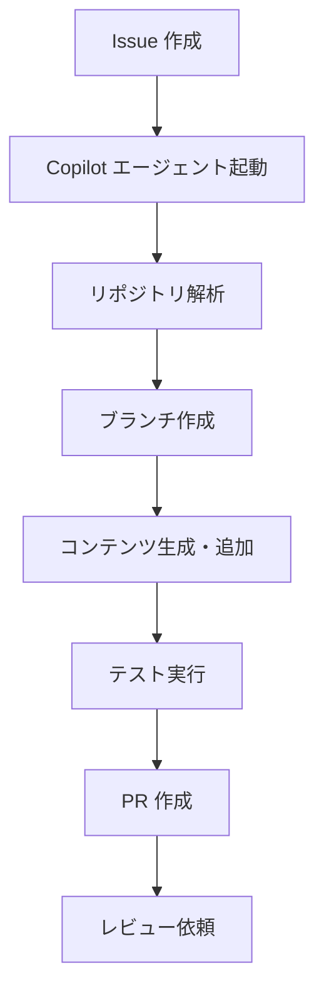

## はじめに

日々の開発において、ブランチ管理や PR 作成は繰り返しの作業です。  
**GitHub Copilot Coding Agent** を活用すれば、こうした定型作業を自動化し、開発者がより価値の高い作業に集中できる環境を作れます。

この記事では、**日付ベースの自動 PR ワークフロー**を構築する方法を紹介します。

---

## 自動 PR ワークフローとは

`feature/auto-pr-YYYYMMDD` のような命名規則でブランチを自動生成し、定期的に新しいコンテンツや機能追加を PR としてまとめる仕組みです。

**活用シーン**:

- ブログ記事の定期投稿
- 依存パッケージの自動アップデート
- データや設定ファイルの日次同期
- ドキュメントの自動更新

---

## 基本的な構成

### 1. GitHub Actions ワークフロー

```yaml
# .github/workflows/auto-pr.yml
name: Auto PR Generator

on:
  schedule:
    - cron: '0 9 * * *'  # 毎日午前9時（UTC）
  workflow_dispatch:

jobs:
  create-auto-pr:
    runs-on: ubuntu-latest
    permissions:
      contents: write
      pull-requests: write

    steps:
      - uses: actions/checkout@v4

      - name: Set date variable
        id: date
        run: echo "DATE=$(date +%Y%m%d)" >> $GITHUB_OUTPUT

      - name: Create feature branch
        run: |
          git checkout -b feature/auto-pr-${{ steps.date.outputs.DATE }}
          git push origin feature/auto-pr-${{ steps.date.outputs.DATE }}

      - name: Generate content
        run: |
          # コンテンツ生成スクリプトを実行
          ./scripts/generate-daily-content.sh

      - name: Commit and push
        run: |
          git add .
          git commit -m "chore: auto-generated content for ${{ steps.date.outputs.DATE }}"
          git push origin feature/auto-pr-${{ steps.date.outputs.DATE }}

      - name: Create Pull Request
        uses: peter-evans/create-pull-request@v6
        with:
          branch: feature/auto-pr-${{ steps.date.outputs.DATE }}
          base: main
          title: "feat: auto-generated content for ${{ steps.date.outputs.DATE }}"
          body: |
            ## 自動生成PR

            このPRは GitHub Actions により自動生成されました。

            **生成日**: ${{ steps.date.outputs.DATE }}

            ### 変更内容
            - 日次コンテンツの自動追加

            ---
            > このPRをレビューし、問題なければマージしてください。
```

---

## GitHub Copilot Coding Agent との連携

**GitHub Copilot Coding Agent** を使えば、自動 PR の内容をより高度に制御できます。

### Issue 経由でエージェントをトリガーする

```markdown
# Issue タイトル
feature/auto-pr-20260405 ブランチを作成し、main へのマージ PR を用意してください。

# Issue 本文
以下の手順で自動 PR を作成してください:
1. feature/auto-pr-20260405 ブランチを作成
2. 新しい記事を追加
3. main へのマージ PR を作成
```

Copilot は Issue の内容を読み取り、コードの変更から PR 作成まで自動で実行します。

### エージェントの処理フロー



---

## ブランチ命名規則のベストプラクティス

自動 PR に使うブランチ名には、以下の命名規則を推奨します。

| パターン | 説明 | 例 |
| --- | --- | --- |
| `feature/auto-pr-YYYYMMDD` | 日付ベースの自動 PR | `feature/auto-pr-20260405` |
| `chore/deps-update-YYYYMMDD` | 依存関係の自動更新 | `chore/deps-update-20260405` |
| `docs/auto-update-YYYYMMDD` | ドキュメントの自動更新 | `docs/auto-update-20260405` |

---

## 自動マージの設定

問題のない自動 PR はレビューなしでマージできるように設定することも可能です。

```yaml
- name: Enable auto-merge
  run: |
    gh pr merge \
      --auto \
      --squash \
      feature/auto-pr-${{ steps.date.outputs.DATE }}
  env:
    GH_TOKEN: ${{ secrets.GITHUB_TOKEN }}
```

:::message alert
自動マージを有効にする場合は、**ブランチ保護ルール** と **必須ステータスチェック** を適切に設定してください。意図しない変更が main ブランチに入らないよう注意が必要です。
:::

---

## 実装のポイント

### 冪等性の確保

同じ日付で複数回実行されても問題ないように、ブランチが既に存在する場合は処理をスキップするロジックを追加します。

```bash
#!/bin/bash
BRANCH="feature/auto-pr-$(date +%Y%m%d)"

if git ls-remote --exit-code --heads origin "$BRANCH" > /dev/null 2>&1; then
  echo "Branch $BRANCH already exists. Skipping."
  exit 0
fi

git checkout -b "$BRANCH"
```

### エラーハンドリング

自動化ワークフローでは、エラー発生時の通知と再試行の仕組みが重要です。

```yaml
- name: Notify on failure
  if: failure()
  uses: actions/github-script@v7
  with:
    script: |
      await github.rest.issues.create({
        owner: context.repo.owner,
        repo: context.repo.repo,
        title: `Auto PR generation failed: ${new Date().toISOString().split('T')[0]}`,
        body: '自動PR生成に失敗しました。ワークフローのログを確認してください。',
        labels: ['bug', 'automation']
      })
```

---

## まとめ

**GitHub Copilot + GitHub Actions** を組み合わせることで、日次の自動 PR ワークフローを実現できます。

- ✅ ブランチの自動生成
- ✅ コンテンツの自動追加
- ✅ PR の自動作成とレビュー依頼
- ✅ 問題なければ自動マージ

定型作業をこの仕組みで自動化し、開発者はより本質的な課題解決に集中しましょう。

---

## 参考リンク

- [GitHub Actions ドキュメント](https://docs.github.com/ja/actions)
- [peter-evans/create-pull-request](https://github.com/peter-evans/create-pull-request)
- [GitHub Copilot Coding Agent](https://docs.github.com/ja/copilot/using-github-copilot/using-copilot-coding-agent)
