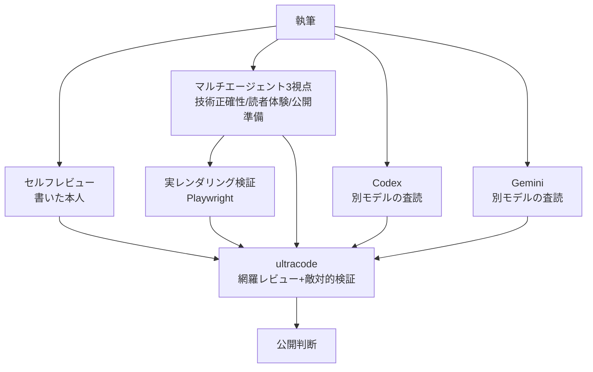

> TL;DR

- 全9章の Zenn Book を、**セルフ → マルチエージェント3視点 → Codex → Gemini → ultracode（網羅マルチエージェント）** の5系統で何度もレビューして公開した。
- 各レビュー層は**別々の種類の問題**を捕まえた。とくに「**Zenn が SVG 画像を表示しない**」という公開ブロッカーは、レビュー文章でなく**実レンダリング検証（Playwright）**でしか出てこなかった。
- 「もう収束した」と思った後に走らせた **ultracode（網羅レビュー＋敵対的検証）が、5系統が見逃していた実バグ**（コピペで動かないサンプル等）を掘り当てた。
- 同時に、**敵対的検証は「水増し改善」を却下**してくれた。レビューは足し算でなく、足すべきものと却下すべきものを分ける営みだった。

## はじめに：なぜ「レビューの設計」を記事にするのか

AI コーディング統制 OSS のドキュメントを、Zenn Book（全9章・無料）として公開しました。本記事はその**中身**ではなく、**どうレビューして品質を担保したか**の話です。

AI に文章を書かせると、速く・大量に・もっともらしく出てきます。問題は、**もっともらしさが正しさを保証しない**こと。とくに技術書は、サンプルコードや手順が「動かない」「最新仕様とズレている」と一発で信頼を失います。

そこで、1人（＋AI）でも回せる**多層レビュー**を設計しました。結論を先に言うと、レビューは「何回も読む」ではなく「**違う種類の目で読む**」と「**実際に動かして確かめる**」の組み合わせが効きました。

## レビュー体制：5系統の役割分担



各層には**役割の違い**を持たせました。

| 層 | 主に捕まえるもの |
|----|------------------|
| セルフ | 自分の意図とのズレ、書き残し |
| マルチエージェント（技術正確性） | 実装との不一致（Hook 名・コマンド・スキーマ）|
| マルチエージェント（読者体験） | 離脱しそうな箇所・宣伝臭・不足 |
| マルチエージェント（公開準備） | 媒体仕様・リンク・画像・構造 |
| Codex / Gemini | 別モデル視点での思い込みの突き崩し |
| 実レンダリング（Playwright）| 文章では見えない「実際の表示」|
| ultracode | 収束後の見逃し＋過剰研磨の抑制 |

ポイントは、**同じ AI に何度も読ませても同じ盲点が残る**ことです。実装した AI と検証する AI を分け、さらに別系統（Codex/Gemini）を当てることで、思い込みが突き崩されます。

## 層ごとに「違う問題」が出た

### 公開ブロッカーは、文章レビューでは出なかった

最初、図を見栄えのする SVG で用意していました。文章レビューでは誰も問題にしませんでした。ところが **Playwright で実際の Zenn プレビューをレンダリング**したところ、本番のレンダラがこう出力していました。

```text
/images/.../enforcement-architecture.svg を表示できません。
対応している画像の拡張子は .png,.jpg,.jpeg,.webp,.gif です。
```

**Zenn は markdown 画像の SVG をサポートしません**（セキュリティ上の理由）。一方で **mermaid のコードブロックはネイティブに描画されます**。これは「文章を読む」レビューでは絶対に出てこない、**実際に動かして初めて分かる**種類の問題でした。

→ 図はすべて mermaid に置き換え、解消。教訓は「**最終出力の媒体で、実際にレンダリングして確かめる**」。

### 「もう収束した」あとに、ultracode が実バグを掘り当てた

5系統レビューを数ラウンド回し、3系統が「これ以上は水増し」と判断する**収束状態**に達しました。普通ならここで公開です。

ですが、ダメ押しで **ultracode（章ごとに並列エージェントを立て、外部リンク実在確認、改善提案を敵対的に検証する網羅レビュー）** を走らせたところ、**収束済みの本でも見逃されていた実バグ**が出ました。代表例：

- **承認記録 JSON のサンプルが、スキーマ必須項目（`task_id` / `phase`）を欠いていた。** 読者がコピーすると検証で弾かれて動かない。
- **ある自動承認機能の説明が「前提条件」を落としていた。** 「低リスクなら既定で自動承認」と読めてしまい、本の核（人間の承認ゲート）と矛盾する。

どちらも「文章としては自然」で、複数ラウンドのレビューをすり抜けていました。網羅的に並列で当てて初めて表に出たわけです。

### 敵対的検証が「水増し」を却下してくれた

面白かったのは、ultracode が**改善提案を却下もした**ことです。各提案を「これは本当に読者価値を上げるか、それとも水増しか」と敵対的に検証し、たとえば次を**却下**しました。

- 「巻頭にバージョン差の注記を足す」→ 同じ説明が参照先 doc に既にあり冗長。本書の「変わらない原理を扱う」方針に反する。
- 「付録にも図を足す」→ 既存の表で情報は足りており、装飾的な水増し。

レビューを重ねると「何か直さなきゃ」と**改善のための改善**を足しがちです。敵対的検証は、その衝動にブレーキをかけてくれました。**レビューの質は「足した数」ではなく「足すべきものと却下すべきものを分けられたか」**で決まる、と実感しました。

## 設計してよかった3つのこと

### 1. 役割を分けた多視点（同質な多数決にしない）

「3人に聞く」より「**技術正確性・読者体験・公開準備という別軸で聞く**」方が、重複しない指摘が集まりました。別モデル（Codex/Gemini）を混ぜるのも、単一モデルの盲点対策として効きました。

### 2. 実レンダリング検証を必ず入れる

文章レビューと、**最終媒体での実表示確認**は別物です。SVG 非対応のような媒体仕様は、Playwright で本番相当をレンダリングしないと捕まりません。公開前チェックに「実際に表示する」を必ず入れるべきでした。

### 3. 「収束」を疑う最終パス

複数レビューが「もう十分」と言っても、**網羅的に並列で当てる最終パス**は別の価値がありました。ただし、そこで出た提案をそのまま全部入れると過剰研磨になるので、**敵対的検証で選別**します。「掘り当てる」と「足しすぎない」を両立させるのがコツです。

## 注意点・限界

- マルチエージェントレビューは**トークンコストがかかります**。全部に全力でやるより、技術書のように「誤りが信頼を壊す」成果物に絞るのが現実的です。
- AI レビューは**実装の正本（コードやスキーマ）と照合**して初めて意味を持ちます。照合先を与えないと、もっともらしいだけの指摘も混ざります。
- 最後の公開判断（外向きアクション）は人間が持つべきです。レビューはあくまで判断材料を増やす営みでした。

## まとめ

- 技術書のレビューは「何回読むか」でなく「**違う種類の目で読む × 実際に動かす**」。
- 役割を分けた多視点 ＋ 別モデル ＋ 実レンダリング ＋ 網羅レビュー、で**別々の問題**が出た。とくに媒体仕様（SVG 非対応）は実レンダリングでしか出なかった。
- 「収束した」あとの網羅パスが、見逃していた実バグを掘り当てた。
- 敵対的検証は水増しを却下し、過剰研磨を防いだ。

レビューは足し算ではなく、**足すべきものと却下すべきものを分ける設計**だと学びました。

## 関連記事

- 📕 [Zenn Book: AI にコードを書かせる前にやること — PlanGate 実践ガイド](https://zenn.dev/minewo/books/plangate-guide) - 本記事でレビューした Book 本体です。
- [AI記事制作で品質を落とさない：編集フローを3層の品質ゲートで設計する](https://zenn.dev/minewo/articles/ai-article-quality-gate-workflow) - 記事制作の品質ゲートの考え方。
- [仕様を揃えて止めない：マルチエージェント開発の3原則（SDD・TDD・ノンブロッキング）](https://zenn.dev/minewo/articles/sdd-tdd-nonblocking-agent) - マルチエージェントを止めずに品質を担保する原則。
