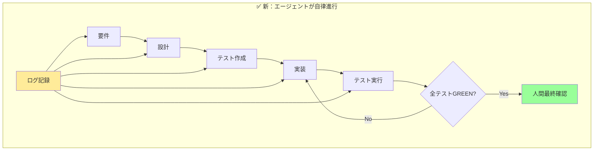

# はじめに

これまで、マルチエージェントを使った開発にチャレンジしてきました。
Claude、Gemini、Codex、Copilotなど、複数のAIエージェントを連携させて、人間はやりたいことを伝えるだけ、AIが自動でコードを書く
──夢のような話だが、近づいている現実と感じていました。

しかし、最初からうまくいったわけではありません。エージェント同士のやり取りは破綻していきます、実際に「修正したたCIがエラーで通らない」「エラーを修正していくと、仕様が変わっていく」と事実が重なっていくと、「これは本当に動くのか？」と不安になり、人間がブロッキングしてしまう。改善しては失敗する、を繰り返してきました。

本記事では、試行錯誤の末にたどり着いた**3つの原則**と、実際のプロジェクトでの適用例を共有します。

## 本記事の範囲

- マルチエージェント開発における課題と解決アプローチ
- SDD・TDD・ノンブロッキングの具体的な実践方法
- 実装例「デジタルアラームアプリ」

## 想定読者

- AIエージェントを使った開発に興味があるエンジニア
- 開発プロセスの自動化・効率化を検討している方
- マルチエージェント開発で失敗した経験がある方

## 得られるもの

- エージェント連携が破綻する原因と対策
- 3原則の具体的な実装方法とテンプレート
- 実践可能なワークフローとツール選定の指針

# 解決したい2つの課題

## 課題① エージェント連携の破綻

前提条件が正しく伝わらない。エージェントによって解釈が異なる。

特に曖昧な自然言語要件をそのまま渡すと、エージェントごとに違う理解をしてしまいます。

### 実際に起きた解釈のズレ

```
要件：「平日にアラームを鳴らす」

エージェントA：「平日 = 月曜〜金曜」
エージェントB：「平日 = 営業日（祝日除く）」
エージェントC：「平日 = 月曜〜金曜（振替休日も考慮）」
```

このズレが積み重なると、最終的にテストや実装が食い違い、連携が破綻してしまうのです。

## 課題② 人間がブロッキングしてしまう

エージェントがどこまで進んでいるのかが分からない。仕様の抜けで止まっているのか、意図的な変更なのか、**経緯が見えない**。

経緯が分からないと「ちゃんと進んでるの？」と不安になり、どうしてもレビューや承認を**ブロック要素として差し込んでしまう**。


結果、「自律的に進めるはずのAI」が、人間の承認待ちで停滞する──そんな本末転倒な事態に陥りました。

# ログの重要性：透明性が信頼を生む

そこで気づいたのが、**ログを残すこと**の重要性です。

- エージェント同士のやり取りを記録する
- 人間は「なぜこうなったのか」を後から理解できる
- 無用なブロックを減らせる
- エージェント自身も「意思決定の透明性」を持つことでサボらない

ログは安心感の源泉となり、ブロック要素を減らします。

# 3つの原則

## 原則1：SDD（Specification-Driven Development：仕様駆動開発）

**仕様を共通言語にする**ことで、エージェントが同じ前提で進められます。

### 必要な仕様ドキュメント

| ドキュメント | 役割 | 記載内容 |
|------------|------|---------|
| requirements.md | 要件定義 | 何を作るか、なぜ必要か |
| design.md | 設計仕様 | どう作るか、アーキテクチャ |
| tasks.md | タスク分解 | 誰が何をするか |

### 仕様書の書き方（曖昧さを殺す）

**ダメな例**
```markdown
# requirements.md
- 平日にアラームを鳴らす
- 適切なタイミングでスヌーズ
```

**良い例**
```markdown
# requirements.md
## アラーム条件
- 曜日：月曜日(1) 〜 金曜日(5)
- 時刻：07:00:00（秒単位）
- 祝日：考慮しない（祝日でも鳴る）
  
## スヌーズ仕様
- 間隔：300秒（5分）
- 最大回数：3回
- 4回目以降：無視（エラーも出さない）
```

数値、単位、エッジケース...全部書く。「当たり前でしょ」は存在しません。

## 原則2：TDD（Test-Driven Development：テスト駆動開発）

**実装前にテストを書く**ことで「到達すべきゴール」が明確になります。

### 2種類のテスト

- **受け入れテスト（Acceptance Test）**：ユーザー視点での動作確認
- **契約テスト（Contract Test）**：コンポーネント間の約束事

エージェントは「テストを通す」ことだけに集中できます。

## 原則3：ノンブロッキング（Non-Blocking：人間は進行を止めない）

エージェントは**ログを残しながら自律的に進行**します。

### 従来のフロー vs ノンブロッキングフロー



人間は途中で覗けるが承認待ちは挟まない。最終レビュー前に**テストGREENを担保** → 人間は仕様・テスト・ログを確認するだけです。

# 具体例：デジタルアラームアプリの開発

実際にマルチエージェント開発で「平日7時に鳴るアラームアプリ」を作った時の流れを紹介します。

## Step1: SDD（仕様駆動開発）

最初に3つの仕様ファイルを作成し、全エージェントの共通認識を作ります。

### requirements.md（要件定義）

```markdown
# アラームアプリ要件 v1.0

## 用語定義
- 平日：月曜日(1)、火曜日(2)、水曜日(3)、木曜日(4)、金曜日(5)
- 週末：土曜日(6)、日曜日(0)
- 祝日：本アプリでは考慮しない

## 機能仕様

### F-001：定時アラーム
- トリガー条件：
  ```
  if (曜日 in [1,2,3,4,5] AND 時刻 == "07:00:00") {
    アラーム発動
  }
  ```
- 音量：デバイス音量の80%
- 音源：default_alarm.mp3（同梱）

### F-002：スヌーズ
- 発動：アラーム鳴動中に「SNOOZE」ボタン押下
- 待機時間：300秒 ± 1秒
- カウンター：
  ```
  if (snooze_count < 3) {
    snooze_count++;
    set_timer(300);
  } else {
    // 何もしない（ボタンは押せるが無反応）
  }
  ```

## 非機能要件
- アラーム鳴動は1秒以内の精度
- バッテリー消費を最小限に
```

**ポイント：擬似コードで書く**。自然言語より誤解が少なくなります。

### design.md（設計仕様）

```markdown
# アーキテクチャ設計

## コンポーネント構成
- AlarmManager: アラーム全体の制御
- ClockService: 時刻監視サービス
- NotificationService: アラーム通知
- UIController: ユーザーインターフェース

## インターフェース定義
```

```typescript
interface Clock {
  getCurrentTime(): DateTime
  isWeekday(date: DateTime): boolean
}

interface Alarm {
  schedule(time: Time): void
  snooze(minutes: number): boolean  // 成功時true
  cancel(): void
  getSnoozeCount(): number
}
```

### tasks.md（タスク分解）

```markdown
# 実装タスクリスト

## Phase 1: 基盤実装
1. [ ] ClockServiceの実装
   - [ ] getCurrentTimeメソッド
   - [ ] isWeekdayメソッド（曜日判定）
   
2. [ ] AlarmManagerの実装
   - [ ] scheduleメソッド
   - [ ] snoozeメソッド（カウンター付き）
   - [ ] スヌーズ上限チェック

## Phase 2: 統合
3. [ ] NotificationServiceの実装
   - [ ] 通知表示
   - [ ] サウンド再生
   
4. [ ] 統合テスト
   - [ ] 平日シナリオ
   - [ ] 週末シナリオ
   - [ ] スヌーズシナリオ
```

## Step2: TDD（テスト駆動開発）

実装前にテストを書き、エージェントが「何を達成すべきか」を明確にします。

### acceptance.test.js（受け入れテスト）

```javascript
// 平日7時のアラーム動作テスト
describe('平日アラーム機能', () => {
  let alarm;
  let mockDate;
  
  beforeEach(() => {
    alarm = new AlarmApp();
    mockDate = new MockDate();
  });

  test('月曜7時ジャストに鳴る', () => {
    // GIVEN: 月曜日の6:59:59
    mockDate.set('2024-01-15 06:59:59'); // 月曜
    alarm.update(mockDate);
    
    // WHEN: 1秒経過
    mockDate.advance(1);
    alarm.update(mockDate);
    
    // THEN: アラームが鳴動
    expect(alarm.state).toBe('RINGING');
    expect(alarm.sound.volume).toBe(0.8);
  });

  test('土曜7時には鳴らない', () => {
    // GIVEN: 土曜日の7:00:00
    mockDate.set('2024-01-20 07:00:00'); // 土曜
    
    // WHEN: 状態を更新
    alarm.update(mockDate);
    
    // THEN: アラームは鳴動しない
    expect(alarm.state).toBe('IDLE');
  });
});

describe('スヌーズ動作', () => {
  test('3回までスヌーズ可能', () => {
    const alarm = new AlarmApp();
    alarm.state = 'RINGING';
    
    // 1-3回目：成功
    for(let i = 1; i <= 3; i++) {
      expect(alarm.snooze()).toBe(true);
      expect(alarm.getSnoozeCount()).toBe(i);
    }
    
    // 4回目：失敗（カウントは増えない）
    expect(alarm.snooze()).toBe(false);
    expect(alarm.getSnoozeCount()).toBe(3);
  });
});
```

### contract.test.js（契約テスト）

```javascript
// ClockServiceの契約テスト
describe('ClockService契約', () => {
  const clock = new ClockService();
  
  test('isWeekdayは月〜金でtrueを返す', () => {
    // 月〜金：true
    const weekdays = [
      '2024-01-15', // 月
      '2024-01-16', // 火
      '2024-01-17', // 水
      '2024-01-18', // 木
      '2024-01-19', // 金
    ];
    
    weekdays.forEach(date => {
      expect(clock.isWeekday(new Date(date))).toBe(true);
    });
    
    // 土日：false
    expect(clock.isWeekday(new Date('2024-01-20'))).toBe(false); // 土
    expect(clock.isWeekday(new Date('2024-01-21'))).toBe(false); // 日
  });
});
```

## Step3: ノンブロッキング実行

エージェントが自律的に進行し、その過程をログに残します。

### 実行ログの例

```log
[2024-01-15 10:00:00] [Agent-Spec] requirements.mdを解析開始
[2024-01-15 10:00:02] [Agent-Spec] 平日の定義を確認: 月〜金（祝日除外なし）
[2024-01-15 10:00:03] [Agent-Test] acceptance.test.jsから7個のテストケースを生成

[2024-01-15 10:00:05] [Agent-Impl-1] ClockService実装開始
[2024-01-15 10:00:08] [Agent-Impl-1] isWeekdayメソッド実装完了
[2024-01-15 10:00:09] [Agent-Test] ClockService契約テスト実行: 7/7 PASS ✓

[2024-01-15 10:00:12] [Agent-Impl-2] AlarmManager実装開始
[2024-01-15 10:00:15] [Agent-Impl-2] スヌーズカウンター実装（最大3回）
[2024-01-15 10:00:18] [Agent-Test] AlarmManager単体テスト: 5/5 PASS ✓

[2024-01-15 10:00:20] [Agent-Integration] 統合テスト実行
[2024-01-15 10:00:22] [Agent-Integration] シナリオ1: 平日アラーム動作 PASS ✓
[2024-01-15 10:00:23] [Agent-Integration] シナリオ2: 週末スキップ PASS ✓
[2024-01-15 10:00:24] [Agent-Integration] シナリオ3: スヌーズ3回 PASS ✓

[2024-01-15 10:00:25] [Agent-Review] 全テスト GREEN - 実装完了
```

### エージェント間の会話ログ

エージェント同士のやり取りも記録し、意思決定の過程を透明化します。

```log
[Agent-Spec → Agent-Test]: 
「requirements.mdの『平日』は月〜金で、祝日考慮なしです」

[Agent-Test → Agent-Impl-1]: 
「isWeekday()は0（日）と6（土）でfalse、1-5でtrueを返してください」

[Agent-Impl-1 → Agent-Test]: 
「実装完了。getDay()メソッドを使用しました」

[Agent-Test → Agent-Impl-2]: 
「ClockServiceの契約テストPASS。AlarmManagerでこれを利用してください」

[Agent-Impl-2 → Agent-Test]: 
「スヌーズ実装で質問：4回目のスヌーズ要求はどう処理しますか？」

[Agent-Test → Agent-Spec]: 
「仕様確認：スヌーズは最大3回ですが、4回目の挙動が未定義です」

[Agent-Spec → Agent-Test]: 
「requirements.md更新：4回目以降は無視する仕様としました」
```

## 結果：人間は最終確認のみ

このプロセスを経て、人間が確認するのは：

1. **仕様の妥当性**：requirements.mdが要求を正しく反映しているか
2. **テストカバレッジ**：重要なシナリオが網羅されているか  
3. **実装品質**：ログから問題がないか確認
4. **最終動作**：全テストGREENを確認

**人間のレビュー時間：約5分**（従来の1/10）

# エージェントの失敗と学習

## 失敗例1：仕様の解釈ミス

```log
[ERROR] [Agent-Impl-1] 祝日判定APIを呼び出そうとしました
[Agent-Spec] 訂正：requirements.mdでは「祝日は考慮しない」です
[Agent-Impl-1] 了解。シンプルな曜日判定のみに修正
```

## 失敗例2：過剰な最適化

```log
[WARNING] [Agent-Impl-2] バッテリー最適化のため1分間隔でチェック
[Agent-Test] テスト失敗：1秒以内の精度が必要
[Agent-Impl-2] 1秒間隔に修正しました
```

これらの失敗もログに残ることで、次回以降の開発で同じミスを避けられます。

# 実践ガイド

## 使用可能なツール/サービス

| ツール | 特徴 | 適用シーン |
|--------|------|-----------|
| Claude Projects + MCP | 高度な文脈理解 | 複雑な仕様の実装 |
| GitHub Copilot Workspace | GitHubとの連携 | OSS開発 |
| Cursor + カスタムルール | IDE統合 | 日常的なコーディング |
| CrewAI | マルチエージェント特化 | チーム開発シミュレーション |

## プロジェクト構造

```
project/
├── .agent-logs/           # エージェントログ
│   ├── 2024-01-15-session.log
│   ├── decisions.json
│   └── metrics.json
├── specs/                 # 仕様ドキュメント
│   ├── requirements.md
│   ├── design.md
│   └── tasks.md
├── tests/                 # テストファイル
│   ├── acceptance/
│   └── contracts/
└── src/                   # 実装コード
```

## 安全対策

### 予算制限とタイムアウト

```yaml
# .agent-config.yml
limits:
  api_calls_per_hour: 100
  max_cost_per_day: $10
  timeout_per_task: 300s
  
circuit_breaker:
  max_errors: 3
  error_types:
    - compilation_error
    - test_failure
  
notifications:
  slack_webhook: "https://..."
  conditions:
    - error_rate > 0.5
    - cost > $5
```

# よくある質問

## Q1: エージェントが暴走したらどうする？

**A:** 3段階の安全策を用意します：
1. API利用上限の設定（コスト制限）
2. タイムアウト設定（時間制限）
3. エラー頻度による自動停止（品質制限）

## Q2: 既存プロジェクトにも適用できる？

**A:** はい、段階的に適用可能です。まず新機能開発で試し、成功事例を作ってから既存部分に展開することをお勧めします。

## Q3: チーム全員がAIツールに詳しくない場合は？

**A:** 以下のステップで導入します：
1. AIに詳しい1人がパイロット実施
2. 成功事例を共有
3. ペアプログラミングで知識移転
4. チーム全体へ展開

## Q4: テストが全てGREENでも品質が心配

**A:** 以下を確認してください：
- テストカバレッジ（80%以上推奨）
- エッジケースのテスト有無
- 非機能要件のテスト（性能、セキュリティ）
- 実際のユーザーシナリオとの一致

# 運用で得たこと

## 定量的な効果

| 指標 | Before | After | 改善率 |
|------|--------|-------|--------|
| 開発時間 | 8時間 | 1時間 | 87.5%削減 |
| 待ち時間の割合 | 60% | 5% | 91.7%削減 |
| エージェント連携成功率 | 30% | 85% | 183%向上 |
| 手戻り発生率 | 70% | 15% | 78.6%削減 |

## 定性的な効果

- **認知負荷の軽減**：仕様が明確なため、意思決定が速い
- **心理的安全性**：ログによる透明性で不安が減少
- **学習の蓄積**：失敗パターンがナレッジ化される
- **創造的時間の確保**：定型作業から解放される

# まとめ

マルチエージェント開発は**破綻リスクが高い**からこそ、原則が必要です。

## 3原則の効果

| 原則 | 解決する問題 | 得られる効果 |
|------|------------|------------|
| **SDD** | 解釈のズレ | 共通認識の確立 |
| **TDD** | ゴールの不明確さ | 明確な完了条件 |
| **ノンブロッキング** | 人間のボトルネック | 自律的な進行 |

## 次のアクション

1. **小規模案件で1サイクル実施**（ユーティリティ関数から）
2. **ログから観点を抽出**してチェックリスト化
3. **成功事例を共有**してチーム展開

未来の開発では、人間は**要件定義と最終レビュー**に集中し、AIエージェントは**仕様とテストを頼りに止まらず進む**──そんなスタイルが当たり前になっていくでしょう。

この3原則を守ることで、エージェントは自律的に動き、透明性と効率の両立が可能になります。

まずは小さなプロジェクトから、ぜひ試してみてください。

---

## 参考リンク

- [Model Context Protocol (MCP)](https://modelcontextprotocol.io/)
- [CrewAI Documentation](https://docs.crewai.com/)
- [Test-Driven Development by Example](https://www.amazon.co.jp/dp/4274217884)

## 著者について

マルチエージェント開発に取り組むエンジニア。失敗を重ねながら、実践的な手法を模索中。

Twitter: [@mine-take](https://x.com/mine_take?screen_name=mine_take)
GitHub: [github.com/s977043](https://github.com/s977043)
