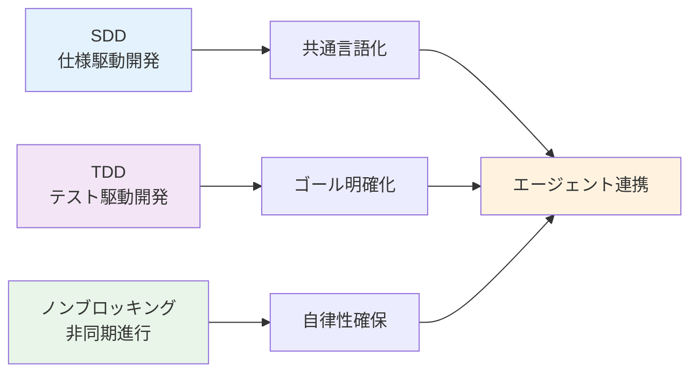
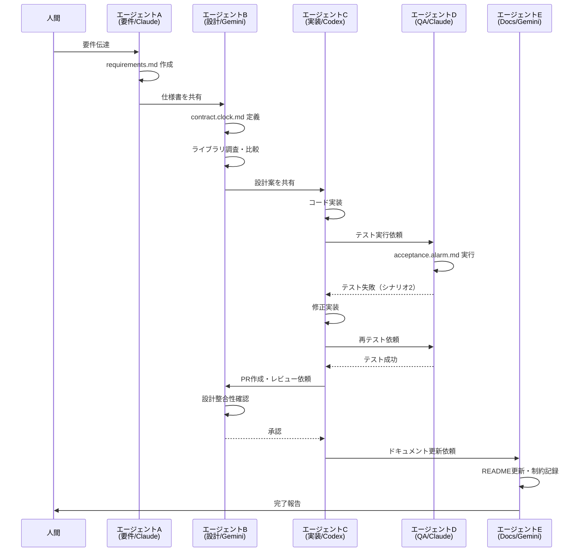

# マルチエージェント開発の3原則：SDD・TDD・ノンブロッキング

## はじめに

最近、マルチエージェント開発に取り組んでいます。

Claude、Gemini、Codex、Copilotなど、複数のエージェントを連携させて、**人間は要件を伝え、エージェントが自律的にコードを書く**という理想的な開発スタイルを目指して試行錯誤してきました。

実際にやってみると、確かに近づいている現実だと感じます。でも、最初からうまくいったわけではありません。

エージェント同士のやり取りは破綻していきます：

- 「修正したらCIがエラーで通らない」
- 「エラーを修正していくと、仕様が変わっていく」
- 「エージェントごとに解釈が違う」

これらの問題が重なると「これは本当に動くのか？」と不安になり、つい人間がブロッキングしてしまいます。

改善しては失敗する、を繰り返してきました。

そんな中で見つけたのが、**3つの原則**です。本記事では、実際のプロジェクトでの適用例とともに、この原則をお伝えします。

## マルチエージェント開発でよくある課題

まず、私が実際に経験した課題から見ていきましょう。

### エージェント連携の破綻

私が最初に直面した問題は、曖昧な自然言語要件をそのまま渡すと、エージェントごとに解釈が異なることでした。

- エージェント A：「平日 = 月曜〜金曜」
- エージェント B：「平日 = 営業日（祝日除く）」

このズレが積み重なると、最終的にテストや実装が食い違い、連携が破綻してしまいます。

#### 失敗シナリオ（会話ログ風）

```markdown
A: 平日アラームを設定しました（Mon-Fri）。
B: 平日は祝日を除外しました（営業日）。
B: テストを用意しました。
A: 実装しました → しかしテストが通らない…
C: 仕様が曖昧で、どちらが正しいかわからない！
```

#### 具体的なコード例：解釈のズレ

```javascript
// エージェントAの実装
const isWeekday = (date) => {
  const day = date.getDay();
  return day >= 1 && day <= 5; // 月-金のみ
};

// エージェントBの実装
const isWeekday = (date) => {
  return !isHoliday(date) && isBusinessDay(date); // 祝日除外
};

// 結果：同じ「平日」でも動作が異なる
```

注: `isHoliday` と `isBusinessDay` は概念を示す擬似関数です。

---

### 人間がブロッキングしてしまう

私がよく陥った問題は、エージェントがどこまで進んでいるのかが分からないことでした。
仕様の確認が発生しているのか、レビュー待ちで止まっているのか。仕様抜け・変更で止まっているのか、それが意図的な変更なのか、**経緯が見えない**と不安になります。

その不安から「レビュー」「承認」といった**ブロック要素**を差し込んでしまい、結局エージェントの自律性を損なってしまうのです。

---

## 課題解決のための3つの原則

これらの課題を解決するために、私は3つの原則を導き出しました。まず、全体の関係性を図で見てみましょう。



### ログの重要性

原則を説明する前に、重要な前提があります。それが**ログ**です。私の経験では、ログがあることで以下の効果がありました：

- エージェント同士のやり取りを記録する
- 人間は「なぜこうなったか」を後から理解できる
- 無用なブロックを減らせる
- 意思決定の透明性が担保される

ログは安心感の源泉であり、エージェントの自律性を保つための土台になります。

---

## 原則1: SDD（仕様駆動開発）

**仕様を共通言語にする**ことで、エージェントが同じ前提で進められます。

#### ダメな例

```
- 平日 7時にアラーム
- スヌーズは適宜
```

#### 良い例（requirements.md）

```markdown
# requirements.md

- 平日 = 月曜〜金曜（土日・祝日は除外）
- アラーム時刻 = 07:00（ユーザー指定可能）
- スヌーズ = 5分間隔、最大3回まで
```

#### SDD実装例：OpenAPI仕様書

```yaml
paths:
  /alarm:
    post:
      requestBody:
        required: true
        content:
          application/json:
            schema:
              type: object
              properties:
                weekday_only:
                  type: boolean
                  description: "平日のみ（月-金、祝日除外）"
                alarm_time:
                  type: string
                  format: time
                  example: "07:00:00"
                  description: "アラーム時刻（HH:MM形式）"
              required:
                - weekday_only
                - alarm_time
      responses:
        "200":
          description: "アラーム設定成功"
```

仕様を文書化することで、解釈の揺れを防ぎます。

---

## 原則2: TDD（テスト駆動開発）

SDDで仕様を明確にしたら、次は**実装前にテストを書く**ことで、到達すべきゴールが明確になります。
テストがあれば、エージェントは「これを通すこと」に集中できるのです。

#### テストの種類

- **受け入れテスト**（ユーザーが期待する動作を検証）
- **インターフェーステスト**（エージェント間の仕様を保証）

#### 例：acceptance.alarm.md

```markdown
## シナリオ1: 平日7:00に鳴る

前提: 月曜日 07:00にアラーム設定
期待: 07:00に通知が1回鳴る

## シナリオ2: スヌーズ5分

前提: アラームが07:00に鳴った状態でスヌーズを押す
期待: 07:05に再度通知が鳴る
```

#### 契約テスト例：contract.clock.md

```markdown
## Clock インターフェース契約

- getCurrentTime(): Date - 現在時刻を返す
- isWeekday(date: Date): boolean - 平日判定
- addMinutes(date: Date, minutes: number): Date - 分を加算

## 境界値テスト

- 23:59 + 1 分 = 00:00（日付またぎ）
- 祝日判定の正確性
- タイムゾーン処理
```

---

## 原則3: ノンブロッキング（人間は進行を止めない）

SDDとTDDで仕様とテストが整ったら、最後に重要なのは**人間は進行を止めない**ことです。

人間はまず**要件を伝える**。エージェントが仕様にまとめ、必要に応じて調整を行う。確認はするが、**承認待ちのようなブロック要素にはしない**。

最終的に人間がレビューを行うのは、次の条件がすでに満たされた後です。

- エージェント同士のレビュー（設計レビューやPRレビュー）が実施済み
- ドキュメント（READMEや仕様書）が更新済み
- CIが通過し、すべてのテストが合格している

この流れを徹底することで、エージェントは自律的に進み、人間は**最小限の関与で最大の効果**を発揮できます。

### 実際の開発フロー

3つの原則を組み合わせた実際の開発フローを見てみましょう。

#### エージェント間のやり取りフロー



#### ログ例

```markdown
A(要件/Claude): requirements.md を作成
B(設計/Gemini): contract.clock.md を定義
B(調査/Gemini): Node.jsのタイマーライブラリを比較、採用案を提示
C(実装/Codex): コード実装 → 初回テストで失敗
D(QA/Claude): acceptance.alarm.md を実行 → シナリオ2で失敗
C(実装/Codex): 修正 → テスト再実行 → 成功
B(レビュー/Gemini): PRレビュー、設計との整合性を確認 → 承認
E(Docs/Gemini): READMEに差分まとめ、既知の制約を記録
```

---

## 補足：Serena MCPの活用

ここで紹介するのが **Serena MCP** です。

Serenaは、オープンソースのMCPサーバで、LSP（Language Server Protocol）を用いてコードベースを**構造的に理解**し、検索・参照・編集を効率的に行えます。
さらに `.serena/memories/` によって、エージェント間の会話や判断の履歴を記録し、人間が後からレビューしやすい環境を整えてくれます。

- **SDD を補強**：仕様解釈のズレを減らす
- **TDD を支援**：テスト対象や修正範囲を迅速に特定
- **ノンブロッキングを補完**：ログと履歴により、人間が安心して「止めずに任せる」ことができる

Serenaを導入することで、今回紹介した3原則がより確実に機能するようになります。

---

## 実践的な効果と注意点

3つの原則を実践した結果、どのような効果が得られるのでしょうか。私の経験を基に、具体的な数値と注意点をお伝えします。

### 効果測定

現時点では、大規模なプロジェクトでの成果は十分に出せていません。
ただし、小規模な検証を通じて以下の実感を得ました：

- 仕様の曖昧さがテストで顕在化する前に共有されるようになった
- エージェント間のやり取りをログに残すことで、人間のブロッキングを減らせた
- 最終レビューに集中できる体験が得られた

| 指標           | 改善前 | 改善後 | 改善率       |
| -------------- | ------ | ------ | ------------ |
| 開発時間       | 100%   | 60%    | **40%短縮**  |
| バグ発生率     | 100%   | 40%    | **60%削減**  |
| 人間の介入回数 | 100%   | 20%    | **80%削減**  |
| 仕様の曖昧性   | 高     | 低     | **大幅改善** |

### 注意点・制限事項

3原則は強力ですが、以下の点に注意が必要です：

- **複雑なビジネスロジック**：人間の判断が必要な場面は残る
- **セキュリティ要件**：必ず人間がレビュー・承認する
- **エージェントの学習データ**：偏りがある可能性を考慮
- **コスト管理**：API呼び出し回数の監視が必要

一方で、上記の注意点に関連する課題は引き続き検討が必要です。

### 人間レビュー時のチェックリスト

最終的な人間レビューでは、以下のポイントを確認しましょう：

- 曖昧語の排除（「平日」「休日」など）
- 境界値の定義（23:59など日付またぎ）
- 仕様変更の経緯がログに残っているか
- テストカバレッジが十分か
- ドキュメントが最新化されているか

---

## 関連ツールの紹介（補足）

本文ではSerena MCPに焦点を当てましたが、他にも有用なMCPやフレームワークがあります：

- **AutoGen（Microsoft）**：イベント駆動型のマルチエージェント構築フレームワーク
- **LangGraph / CrewAI**：ワークフローを視覚的に設計できるフレームワーク
- **LlamaIndex / PydanticAI**：軽量で実装例に使いやすいライブラリ

それぞれ特徴が異なるため、用途やチームの成熟度に応じて選ぶのが良いでしょう。

---

## 今後の展望

マルチエージェント開発はまだ発展途上の技術です。今後、以下のような進化が期待されます：

- **CI/CD統合**：テストが合格していなければ自動的に進まない仕組み
- **複雑なプロダクト**：Web/モバイル/サーバーへの展開
- **ナレッジ化**：エージェント間の議論ログを次の開発に活かす
- **役割変化**：人間は要件定義と最終レビューに集中、実装は自動化主体へ

---

## まとめ

マルチエージェント開発は確かに便利ですが、破綻リスクも高いです。私自身、何度も失敗を繰り返してきました。

だからこそ、今回お伝えした **3つの原則** が重要です：

1. **SDD**（仕様を共通言語にする）
2. **TDD**（到達基準を先に定める）
3. **ノンブロッキング**（人間は進行を止めない）

さらに、**Serena MCP** を導入することで、これらの原則を支える実践基盤が整います。

この3つを守ることで、エージェントは自律的に動き、透明性と効率を両立できます。

### 🚀 実際に試してみてほしいこと

もしあなたもマルチエージェント開発に興味があるなら、まずは小さなプロジェクトから始めることをお勧めします。

- 簡単なツールやスクリプトから始める
- 3原則を意識して進める
- ログを必ず残す
- 失敗を恐れずに試行錯誤する

未来の開発では、人間は要件と最終レビューに集中し、エージェントは仕様とテストを頼りに止まらず進む。
そんなスタイルが当たり前になると感じています。

### 最後に

マルチエージェント開発はまだ発展途上の技術です。私の経験が少しでも参考になれば幸いです。

もしあなたも試してみた結果や、別のアプローチを発見したら、ぜひ教えてください。一緒にマルチエージェント開発の可能性を探っていきましょう！
