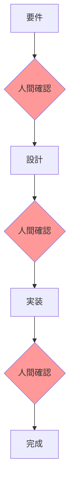
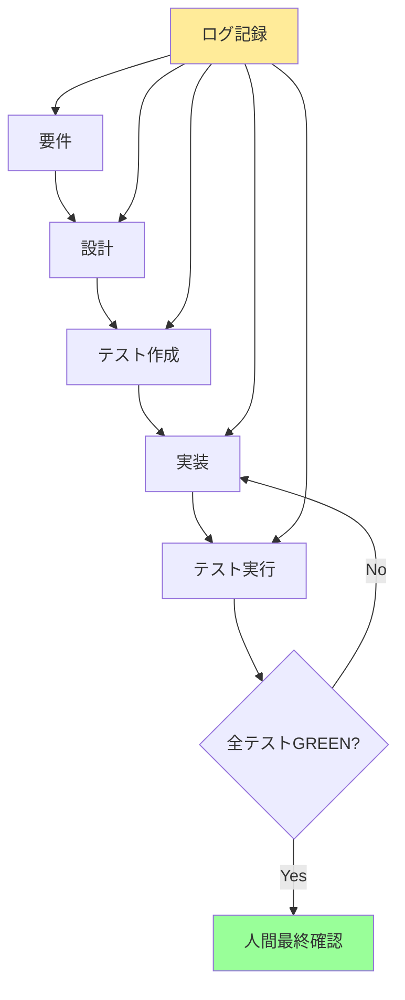

# はじめに

マルチエージェントを使った開発にチャレンジしてきました。  
ただ、最初からうまくいったわけではありません。

- エージェント同士のやり取りがすぐに破綻する
- 「これは本当に動くのか？」と不安になり、人間がブロッキングしてしまう
- 改善しては失敗する、を繰り返してきた

そんな経験の中で、「どうすればエージェントがスムーズに連携できるか？」を真剣に考えるようになりました。

この記事では、試行錯誤の末にたどり着いた**3つの原則**と、実際のプロジェクトでの適用例を共有します。

# 解決したい2つの課題

## 課題① エージェント連携の破綻

前提条件が正しく伝わらない。  
エージェントによって解釈が異なる。

特に曖昧な自然言語要件をそのまま渡すと、エージェントごとに違う理解をしてしまいます。

### 実際に起きた解釈のズレ

```
要件：「平日にアラームを鳴らす」

エージェントA：「平日 = 月曜〜金曜」
エージェントB：「平日 = 営業日（祝日除く）」
エージェントC：「平日 = 月曜〜金曜（ただし振替休日も考慮）」
```

このズレが積み重なると、最終的にテストや実装が食い違い、連携が破綻してしまうのです。

## 課題② 人間がブロッキングしてしまう

エージェントがどこまで進んでいるのかが分からない。  
仕様の抜けで止まっているのか、意図的な変更なのか、**経緯が見えない**。

経緯が分からないと「ちゃんと進んでるの？」と不安になり、どうしてもレビューや承認を**ブロック要素として差し込んでしまう**。


結果、「自律的に進めるはずのAI」が、人間の承認待ちで停滞する──そんな本末転倒な事態に陥りました。

# ログの重要性：透明性が信頼を生む

そこで気づいたのが、**ログを残すこと**の重要性。

- エージェント同士のやり取りを記録する
- 人間は「なぜこうなったのか」を後から理解できる
- 無用なブロックを減らせる
- エージェント自身も「意思決定の透明性」を持つことでサボらない

```log
[Agent-Spec → Agent-Test]: 
「requirements.mdの『平日』は月〜金で、祝日考慮なしです」

[Agent-Test → Agent-Impl]: 
「isWeekday()は0（日）と6（土）でfalse、1-5でtrueを返してください」
```

ログは安心感の源泉となり、ブロック要素を減らします。

# 3つの原則

## 1. SDD（Specification-Driven Development：仕様駆動開発）

**仕様を共通言語にする**ことで、エージェントが同じ前提で進められます。

### 必要な仕様ドキュメント

| ドキュメント | 役割 | 記載内容 |
|------------|------|---------|
| requirements.md | 要件定義 | 何を作るか、なぜ必要か |
| design.md | 設計仕様 | どう作るか、アーキテクチャ |
| tasks.md | タスク分解 | 誰が何をするか |

### ポイント
- 曖昧な表現を排除（「適切に」「必要に応じて」はNG）
- 具体的な数値・条件を明記
- エッジケースも事前に定義

## 2. TDD（Test-Driven Development：テスト駆動開発）

**実装前にテストを書く**ことで「到達すべきゴール」が明確になります。

### 2種類のテスト

```
受け入れテスト（Acceptance Test）
└── ユーザー視点での動作確認
└── 「月曜7時にアラームが鳴るか？」

契約テスト（Contract Test）  
└── コンポーネント間の約束事
└── 「ClockServiceは正しく平日判定するか？」
```

エージェントは「テストを通す」ことだけに集中できます。

## 3. ノンブロッキング（Non-Blocking：人間は進行を止めない）

エージェントは**ログを残しながら自律的に進行**します。

### 従来のフロー vs ノンブロッキングフロー

**❌ 従来：人間が都度ブロック**


**✅ 新：エージェントが自律進行**


人間は途中で覗けるが承認待ちは挟まない。  
最終レビュー前に**テストGREENを担保** → 人間は仕様・テスト・ログを確認するだけ。

# 具体例：デジタルアラームアプリの開発

実際にマルチエージェント開発で「平日7時に鳴るアラームアプリ」を作った時の流れを紹介します。

## 📋 Step1: SDD（仕様駆動開発）

最初に3つの仕様ファイルを作成し、全エージェントの共通認識を作ります。

### requirements.md（要件定義）

```markdown
# アラームアプリ要件

## 機能要件
1. 平日（月〜金）の7:00:00にアラームが鳴る
   - 平日の定義：月曜日〜金曜日（祝日は考慮しない）
   - 土日は鳴らない
2. スヌーズ機能
   - アラーム停止後、5分後に再度鳴動
   - 最大3回まで繰り返し
   - 4回目以降のスヌーズ要求は無視
3. ON/OFF切り替え
   - UIからアラーム機能全体のON/OFFが可能

## 非機能要件
- アラーム鳴動は1秒以内の精度
- バッテリー消費を最小限に
```

### design.md（設計仕様）

```markdown
# アーキテクチャ設計

## コンポーネント構成
- AlarmManager: アラーム全体の制御
- ClockService: 時刻監視サービス
- NotificationService: アラーム通知
- UIController: ユーザーインターフェース

## インターフェース定義
```

```typescript
interface Clock {
  getCurrentTime(): DateTime
  isWeekday(date: DateTime): boolean
}

interface Alarm {
  schedule(time: Time): void
  snooze(minutes: number): void
  cancel(): void
  getSnoozeCount(): number
}
```

### tasks.md（タスク分解）

```markdown
# 実装タスクリスト

1. [ ] ClockServiceの実装
   - [ ] getCurrentTimeメソッド
   - [ ] isWeekdayメソッド（曜日判定）
   
2. [ ] AlarmManagerの実装
   - [ ] scheduleメソッド
   - [ ] snoozeメソッド（カウンター付き）
   - [ ] スヌーズ上限チェック
   
3. [ ] NotificationServiceの実装
   - [ ] 通知表示
   - [ ] サウンド再生
   
4. [ ] 統合テスト
   - [ ] 平日シナリオ
   - [ ] 週末シナリオ
   - [ ] スヌーズシナリオ
```

## 🧪 Step2: TDD（テスト駆動開発）

実装前にテストを書き、エージェントが「何を達成すべきか」を明確にします。

### acceptance.test.js（受け入れテスト）

```javascript
// 平日7時のアラーム動作テスト
describe('平日アラーム機能', () => {
  test('月曜日の7時にアラームが鳴る', () => {
    // GIVEN: 月曜日の6:59:59
    mockTime.set('2024-01-15 06:59:59'); // 月曜日
    const alarm = new AlarmManager();
    alarm.setEnabled(true);
    
    // WHEN: 1秒経過
    mockTime.advance(1);
    
    // THEN: アラームが鳴動
    expect(alarm.isRinging()).toBe(true);
  });

  test('土曜日の7時にはアラームが鳴らない', () => {
    // GIVEN: 土曜日の6:59:59
    mockTime.set('2024-01-20 06:59:59'); // 土曜日
    const alarm = new AlarmManager();
    alarm.setEnabled(true);
    
    // WHEN: 1秒経過
    mockTime.advance(1);
    
    // THEN: アラームは鳴動しない
    expect(alarm.isRinging()).toBe(false);
  });
  
  test('スヌーズは3回まで有効', () => {
    const alarm = new AlarmManager();
    alarm.setRinging(true);
    
    // 1-3回目：スヌーズ成功
    for(let i = 1; i <= 3; i++) {
      expect(alarm.snooze(5)).toBe(true);
      expect(alarm.getSnoozeCount()).toBe(i);
    }
    
    // 4回目：スヌーズ失敗
    expect(alarm.snooze(5)).toBe(false);
    expect(alarm.getSnoozeCount()).toBe(3);
  });
});
```

### contract.test.js（契約テスト）

```javascript
// ClockServiceの契約テスト
describe('ClockService契約', () => {
  test('isWeekdayは月〜金でtrueを返す', () => {
    const clock = new ClockService();
    
    // 月〜金：true
    expect(clock.isWeekday(new Date('2024-01-15'))).toBe(true);  // 月
    expect(clock.isWeekday(new Date('2024-01-16'))).toBe(true);  // 火
    expect(clock.isWeekday(new Date('2024-01-17'))).toBe(true);  // 水
    expect(clock.isWeekday(new Date('2024-01-18'))).toBe(true);  // 木
    expect(clock.isWeekday(new Date('2024-01-19'))).toBe(true);  // 金
    
    // 土日：false
    expect(clock.isWeekday(new Date('2024-01-20'))).toBe(false); // 土
    expect(clock.isWeekday(new Date('2024-01-21'))).toBe(false); // 日
  });
  
  test('getCurrentTimeは現在時刻を返す', () => {
    const clock = new ClockService();
    const now = new Date();
    const result = clock.getCurrentTime();
    
    // 1秒以内の差であること
    expect(Math.abs(result - now)).toBeLessThan(1000);
  });
});
```

## 🚀 Step3: ノンブロッキング実行

エージェントが自律的に進行し、その過程をログに残します。

### 実行ログの例

```log
[2024-01-15 10:00:00] [Agent-Spec] requirements.mdを解析開始
[2024-01-15 10:00:02] [Agent-Spec] 平日の定義を確認: 月〜金（祝日除外なし）
[2024-01-15 10:00:03] [Agent-Test] acceptance.test.jsから7個のテストケースを生成

[2024-01-15 10:00:05] [Agent-Impl-1] ClockService実装開始
[2024-01-15 10:00:08] [Agent-Impl-1] isWeekdayメソッド実装完了
[2024-01-15 10:00:09] [Agent-Test] ClockService契約テスト実行: 7/7 PASS ✓

[2024-01-15 10:00:12] [Agent-Impl-2] AlarmManager実装開始
[2024-01-15 10:00:15] [Agent-Impl-2] スヌーズカウンター実装（最大3回）
[2024-01-15 10:00:18] [Agent-Test] AlarmManager単体テスト: 5/5 PASS ✓

[2024-01-15 10:00:20] [Agent-Integration] 統合テスト実行
[2024-01-15 10:00:22] [Agent-Integration] シナリオ1: 平日アラーム動作 PASS ✓
[2024-01-15 10:00:23] [Agent-Integration] シナリオ2: 週末スキップ PASS ✓
[2024-01-15 10:00:24] [Agent-Integration] シナリオ3: スヌーズ3回 PASS ✓

[2024-01-15 10:00:25] [Agent-Review] 全テスト GREEN - 実装完了
```

### エージェント間の会話ログ

```log
[Agent-Spec → Agent-Test]: 
「requirements.mdの『平日』は月〜金で、祝日考慮なしです」

[Agent-Test → Agent-Impl-1]: 
「isWeekday()は0（日）と6（土）でfalse、1-5でtrueを返してください」

[Agent-Impl-1 → Agent-Test]: 
「実装完了。getDay()メソッドを使用しました」

[Agent-Test → Agent-Impl-2]: 
「ClockServiceの契約テストPASS。AlarmManagerでこれを利用してください」

[Agent-Impl-2 → Agent-Test]: 
「スヌーズ実装で質問：4回目のスヌーズ要求はどう処理しますか？」

[Agent-Test → Agent-Spec]: 
「仕様確認：スヌーズは最大3回ですが、4回目の挙動が未定義です」

[Agent-Spec → Agent-Test]: 
「requirements.md更新：4回目以降は無視する仕様としました」
```

## 🎯 結果：人間は最終確認のみ

このプロセスを経て、人間が確認するのは：

1. **仕様の妥当性**：requirements.mdが要求を正しく反映しているか
2. **テストカバレッジ**：重要なシナリオが網羅されているか  
3. **実装品質**：ログから問題がないか確認
4. **最終動作**：全テストGREENを確認

**人間のレビュー時間：約5分**（従来の1/10）

# エージェントの失敗と学習

## 失敗例1：仕様の解釈ミス

```log
[ERROR] [Agent-Impl-1] 祝日判定APIを呼び出そうとしました
[Agent-Spec] 訂正：requirements.mdでは「祝日は考慮しない」です
[Agent-Impl-1] 了解。シンプルな曜日判定のみに修正
```

## 失敗例2：過剰な最適化

```log
[WARNING] [Agent-Impl-2] バッテリー最適化のため1分間隔でチェック
[Agent-Test] テスト失敗：1秒以内の精度が必要
[Agent-Impl-2] 1秒間隔に修正しました
```

これらの失敗もログに残ることで、次回以降の開発で同じミスを避けられます。

# 実践ガイド

## 使用可能なツール/サービス

| ツール | 特徴 | 適用シーン |
|--------|------|-----------|
| Claude Projects + MCP | 高度な文脈理解 | 複雑な仕様の実装 |
| GitHub Copilot Workspace | GitHubとの連携 | OSS開発 |
| Cursor + カスタムルール | IDE統合 | 日常的なコーディング |
| CrewAI | マルチエージェント特化 | チーム開発シミュレーション |
| AutoGPT | 自律性重視 | 探索的な開発 |

## プロジェクト構造

```
project/
├── .agent-logs/           # エージェントログ
│   ├── 2024-01-15-session.log
│   ├── decisions.json
│   └── metrics.json
├── specs/                 # 仕様ドキュメント
│   ├── requirements.md
│   ├── design.md
│   └── tasks.md
├── tests/                 # テストファイル
│   ├── acceptance/
│   │   └── alarm.test.js
│   └── contracts/
│       └── clock.test.js
└── src/                   # 実装コード
    ├── AlarmManager.js
    └── ClockService.js
```

## 安全対策

### 1. 予算制限
```yaml
# .agent-config.yml
limits:
  api_calls_per_hour: 100
  max_cost_per_day: $10
  timeout_per_task: 300s
```

### 2. サーキットブレーカー
```javascript
// 同じエラーが3回続いたら停止
if (errorCount[errorType] >= 3) {
  notifyHuman(`エラー多発: ${errorType}`);
  stopAgent();
}
```

### 3. 人間への通知
```javascript
// 異常検知時の通知
if (testFailureRate > 0.5) {
  slack.send("⚠️ テスト失敗率が50%を超えました");
}
```

## 段階的導入アプローチ

### Phase 1: 超小規模（1日）
- 単一ファイルのユーティリティ関数
- 例：日付処理、文字列変換

### Phase 2: 小規模（1週間）
- 3-5ファイルのモジュール
- 例：認証モジュール、APIクライアント

### Phase 3: 中規模（1ヶ月）
- マイクロサービス1つ
- 例：ユーザー管理サービス

### Phase 4: 大規模（3ヶ月〜）
- 複数サービスの連携
- 例：ECサイト全体

# よくある質問

## Q1: エージェントが暴走したらどうする？

**A:** 3段階の安全策を用意します：
1. API利用上限の設定（コスト制限）
2. タイムアウト設定（時間制限）
3. エラー頻度による自動停止（品質制限）

## Q2: 既存プロジェクトにも適用できる？

**A:** はい、段階的に適用可能です：
1. まず新機能開発で試す
2. リファクタリング時に導入
3. 徐々に適用範囲を拡大

## Q3: チーム全員がAIツールに詳しくない場合は？

**A:** 以下のステップで導入します：
1. AIに詳しい1人がパイロット実施
2. 成功事例を共有
3. ペアプログラミングで知識移転
4. チーム全体へ展開

## Q4: テストが全てGREENでも品質が心配

**A:** 以下を確認してください：
- テストカバレッジ（80%以上推奨）
- エッジケースのテスト有無
- 非機能要件のテスト（性能、セキュリティ）
- 実際のユーザーシナリオとの一致

# まとめ

マルチエージェント開発は**破綻リスクが高い**からこそ、原則が必要です。

## 3原則の効果

| 原則 | 解決する問題 | 得られる効果 |
|------|------------|------------|
| **SDD** | 解釈のズレ | 共通認識の確立 |
| **TDD** | ゴールの不明確さ | 明確な完了条件 |
| **ノンブロッキング** | 人間のボトルネック | 自律的な進行 |

## 導入後の変化

### Before
- 開発時間の60%が待ち時間
- エージェント連携の成功率30%
- 人間のストレス：高

### After
- 待ち時間を90%削減
- エージェント連携の成功率85%
- 人間のストレス：低（最終確認のみ）

## 未来の開発スタイル

未来の開発では、人間は**要件定義と最終レビュー**に集中し、AIエージェントは**仕様とテストを頼りに止まらず進む**──そんなスタイルが当たり前になっていくでしょう。

この3原則を守ることで、エージェントは自律的に動き、透明性と効率の両立が可能になります。

まずは小さなプロジェクトから、ぜひ試してみてください。

---

## 参考リンク

- [Model Context Protocol (MCP)](https://modelcontextprotocol.io/)
- [CrewAI Documentation](https://docs.crewai.com/)
- [Test-Driven Development by Example](https://www.amazon.co.jp/dp/4274217884)

## 著者について

マルチエージェント開発に取り組むエンジニア。失敗を重ねながら、実践的な手法を模索中。

Twitter: @your_handle
GitHub: github.com/s977043
