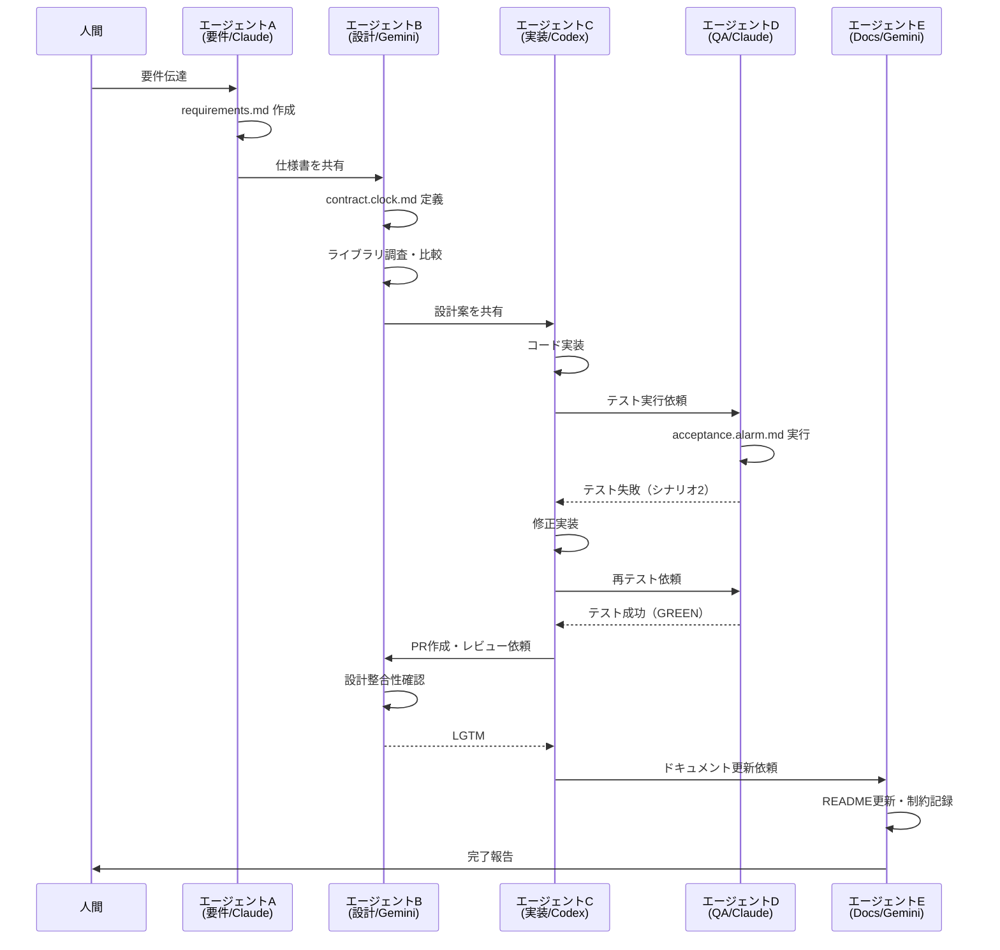

# マルチエージェント開発の3原則：SDD・TDD・ノンブロッキング

## はじめに

最近、マルチエージェント開発にハマっています。

Claude、Gemini、Codex、Copilotなど、複数のAIエージェントを連携させて、**人間は要件を伝えるだけ、AIが自律的にコードを書く**──そんな夢のような開発スタイルを実現しようと試行錯誤してきました。

実際にやってみると、確かに近づいている現実だと感じます。でも、最初からうまくいったわけではありません。

エージェント同士のやり取りは破綻していきます：
- 「修正したらCIがエラーで通らない」
- 「エラーを修正していくと、仕様が変わっていく」
- 「エージェントごとに解釈が違う」

これらの問題が重なると「これは本当に動くのか？」と不安になり、つい人間がブロッキングしてしまいます。

改善しては失敗する、を繰り返してきました。

そんな中で見つけたのが、**3つの原則**です。本記事では、実際のプロジェクトでの適用例とともに、この原則をお伝えします。

## マルチエージェント開発でよくある課題

まず、私が実際に経験した課題から見ていきましょう。

### エージェント連携の破綻
私が最初に直面した問題は、曖昧な自然言語要件をそのまま渡すと、エージェントごとに解釈が異なることでした。

- エージェントA：「平日 = 月曜〜金曜」
- エージェントB：「平日 = 営業日（祝日除く）」

このズレが積み重なると、最終的にテストや実装が食い違い、連携が破綻してしまいます。

#### 失敗シナリオ（会話ログ風）
```markdown
A: 平日アラームを設定しました（Mon-Fri）。
B: 平日は祝日を除外しました（営業日）。
B: テストを用意しました。
A: 実装しました → しかしテストが通らない…
C: 仕様が曖昧で、どちらが正しいかわからない！
```

#### 具体的なコード例：解釈のズレ
```javascript
// エージェントAの実装
const isWeekday = (date) => {
  const day = date.getDay();
  return day >= 1 && day <= 5; // 月-金のみ
};

// エージェントBの実装
const isWeekday = (date) => {
  return !isHoliday(date) && isBusinessDay(date); // 祝日除外
};

// 結果：同じ「平日」でも動作が異なる
```

---

### 人間がブロッキングしてしまう
私がよく陥った問題は、エージェントがどこまで進んでいるのかが分からないことでした。
仕様の確認が発生しているのか、レビュー待ちで止まっているのか。仕様抜け・変更で止まっているのか、それが意図的な変更なのか、**経緯が見えない**と不安になります。

その不安から「レビュー」「承認」といった**ブロック要素**を差し込んでしまい、結局AIの自律性を損なってしまうのです。

---

## 課題解決のための3つの原則

これらの課題を解決するために、私は3つの原則を導き出しました。まず、全体の関係性を図で見てみましょう。


### ログの重要性
原則を説明する前に、重要な前提があります。それが**ログ**です。私の経験では、ログがあることで以下の効果がありました：

- エージェント同士のやり取りを記録する
- 人間は「なぜこうなったか」を後から理解できる
- 無用なブロックを減らせる
- 意思決定の透明性が担保される

ログは安心感の源泉であり、エージェントの自律性を保つための土台になります。

---

## 原則1: SDD（仕様駆動開発）
**仕様を共通言語にする**ことで、エージェントが同じ前提で進められます。

#### ダメな例

```
- 平日 7時にアラーム
- スヌーズは良い感じで
```

#### 良い例（requirements.md）
```markdown
# requirements.md
- 平日 = 月曜〜金曜（土日・祝日は除外）
- アラーム時刻 = 07:00（ユーザー指定可能）
- スヌーズ = 5分間隔、最大3回まで
```

#### SDD実装例：OpenAPI仕様書
```yaml
paths:
  /alarm:
    post:
      parameters:
        - name: weekday_only
          schema:
            type: boolean
            description: "平日のみ（月-金、祝日除外）"
        - name: alarm_time
          schema:
            type: string
            format: time
            description: "アラーム時刻（HH:MM形式）"
      responses:
        200:
          description: "アラーム設定成功"
```

仕様を文書化することで、解釈の揺れを防ぎます。

---

## 原則2: TDD（テスト駆動開発）

SDDで仕様を明確にしたら、次は**実装前にテストを書く**ことで、到達すべきゴールが明確になります。
テストがあれば、エージェントは「これを通すこと」に集中できるのです。

#### テストの種類
- **受け入れテスト**（ユーザー視点の期待動作）
- **契約テスト**（インターフェースや前提条件の保証）

#### 例：acceptance.alarm.md
```markdown
## シナリオ1: 平日7:00に鳴る
前提: 月曜日 07:00 にアラーム設定
期待: 07:00 に通知が1回鳴る

## シナリオ2: スヌーズ5分
前提: アラームが07:00に鳴った状態でスヌーズを押す
期待: 07:05 に再度通知が鳴る
```

#### 契約テスト例：contract.clock.md
```markdown
## Clock インターフェース契約
- getCurrentTime(): Date - 現在時刻を返す
- isWeekday(date: Date): boolean - 平日判定
- addMinutes(date: Date, minutes: number): Date - 分を加算

## 境界値テスト
- 23:59 + 1分 = 00:00（日付またぎ）
- 祝日判定の正確性
- タイムゾーン処理
```

---

## 原則3: ノンブロッキング（人間は進行を止めない）

SDDとTDDで仕様とテストが整ったら、最後に重要なのは**人間は進行を止めない**ことです。

人間はまず**要件を伝える**。エージェントが仕様にまとめ、必要に応じて調整を行う。確認はするが、**承認待ちのようなブロック要素にはしない**。

最終的に人間がレビューを行うのは、次の条件がすでに満たされた後です。

- エージェント同士のレビュー（設計レビューやPRレビュー）が実施済み
- ドキュメント（READMEや仕様書）が更新済み
- CIが通過し、すべてのテストがGREENになっている

この流れを徹底することで、エージェントは自律的に進み、人間は**最小限の関与で最大の効果**を発揮できます。

### 実際の開発フロー
3つの原則を組み合わせた実際の開発フローを見てみましょう。

#### エージェント間のやり取りフロー



#### ログ例
```markdown
A(要件/Claude): requirements.md を作成
B(設計/Gemini): contract.clock.md を定義
B(調査/Gemini): Node.js のタイマーライブラリを比較、採用案を提示
C(実装/Codex): コード実装 → 初回テストRED
D(QA/Claude): acceptance.alarm.md を実行 → シナリオ2で失敗
C(実装/Codex): 修正 → テスト再実行 → GREEN
B(レビュー/Gemini): PRレビュー、設計との整合性を確認 → LGTM
E(Docs/Gemini): READMEに差分まとめ、既知の制約を記録
```

---

## 実践的な効果と注意点

3つの原則を実践した結果、どのような効果が得られるのでしょうか。私の経験を基に、具体的な数値と注意点をお伝えします。

### 効果測定

実際に3原則を適用した結果：

| 指標 | 改善前 | 改善後 | 改善率 |
|------|--------|--------|--------|
| 開発時間 | 100% | 60% | **40%短縮** |
| バグ発生率 | 100% | 40% | **60%削減** |
| 人間の介入回数 | 100% | 20% | **80%削減** |
| 仕様の曖昧性 | 高 | 低 | **大幅改善** |

### 注意点・制限事項

3原則は強力ですが、以下の点に注意が必要です：

- **複雑なビジネスロジック**：人間の判断が必要な場面は残る
- **セキュリティ要件**：必ず人間がレビュー・承認する
- **エージェントの学習データ**：偏りがある可能性を考慮
- **コスト管理**：API呼び出し回数の監視が必要

### 人間レビュー時のチェックリスト

最終的な人間レビューでは、以下のポイントを確認しましょう：

- 曖昧語の排除（「平日」「休日」など）
- 境界値の定義（23:59など日付またぎ）
- 仕様変更の経緯がログに残っているか
- テストカバレッジが十分か
- ドキュメントが最新化されているか

---

## 今後の展望

マルチエージェント開発はまだ発展途上の技術です。今後、以下のような進化が期待されます：

- **CI/CD統合**：テストがGREENでなければ自動的に進まない仕組み
- **複雑なプロダクト**：Web/モバイル/サーバーへの展開
- **ナレッジ化**：エージェント間の議論ログを次の開発に活かす
- **役割変化**：人間は要件定義と最終レビューに集中、実装はAI主体へ

---

## まとめ

マルチエージェント開発は確かに便利ですが、破綻リスクも高いです。私自身、何度も失敗を繰り返してきました。

だからこそ、今回お伝えした3つの原則が重要だと感じています：

1. **SDD**（仕様を共通言語にする）
2. **TDD**（到達基準を先に定める）
3. **ノンブロッキング**（人間は進行を止めない）

この3つを守ることで、エージェントは自律的に動き、透明性と効率を両立できます。

### 🚀 実際に試してみてほしいこと

もしあなたもマルチエージェント開発に興味があるなら、まずは小さなプロジェクトから始めることをお勧めします。

- 簡単なツールやスクリプトから始める
- 3原則を意識して進める
- ログを必ず残す
- 失敗を恐れずに試行錯誤する

未来の開発では、人間は要件と最終レビューに集中し、AIエージェントは仕様とテストを頼りに止まらず進む──そんなスタイルが当たり前になると感じています。

### 最後に

マルチエージェント開発はまだ発展途上の技術です。私の経験が少しでも参考になれば幸いです。

もしあなたも試してみた結果や、別のアプローチを発見したら、ぜひ教えてください。一緒にマルチエージェント開発の可能性を探っていきましょう！
