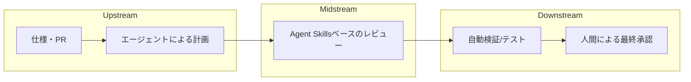

:::message
この記事は、note記事『[AIコードレビューの「投げっぱなし」をやめる](https://note.com/mine_unilabo/n/nd21c3f1df22e)』の設計思想をベースに、自律型AIエージェントを組織の「資産」として運用するための実装パターンを解説する技術記事です。
:::

## 1. はじめに：AIエージェントの「投げっぱなし」を卒業する

`Claude Code` や `Codex` といった強力なAIツールの登場により、コードの生成・レビュー能力は劇的に向上しました。しかし、強力なエージェントを現場に導入すると、ある共通の課題に直面します。

それは、**「AIは自律的に動くが、プロジェクト固有の流儀（暗黙知）を必ずしも守らない」**ということです。

多くのツールは「一般的なベストプラクティス」には従いますが、現場にある「このレガシーコードは触るな」「このプロジェクトではこのパターンを優先する」といった**暗黙知**を考慮できません。これを私は、AIに対する**「投げっぱなし（Fire-and-Forget）」**の状態と呼んでいます。

**River Reviewer**は、開発フローを一つの「運河（River）」のようなストリームとして捉え、組織の暗黙知を**「Agent Skills」**という明示的な技術資産へと変換するフレームワークです。

## 2. コンセプト：レビューを「ストリーム（運河）」として捉える

River Reviewerの核心は、レビュープロセスを3つのフェーズに分けるストリーム処理にあります。

### The Stream（データフロー）



### 共有メモリ（Shared Memory）の設計
毎回全ての情報をプロンプトに詰め込むのではなく、必要な情報だけを「共有メモリ」として抽出し、エージェントの注意力をコントロールします。これにより、AIは「何を前提として良いか」が明確になり、ハルシネーション（幻覚）のリスクを低減できます。

## 3. 統治：失敗のリスクから「自由度」を設計する

AIの「賢さ」に期待して丸投げするのではなく、失敗したときのリスクと検証のしやすさで**“自由度（＝裁量の幅）”**を先に決めます。自由度が上がるほど発想は広がりますが、出力のブレが増え、検証コストも上がります。だからこそ、タスクごとに自由度を三段階で設計します。

### 低自由度（崖：Cliff）
**「事故ると困る」領域。固定手順 ＋ 強い検証をセットにします。**
- **対象例**: セキュリティ、破壊的変更、重大な規約違反
- **やり方**: 入力を定型化し、許可する操作を限定します。チェックリスト、必須テスト、静的解析、承認フローなどで**“落下防止柵”**を作ります。
- **停止条件**: 情報が足りないなら、**推測せず質問に切り替える**よう制約をかけます。

### 中自由度（丘：Hill）
**「日常的なメインのレビュー」領域。テンプレート ＋ パラメータで制御します。**
- **対象例**: Lint、命名、一般的な設計・可読性
- **やり方**: 優先度（Must/Want）や観点（性能/保守性/可読性）をパラメータとして渡し、出力の粒度と範囲を安定させます。

### 高自由度（原っぱ：Plain）
**「探索・発散が価値になる」領域。方針だけ渡して発散を許容します。**
- **対象例**: 観点出し、問いの生成、未知のリスク洗い出し
- **やり方**: 背景・制約・ゴールだけ共有し、まずは広く出させてから、人間側で束ねて優先度付けします。

## 4. 実装詳細：Agent Skills と「10行ルール」

AIへの指示を巨大なプロンプトにまとめるのではなく、**「Agent Skills」**という小さな単位に分割して管理します。

### クイックスタートとしての「10行ルール」
スキルを定義する際のベストプラクティスとして、以下の5項目を各2行程度、計**10行**に凝縮します。これは、LLMの注意力を特定の制約に集中させ、ハルシネーションを防ぐための知恵です。

1. **Priority（優先順位）**: 何を最も重視するか
2. **Prohibited（禁止事項）**: 絶対にやってはいけないこと
3. **Stop Conditions（停止条件）**: 判断に迷った際に「質問」へ切り替える基準
4. **Exceptions（例外）**: ルールを適用外とするケース
5. **Verify（検証）**: 成功をどう定義するか（テスト、型チェック等）

```typescript
export const SecurityAuditSkill: AgentSkill = {
  name: "SQL Injection Guardian",
  riskLevel: "Cliff", // 低自由度：落下防止柵が必要
  rule: {
    priorities: ["SQLインジェクションの検知", "ORM de 適切な使用"],
    prohibited: ["raw query の直接使用", "サニタイズされていない入力の利用"],
    stopConditions: ["コンテキスト不足により推測が必要な場合、即座に質問すること"],
    verify: ["npm test がパスすること", "静的解析エラーがないこと"]
  }
};
```

## 5. ワークフロー：Plan / Validate / Verify

「いきなりコードを書かせない」のがRiver Reviewerの鉄則です。

1. **Plan（計画）**: AIが「どのファイルに対し、どの Agent Skills を使い、どう変更するか」をJSONで出力。
2. **Validate（妥当性確認）**: 人間がその計画を見てGo/No-Goを判断。自由度が高い（原っぱ）場合は、ここで発散したアイデアを人間が絞り込みます。
3. **Verify（検証）**: 実装後、スキルに定義された検証ロジックを自動実行。

## 6. 核心：評価駆動（Evaluation-Driven）でスキルを育てる

River Reviewerにおいて最も重要なのは、**「精度を最初から求めるのではなく、評価を通じてスキルを育てる」**ことです。AIは「完成されたツール」ではなく、フィードバックを通じて成長させる**「教育可能な後輩」**です。

1. **実行**: Agent Skills に基づきAIがレビューを行う。
2. **ギャップの特定**: 「的外れな指摘」や「規約違反の提案」があった場合、その原因を分析する。
3. **スキルの更新**: その知見をスキルの **`prohibitedItems`（禁止事項）** 等に追記する。

この繰り返しにより、Agent Skills は組織の「暗黙知」を吸収し、チーム専用の「優秀なシニアエージェント」へと育っていきます。

## おわりに：暗黙知を「技術資産」に変える

AIエージェントの導入は、単なる自動化ではありません。チーム内の「暗黙知」を **Agent Skills** として言語化し、リスクに応じた**自由度を設計**することで、AIを組織の強力な**明示的資産（Development Policy as Code）**へと変換するプロセスです。

レビューでのミスを糧にし、スキルをリファクタリングし続ける。このサイクルこそが、AI時代の新しいDevOpsの形です。あなたのチームの「秘伝のタレ」を、今日から実装してみませんか？

---
- **GitHub**: [s977043/river-reviewer](https://github.com/s977043/river-reviewer)
- **note**: [AIコードレビューの「投げっぱなし」をやめる](https://note.com/mine_unilabo/n/nd21c3f1df22e)
- **Documentation**: [River Reviewer Docs](https://river-reviewer.vercel.app/)
