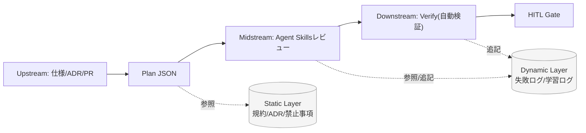

:::message
この記事は、note 記事『[AI コードレビューの「投げっぱなし」をやめる](https://note.com/mine_unilabo/n/nd21c3f1df22e)』の設計思想をベースに、自律型 AI エージェントを組織の「資産」として運用するための実装パターンを解説する技術記事です。
:::

## 1. はじめに：AI エージェントの「投げっぱなし」を卒業する

`Claude Code` や `Codex` といった強力な AI ツールの登場により、コードの生成・レビュー能力は劇的に向上しました。しかし、強力なエージェントを現場に導入すると、ある共通の課題に直面します。

それは、「**AI は自律的に動くが、プロジェクト固有の流儀（暗黙知）を必ずしも守らない**」ということです。多くのツールは「一般的なベストプラクティス」には従いますが、現場にある「このレガシーコードは触るな」といった **暗黙知** を考慮できません。これを私は、AI に対する「**投げっぱなし（Fire-and-Forget）**」の状態と呼んでいます。

River Reviewer は、SDLC（設計 → 実装 →QA）を **上流/中流/下流** のフェーズとして扱い、フェーズに応じた「スキル」を適用してレビューを実行する **フローベースの AI レビューエージェント** です。GitHub Actions で PR 作成時に動かし、変更ファイルに応じてスキルを読み込み、スキーマ検証のうえで構造化したレビューコメントを出力できます。

River Reviewer は、PR や仕様を入力にして「計画 → レビュー → 検証」を流れで実行する、**AI レビュー運用のための OSS/フレームワーク** です。

まず、River Reviewer が「何であり、何でないか」を定義します。

- **入力**: PR 差分、仕様書、プロジェクト固有の共有メモリ（Shared Memory）
- **出力**: 実装計画（Plan JSON）、Agent Skills ベースのレビューコメント、検証結果（Verify）
- **非目的**: 完全自動マージ、プロジェクト外の一般論レビュー

## 2. アーキテクチャ：3 つの流れと「二層の共有メモリ」

River Reviewer は、開発プロセスを 3 つのフェーズに分けるストリーム処理として設計します。

:::message
このフェーズ分割は比喩ではなく、実運用においても GitHub Actions の `phase` 入力として指定し、実行するスキルの束を切り替えるための軸になります。
:::



### 共有メモリ（Shared Memory）の二層構造

コンテキストを「共有メモリ」として抽出し、エージェントの注意力をコントロールします。実戦的には、以下の二層で管理することを推奨します。

1.  **組織憲法（Static Layer）**: 読み取り専用。コーディング規約、アーキテクチャ決定（ADR）、禁止ライブラリ等。
2.  **学習ログ（Dynamic Layer）**: 更新可能。過去のレビュー指摘の修正履歴、ハルシネーションの記録、既知のバグパターン等。

## 3. 統治：失敗のリスクから「自由度」を設計する

AI の「賢さ」に期待して丸投げするのではなく、失敗したときのリスクと検証のしやすさで “**自由度（＝裁量の幅）**” を先に決めます。

### 開発シーン別の自由度分類案

| 自由度                     | カテゴリ               | 推奨 Temp | 承認 (HITL)      | ユースケース例                                    | 失敗時のインパクト     |
| :------------------------- | :--------------------- | :-------- | :--------------- | :------------------------------------------------ | :--------------------- |
| **低自由度：Cliff (崖)**   | **セキュリティ・基盤** | 0.0 - 0.1 | **事前承認必須** | 認証ロジックの変更、DB マイグレーション、権限変更 | サービス停止、情報漏洩 |
| **中自由度：Hill (丘)**    | **リファクタリング**   | 0.3 - 0.5 | 事後レビュー     | 重複コード共通化、型の厳格化、コンポーネント分割  | バグ混入、表示崩れ     |
| **高自由度：Plain (平原)** | **新規機能・案**       | 0.7 - 0.9 | 不要             | 新機能のロジック案、README 作成、正規表現列挙     | 案が不採用（低リスク） |

**低自由度（Cliff）** 領域では、情報が足りないなら **推測せず質問に切り替える（Stop Conditions）** ことで、SRE 的な安全性を担保します。

## 4. 実装詳細：Agent Skills と「10 行ルール」

AI への指示を「Agent Skills」という小さな単位に分割します。

複雑な型定義を書き始める前に、チームが即座にルールを言語化するための「**クイックスタート**」として、以下のような 10 行程度のテキストで定義する運用を推奨します。

```md
# 10 行ルール例（DB Migration / Cliff）

Priority: 破壊的変更・性能劣化を最優先で検知
Prohibited: DROP/無索引 JOIN/ダウンタイム変更を提案しない
Stop: 影響範囲・移行手順・ロールバック不明なら質問して停止
Exceptions: 新規テーブル作成のみなら型変更チェックは省略
Verify: npm run test:migration-dry-run (blocking)
```

これをベースに、プログラムで扱いやすい `Agent Skills` のインターフェースへ落とし込んでいきます。

### 堅牢な Agent Skills インターフェース定義

ここでは考え方を分かりやすくするため TypeScript の型で表現しますが、River Reviewer 本体のスキル定義は **YAML frontmatter（メタデータ）＋ Markdown（ガイダンス）** で管理し、スキーマで検証して運用のブレを抑えます。

AI への制約をプログラムレベルで表現するために、検証設定を強制する型定義を行います。

```typescript
type RiskLevel = "Cliff" | "Hill" | "Plain";

interface VerificationConfig {
  type: "shell" | "unit-test" | "e2e";
  command: string;
  blocking: boolean; // Cliffの場合は常にtrueを推奨
}

interface AgentSkills {
  name: string;
  riskLevel: RiskLevel;
  rule: {
    priorities: string[];
    prohibited: string[];
    /**
     * Stop Conditions: AIが「これ以上進めてはいけない」と判断する境界線
     */
    stopConditions: string[];
    /**
     * Cliffレベルの場合、verifyの定義を必須とする運用を推奨
     */
    verify?: VerificationConfig;
  };
}

// 具体的なスキル定義の例
export const DatabaseMigrationSkills: AgentSkills = {
  name: "DB Schema Auditor",
  riskLevel: "Cliff",
  rule: {
    priorities: ["インデックスの貼り忘れ確認", "破壊的変更の検知"],
    prohibited: [
      "テーブルの直接削除（DROP）",
      "ダウンタイムが発生するカラム変更",
    ],
    stopConditions: [
      "既存データの移行手順が仕様書に記載されていない場合",
      "影響を受けるクエリの実行計画が不明な場合",
    ],
    verify: {
      type: "shell",
      command: "npm run test:migration-dry-run",
      blocking: true,
    },
  },
};
```

## 5. ワークフロー：Plan / Validate / Verify

「**いきなりコードを書かせない**」。これは、多くのエージェント運用から得られた **Agent Skills における最も重要な知見** です。

River Reviewer では、この知見に基づきワークフローを 3 つのステップに分離します。運用上はこの一連の処理を GitHub Actions で PR 作成時に実行し、変更ファイル検出 → 関連スキル読み込み → スキーマ検証 → レビューコメント出力、という形で「流れ」に乗せます。

1.  **Plan (計画)**: 差分と `Agent Skills` を照らし合わせ、実行計画を JSON で生成。ここで `riskLevel` を自己判定させ、承認フローを分岐させます。

    ```json
    {
      "riskLevel": "Hill",
      "files": [{ "path": "src/db/migrate.ts", "reason": "migration changes" }],
      "skills": [{ "id": "db-schema-audit", "reason": "migrations touched" }],
      "proposedActions": [
        "Add index for users.email",
        "Avoid type change; use shadow column + backfill"
      ],
      "verify": [
        {
          "type": "shell",
          "command": "npm run test:migration-dry-run",
          "blocking": true
        }
      ],
      "questions": []
    }
    ```

2.  **Validate (ゲート)**: 人間（EM やテックリード）が計画を審査。`Cliff` ならば手動承認、`Hill` ならば CI による自動判定へ。
3.  **Verify (検証)**: スキルに紐づく `verify` コマンドを実行。失敗時はリトライさせず、「**なぜ失敗したか（期待値との差分等）」を共有メモリ（Dynamic Layer）に書き込んで即時停止** させます。

    ```yaml
    - date: 2025-12-27
      pr: 123
      skillId: db-schema-audit
      event: verify_failed
      observed: "migration dry-run failed: missing backfill"
      action: "Add backfill script + rerun dry-run"
      promoteToStatic: true
    ```

## 6. 核心：評価駆動（Evaluation-Driven）でスキルを育てる

Agent Skills を「資産」として維持するために、共有メモリをメンテナンスする運用ステップを組み込みます。

- **定期的な要約（Compression）**: `Dynamic Layer`（学習ログ）が一定量を超えたら、過去の「**失敗の共通項**」を AI に抽出させ、`Static Layer`（組織憲法）へ昇格させます。
- **負債のパージ**: ライブラリの更新等により不要になった過去の「**禁止事項**」を削除する PR を定期的に作成します。

### 評価指標（KPI）の例

- **指摘の妥当率（Precision）**: AI の指摘のうち、人間が「修正が必要」と認めた割合
- **誤検知率（False Positive Rate）**: 規約に沿っているのに AI がエラーとした割合
- **PR リードタイムの短縮**: 一次レビューの自動化による速度向上

## おわりに：暗黙知を「資産」に変える

River Reviewer は、単なる OSS ツールではなく、「**開発文化をコード化するフレームワーク**」です。組織の暗黙知を **Agent Skills** として言語化し、リスクに応じた **自由度を設計** し、評価を通じて成長させる。

あなたのチームの「秘伝のタレ」を、今日から実装してみませんか？

---

- **GitHub**: [s977043/river-reviewer](https://github.com/s977043/river-reviewer)
- **note**: [AI コードレビューの「投げっぱなし」をやめる](https://note.com/mine_unilabo/n/nd21c3f1df22e)
- **Documentation**: [River Reviewer Docs](https://river-reviewer.vercel.app/)
