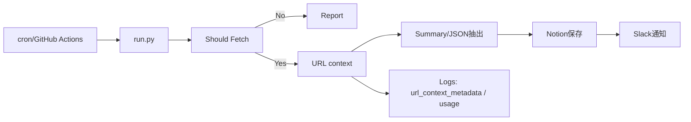

## はじめに

AI に技術情報を読ませるときの“あるある”は、だいたいこの3つです。

- **古い情報に引っ張られる**（旧仕様・旧記事を拾う）
- **誤りが混ざる**（個人ブログやフォーラムの断片が正解として混入）
- **一次情報に辿りつけない**（公式Docsを直接参照してくれない）

**URL context tool** は、この根本原因（検索結果の間接参照）を外し、**「このURLを読め」** と明示できる公式機能です。  
特定URLを追加コンテキストとして渡すだけで、モデルがそのページ内容を取得して回答の根拠に使います。スクレイピング用コードは不要。正確性が最優先の場面（フレームワークの最新仕様、公的情報、製品仕様など）で効果を発揮します。

---

## URL context tool とは（要点だけ）

- **役割**：指定したURLの内容を取得し、回答の根拠に使う（一次情報ベースでの回答）。
- **仕組み**：内部キャッシュを参照し、なければ **ライブ取得** にフォールバック（速度と最新性のバランス）。
- **検証**：レスポンスの `url_context_metadata` で **どのURLを読んだか**／取得結果（Success/Fail/Unsafe）を確認可能。
- **フォーマット**：HTML だけでなく PDF / JSON / 画像などにも対応（ログイン必須やペイウォールは不可）。
- **運用Tips**：**該当セクションの直URLを渡す**／**長文は分割**／**検証メタを保存**。

> 本稿の具体例・コードは **Gemini API（Developer API）** に限定して記載します。

---

## まずは最小コード（Python / Gemini API）

```bash
pip install -U google-genai python-dotenv
```

```python
# minimal.py
# 環境変数 GOOGLE_GENAI_API_KEY をセットして実行
from google import genai
from google.genai.types import GenerateContentConfig

client = genai.Client()
model_id = "gemini-2.5-flash"

prompt = """次のURLをURL context toolで参照し、本文に忠実に3点で要約してください。
URL: https://nextjs.org/docs/app
"""

resp = client.models.generate_content(
    model=model_id,
    contents=prompt,
    config=GenerateContentConfig(
        tools=[{"url_context": {}}],  # ← URL context を有効化
    ),
)

print("--- Answer ---")
print(resp.text)

print("\n--- URL Context Metadata ---")
print(getattr(resp.candidates[0], "url_context_metadata", None))
```

- `tools=[{"url_context": {}}]` を有効化すると、プロンプト内に記載したURLを読みます。
- `resp.text` が回答本体。`url_context_metadata` で **参照URL/ステータス** を検証できます。

---

## 挙動の具体例（題材：Next.js App Router ※あくまで“例”）

- **URL**： `https://nextjs.org/docs/app`
- **プロンプト例**：
  ```
  次のURLの要点を3点で要約してください：
  https://nextjs.org/docs/app
  ```
- **期待される方向性**：
  1) **ファイルシステムベースのルーティング**（`app/` ディレクトリ）  
  2) **Server Components / Suspense などの採用**  
  3) **Streaming など最新機能に最適化**

Search（検索）だけだと他サイトや古い情報を拾うことがありますが、URL context tool なら**公式本文の表現に沿った要約**を返しやすく、`url_context_metadata` で「本当に読んだ」ことも検証できます。

---

# 実務導入：小さく始めて自動化まで（Gemini APIのみ）

> ゴール：指定URL群（公式Docs等）を **毎晩チェック** → 変更があれば **要約/抽出を更新** → **Notionに保存** → **Slack通知**。  
> すべてに **参照URL（url_context_metadata）** と **トークン使用量** のログが残る。



## 0. リポジトリ雛形

```
url-context-lab/
├─ run.py
├─ urls.txt                # 対象URL（1行1URL）
├─ templates/
│   └─ prompt.txt          # 要約・抽出の共通プロンプト
├─ out/
│   ├─ summaries/          # md/textの出力
│   └─ json/               # JSON抽出の出力
├─ .env.example
└─ requirements.txt
```

**requirements.txt**
```txt
google-genai>=0.3.0
python-dotenv>=1.0.1
requests>=2.32.3
notion-client>=2.2.1
slack_sdk>=3.27.1
```

**.env.example**
```env
GOOGLE_GENAI_API_KEY=xxxxx
NOTION_TOKEN=xxxxx
NOTION_DATABASE_ID=xxxxx
SLACK_BOT_TOKEN=xoxb-xxxxx
SLACK_CHANNEL_ID=Cxxxxx
```

## 1. プロンプト雛形（templates/prompt.txt）

```text
あなたは技術ライターです。以下のURLをURL context toolで参照し、公式本文に忠実に要約してください。

出力要件:
- 箇条書きで5点
- 引用は10語以内
- JSONも出力（keys: title, key_points[], citations[]）。citationsは参照URLの配列。

対象URL:
{{URL}}
```

## 2. 実行スクリプト（run.py：差分検知・検証つき）

```python
import os, json, hashlib, time, pathlib
import requests
from dotenv import load_dotenv
from google import genai
from google.genai.types import GenerateContentConfig

load_dotenv()
API_KEY = os.getenv("GOOGLE_GENAI_API_KEY")
MODEL_ID = "gemini-2.5-flash"

OUT_DIR = pathlib.Path("out")
(OUT_DIR / "summaries").mkdir(parents=True, exist_ok=True)
(OUT_DIR / "json").mkdir(parents=True, exist_ok=True)

def read_urls(path="urls.txt"):
    with open(path, "r", encoding="utf-8") as f:
        return [l.strip() for l in f if l.strip() and not l.startswith("#")]

def content_hash(url: str) -> str:
    """軽量な更新検知（ETag/Last-Modified→fallbackでbody先頭）"""
    try:
        r = requests.head(url, timeout=10, allow_redirects=True)
        tag = r.headers.get("ETag") or r.headers.get("Last-Modified")
        if tag:
            return hashlib.sha256(tag.encode()).hexdigest()
    except Exception:
        pass
    try:
        r = requests.get(url, timeout=15)
        r.raise_for_status()
        return hashlib.sha256(r.content[:100_000]).hexdigest()
    except Exception:
        return str(time.time())  # 失敗時は毎回実行に倒す

def should_fetch(url: str) -> bool:
    h = content_hash(url)
    fp = OUT_DIR / f"{hashlib.md5(url.encode()).hexdigest()}.hash"
    if fp.exists() and fp.read_text() == h:
        return False
    fp.write_text(h)
    return True

def summarize_with_url_context(url: str):
    client = genai.Client(api_key=API_KEY)
    prompt = pathlib.Path("templates/prompt.txt").read_text(encoding="utf-8").replace("{{URL}}", url)

    resp = client.models.generate_content(
        model=MODEL_ID,
        contents=prompt,
        config=GenerateContentConfig(
            tools=[{"url_context": {}}],  # URL context 有効化
        ),
    )

    text = getattr(resp, "text", "")
    meta = getattr(resp.candidates[0], "url_context_metadata", None)  # 参照URL/結果
    usage = getattr(resp, "usage_metadata", None)  # トークン内訳
    return text, meta, usage

def parse_json_block(text: str):
    """本文末尾のJSONを抽出してparse"""
    try:
        l = text.find("{")
        r = text.rfind("}")
        return json.loads(text[l:r+1])
    except Exception:
        return {"title":"", "key_points":[], "citations":[]}

def main():
    for url in read_urls():
        print(f"==> {url}")
        if not should_fetch(url):
            print("  no change; skip")
            continue

        text, meta, usage = summarize_with_url_context(url)

        base = hashlib.md5(url.encode()).hexdigest()
        (OUT_DIR / "summaries" / f"{base}.md").write_text(text, encoding="utf-8")

        data = parse_json_block(text)
        data["url"] = url
        data["url_context_metadata"] = meta
        data["usage_metadata"] = usage
        (OUT_DIR / "json" / f"{base}.json").write_text(json.dumps(data, ensure_ascii=False, indent=2), encoding="utf-8")

if __name__ == "__main__":
    main()
```

> **ポイント**
> - URLはプロンプト内に明示（`tools.url_context` 有効化済み）
> - `url_context_metadata` と `usage_metadata` を **保存**（検証 & コスト可視化）
> - 差分検知で無駄叩き削減（トークン節約）

## 3. 複数URL & JSON抽出（章ごと分割のテンプレ）

```text
次のURLをURL context toolで参照し、「ルーティング」「レイアウト」「遷移」の要点を抽出。
以下のJSONで返してください。

Schema:
{
  "topic": "string",
  "bullets": ["string", ...],
  "citations": ["string", ...]
}

対象URL:
- https://nextjs.org/docs/app
- https://nextjs.org/docs/app/building-your-application/routing
- https://nextjs.org/docs/app/building-your-application/routing/pages-and-layouts
```

受け側（抜粋）:

```python
def extract_json(model_id, prompt):
    client = genai.Client(api_key=API_KEY)
    resp = client.models.generate_content(
        model=model_id,
        contents=prompt,
        config=GenerateContentConfig(tools=[{"url_context": {}}]),
    )
    text = getattr(resp, "text", "")
    return parse_json_block(text), resp
```

## 4. GitHub Actions で毎晩回す

`.github/workflows/nightly.yml`

```yaml
name: url-context-nightly
on:
  schedule:
    - cron: "0 18 * * *"   # JST 03:00（GitHubはUTC）
  workflow_dispatch: {}

jobs:
  run:
    runs-on: ubuntu-latest
    steps:
      - uses: actions/checkout@v4
      - uses: actions/setup-python@v5
        with:
          python-version: "3.11"
          cache: "pip"
      - run: pip install -r requirements.txt
      - run: python run.py
        env:
          GOOGLE_GENAI_API_KEY: ${{ secrets.GOOGLE_GENAI_API_KEY }}
          NOTION_TOKEN: ${{ secrets.NOTION_TOKEN }}
          NOTION_DATABASE_ID: ${{ secrets.NOTION_DATABASE_ID }}
          SLACK_BOT_TOKEN: ${{ secrets.SLACK_BOT_TOKEN }}
          SLACK_CHANNEL_ID: ${{ secrets.SLACK_CHANNEL_ID }}
      - name: Upload artifacts
        uses: actions/upload-artifact@v4
        with:
          name: url-context-output
          path: out/**
```

> **コツ**  
> - cronは **UTC**。JSTの早朝実行に合わせる  
> - 成果物は **Artifacts** に保存＋Notion/Slackで可視化

## 5. Notion 連携（定点管理）

DB例（最低限）:
- **Title**（Title）
- **Source URL**（URL）
- **Key Points**（Rich text）
- **Citations**（Rich text or URL）
- **Last Checked**（Date）
- **UrlContext Status**（Select: Success / Fail / Unsafe / Partial）
- **Tokens (In/Out/Total)**（Number）
- **Hash**（Text）

追記コード（例・行追加）:

```python
from notion_client import Client as Notion
import time

def upsert_notion_row(notion: Notion, dbid: str, data: dict):
    title = data.get("title") or data["url"]
    citations = ", ".join(data.get("citations", []))
    usage = data.get("usage_metadata") or {}
    in_t = usage.get("prompt_token_count", 0)
    out_t = usage.get("candidates_token_count", 0)
    total_t = usage.get("total_token_count", in_t + out_t)

    notion.pages.create(
        parent={"database_id": dbid},
        properties={
            "Title": {"title": [{"text": {"content": title}}]},
            "Source URL": {"url": data["url"]},
            "Key Points": {"rich_text": [{"text": {"content": "・" + "\n・".join(data.get("key_points", []))}}]},
            "Citations": {"rich_text": [{"text": {"content": citations}}]},
            "Last Checked": {"date": {"start": time.strftime("%Y-%m-%d")}},
            "UrlContext Status": {"select": {"name": "Success"}},
            "Tokens (In/Out/Total)": {"number": int(total_t)},
            "Hash": {"rich_text": [{"text": {"content": ""}}]},
        },
    )
```

> **運用**  
> - **One URL = One Row** で重複回避（理想はURLキーでUpsert）  
> - 参照URL・要点・トークンを可視化 → **コストと品質** を追える

## 6. Slack 通知（要点＋Notionリンク）

```python
from slack_sdk import WebClient
import os

def notify_slack(text, url=None):
    cli = WebClient(token=os.getenv("SLACK_BOT_TOKEN"))
    blocks = [{"type":"section","text":{"type":"mrkdwn","text":text}}]
    if url:
        blocks.append({"type":"actions","elements":[{"type":"button","text":{"type":"plain_text","text":"Open in Notion"},"url":url}]})
    cli.chat_postMessage(channel=os.getenv("SLACK_CHANNEL_ID"), text=text, blocks=blocks)
```

> **運用**  
> - **変更があったURLだけ** 通知  
> - まとめ通知（件数・トークン合計・失敗件数）も用意すると便利

## 7. フェイルセーフ＆再試行

- **分類**
  - *Fail*（NotFound / Timeout / RateLimit）：指数バックオフ（2s→4→8、最大3回）
  - *Unsafe*：安全フィルタ該当は対象外として記録（次回スキップ）
- **代替URL**
  - 章ページ → **該当セクションの直URL**（見出しリンク）に切替
- **リトライ（疑似）**
```python
def retry(func, max_attempts=3):
    for i in range(max_attempts):
        try:
            return func()
        except Exception:
            time.sleep(2 ** i)
    raise
```

## 8. コスト最適化の実務ポイント

- **差分検知ファースト**：ETag/Last-Modified/ハッシュで **変化が無ければ叩かない**
- **章単位で回す**：URLを **細かく分割** → 必要な章だけ更新
- **段階要約**：章ごと要約 → 1ページ要約 → 週次まとめ（多段でトークン抑制）
- **プロンプト節約**：出力形式（JSONスキーマ）を **短く固定**、冗長な指示を削る

## 9. 運用チェックリスト（抜粋）

- [ ] APIキー・Secretは GitHub Secrets / 1Password で一元管理  
- [ ] 参照URLは **公開ページのみ**（ログイン・ペイウォール不可）  
- [ ] `url_context_metadata` を **毎回保存**（検証＆トラブル対応）  
- [ ] 失敗URLは **再試行キュー** で別管理  
- [ ] 週次で **不要URLの棚卸し**／**トークン使用量の棚卸し**

---

## まとめ（記事の締め）

- **URL context tool** は、AIが **検索に頼らず**、**指定URLの一次情報** を根拠に回答できる公式機能。  
- 設計のキモは **URLのピンポイント指定**、**長文の分割**、**メタデータによる検証**。  
- 実務では **差分検知→夜間バッチ→Notion/Slack連携→ログ保存** のループを作ると、コストと品質を両立できます。  

> 結論：**“探させる”より“読ませるURLを示す”**。  
> これが、技術情報の取り込み精度を一段引き上げる近道です。
