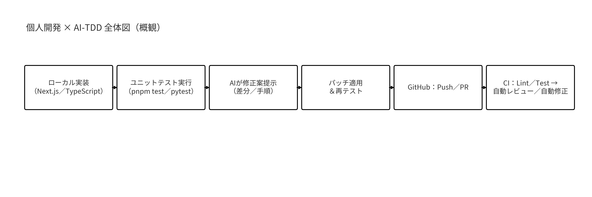
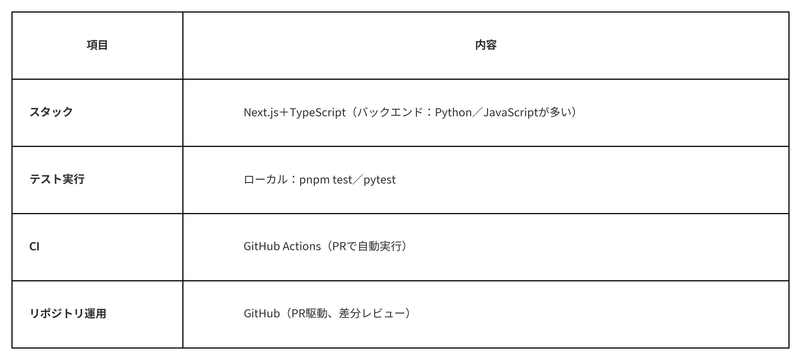

# 【個人開発×AI】TDDで大事なのは「落ちたCIをどれだけ自動で直せるか」

> 出典: https://note.com/mine_unilabo/n/n941cbacf0a7f  
> 公開状態: draft  
> 更新: Thu, 14 Aug 2025 02:16:41 +0900

## 1. 導入

本稿は**Claude Code**を基準に、**GitHub Copilot / Cursor（＋CLI） / OpenAI Codex CLI / Gemini CLI / Devin**を、**実装コスト・日々の生産性・再現性・取り回し（CLI/IDE/CI）・安心感（差分プレビュー／ロールバック）・PR自動レビュー・CI自己修復・コスト感**の観点で比較します。対象は**個人でのプロダクト開発**。セキュリティは過度に厳格化せず、**AIとのペアプロ／AIメイン開発**の実効性を重視します。**AI-TDDの詳説は既稿**をご参照ください（👉 <https://note.com/mine_unilabo/n/nc62d478194d3>）。



個人開発×AI-TDDの全体フロー（概観）

## 2. 本稿の前提

- **読者**：個人〜小規模PoCの実装意思決定者（Webエンジニア／PdM／CTO）
- **前提**：リポジトリは**GitHub管理**、CIは**GitHub Actions**、**ローカル環境でもUnitテスト**を実行
- **スタック**：**Next.js＋TypeScript**（バックエンドはPython か JavaScriptが多め）
- **評価軸**：実装コスト／日々の生産性／再現性（プロンプト雛形・モデル固定）／取り回し（CLI・IDE・CI）／安心感（差分プレビュー・ロールバック）／PR自動レビュー／CIエラー自己修復／コスト感



図2. 前提のサマリ表

## 3. なぜ「Claude Code基準」か

- **Red→Greenの最短化**：テスト失敗からの**差分提案**が素直で、ローカルの反復に乗せやすい。
- **ドキュメント駆動が得意**：設計メモ（例：**Claude.md**）を咀嚼し、**仕様→実装→テスト**の橋渡しに向く。
- **GitHub運用との親和性**：PRレビュー／コメントの**自然言語化**が安定。

※本稿では、**観点を固定**するための**基準器**として採用（＝唯一最適という主張ではない）。

## 4. ニーズ別にみる「まず一歩目」

- **IDE中心で完結したい** → **Cursor（＋CLI）**
- **GitHub運用の自動化を強化したい** → **Gemini CLI**
- **PRの読みやすいレビューを重視** → **Claude Code**
- **コード補完を軽量に強化** → **GitHub Copilot**
- **CLI前提で小粒に試したい／自作に合わせたい** → **OpenAI Codex CLI**
- **自律実行まで含めて試したい** → **Devin**（※個人開発ではPoC的な扱いを推奨）

## 5. GitHubファースト比較（PR自動レビューとCI自己修復）

この章は**画像の表**で固定化し、noteの表崩れを回避します。
比較観点：**PR自動レビュー／レビューの質（◎／○／△）／CIログ理解／CI自己修復（自動PR）／差分プレビュー／コスト帯（目安）／備考**

> 補足：各ツールの“自動修復”は、**人の承認フロー**前提で安全に組み込むのが実務的。PRに**差分プレビュー**と**ロールバック前提**を置くと安心感が上がる。

## 6. 開発フロー（個人開発×AI-TDD）

1. **Red**：pnpm test／pytest を実行 → 失敗
2. **AI提案**：失敗ログ＋差分／設計メモ（Claude.md）を渡す → 修正案
3. **Green**：パッチ適用 → pnpm test／pytest で緑化
4. **PR**：ブランチをPush → PR作成
5. **Auto-Review**：CIでLint／Test → AIが**PRコメントで指摘**
6. **Auto-Fix**：指摘から**自動コミット**（または提案を手動採用）
7. **マージ**：再テスト通過後にマージ

> AITDDの背景とテクニックは別記事へ 👉 <https://note.com/mine_unilabo/n/nc62d478194d3>

最小CI（Node／PNPM例）

```
# .github/workflows/ci.yml
name: CI
on: [pull_request]
jobs:
  test:
    runs-on: ubuntu-latest
    steps:
      - uses: actions/checkout@v4
      - uses: actions/setup-node@v4
        with:
          node-version: '20'
      - run: corepack enable && pnpm i
      - run: pnpm test -- --reporter=junit
```

## 7. コスト感（帯で把握する）

- 価格や制限は**変動が早い**ため、**帯／傾向**で把握 → 詳細は**公式の最新**を確認。
- 個人開発では、**固定費の有無**と**従量の上限**、**無料枠**の有無が効く。
- IDE完結（Copilot／Cursor）／CLI中心（Codex／Gemini）／エージェント系（Claude／Devin）で**使い方の単価**が変わる。

## 8. まとめ（と次の一歩）

- **Claude Code基準**で観点を固定すると、他ツールの比較が**実務に刺さる粒度**になる。
- まずは\*\*「GitHubファースト比較表」→「スイムレーン」**の2枚を見ながら、最小CIを用意して**AI-TDD\*\*を回す。
- **インプットの定型化（Claude.md）で再現性とコスト**を改善 → PR自動レビュー／CI自己修復の導入難度が下がる。
