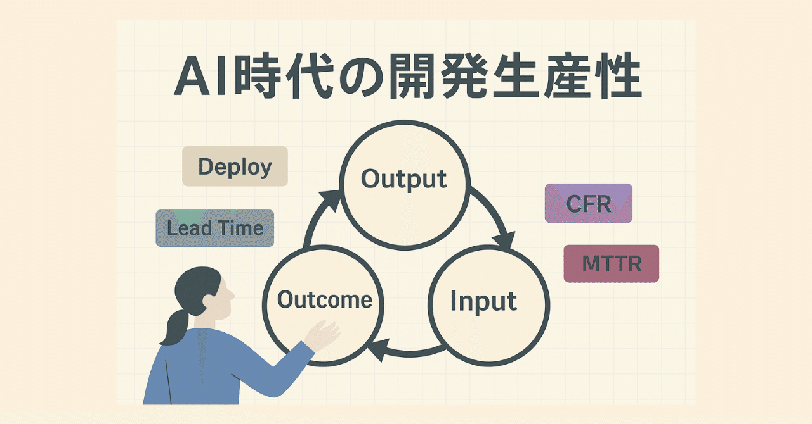

# AI時代の開発生産性をどう測るか？

> 出典: https://note.com/mine_unilabo/n/ncced36189e87  
> 公開状態: draft  
> 更新: Sat, 20 Sep 2025 23:34:22 +0900
> 区分: 個人

## AI時代の開発生産性をどう測るか？

──Four Keysの限界と、アウトプットからアウトカム・インプットへの拡張

---

## 導入

AIエージェントを開発に取り入れてみて、チームの仕事の進み方が大きく変わりました。
コードやテストを書くスピードは格段に上がり、以前よりも多くのアウトプットを出せています。

ただ、ここで改めて考えたいのが **「生産性が上がった」とはどういう状態なのか？」** という問いです。

私たちのチームではこれまでも Four Keys（デプロイ頻度、変更リードタイム、失敗率、復旧時間）を参考にして、生産性を定点観測してきました。
数値は確かに改善しているのですが、それだけでは「本当に価値を出せているのか？」という実感までは持てないこともあります。

五反田のスタートアップでEMをしている、みね（[@mine\_take](https://x.com/mine_take)）です。今回は「AI導入後の生産性の測り方」を自分たちの実践から整理します。

---

## 第0章：AI時代の生産性を考える “5つの観点”

AI導入で「速く作れる」時代になったからこそ、私たちは生産性をもう一段広く捉え直す必要があります。私は次の5つで見るのがしっくり来ています。

1. **速度（Speed）**
   リードタイム短縮、デプロイ頻度の増加。AIで最も改善しやすい領域。
2. **品質（Quality）**
   レビュー・テストの厚み、リワーク低減。速さと同時に担保したい土台。
3. **価値（Outcome）**
   利用率や顧客満足、事業貢献。**アウトプットがアウトカムに繋がっているか**。
4. **持続性（Sustainability / Well-being）**
   集中できる環境、前向きさ、健全なリズム。**長く良い開発** を続けられるか。
5. **適応力（Adaptability）**
   変化（仕様・技術・組織）を取り込み続ける力。**学びの早さ**・**詰まりの少なさ**。

以降はこの**5観点**を背景に、Four Keysの「その先」をどう測るかを整理していきます。

---

## 第1章：Four Keysがくれた気づきと限界

Four Keysは、クラウド時代のDevOpsを定量的に評価する強力な枠組みです。
私たちのチームもこれに沿って改善を繰り返してきました。

その過程は以前の記事にもまとめています：
👉 [アイミツ](https://note.com/mine_unilabo/n/n926343ee80ce)[SaaS](https://note.com/mine_unilabo/n/n926343ee80ce)[開発チームの開発生産性を数値でふり返る](https://note.com/mine_unilabo/n/n926343ee80ce) [-Four Keys](https://note.com/mine_unilabo/n/n926343ee80ce)[指標](https://note.com/mine_unilabo/n/n926343ee80ce)[-](https://note.com/mine_unilabo/n/n926343ee80ce)

数値を追うことで改善は進み、数字上は「エリート」に近づいてきました。
ただし、その中でこんな違和感も残りました──

- 数値は改善しているのに、なぜか「停滞感」がある
- 数字を追うこと自体が目的化してしまいそうになる
- ユーザーに届いた価値とどう結びついているかが見えにくい

Four Keysは「速度と品質」を見るには優れているけれど、**価値・持続性・適応力** までは照らし切れません。ここに “次のレイヤー” を重ねたい、というのが私の実感です。

---

## 第2章：AI導入でリードタイムが激変

AIを導入したことで、**開発全体のリードタイムは明らかに短くなった**という実感があります。

もともと私たちは「小さく開発し、小さくデプロイし、早くフィードバックを受ける」ことを大切にしてきました。
その土台があったからこそ、AIのサポートによってさらに良い影響を受けられています。

- **リファイメントの徹底 ☀**：仕様の課題点・不明点をできる限り解消してから着手。
  → 着手後の「確認待ち」「仕様検討中」というプロックを未然に減らす。
- **PBIの分解とサブタスク化 ☁**：粒度を小さく保つ。
  → AIの生成やテストを小さな単位に適用でき、検証・改善が速く回る。
- **軽量なDoR/DoD 📝**：着手・完了の基準を1枚メモで先に共有（例：受け入れ条件3〜5個＋検証方法）。
  → AIに渡す要件とテストが最初から明確になり、**生成→レビュー→修正**の往復が減って手戻りが少なくなる。

> **- DoR（Definition of Ready）**：このPBI/タスクを**着手して良い状態**の基準
> - **DoD（Definition of Done）**：このPBI/タスクが**完了と言える状態**の基準

結果として、**「小さな開発の仕組み × AI」** の掛け算でリードタイムが短縮。
**“速く作る力”** に関しては、明確にブレイクスルーが起きています。

---

## 第3章：開発者体験（DX） <検証中の観点>

“速く作れる”だけでは長続きしません。私たちは**開発者体験（Developer Experience: DX）**にも目を向けています。

- 邪魔されずに集中できる時間があるか
- レビューや設計のやり取りに納得感があるか
- AIとの協働で「やっていて面白い」と感じられるか

これらはFour Keysの範囲外です。いまは**試しながら**、DXを軽いパルスサーベイやふりかえりの問いで拾っています。

> 参考：スプリント末に**5問・10段階**の軽いパルスサーベイで**傾向だけ**を見る運用（「集中できた？」「AIとの協働は楽しかった？」など）。数値を上げるための運用にはしません。

---

## 第4章：数値と感覚を“両輪”で回す

私たちが大事にしているのは、**数値と感覚を両輪で見ること** です。

- **Four Keys**は「速度と品質」を測る**体温計**。
- **開発者体験（DX）は**メトロノーム。（無理のないテンポかどうかを整える。）

特に **リードタイム** と **デプロイ頻度** は「健康診断のような指標」として“ゆるく”見ています。

- **リードタイム**：変化をどれだけ速く取り込めているか
- **デプロイ頻度**：その変化をどれだけユーザーに届けているか

ここでのポイントは、**数値を目標にしない**こと。
数字のための開発に陥らないよう、\*\*「おかしくないかを見るための検診」\*\*として扱います。

### ふりかえりでの軽量チェック（例）

- 先スプリント比で**リードタイムの中央値**はどうだった？
- **デプロイのリズム**は崩れていない？（“溜まってまとめて出す”になっていない？）
- **ブロッカーの滞留**はあった？（どこに潜んでいた？次は潰せる？）
- **体感**はどう？（速くなった実感、逆に焦りや消耗は？）

### 避けたい落とし穴

**「KPI化 → 数字合わせ」に陥らない。
目的は**価値の循環を妨げる詰まりの早期発見であって、記録更新ではない。

---

## 第5章：これからの変化 — アウトプットからアウトカム、そしてインプットへ

これまでも私たちは、アウトプットだけでなく**アウトカム**を大切にしてきました。
「作った」ではなく「ユーザーにどう価値を届けられたか」を見ようとしてきた、ということです。

そこにAIが加わったことで、変化が生まれました。
**アウトプットを早く出す課題が解決された** ことで、**次の課題により早く取り掛かれる** ようになりました。

自然と、次の問いが前に出てきます。

- そのアウトプットは本当に**アウトカム**に繋がっているか？
- さらに、次の**インプット（学び・仮説の種）**に還元できているか？

私は、**生産性の軸が「作る速さ」から「価値の循環をどれだけ速く・確実に回せるか」へ**と移っていくと見ています。

この変化の中で、人間の役割も進化します。
AIがアウトプットの多くを担保してくれるほど、**人は「なぜ作るのか」「何を優先するのか」を決めるPdM的な要素**を強めることになる。
つまり、**価値を選び取る力**が問われる、ということです。

私たちはまだ移行の途中にいます。
だからこそ、この変化を観察し続け、自分たちなりの「生産性の定義」を更新していきたいと思っています。

**AIは手を動かす。人は進む方向を決める。**
これが、AI時代の生産性を考える上での核心だと捉えています。

---

## 実践メモ（すぐに使える軽量テンプレ）

- **週1の“ゆるふわ検診”**（合計10分）

  - リードタイム中央値・デプロイ回数の**トレンドだけ**確認
  - ブロックの**予兆**がないかをひと言ずつ
  - 「体感」1〜10の自己評価をSlack投票でとる（集計しない、見るだけ）
- **ふりかえり用 “問いカード”**（スプリント末に3問）

  1. 今回、一番速くなったのはどの部分？なぜ速くなった？
  2. その速さはアウトカムに繋がった？繋げるには何が必要？
  3. 次のインプット（学び・仮説）に還元できる小さな実験は？
- **PdM的視点を育てる “ひとことDoR”**

  - 「なぜ今やる？」（ユーザー/事業の文脈を1行で）
  - 「価値仮説は？」（期待する変化を1行で）
  - 「計測は？」（見に行く場所・タイミングを1行で）

---

## 結び

AIは確かにアウトプットを加速してくれます。
でも、それだけでは足りません。
**アウトカムとインプットを循環させ、チームが健全に価値を届け続けられること**。
そこにこそ、本当の意味での生産性があると思います。

Four Keys、**開発者体験（DX）**、そしてAI。
それぞれは別の側面を照らしますが、組み合わせると**数字と実感の両方**からチームを見直せます。
その積み重ねこそ、これからの開発チームに必要な営みだと感じています。

一言で言えば──
**「AIは速さをくれる。でも、人が価値を選び取る。」**
その両輪で、生産性をもう一度定義していく時代に入ったのではないでしょうか。

> Four Keysを中心に取り組んできた時期の振り返りはこちら
> 👉 [アイミツ](https://note.com/mine_unilabo/n/n926343ee80ce)[SaaS](https://note.com/mine_unilabo/n/n926343ee80ce)[開発チームの開発生産性を数値でふり返る](https://note.com/mine_unilabo/n/n926343ee80ce) [-Four Keys](https://note.com/mine_unilabo/n/n926343ee80ce)[指標](https://note.com/mine_unilabo/n/n926343ee80ce)[-](https://note.com/mine_unilabo/n/n926343ee80ce)

---

### おまけ：SNSシェア用の一言

> **「AIを入れて開発は速くなった。
> でも、それって本当に“生産性が上がった”と言えるのか？」**

本編では、Four Keysの先を“価値の循環”で捉え直しています。
