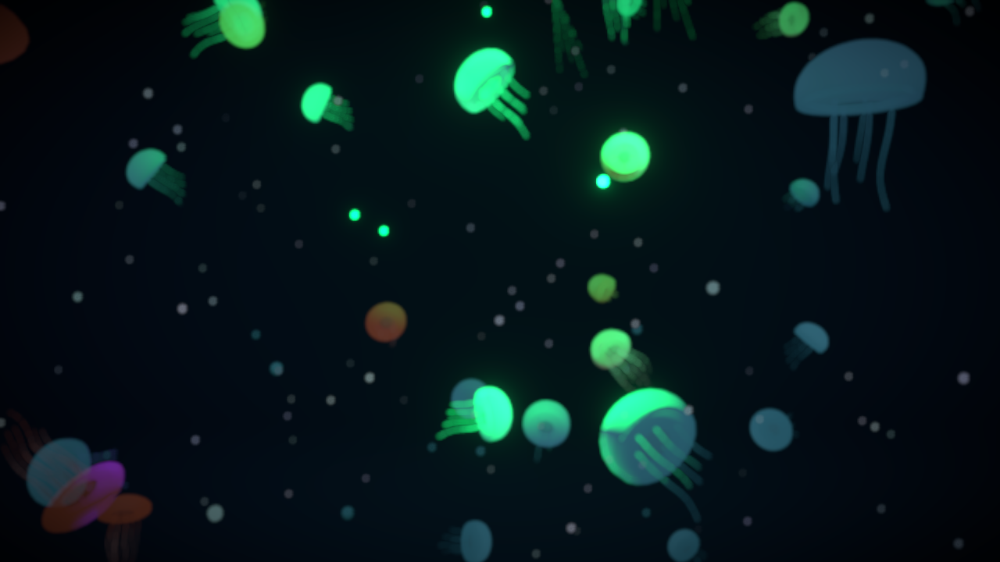
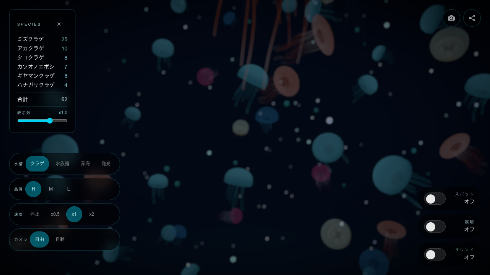

# コードを1行も書かずに、子供と見たクラゲ水槽をAIと一緒に作った話

子供達と水族館に行った日、いちばん長く見ていたのはクラゲの水槽でした。

薄暗い水の中で、クラゲがゆっくり漂っている。
光に透けながら、ふわふわと形を変えている。

何かが起きるわけでもないのに、その前からなかなか離れられませんでした。

魚みたいに速く泳ぐわけでもない。
大きな音がするわけでもない。
何か派手なことが起きるわけでもない。

でも、なぜかずっと見ていられる。

そのときに思いました。

この水槽を、いつでも見られるようにしたい。

水族館に行った日だけではなく、家でも、仕事の合間でも、少し疲れた夜でも、ブラウザを開いたらクラゲが泳いでいる。

そんな小さな水槽を作れないだろうか。

ということで、作ってみました。

開くと、画面の中でクラゲがゆっくり漂います。

https://ocean.the3396.com/jellyfish

しかも今回は、自分ではコードを1行も書いていません。

調査もAI。
設計もAI。
実装もAI。
改善もAI。

メインで使ったのはCodexです。
調査にはGeminiも使いました。
開発の一部ではAntigravityも使いました。

人間がやったのは、コードを書くことではありません。

「こうしたい」
「これは違う」
「もっとクラゲっぽくしたい」

そう伝え続けることでした。

## この記事は、すごいAI活用術ではありません

最初に書いておくと、この記事は「AIを使いこなす高度な開発テクニック」の話ではありません。

むしろ逆です。

自分ではコードを書かず、調査もAIに任せ、実装もAIに任せたら、どこまでアプリが作れるのか。

それを試した記録です。

きれいな設計論も、再現性の高いベストプラクティスも、まだありません。

ただ、子供達と水族館で見たクラゲ水槽を、いつでも見られるようにしたかった。

その気持ちをAIに渡して、少しずつ形にしていった話です。

## 作ったもの

作ったのは、ブラウザで見られるクラゲ水槽です。

画面の中では、いくつかの種類のクラゲがゆっくり漂っています。

ミズクラゲ。
アカクラゲ。
タコクラゲ。
カツオノエボシ。
ギヤマンクラゲ。
ハナガサクラゲ。

表示数を変えたり、泳ぐ速度を調整したり、カメラを自動にしたり、照明やサウンドを切り替えたりできます。

ゲームではありません。

クリアもありません。
ランキングもありません。
ログインもありません。
何かを入力する必要もありません。

ただ、クラゲが泳いでいます。

作業の合間に開いておくと、少しだけ水族館にいる気分になります。

## 使ったAI

今回メインで使ったのはCodexです。

開発はほぼCodexに任せました。

自分でコードを書くのではなく、最初はこんな感じで頼みました。

> ブラウザで見られる、クラゲが泳ぐ水槽アプリを作りたいです。
> 水族館のクラゲ水槽みたいに、ぼーっと眺められるものにしたいです。
> まず実現方法を調べて、設計して、実装まで進めてください。

クラゲの種類。
クラゲの動き。
水槽っぽい見え方。
深海っぽい雰囲気。
Webで表現する方法。

このあたりの調査はGeminiにも任せました。

実装の一部ではAntigravityも使いました。

なので今回やったのは、「AIにちょっとコードを書いてもらった」というより、調査から実装までかなりAI側に寄せる進め方です。

人間は、何を作りたいかを決める。
出てきたものを見る。
違和感を言葉にする。
もう一度AIに戻す。

その繰り返しでした。

## 自分でコードを書かない縛り

今回、意識していたことがあります。

自分でコードを書かないことです。

普段なら、ちょっとした修正は自分で直したほうが早いです。

余白を変える。
速度を変える。
配列を調整する。
UIの文言を直す。

そのくらいなら、自分でやったほうがすぐ終わります。

でも今回は、そこをあえてAIに戻しました。

> クラゲの動きが速すぎて、魚っぽく見えます。
> もっと浮遊感を出してください。

> 設定UIが前に出すぎています。
> 水槽を眺める体験を邪魔しないようにしてください。

> 数を増やすと重く感じます。
> 見た目を保ったまま、パフォーマンスを調整してください。

こんなふうに、違和感を言葉にして戻します。

自分で手を動かすのではなく、AIにレビューを返す。

開発しているというより、AI開発者にディレクションしている感覚でした。

このとき大事だったのは、AIに正しいコードを書かせることではありませんでした。

大事だったのは、出てきたものを見て、

「何が違うのか」
「どんな体験に近づけたいのか」

を、人間の側が言葉にすることでした。

コードはAIが書く。
でも、違和感を見つけて、方向を決めるのは人間がやる。

今回のクラゲ水槽づくりは、その役割分担を試す時間でもありました。

## 小学生の息子にも見てもらった

できたものは、自分だけで見るのではなく、小学生の息子にも見てもらいました。

これは今も試している開発フローです。

AIに作ってもらう。
自分が見る。
息子にも見てもらう。
反応を聞く。
その反応をまたAIに伝えて直してもらう。

実際に見てもらうと、開発者目線とは違う反応が返ってきます。

「クラゲっぽい」

まずそう言ってくれます。

でも少し見てから、

「もっと増やしたい」
「動きがちょっと速い」
「こっちのほうが好き」

と、かなり素直に返ってきます。

そういう一言が、かなり参考になります。

自分だけで見ていると、どうしてもコードやUIやパフォーマンスを気にしてしまいます。

でも子供は、もっと素直に見ます。

楽しいか。
クラゲっぽいか。
ずっと見ていられるか。

その反応をもとに、またCodexに伝えます。

> 小学生の息子に見せたら、動きが少し速くてクラゲっぽくないと言われました。
> もっとゆっくり、ふわふわ漂う感じに調整してください。

こうやって、人間の反応をAIに戻していく。

コードは書いていません。

でも、見た人の反応をもとに、少しずつ水槽がよくなっていく。

この感じが、今回かなり面白かったところです。

## うまくいかなかったこと

もちろん、最初からいい感じだったわけではありません。

最初のほうは、クラゲがすいすい横に進んでしまって、どう見ても魚に近い動きでした。

水の中で漂っているというより、きれいな背景アニメーションが流れている感じでした。

設定UIが強すぎて、クラゲを見るよりボタンを見る感じになったこともあります。

数を増やすと、見た目はにぎやかになるけれど、重く感じることもありました。

そういうたびに、Codexに戻しました。

「クラゲっぽくない」
「もっと水中にいる感じにしたい」
「UIが主役になっている」
「眺める体験を優先したい」

エラー内容を説明するというより、体験として何が違うのかを伝える。

これが思ったより大事でした。

AIに任せる開発では、コードを書く力よりも、違和感を言語化する力のほうが必要になる場面が多いのかもしれません。

## 途中で、AIに任せられる範囲が変わった

今回の開発は、最初はGPT-5.2で始めました。

途中からGPT-5.4になり、そこで開発の感覚がかなり変わりました。

GPT-5.2のころは、こちらが作業の進め方まで細かく指定する必要がありました。

「まず調査して」
「影響範囲を見て」
「このファイルは壊さないで」
「実装後に確認して」
「不要な変更は入れないで」

というように、かなり先回りして伝えていました。

それでも、意図と違う方向に進んだり、見た目の調整だけのつもりが別の部分まで触られたりすることがありました。

なので、人間側が細かく見張っている感覚が強かったです。

でもGPT-5.4になってからは、こちらが細かく段取りを指定しなくても、次に必要なことを拾ってくれる場面が増えました。

たとえば、

「クラゲの動きが魚っぽい」
「もっと水の中を漂っている感じにしたい」
「UIが水槽を見る体験を邪魔している」

と伝えると、原因になりそうな箇所を探し、直し方を考え、実装して、確認まで進めてくれます。

こちらが全部を命令しなくても、体験として何を直したいのかを汲み取って、作業に落としてくれる感じがありました。

これはかなり大きな変化でした。

AIにコードを書かせているというより、AIに開発の一部を任せている感覚に近くなりました。

「細かく命令する相手」から、「ある程度任せられる開発メンバー」に近づいたように感じました。

もちろん、完全に任せきれるわけではありません。

AIは間違えます。
意図と違う変更もします。
だから最後に見るのは人間です。

それでも、GPT-5.2で始めたときと、GPT-5.4で進めたときでは、任せられる範囲が明らかに違いました。

今回のクラゲ水槽づくりで一番驚いたのは、完成したものそのものよりも、むしろこの変化だったかもしれません。

## 人間は何をしていたのか

今回、自分ではコードを一切書いていません。

では、人間は何をしていたのか。

振り返ると、やっていたのはこのあたりです。

- 何を作りたいかを決める
- どういう雰囲気にしたいかを伝える
- AIの出力を見て、良いか悪いかを判断する
- 違和感を言語化する
- 優先順位を決める
- 最後に体験として成立しているかを見る

つまり、実装者というより、ディレクターに近い役割でした。

AIが作る。
人間が見る。
違和感を返す。
AIが直す。
また人間が見る。

この繰り返しです。

クラゲ水槽のようなアプリには、明確な正解がありません。

クラゲの動きが物理的に正しいかどうかよりも、見ていて気持ちいいかどうかのほうが大事です。

その判断は、まだ人間側に残っている気がします。

AIに何かを作ってもらったあと、どこを見て「これは違う」と思うか。

今回のクラゲ水槽では、その問いが何度も出てきました。

## 作ってみて思ったこと

作ってみて一番感じたのは、「AIに任せる」の意味が変わってきているということです。

少し前までは、AIにコードを書かせるといっても、部品を作ってもらう感覚が強かったです。

関数を書いてもらう。
エラーを直してもらう。
コンポーネントを作ってもらう。
CSSを調整してもらう。

でも今回は、もう少し大きな単位で任せられました。

調査して、設計して、実装して、調整して、改善する。

この一連の流れを、かなりAI側に寄せられました。

もちろん、全部を信用して丸投げできるわけではありません。

AIは間違えます。
意図と違うものも作ります。
たまに、なぜそうしたのかわからない方向へ進みます。

それでも、開発の手触りは明らかに変わってきています。

コードを書く時間より、何を作りたいのかを考える時間。

実装方法を調べる時間より、出てきたものが良いかどうか判断する時間。

そういう時間の比率が増えていくのかもしれません。

## 完璧ではないけれど

このクラゲ水槽は、完璧ではありません。

本物の水族館の水槽にはかないません。

あの暗さも、光も、水の揺らぎも、目の前にある感じも、ブラウザだけで全部再現するのは難しいです。

でも、ブラウザを開くとクラゲが泳いでいます。

何も操作しなくても、ただ漂っているのを眺めるだけ。
それだけで、作ってよかったと思える瞬間があります。

子供達と水族館で見たクラゲを思い出しながら、家でも、仕事の合間でも、少しだけ眺められる。

小学生の息子に見てもらって、「ここをもっとこうしたい」と思ったら、またAIに伝えて直してもらう。

そんな作り方を、今も試しています。

コードは1行も書いていません。

でも、クラゲは泳いでいます。

そこが、今回いちばん面白かったところです。

## 明日できること

AIで何か作ってみたいけれど、何から始めればいいかわからない。

そう思ったら、まずはAIにそのまま相談してみるのがいいと思います。

きれいな仕様書を書かなくても大丈夫です。

「こういうものを作りたい」
「何から始めたらいいかわからない」
「調査からお願いしたい」
「実装も任せたい」
「自分はコードを書かずに進めてみたい」

そのくらいで始めても、意外と前に進みます。

たとえば、最初はこのくらいでいいと思います。

> こういうものを作りたいです。
> 自分ではコードを書かずに進めたいです。
> まず実現方法を調べて、作り方を提案してください。
> そのあと、動くものを作って、改善点を一緒に見つけたいです。

大事なのは、最初から完璧に作ることではありません。

動くものを出して、見て、違和感を言葉にして、またAIに戻すこと。

今回は、それを繰り返していたら、ブラウザの中に小さなクラゲ水槽ができました。

コードを1行も書かずに。

よかったら、少しだけ開いて眺めてみてください。
何かを操作しなくても大丈夫です。

ただ、クラゲが泳いでいます。

https://ocean.the3396.com/jellyfish
