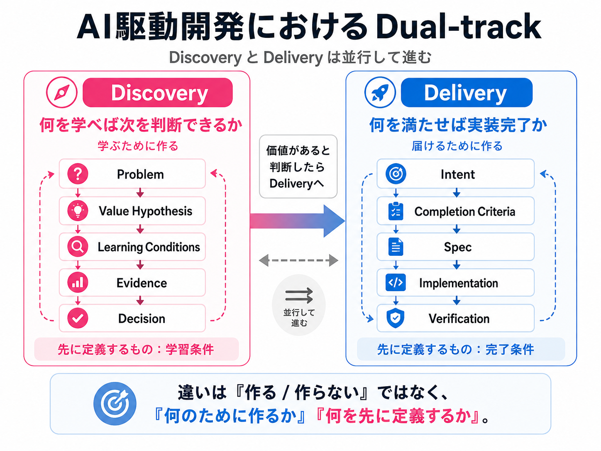

# AI駆動開発でSDDを考え直した。DiscoveryとDeliveryでは「先に定義するもの」が違った

> 区分: 個人

こんにちは、みねです。

AIに実装を任せるとき、自分は「何を満たせば完了なのか」を先に定義するようにしてきました。

開発アイテムの内容をチームで整理し、何を満たせば完了なのかを外に出す。そのうえで、設計と実行計画を作ってAgentへ渡す。

このやり方は、Deliveryではかなりうまく機能しています。

ところが、新しい価値を探るDiscovery側のPoCで、同じ型を使おうとすると噛み合わないことがありました。

最初は、

> DiscoveryではSDDが合わないのではないか

と考えました。

でも、今は少し違う捉え方をしています。

**SDDがDiscoveryに合わなかったのではなく、Delivery用に作ったSpecの型を、そのままDiscoveryへ当てていた。**

自分たちのProduct Developmentでは、DiscoveryとDeliveryを並行して進めるDual-trackに近い形で開発しています。

Discoveryでは、何を作る価値があるのかを探る。Deliveryでは、価値があると判断したものをプロダクトとして正しく届ける。

ただし、実際にはどちらでも実装が発生します。DiscoveryでもPoCや試作を作りますし、DeliveryではもちろんSoftwareを作ります。

**この「どちらでも作る」という状態が、今回の混線の原因の一つでした。**

Deliveryでうまく機能していたSDDの型を、そのままDiscoveryの試作にも当てようとしていたからです。

違いは「作る / 作らない」ではありません。**何のために作るのか、何を先に定義するのか**です。

**Deliveryでは「何を満たせば完了か」を先に定義する。**

**Discoveryでは「何を学べれば次を判断できるか」を先に定義する。**

この記事では、探索的なPoCで感じた違和感から、SDDの使い方をどう考え直したかを書きます。

---

## Deliveryでは「完了条件」をSpecifyする

自分たちのDelivery Flowでは、PBI単位でAI駆動開発を回しています。

~~~text
PBI
  ↓
リファインメント
  ↓
プランニング
  ↓
Spec・完了条件
  ↓
設計・実行計画
  ↓
AIによる実装
  ↓
検証
~~~

PBIは、Product Backlog Itemの略です。ここでは「今回実現したい変更や要求を、開発チームが扱える単位にしたもの」くらいの意味で使っています。

このFlowでは、PBIをそのままAgentへ渡しません。

なぜ作るのか。何を実現するのか。何ができれば完了なのか。何を変えないのか。何を検証するのか。

そうした条件を先に外へ出してから実装へ進みます。

この考え方は、普段使っているPlanGateの運用にも組み込んでいます。

### DONEは「何を満たせば完了か」

自分たちのFlowでは、PBIごとにDONEを置きます。

ここでいうDONEは、**何が満たされれば、この変更を完了と判断できるかという完了条件**です。

例えば、

> 管理者がユーザーを一時停止できるようにする

というPBIなら、

~~~text
目的:
管理者がユーザーを一時停止できる

DONE:
- 管理者だけが停止できる
- 停止されたユーザーはログインできない

変更しないこと:
- 認証方式そのものは変更しない
~~~

のように定義できます。

この状態なら、Agentに対して、

- 何を実現するか
- 何を変えないか
- どこまで進めればよいか
- 何をもって正しいと判断するか

を渡せます。

Deliveryでは、このSDDの型がかなりよく機能しました。

---

## Discoveryに同じSpecを当てると、価値仮説が完了条件になった

違和感が出たのは、既存プロダクトの利用フローの途中に新しい体験を加え、その体験が実際に使われるかを確かめる探索的なPoCでした。

具体的な機能名や案件内容は伏せますが、対象ユーザーが普段使っている流れの中に新しい選択肢を置き、その選択肢を使うことで追加の価値が生まれるかを見ようとしていました。

このPoCは、何も根拠がない状態から始めたわけではありません。

事前にユーザーインタビューなどを行い、

> こういう価値があれば、ユーザーにとって意味があるのではないか

という仮説は持っていました。

ただし、どんな形でその価値を届けるか、その体験自体に本当に価値があるかは、まだ検証が必要な状態でした。

ここでDeliveryと同じようにPBIを作り、DONEを置こうとしました。

例えば、構造だけを単純化すると、

~~~text
DONE:
- 新しい体験を利用できるようにする
~~~

とは書けます。

Softwareとしては、この条件を満たせます。

でも、PoCで本当に確かめたかったのは、

> **その体験に、ユーザーにとって価値があるのか**

でした。

つまり、

~~~text
実装として決められること:
- 新しい体験を利用できるようにする

まだ確かめる必要があること:
- その体験自体に価値があるか
- この提供方法が適切か
~~~

が混ざっていました。

前者は完了条件です。

後者は価値仮説です。

ここを区別せずにDeliveryのSpecへ入れると、

**「価値があるかもしれない」が「これを作るべき」に変わってしまう。**

そしてAgentは、その区別をしてくれません。

こちらが価値仮説を要件として渡せば、その仮説も忠実に実装します。

結果として、

**間違った仮説を、高い品質で、速く実装する**

ことが起こり得ます。

これはSDDの欠点ではありません。

**Specifyする対象を間違えていた**ことが問題でした。

---

## SDDは「howの前にwhatを定義する」

今回考え直すうえで、GitHub Spec KitのSDDの説明が参考になりました。

GitHub Spec Kitでは、Spec-Driven Developmentを、**実装方法であるhowより先に、実現したいwhatを仕様として定義するIntent-drivenな開発**として説明しています。

実際、Spec Kitの基本Flowも、

~~~text
Specify
  ↓
Plan
  ↓
Tasks
  ↓
Implementation
~~~

となっていて、`/speckit.specify` では技術スタックではなく、まず「何を作るのか」「なぜ作るのか」に集中します。

自分もSDDを、**分かっているIntentを実装前に外へ出し、Agentが実行できる形へ変える方法**として捉えてきました。

ここで今回引っかかったのが、whatという言葉です。

Deliveryでは、「何を作るか」はある程度分かっています。

一方、Product Discoveryでは、**そのwhat自体に価値があるのかをまだ確かめている**ことがあります。

つまり、問題はSpecを書くタイミングだけではありませんでした。

**DiscoveryとDeliveryでは、Specifyする対象そのものが違う。**

この理解が、自分の中ではかなり大きな変化でした。

なお、GitHub Spec KitにはCreative Explorationという開発フェーズがあり、複数の実装、技術スタック、Architecture、UX PatternなどのSolution探索を扱います。

さらに現在は、`/speckit.specify` の前段で「そもそも作る価値があるか」を評価する `assess` というIdea Assessment Pipelineもあります。`intake → research → define → shape → decide` の流れでProblemやEvidenceを整理し、`go / needs-clarification / kill` を判断してからSDDへ渡す仕組みです。

これは、DiscoveryとDeliveryを分けるという点で、今回の整理とかなり近い考え方です。

一方で、Spec Kitの `assess` はDiscoveryと実装を明確に分離し、`speckit.assess.*` の各Commandはソースコードを変更しません。Solution DesignやImplementationは `/speckit.specify` 以降のSDD lifecycleへ渡します。

この記事で扱っているのは、**Product Discoveryそのものに、PoCやExperimentとして最小限の実装が必要になるケース**です。

その実装をAgentへ渡すとき、Deliveryと同じ完了条件をContractにするのではなく、**「何を学ぶための実装なのか」を先に外へ出す必要がある**と考えました。

---

## Discoveryでは「学習条件」をSpecifyする

ここまで考えて、自分の結論は、

> DiscoveryではSDDを使わない

ではなくなりました。

むしろ、**SDDの「実装前にIntentを外部化する」という考え方を、DiscoveryのExperimentにも適用すると、Deliveryとは違うものを先に定義する必要がある**と考えています。

以下はGitHub Spec Kitの公式用語ではなく、自分たちの運用上の整理です。

Deliveryで先に定義するのが完了条件なら、Discoveryで先に定義したいのは、

- どんなProblemを見ているのか
- どんなValue Hypothesisを持っているのか
- 何を確かめたいのか
- 何が観測できれば次を判断できるのか
- どんなEvidenceを得たいのか
- そのEvidenceを見て、次にどんなDecisionを取るのか
- 今回は何を固定しないのか

です。

例えば、実際の案件内容は伏せたうえで、今ならPoCのSpecを次のように考えます。

~~~text
Problem:
既存の利用フローの中で、
対象ユーザーが十分に解決できていない課題がある

Value Hypothesis:
既存フローに新しい体験を加えることで、
ユーザーに追加の価値を届けられる

Learning Conditions:
- 実際の利用文脈で、その体験が利用されるかを確認する
- 利用されない場合、
  「価値そのものが弱い」のか
  「提供方法に問題がある」のかを区別できる情報を得る

Evidence:
- 実際の利用文脈での利用 / 非利用
- 利用前後の行動
- 利用しなかった理由
- 利用後に得られた反応

Decision:
- 価値仮説を支持するEvidenceが得られた → 次のExperimentへ進む
- 価値はありそうだが提供方法に問題がある → Solutionを変更する
- 価値自体を支持するEvidenceが得られない → 仮説を見直す / Stopする

今回まだ固定しないこと:
- 本実装としての最終仕様
- この提供方法を継続すること
~~~

Discoveryだから何も決めないわけではありません。

**決める対象が違う。**

### 仮説だと分かったら、DONEを捨てるのではなく書き換える

ここも今回の学びでした。

DONEを書いていて、そこに価値仮説が混ざっていると気づいたからといって、実装をすべて止める必要はありません。

価値仮説の部分を完了条件から外して、**学習条件へ書き換える。**

そして、その学習に必要な最小限の試作だけをAgentへ渡す。

~~~text
価値仮説
  ↓
Learning Conditions
  ↓
最小限のExperiment
  ↓
Evidence
  ↓
Decision
  │
  └─ 価値を確認できたらDeliveryへ
~~~

価値が確認できたら、その後でDelivery側のPBIとして完了条件を定義すればよい。

こう考えると、DiscoveryとDeliveryは別々の世界ではなく、自然につながります。

---

## DiscoveryとDeliveryで、Agentへ渡すContractを変える

前回、「[失敗をモデルのせいにしない。AI駆動開発を『Model + Harness』で考える](https://note.com/mine_unilabo/n/nd6a5d83d1488)」という記事を書きました。

そこで、Agentを正しく動かすためのHarnessの土台として、目的、完了条件、制約、停止条件などを含むContractを考えました。

今回の経験で、その続きを一つ理解できた気がします。

**Contractは必要。でも、DiscoveryとDeliveryでContractの中身を同じにしてはいけない。**

自分の中では、今こう整理しています。

~~~text
Discovery Contract
- Problem
- Value Hypothesis
- Learning Conditions
- Evidence
- Decision
- 今回固定しないもの

            ↓ Evidence / Decision

Delivery Contract
- Intent
- Completion Criteria
- Constraints
- Verification
- Stop Conditions
~~~

HarnessがAgentに「どう動くか」を支えるものだとしたら、SDDはそのAgentへ**何を先に渡すか**を考えるものとして見えてきました。

Discoveryでは、学習すべきことをContractにする。

Deliveryでは、実現すべきことをContractにする。

---

## SDDがAI駆動開発に合わないのではなかった

今回、最初に感じていた違和感は、

> PoCではSDDが噛み合わない

でした。

今は、**SDDがAI駆動開発に合わないのではなく、DiscoveryとDeliveryで同じSpecの型を使っていた**ことが問題だったと考えています。

Product Developmentでは、DiscoveryとDeliveryがいつもきれいに分かれるわけではありません。Discoveryでも実装は必要ですし、Deliveryしながら新しいことが分かることもあります。

だから分類そのものが目的ではありません。

自分自身、これからAgentへPBIやSpecを渡す前に、まず次の2つを確認したいと思っています。

- **いま必要なのは、価値を確かめることか。それとも、価値があると判断したものを届けることか**
- **このSpecで先に定義すべきなのは、完了条件か。それとも学習条件か**

SDDを使うか使わないかではなく、**DiscoveryとDeliveryで、何をSpecifyするのかを変える。**

今回のPoCから得た、一番大きな学びです。

---

## 参考

- GitHub Spec Kit「What is Spec-Driven Development?」
  - SDDを、howより先にwhatを定義するIntent-drivenな開発として整理する際の参考
  - https://github.com/github/spec-kit/blob/main/docs/concepts/sdd.md
- GitHub Spec Kit README
  - `/speckit.specify` でwhat / whyを定義し、Plan / Tasks / Implementationへ進むFlowの参考
  - https://github.com/github/spec-kit
- GitHub Spec Kit `assess` - Idea Assessment Pipeline Extension
  - SDDの前段にDiscovery trackを置き、`go / needs-clarification / kill` を判断するFlowと、Discoveryではソースコードを変更しないGuardrailの参考
  - https://github.com/github/spec-kit/blob/main/extensions/assess/README.md
- 前回の記事「失敗をモデルのせいにしない。AI駆動開発を『Model + Harness』で考える」
  - https://note.com/mine_unilabo/n/nd6a5d83d1488
