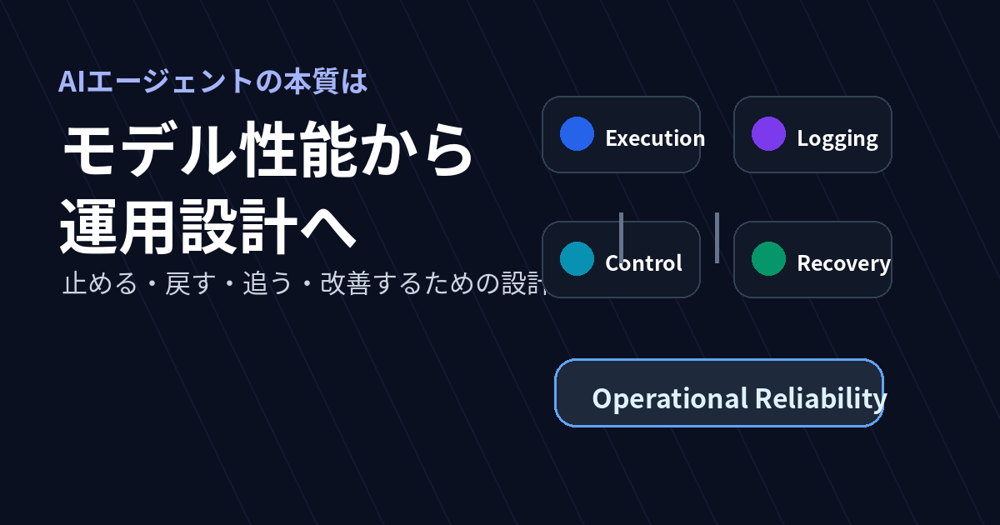
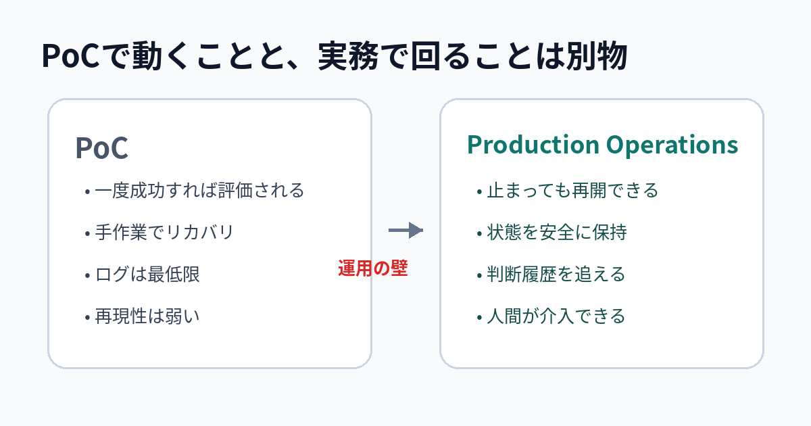

# いま本当に重要なAIエージェント論は、モデル性能より運用設計だと私は考えている

> 区分: 個人

AIエージェントの議論は、いまだにモデル性能の話に寄りすぎている。私はそう感じています。

モデルが賢いことはもちろん前提です。
ただ、実際に導入や運用を考え始めると、詰まるのはモデル性能そのものではないことが多い。

途中で止まった処理を再開できるか。
どの情報を、どの権限で参照させるか。
判断の履歴を追えるか。
人間がどこで介入するか。
失敗したときに、どこまで安全に戻せるか。

1回うまく動くことと、業務で回り続けることの間には、想像以上に大きな差があります。

最近のAIエージェントをめぐる論点は、「どのモデルが一番賢いか」から、「どうすれば壊れずに運用できるか」へ重心が移ってきている。この記事は、その感覚を自分なりに整理してみたものです。

この見立ては、個人的な印象だけではありません。
[2025年9月29日にAnthropicが公開した Claude Agent SDK の解説](https://www.anthropic.com/engineering/building-agents-with-the-claude-agent-sdk/)では、焦点はモデル比較そのものより、ツール設計、視覚フィードバック、失敗ケースの見直し、顧客利用に基づく評価に置かれていました。
さらに、[2026年4月15日にOpenAIが公開した Agents SDK の更新](https://openai.com/index/the-next-evolution-of-the-agents-sdk/)でも、前面に出てきたのは、モデルを安全に動かすための実行基盤です。たとえば、制御された sandbox（サンドボックス）実行や、途中で止まっても復元できる durable execution（耐障害性実行）の考え方が強く打ち出されています。

要するに、主要ベンダーの公式ガイド自体が、すでに「どう賢く答えさせるか」だけではなく、「どう安全に動かし続けるか」に軸足を移しています。

## AIエージェントは、もともとこう整理されていた

これまでAIエージェントは、ざっくり言えば次のような要素で語られることが多かった。

- LLM
- Memory
- Planning
- Tool Use

この整理自体は、今でも有効です。
主要なベンダーやフレームワークも、LLM（モデル）・Tool Use（ツール）・Memory（状態）・Planning（制御フロー）という対応で、ほぼ同じ要素からエージェントを説明しています。

ただ、この整理だけでは本番運用の論点が抜け落ちやすい。最近はそこを強く感じます。

この見方は、「どうすればエージェントが答えを出せるか」を考えるには向いています。
一方で、「どうすればエージェントが壊れずに働き続けられるか」を考えるには、少し足りない。

PoC（概念実証）の段階では、それでも十分です。
一度うまく動けば、可能性が見えるからです。

でも本番では、求められるものが変わる。
ここから先は、賢さの話だけでは済まない。

## PoCで動くことと、実務で回ることは別物

PoCでは「一度うまく動いた」が評価されやすい。これは当然でしょう。

新しい技術は、まず可能性を示す必要がある。
だから最初は、成功したデモが強い。

ただ、実務では評価軸がかなり変わります。

たとえば、実際の運用で気になるのはこんな点です。

- 長い処理の途中で止まっても再開できるか
- 状態を安全に保持できるか
- 外部ツールの失敗を吸収できるか
- どこで人間が介入すべきか定義されているか
- 後から「なぜそう判断したか」を追えるか
- 同じ入力に対して、ある程度再現可能に振る舞えるか

AIエージェントの難しさは「答えを出すこと」より、「途中で壊れても仕事を続けられること」にある。私はそう見ています。

デモの成功と、業務運用の成功は別物です。
この2つを同じものとして扱うと、だいたい後で苦しくなる。

現場で必要なのは、モデル性能だけではありません。
停止、再開、監査、介入、復旧に耐える実行基盤（ワークフローエンジン、状態ストア、監査ログ、承認フロー、ロールバック機構といった仕組み）まで含めて成立しているかどうか。そこが勝負になる。

## Memoryは「覚える機能」から「参照を制御する仕組み」として捉え直したい

AIエージェントの文脈で Memory という言葉が出てくると、つい「長く覚えてくれる機能」のように理解しがちです。

一般的には、Memory は短期（会話コンテキスト）と長期（ベクトルストア等）に分けて語られ、アクセス制御は別レイヤ（RBAC（ロールベースアクセス制御）や Retrieval（検索/参照層））として設計されることが多い。

ただ、実務で運用を考えると、これらを分離したままでは扱いづらい。私は「参照制御まで含めて Memory と呼んだほうがしっくりくる」と感じています。

重要なのは、何を覚えるかより、どの情報を、いつ、どの文脈で、どの権限のもとで参照させるかです。

たとえば、古い営業メモを引いてしまえば判断がズレる（品質劣化）。
他部門の情報を誤って参照すれば、権限境界の侵害につながる（セキュリティ事故）。
過去の会話履歴を無差別に流し込めば、コンテキストのノイズが増え、情報漏えいのリスクも高まる。

このあたりを考えていると、Memory は単なる「記憶装置」ではなく、「参照を制御する仕組み」として捉えたほうがしっくりきます。

そう捉えると、論点も自然に広がります。

- 参照する情報の鮮度をどう担保するか
- 機密情報へのアクセス境界をどう切るか
- どの判断がどの文脈に依存していたかをどう残すか
- ログや監査証跡とどう接続するか

つまり、Memory の話を突き詰めると、結局は情報設計、権限設計、監査設計の話に近づいていきます。

エージェント実装の本質的な難しさの一部は、ここにある。

## 競争の中心は「賢いエージェント作り」から「壊れず運用できる仕組み作り」へ

モデル性能の改善は今も続いています。
それでも、実務の競争軸は少しずつ移ってきた。

モデル性能だけでは、以前ほど差がつきにくくなってきた。
少なくとも、現場で効いてくる差分はそこだけではなくなってきた。

むしろ差が出るのは、次のような部分です。

- 判断過程を追えるか
- 評価基盤があるか
- 人間の承認や修正を自然に差し込めるか
- 権限を限定できるか
- 異常時に止められるか
- 変更による劣化を検知できるか

要するに、「賢いか」だけではなく、「追えるか」「止められるか」「改善し続けられるか」が重要になっている。

競争の中心はかなりの部分で、「賢いエージェントを作ること」から「壊れず運用できる仕組みを作ること」へ移った。個人的にはそう受け止めています。

## これからのプロダクト価値は「AIが働きやすい土台」で決まる

この変化は、エージェントの作り方だけの話ではありません。
プロダクトそのものの価値基準も、あわせて変わっていくはずです。

これまでは、UI の使いやすさや機能数が競争力の中心でした。
それは今後も重要です。

ただ、AIが実際に業務を担うようになると、別の価値がかなり前に出てくる。

- 構造化されたデータを持っているか
- 権限体系が明確か
- 操作履歴が残るか
- API や外部連携が安定しているか
- 例外処理の設計が強いか
- 人間とAIの役割分担を埋め込めるか

人にとって使いやすいだけでは足りない。
AIが安全に、安定して、誤動作しにくく働けること自体が価値になる。

これからの良いプロダクトは、「人間向けUIとして優れているもの」であると同時に、「AI実行基盤としても優れているもの」として評価されていくはずです。

画面の見た目や機能追加だけではなく、データの一貫性、監査可能性、権限境界、例外処理の強さ。
そういった地味だけれど重要な設計が、これまで以上に競争力になるはずです。

## AIエージェント導入で露呈するのは、AIの限界より業務の曖昧さ

ここが、個人的にはいちばん本質に近い論点です。

AIエージェントを入れようとすると、「AIの限界」が見えるようでいて、実際には業務の曖昧さが先に露呈することが多い。

- 誰が最終責任者なのか曖昧
- 判断基準が暗黙知のまま
- 例外処理が属人的
- 権限管理が雑
- 正常系しか定義されていない
- 失敗時のエスカレーションが決まっていない

こうした問題は、人間同士の運用では何となく吸収されてきたのでしょう。
でも、AIを組み込もうとすると、ごまかしが効かなくなる。

だからAI導入は、単なる機能追加ではなく、業務と責任の再定義に近い。たとえば「この判断はAI、異常時の最終判断は部門長」「この操作はAIに許可し、この操作は許可しない」といった、役割と権限の線引きを明文化する作業です。

エージェントがうまく動かないとき、原因はモデルの性能ではなく、業務の責任境界や判断基準が未整理であることも少なくありません。

AIを業務に組み込もうとすると、「何となく回っていた」手順が明文化を迫られます。
その意味で、AI導入は業務の健康診断に近い。普段は見えない前提条件や責任の所在が、一度に表に出る。

## AI導入の本質は、業務とシステムの解像度を上げること

ここまで書いてきたことをまとめると、AIエージェント導入は、AI導入であると同時に、業務設計の見直しでもあります。

問われるのは、どのモデルを使うかだけではありません。

- 業務をどう分解するか
- どこまでを自動化し、どこからを人が持つか
- 状態をどう管理するか
- 失敗時にどう止め、どう戻すか
- 権限境界をどう切るか
- 何をもって成功と評価するか

要するに、業務とシステムの解像度が問われる。

AIエージェントは魔法の自動化装置ではない。
むしろ逆で、組織やシステムがどれだけ整理されているかを露わにする装置。そう捉えるほうが、私には腑に落ちます。

だからこそ、いま本当に重要なのはモデル性能だけではない。
どんな責任境界で、どんな状態管理で、どんな失敗前提で業務に組み込むか。そこを設計できるかどうかが、実装の成否を決める。

少なくとも私の目には、AIエージェントの本質は「賢さの競争」から「運用可能性の設計」へと移ってきている。

---

## あとがき

この記事は、AIエージェントに関する一般論を網羅的に整理したものではなく、いま自分が現場感として強く持っている問題意識を、できるだけそのままの温度で言語化したものです。

書きながら、「モデル性能の議論」と「運用設計の議論」を同じ俎上で比べること自体が、そろそろ違うフェーズに入っているのかもしれない、とも感じました。

次はこのあたりを、もう少し具体的な設計パターン（状態管理、監査ログ、人間の介入点の置き方）に落とし込んで書いてみたいと思っています。
