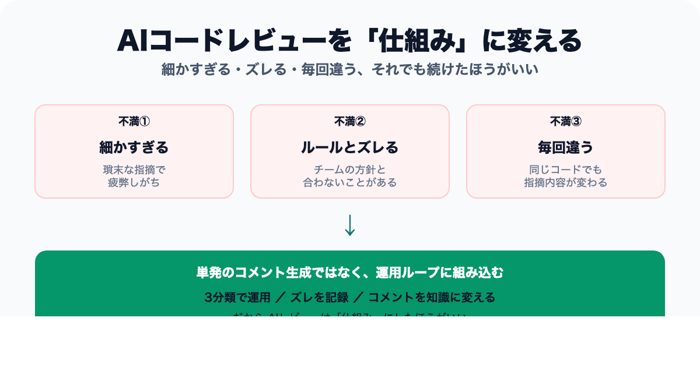
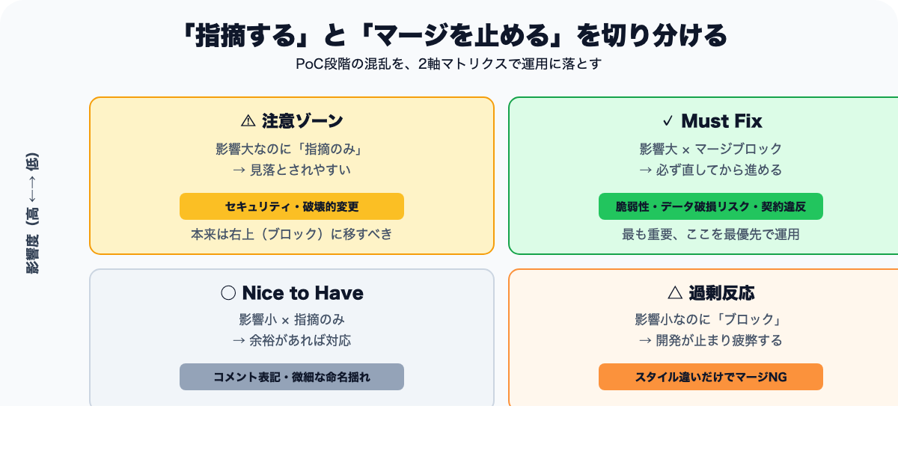
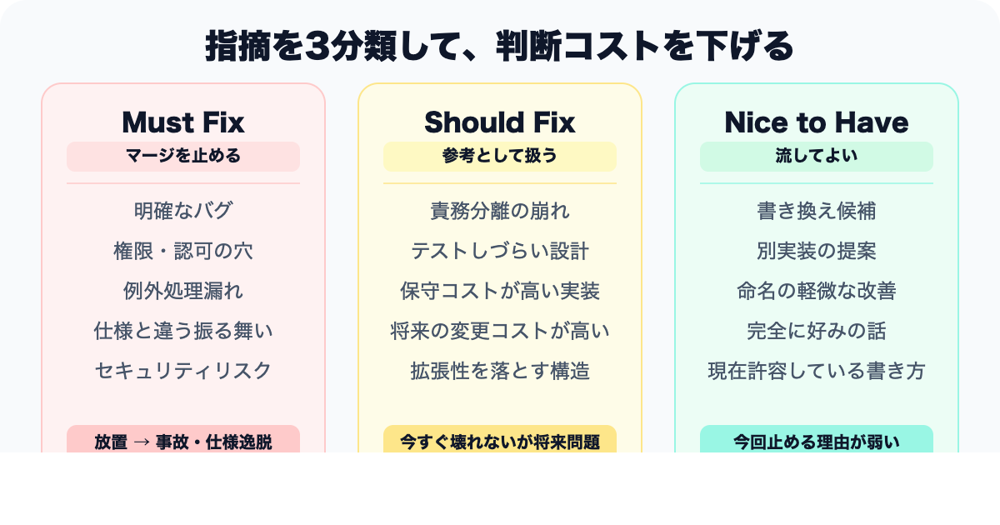
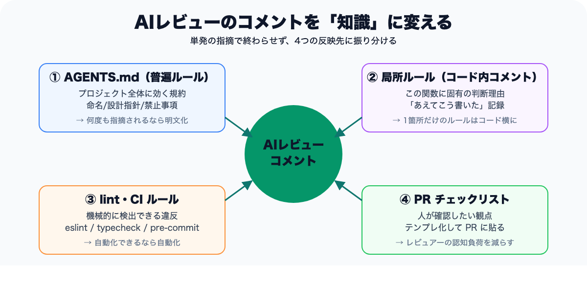
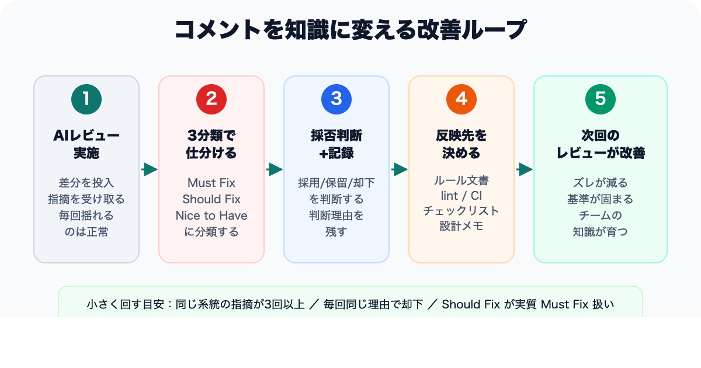

# AIコードレビューが細かすぎる、ズレる、毎回違う。それでも仕組みにしたほうがいい理由

> 区分: 個人

AIコードレビューを使い始めたとき、最初に感じたのは「想像以上によく見てくれるな」という驚きでした。

ただ、運用を続けると、別の種類の難しさが見えてきます。

- 指摘が細かすぎて、重要な論点が埋もれる
- チームのルールとズレた一般論が返ってくる
- 同じ変更でも、実行のたびに指摘が変わる

AIレビューに期待していたのは、レビューの高速化や抜け漏れの削減でした。
でも実際には、指摘が増えるほど判断コストも増える。
ここを整理しないまま使うと、レビューが楽になるどころか、別の種類のノイズが増えていきます。

この記事は、AIコードレビューを試し始めたエンジニアや、チーム導入を考えている人に向けて、指摘をどう分類し、どう記録し、どう改善ループに戻すかを整理したものです。

結論から言うと、AIレビューの問題は「モデルが信用できない」ことより、**レビュー基準と記録の仕組みが固定されていないこと** にあります。

## AIレビューが不安定に見えるのは自然です

AIは、その場で与えられた文脈の中で、もっともらしいレビューを返します。
そのため、基準が曖昧なままだと、出力はどうしても揺れます。

たとえば、こんなことが起きます。

### 指摘が細かすぎる

命名や表現のような軽い論点に反応しすぎて、本当に止めるべきバグや仕様逸脱が見えにくくなる。

レビュー件数が多いこと自体に価値はありません。
重要な指摘が埋もれるなら、それはレビュー量ではなくノイズです。

### チームのルールとズレる

一般論として正しい提案でも、いまのプロジェクトでは採らない設計や書き方があります。

たとえば、「その最適化は今は採らない」「この層ではその責務分離をしない」「このリポジトリではこの書き方を標準にしている」といった判断です。

このズレを放置すると、レビューのたびに同じ説明を人間が繰り返すことになります。

### 実行ごとに指摘が変わる

同じ差分でも、周辺文脈やプロンプト、モデルの揺らぎで注目点は少しずつ変わります。

ここで重要なのは、毎回同じ出力を期待することではありません。
揺れても最終判断がぶれない運用を作れるかどうかです。

## まずは「何を止めるか」を決める

AIレビューを使う前に、チーム側で最低限そろえておいたほうがいいのは、何を指摘対象にし、何を止めるかです。

ここが曖昧だと、軽い改善提案も深刻な不具合も、同じ重さで並びます。
結果として、読む側の負担ばかり増えます。

最初は、次のような粒度で十分です。

- バグになりうる差分
- 仕様違反
- セキュリティや権限のリスク
- 保守性を大きく下げる実装

逆に、対象外も決めておいたほうがいい。

- 完全に好みの話
- 現状のチームルールで許容している書き方
- 今回の変更範囲を超える大きな改善提案

「指摘する」と「マージを止める」は別です。
この境界を切り分けるだけでも、レビューのノイズはかなり減ります。

## 指摘は3分類くらいがちょうどいい

自分は、AIレビューの指摘を次の3つで扱うのが現実的だと感じています。

### Must Fix

放置すると不具合、仕様逸脱、事故につながるものです。

- 明確なバグ
- 権限や認可の穴
- 例外処理漏れ
- 仕様と違う振る舞い

### Should Fix

今すぐ壊れないけれど、保守性や拡張性を落とすものです。

- 責務分離の崩れ
- テストしづらい設計
- 将来の変更コストが高い実装

### Nice to Have

改善余地はあるけれど、今回止める理由は弱いものです。

- 書き換え候補
- 別実装の提案
- 命名や表現の軽微な改善

この3分類を入れるだけで、「細かすぎる」問題はかなり扱いやすくなります。

大事なのは、低優先度の指摘を消すことではありません。
**止めるべきものと、参考意見として流すものを分けること** です。

## チームのルールとズレるなら、ズレを記録したほうがいい

AIレビューが一般論に寄るのは、ある意味で自然です。
プロジェクト固有の判断を知らなければ、一般的にもっともらしい提案を返すしかないからです。

だから、同じズレが何度も出るなら、毎回その場で訂正するより、仕組みに戻したほうがいい。

たとえば、こういうものです。

- このリポジトリでは `useMemo`（React のパフォーマンス最適化API）を基本的に使わない
- API層ではこのバリデーション方針を採る
- ログはこの粒度で残す
- 命名はこの文脈ではこちらを優先する

同じ訂正を人間が何度も返しているなら、それは個人の判断ではなく、チームルール候補です。

## コメントを「知識」に変える

ここがいちばん重要だと思っています。

AIレビューをその場のコメント生成で終わらせると、次回また同じズレが出ます。
残すべきなのは、「AIが何を言ったか」だけではなく、「なぜその指摘を採用したか、しなかったか」です。

最低限、次の項目だけでも記録すると、かなり違います。

- 指摘カテゴリ
- 採用、保留、却下
- 判断理由
- 再発防止策
- どこに反映するか

反映先は、性質に応じて分ければ十分です。

- 全体ルールなら `AGENTS.md`（AIエージェントやレビューツールに読み込む共通ルールファイル）
- 特定領域の判断なら局所ルールや設計メモ
- 自動で守らせたいことなら lint や CI
- レビュー観点として残すなら reviewer 用のチェックリスト

自然言語でお願いするだけでは弱い。
必要に応じて、文書化、自動化、レビュー観点化に分けて戻すほうが安定します。

## 改善ループは、小さく回したほうが続きます

最初から完璧な分類表やダッシュボードを作る必要はありません。
むしろ、重く作りすぎると続きません。

自分なら、まずはこう始めます。

- 同じ系統の指摘が3回以上出た
- 毎回同じ理由で却下している
- `Should Fix` が実質 `Must Fix` として扱われている

このあたりだけ拾って、週次か一定件数ごとに見直す。
それだけでも、かなり仕組み化の候補が見えてきます。

優先順位もシンプルでいいと思います。

1. 事故を防ぐものは CI やテストに寄せる
2. 判断のズレが多いものはルール文書に寄せる
3. 表現や観点の揺れはチェックリストに寄せる

全部をルール化しようとすると、今度は運用が重くなります。
繰り返し出て、再利用価値が高いものだけを仕組みに変えるくらいでちょうどいい。

## AIレビューは、単発のコメント生成で終わらせないほうがいい

AIコードレビューが不安定に見えるのは、モデルの性能だけが原因ではありません。
レビュー基準、重要度の分類、採否の記録が、仕組みとして固定されていないからです。

だからこそ、AIレビューは「賢いコメントを返してくれるか」で評価するより、「チームの判断をどれだけ再利用可能にできるか」で見たほうがいい。

指摘が細かすぎる。
ルールとズレる。
毎回違う。

この不満は、AIレビューをやめる理由というより、運用を設計する理由になる。

少なくとも自分は、そう考えるようになりました。

最初は `Must Fix / Should Fix / Nice to Have` の3分類でも十分です。
同じズレが繰り返し出たら、ルールや CI に戻す。

その流れができると、AIレビューは単発の補助機能ではなく、チームの知識を育てる仕組みに近づいていきます。
