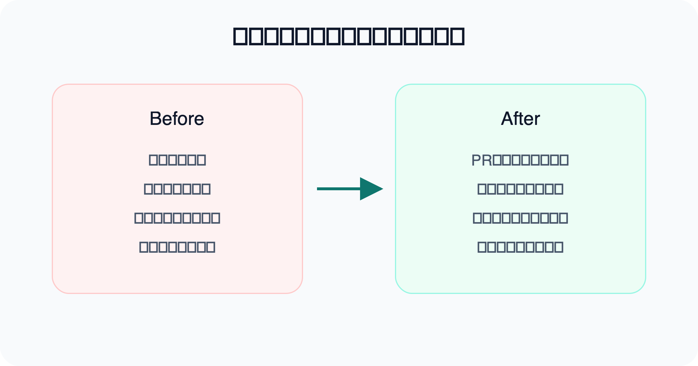
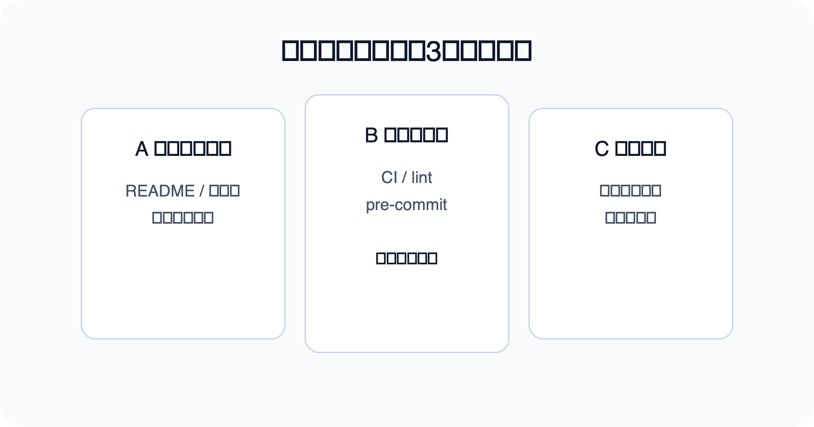
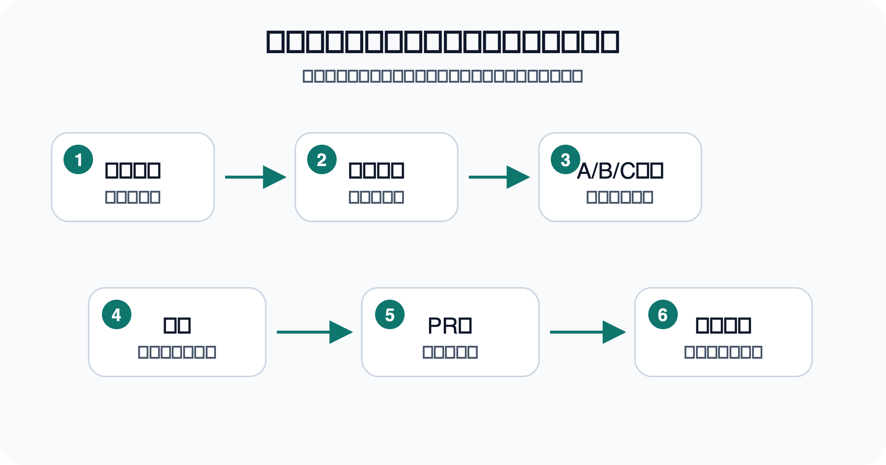

# 「次は気をつけよう」で終わる振り返りを、仕組みに変える考え方

> 区分: 個人

チームで開発を進めていて、振り返りをするたびに、だいたい同じところに着地する感覚があります。

「今回はここが大変だった」
「次は気をつけよう」

誠実な締めくくりに見えて、次のセッションで同じ失敗を踏む。この繰り返しに、最近ずっと違和感を持っています。
特に、複数のPRをまとめて進めたあとや、リリース直後のセッションほど、この傾向が強くなります。
CIが落ちた、force-pushで事故を起こしかけた……。改善ポイントは見えているのに、仕組みに変換しきれないまま次に進んでしまう。

この記事は、チームの振り返りを「反省会」から「仕組みを積む時間」に組み替えるための考え方を、エンジニアリングマネジャーやチームリード、AIと開発するようになった個人開発者に向けて整理しています。

この問題は、振り返り自体の欠陥ではなく、**振り返りの出口を「気をつける」で閉じていること** にあると思うようになりました。

気をつけるのは人間です。
次のセッションで同じ状況に直面したとき、また注意力に頼ることになる。
これはチームが大きくなるほど、AI との協働が増えるほど、破綻しやすいアプローチです。

---

## 個人の反省では限界がある

よくある振り返りは、個人の学びの記録で終わります。

「あの PR はレビュー観点が抜けていた。次は気をつける」
「リリースのチェックリストを忘れていた。来週は忘れないようにする」

これ自体は誠実な姿勢ですが、問題が2つあります。

1つは、**チームとしての再発防止になっていない** こと。学んだのは自分だけで、同じ罠は他のメンバーも踏む。

もう1つは、**人間の注意力をリソースとして浪費する** こと。毎回「忘れないように気をつけよう」と頭の一部を割く状態が、そのままチームの認知負荷になっていく。

振り返りの出口は、個人の反省ではなく、チームが共有する仕組みであるべきだと思います。

---

## 振り返りの出口を3つに分類する

振り返りの出口として、次の3つを意識するようになりました。

**A. ドキュメント追記**

次回の自分、あるいは他のメンバー、あるいは AI エージェントが読む場所に明文化します。
読まれる前提のドキュメントに落とさなければ、知識は個人の中にだけ残って消えていきます。

**B. 自動ガード**

人が忘れても、機械が止めてくれる仕組みです。
CI の追加チェック、pre-commit hook、lint ルール。
ここが強いほど、「気をつける」への依存が減ります。

**C. ツール運用変更**

ツールの呼び出し方や進め方をルール化します。
「バックグラウンド実行はこの条件で使う」「作業順序はこう固定する」といった、運用マニュアルに近いものです。

この3分類にしている理由は、**改善の強度が違うから** です。

A だけで済ませるのは弱いです。ドキュメントに書いたから安心、ではなく、ドキュメントは読まれなければ意味がない。
なので、改善項目の最低1件は B（自動ガード）に落とすように決めています。
「気合い」ではなく「仕組み」で事故率を下げる、というのが大事です。

---

## ドキュメントだけで済ませない

ここがこの考え方のコアだと思っています。

「今回の学びをドキュメントに書いた、これで改善した」と言いたくなる気持ちは分かります。
書いたこと自体は偉い。

けれど、次に同じ状況が来たとき、**そのドキュメントを思い出せるか、探しにいけるか** は別の話です。
締め切りが迫っていたり、疲れていたり、似ているけれど微妙に違う文脈に置かれていたりすると、書いたはずの学びは発動しません。

だから、ドキュメントに書くだけでは、改善が成立したと言い切れません。
「書く → 読まれる → 行動が変わる → 結果が変わる」という経路のうち、最後まで辿れるかどうかで考える必要があります。

自動ガードがあると、この経路を「機械が読んで、機械が止める」に短縮できます。
人間の注意力を経由しない改善は、強い。

---

## 振り返りの粒度も変わる

仕組みに落とすことを前提にすると、振り返りで書く内容の粒度も変わってきます。

「大変だった」では、仕組みに落ちません。
「どのコマンドで、どのファイルを、どう扱ったときに、どのくらい時間を失ったか」
まで書かないと、CI ガードもドキュメントも設計できない。

影響の大きさを、時間・リスク・リカバリコストで見積もる癖がつきます。
感情ではなく、構造で失敗を見る。

これは反省を冷たくする、という話ではありません。
**同じ失敗をチーム全体で二度踏まないために、反省を共有可能な形に翻訳している**、という感覚です。

---

## 軽量モードという逃げ道

一方で、毎回フル装備で振り返る必要はない、とも思っています。

単発 PR で、手戻りもなく、新しいインシデントもないセッションで、改善PRを無理やり作っても、ノイズが増えるだけです。
「健全な状態でした」と結論付けて終われるのも、健全なサイクルの一部です。

改善は「やった感」よりも、次回の失敗率をどれだけ下げられるかで評価したほうが良い。
意味の薄い改善 PR を量産すると、レビューコストだけが積み上がって、本当に必要な改善が埋もれます。

ただし、軽量モードで流した場合でも、「次回に持ち越す観察」は短く残します。
並行作業で見えた違和感、外部要因の変化、自分が手を入れなかった領域で起きた事象。
こうした「持ち越し観察」を書いておくと、次のセッションの振り返りで回収できます。

---

## チームとしての再発防止

個人の反省ではなく、チームとしての再発防止を考えるようになると、振り返りの位置付けが変わります。

振り返りは、感想を共有する時間ではありません。
**次のセッションで、チームの誰がその状況に当たっても、同じ失敗を踏まずに済むための仕組みを積む時間** です。

この捉え方ができると、振り返りは後ろ向きな作業ではなくなります。
失敗を遠ざけるのではなく、失敗を材料に、チームの土台を少しずつ強くしていく作業になる。

その積み重ねが、次の開発速度を決める、と感じます。

---

## まとめ

「次は気をつけよう」で終わる振り返りを、仕組みに変えるためには、いくつかの発想の転換が要ります。

- 個人の反省ではなく、チームの再発防止として設計する。
- ドキュメント追記だけで済ませず、自動ガードに落とす。
- 気合いではなく、仕組みで事故率を下げる。
- 影響を時間・リスク・リカバリコストで見積もる。
- 改善が要らないセッションは、要らないと結論付けて終える。

これが回り始めると、振り返りは反省会ではなく、チームの土台を積み重ねる時間になります。

良い振り返りは、うまく反省できることではなく、
**次の失敗を仕組みで減らせること**、だと思っています。

気をつける、を卒業していく。
その先に、注意力ではなく設計で支えられる開発があると、最近は感じています。

---

なお、この考え方を実際の開発フローにどう落とし込んでいるかは、別記事にスキル運用の具体として書いています。概念を掴んだあとで、手順・コマンド・テンプレートまで知りたい方はそちらをどうぞ。
