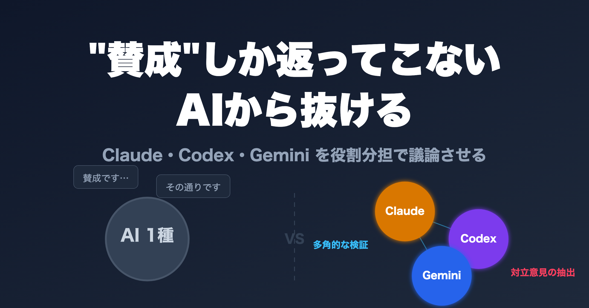
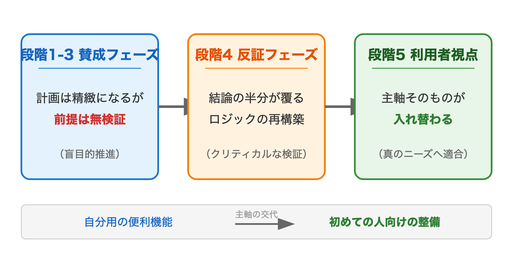

# ChatGPTに賛成ばかりされて困っている人へ：AI 3種を役割分担で議論させる方法

> 区分: 個人

ChatGPT に計画を相談すると、たいてい賛成してくれます。設計の穴は埋めてくれるのに、「そもそもその方針でいいの？」とは聞いてくれない。これは ChatGPT に限らず、AI を 1 種類だけ相談相手にしているときに共通して起きることです。

私はこの「賛成しか返ってこない」状態を抜けるために、Claude・Codex・Gemini の 3 種を**役割分担**させて、ひとつの計画を 5 段階で議論させてみました。結果、最初に「これが主軸」と思っていた機能が完全に外れ、まったく別のものが計画の中心に座りました。

この記事は、その 2 日間の記録です。エンジニアでない方にも読めるように、技術の中身ではなく「議論の組み立て方」の話として書いています。

## まず、5 段階の地図

本文に入る前に、全体像を 1 枚で示します（実際の対話はもっと細かく往復していますが、振り返りやすいよう 5 段階に整理しています）。

| 段階 | やったこと | 担当 | 結果 |
|---|---|---|---|
| 1〜3 | 賛成側として主軸を詰める | Claude / Codex | 計画は精緻になるが前提は無検証のまま |
| 4 | 批判側に回って結論を崩す | Codex | 結論の半分以上がひっくり返る |
| 5 | 利用者視点で前提を問い直す | Codex | 計画の主軸そのものが入れ替わる |

「賛成 → 反証 → 前提の問い直し」と段階を分けたのがこの記事の肝です。以降はこの地図に沿って進みます。

## 1 種類だと「合意」しか作れない

最初、私は「ある自分用の便利機能」を半年計画の主軸にするつもりでした。AI にそう伝えて議論すると、設計の穴は次々と埋まり、計画はどんどん精緻になっていきます。けれど、誰も「そもそもこの主軸でいいのか」を聞いてはくれませんでした。

AI と計画を作るときのありがちな失敗はここにあります。**「自分の思いつきを補強する材料」を AI から受け取って終わる** ことです。設計の穴を指摘してくれることはあります。けれどそれは **「主軸そのものを疑う指摘」ではなく、「主軸を前提にした上での改善案」** にとどまります。

3 段階目までの議論はまさにこれでした。合意は積み上がるのに、最初の「これを主軸にする」という決定だけは、誰にも検証されないまま残り続けます。

## 役割を分けると、視点も分かれる

転換点は 4 段階目でした。同じ AI に、こう頼んだのです。「3 段階目までで決まった結論を、今度は批判する側として、もう一度評価し直してほしい」と。

これだけで結論の半分以上がひっくり返りました。

ポイントは、「賛成して詰める役」と「反対して崩す役」を、別の段階に分けたことです。AI は問いに沿って答えるので、賛成と反対を同時に頼むとどちらも中途半端になります。段階を分けて役割を明示すると、同じ AI でも視点が変わります。

今回使い分けたのは次の 3 種類です。

- **Claude**（Anthropic 社の AI）：全体の進行と統合役。各段階の問いを整理して、次の段階へ結論を渡す
- **Codex**（OpenAI のコーディング向け AI）：深掘りと批判役。論理を詰めるのが得意で、前提を共有したまま「ここが弱い」と容赦なく指摘できるので、あえて反対側に立たせる役に向きます
- **Gemini**（Google の AI）：外部知見の調達役。インターネット検索と組み合わせて、業界の似た事例を引いてくる

役割を決めずに 3 種同時に同じ問いを投げると、それぞれが「総合的に答える」モードに入って差が出ません。**何の役を期待するかを最初に決めておく** のがコツでした。

## 引用 URL がついていても、自分の現場には合わない

3 段階目で Gemini が出してきたのは、業界の有名フレームや論文を引いた「これも入れたほうがよい」という推奨でした。引用元の URL もしっかりついていて、業界事例としても妥当に見えます。

私はそのまま「業界整合が取れているなら採用しよう」と進みかけました。けれど 4 段階目で批判役の Codex に同じ推奨を投げると、その大半が「あなたのプロジェクトの現実制約に合わない」と覆りました。

ここで学んだのは、**AI が「正解」を出してきても、それが自分の「現場」の正解とは限らない**ということです。業界事例として妥当でも、自分の規模・段階・利用者層に合うとは限りません。引用 URL がついていると、つい「裏が取れている＝採用すべき」と思ってしまう。けれど引用が正しいことと、自分の現場に効くことは、まったく別の問題なのです。

## 「誰のための計画か」を最初に決めておく

最後の 5 段階目が、いちばん効きました。

4 段階目まで、議論の前提はずっと「私が使うため」でした。それなのに、私のつくっているものは他の人も使えるよう公開しているものです。4 段階も、暗黙に「自分の使い勝手を上げる」議論をしていたわけです。

5 段階目で「初めて使う人の視点で批判してほしい」と頼んだ瞬間、前提が崩れました。返ってきた一文がいまも印象に残っています。

> これの価値は「初めての人が安全に使い始められる入口を整えること」であって、「すでに使っている自分の使い勝手を磨くこと」ではない。

ここで計画が動きました。具体的にはこう入れ替わりました。

- **Before（主軸のつもりだったもの）**：自分の作業の記録を細かく追える「自分用の便利機能」
- **After（実際に主軸になったもの）**：初めての人が迷わず使い始められる「導入の説明・配り方・互換性の整備」

同じ題材なのに、「誰のために作るか」を変えただけで、計画の優先順位が丸ごと入れ替わったのです。本来この問いは 1 段階目で入れるべきでした。これは会議でも同じで、議題に入る前に「この決定は誰の課題を解くのか」を一度確認しておくだけで、後半のちゃぶ台返しをかなり防げます。

## まとめ：明日から試せる 4 ステップ

この体験を、そのまま手順に落とすとこうなります。AI が 1 種類しかなくても、役を切り替えれば再現できます。順番が大事なので、私の失敗を踏まえて並べ直しました。

1. **最初に「誰のため」を決める**：相談を始める前に「この計画は誰の、どの課題を解くのか」を 1 行で固定する。私はこれを最後に回して痛い目を見ました
2. **役を決める**：1 つの AI に「今は賛成して詰める役」と最初に宣言してから相談を始める
3. **賛成の段階で詰める**：方針に沿って設計の穴を埋めきる。ここでは前提を疑わない
4. **段階を変えて反証させる**：別の対話として「さっきの結論を、現実制約を理由に批判して」と頼む。制約（規模・人数・利用者）を先に渡すのがコツ

私は実際には 1 番を最後にやってしまい、4 段階分の合意がひっくり返りました。理想は最初に置くこと。ただ、もし入れ忘れても、最後に一度「初めて使う人の視点で見て」と問い直すだけで劇的に効きます。1 種類の AI でも、この順で役を切り替えれば「賛成しか返ってこない」状態からは抜けられます。

## おわりに

AI を 1 種類だけ使っていたときは、「賢い相談相手」が手に入った感覚でした。役割を分けて議論させるようになって感じたのは、「自分の前提を壊しに来てくれる相手」が手に入ったということです。

合意を作るための相談ではなく、前提を疑うための議論へ。AI を使った計画の質を一段上げたいときに、試す価値のあるパターンだと思います。

---

技術寄りの詳しい版（実際の議論ログ・OSS ロードマップの組み替え）は Zenn に書きました。中身まで知りたい方はこちらへ：[AIエージェント3種で戦略議論したら、OSSロードマップの主軸が根本から変わった話](https://zenn.dev/s977043/articles/multi-ai-discussion-roadmap-rewrite)
