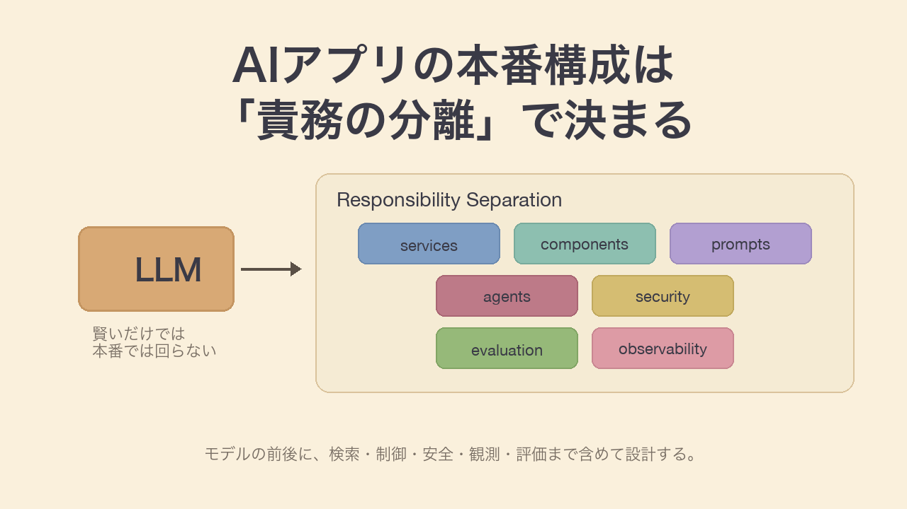
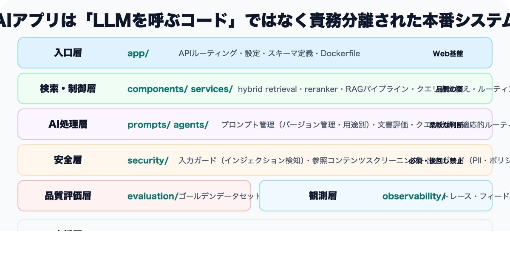
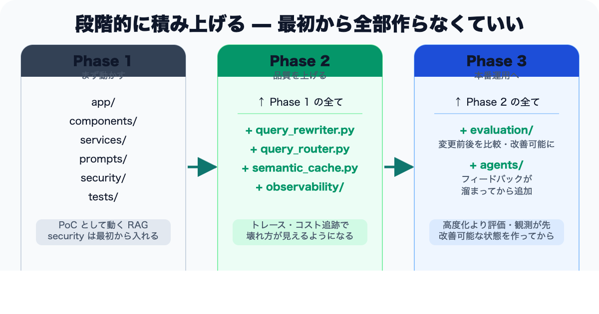

# AIアプリはLLMを呼ぶだけでは作れない：本番構成の全体像を整理する

> 区分: 個人

Xで見かけた [`production-ai-app` の構成図](https://x.com/techNmak/status/2042951175071502513) がとてもよかったので、この記事では本番運用向けAIアプリの責務分離という観点から、図を自分なりに読み解いてみます。

一見するとフォルダ構成のサンプルに見えますが、実際には生成AIアプリを本番運用するための責務分離がかなりうまく整理されています。

RAG、prompt、agent、security、evaluation、observability。
こうした要素がそれぞれ独立したディレクトリとして切られていて、「AIアプリはLLMを呼ぶだけでは成立しない」ということがよく伝わる図でした。

AIアプリを実装しているエンジニア、テックリード、AIプロダクトに関わる方に向けて、「モデルの前後にどんな責務があるか」を整理してみます。

---

## この図は「フォルダ構成」ではなく「責務分離図」

この図を見て最初に思ったのは、これは単なるフォルダ構成例ではない、ということでした。

重要なのはファイル名そのものではなく、**何をどの責務として分離しているか**だと思います。  
図の中では、AIアプリの構成がざっくり次のように分けられています。

- `app/` : アプリの入口
- `components/` : retrieval や reranking の部品
- `services/` : RAG や会話制御の中核ロジック
- `prompts/` : プロンプト管理
- `agents/` : 分解・判定・動的ルーティング
- `security/` : 入力、参照コンテンツ、出力のガード
- `evaluation/` : 品質評価
- `observability/` : トレース、フィードバック、コスト監視
- `data/` : データ整備とインデックス準備
- `tests/` : テスト
- `docs/` : ドキュメント

この分け方を見ると、AIアプリは「LLM API を叩けば終わり」ではなく、**検索、制御、安全、観測、評価まで含めて設計するシステム**だとわかります。

---

## ディレクトリごとの役割をざっくり整理する

### `app/` は普通のWebアプリとしての土台

`main.py`、`config.py`、`models.py`、`Dockerfile` といった構成は、FastAPI などでAIアプリをAPIとして提供する現実的な形だと思います。

ここでは、ルーティングや起動、設定管理、スキーマ定義などを扱います。
生成AIアプリであっても、まずは普通のWebアプリとしての基盤が必要になります。モデルの前に、設定や入出力やデプロイの整理が必要なのは当たり前ですが、AI文脈だと意外と見落とされやすいところです。

### `components/` は検索部品の分離

図では `hybrid_retriever.py` と `reranker.py`（再ランク付けモデル）が `components/` に置かれています。

これはかなり納得感があります。RAGの品質は、最終的な生成モデルの性能だけでなく、**どう検索して、どう並び替えるか**に大きく依存するからです。  
ハイブリッド検索や reranker を独立部品として分けることで、差し替えや改善がしやすくなります。

もしこれらを `rag_pipeline.py` に全部書いてしまうと、処理の責務が混ざってしまい、テストもしにくくなります。retrieval は retrieval として独立させるのが自然でしょう。

### `services/` は業務ロジックの中心

`services/` には以下のようなファイルが置かれていました。

- `rag_pipeline.py`
- `semantic_cache.py`
- `conversation.py`
- `query_rewriter.py`
- `query_router.py`

ここはAIアプリの中核だと感じます。ユーザー入力を受けて、必要ならクエリを書き換え、適切なルートに流し、検索し、会話履歴を参照し、必要ならキャッシュを使いながら回答までつなぐ。この一連の制御がここに集まっています。

特に印象的だったのは、`semantic_cache.py`、`query_rewriter.py`、`query_router.py` が独立していることです。

PoC段階では、ユーザー入力をそのまま埋め込み検索に入れて、結果をプロンプトに詰めて終わり、という作りになりがちだと思います。でも実際には、

- 質問を検索向けに書き換える
- どの情報源に流すか振り分ける
- 似た問い合わせに対しては過去結果を活用する

といった工夫が、品質や速度やコストにかなり効いてきます。

### `prompts/` はプロンプトを資産として扱う層

図では `prompts/templates.py` と `prompts/registry.py` があり、右側には `Versioned, type-specific, hot-swappable` と書かれていました。

これはとても大事だと思います。プロンプトをコードの中にベタ書きしてしまうと、あとから見返したときに何が本番で何が試験版なのかわからなくなりやすい。用途ごとに分かれていないと再利用もしづらいし、差し替えもしにくくなります。

実務では、プロンプトもロジックの一部というより、**管理対象のアセット**として扱うほうがうまくいくはずです。
バージョンを切る、用途別に分ける、必要に応じてすぐ差し替えられるようにする。こうした考え方は、今後のAIアプリではかなり標準になっていく気がします。

### `agents/` は「LLMを補助的に使う判断モジュール群」

一般にAIエージェントというと「自律的にツールを選びながらタスクを完遂する主体」を指すことが多いですが、この図の `agents/` はもう少し狭く、**LLMを補助的に使って判断させるモジュール群**として定義されているように読めます。
図の右側にある `self-correcting retrieval` や `LLM-driven source selection` といった説明から、adaptive / corrective RAG 寄りの位置づけと解釈しました。

`agents/` には以下のような構成があります。

- `document_grader.py`
- `query_decomposer.py`
- `adaptive_router.py`
- `tools/vector_search.py`
- `tools/web_search.py`
- `tools/code_search.py`

このあたりは、単純なRAGを超えて、より柔軟に判断するための層だと思います。

たとえば、

- 複雑な質問を分解する
- 取得した文書が本当に有効か判定する
- ベクトル検索、Web検索、コード検索のどれを使うか選ぶ

といった処理は、固定ロジックだけではなく、LLMを補助的に使って判断させると相性が良いです。

ただし、ここは高度化ポイントでもあります。最初から agent 的な設計を入れすぎると複雑になりやすいので、最小構成から始めて必要に応じて追加するのが現実的でしょう。

### `security/` は入力・参照・出力で分けて考える層

冒頭で6領域を宣言した中で、`security/` は入口・中間・出口を分けて扱う責務を持ちます。

具体的には、次のような責務が集まる層だと思います。

- **入力ガード**: プロンプトインジェクション検知、禁止トピックのフィルタリング
- **参照コンテンツガード**: 取得文書に含まれる悪意ある指示や機密情報のスクリーニング
- **出力ガード**: PII の漏えい検知、ポリシー違反出力の遮断

ここを「入口・中間・出口」で分けて考えるのが重要です。
ひとつのモジュールに全部詰めると、ポリシーの差し替えや個別テストがしにくくなります。検知ルールを差し替えたい、特定の層だけ厳しくしたい、といった運用の柔軟性を保つために、境界ごとに責務を分けるのが良さそうです。

---

## なぜ `evaluation` と `observability` が重要なのか

この図の中で特に良いと思ったのは、`evaluation/` と `observability/` がはっきり独立していることでした。

### `evaluation/` がないと改善できない

`evaluation/` には以下のようなファイルがあります。

- `golden_dataset.json`
- `offline_eval.py`
- `online_monitor.py`
- `eval_results/`

これはつまり、「正解に近いデータセットを持ち」「変更前後を比較し」「本番でも追い続ける」ということだと思います。

生成AIアプリでは、ちょっとした変更で品質が大きく変わります。

- retriever を変えた
- chunk サイズを変えた
- prompt を変えた
- モデルを変えた
- reranker を追加した

こうした変更は全部、何らかの形で回答品質に影響します。でも、評価セットがなければ、その変更が良くなったのか悪くなったのか判断できません。

つまり、**evaluation のないAIアプリは改善が難しい**。
ここを独立した責務として持っているのは、本番設計としてかなり重要だと思います。

### `observability/` がないと壊れ方がわからない

`observability/` には次のようなものがあります。

- `tracer.py`
- `feedback.py`
- `cost_tracker.py`

これも非常に実務的だと思います。

AIアプリはブラックボックス化しやすく、本番運用で次のような問いに答えられないと、障害対応も改善も進まなくなります。

- どのクエリで検索したのか
- どの文書がヒットしたのか
- reranker でどう並び替わったか
- どこでレイテンシが増えたのか
- どこでトークンコストが膨らんだのか

ユーザーフィードバックやトークンコストの追跡まで独立ファイルに切り出されているのは、本番運用を前提にした設計だと感じます。

---

## なぜ prompt や retrieval を独立させるのか

この図を見ていて、改めて大事だと思ったのは、**品質を左右する要素を独立させていること**でした。

生成AIアプリでは、つい「どのモデルを使うか」に目が向きやすい。でも実際には、品質を大きく左右するのは以下のような部分だと思います。

- retrieval が適切か
- reranking が効いているか
- query rewriting が必要か
- prompt が用途に合っているか
- routing が適切か

このあたりが全部 `services/` や `components/` や `prompts/` に明示的に分かれているのが良い。

つまりこの構成は、**品質改善の論点をコード構造として見える化している**とも言えます。
改善したいときに「どこを見ればよいか」が最初から整理されているのは強いと思います。

---

## 最初から全部作らなくていい

この図は非常によくできていますが、そのまま全部を最初から実装する必要はないとも思います。

自分なら、まずは以下のような最小構成から始めます。

- `app/`
- `components/hybrid_retriever.py`
- `services/rag_pipeline.py`
- `prompts/`
- `security/`（最低限の入出力ガード）
- `tests/`

この段階で、まずは「ちゃんと答えられるRAG」を作り、PoCとして触れる状態にします。`security/` を最小構成に含めているのは、入出力ガードは本番前に必ず要るためで、後回しにすると構造に組み込みづらくなるからです。

PoC が動いて「これは運用できそう」と判断できた段階で、以下を足していきます。

- `query_rewriter.py`
- `query_router.py`
- `semantic_cache.py`
- `observability/`（トレースとコスト追跡）

そして、本番で回し始める前に、できるだけ早い段階で `evaluation/` を入れます。
ユーザーフィードバックが集まり始めたら `agents/`（adaptive RAG 的な判断層）を検討する、という順番が現実的だと思います。

この順番が良さそうだと感じたのは、adaptive な判断モジュールを足す前に、評価と観測のほうが先に要るからです。高度な仕組みを入れても、良くなったかどうかわからなければ意味がありません。

---

## まとめ

この図から学べることはたくさんありますが、いちばん大きいのは次の点だと思います。

**AIアプリは、LLMを呼ぶコードではなく、責務分離された本番システムとして設計する必要がある。**

特に重要なのは、

- retrieval を独立部品として扱うこと（検索品質の改善がテスト可能になる）
- services 層で query の書き換え・ルーティング・キャッシュを分離すること
- prompts を管理対象のアセットとして扱うこと
- security を入力・参照・出力で分けて考えること
- evaluation によって改善可能な状態を作ること
- observability によって壊れ方を見えるようにすること

ファイル名そのものはチームごとに違ってよいと思います。でも、**責務をどう切るか**という設計思想はかなり普遍的です。

もし自分のチームのAIアプリを見直すなら、まずはこの6観点でコードベースを眺め、どこが1ファイルに混ざっているかを確認するところから始められそうです。

RAGアプリを作るところから一歩進んで、「運用できるAIアプリ」を考えるうえで、とても参考になる図でした。

---

## おわりに

生成AIアプリはPoCまでは比較的早く作れます。
でも、本番運用しようとすると、検索、評価、監視、安全、コスト、テストといった論点が一気に増えていきます。

今回の図は、その複雑さをうまく整理してくれているように感じました。今後AIアプリを設計するとき、自分も「モデルの前後にどんな責務があるか」をもっと意識していきたいと思います。
