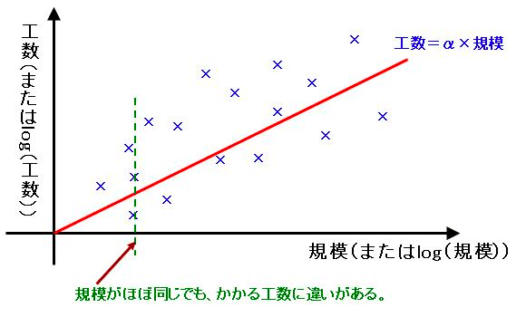
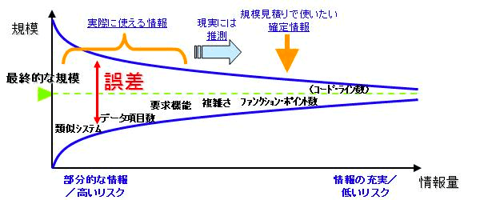
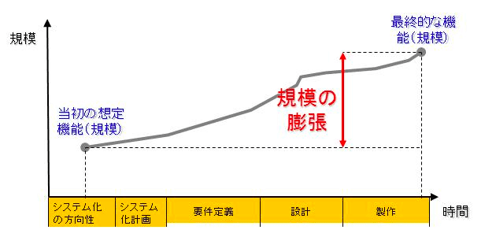
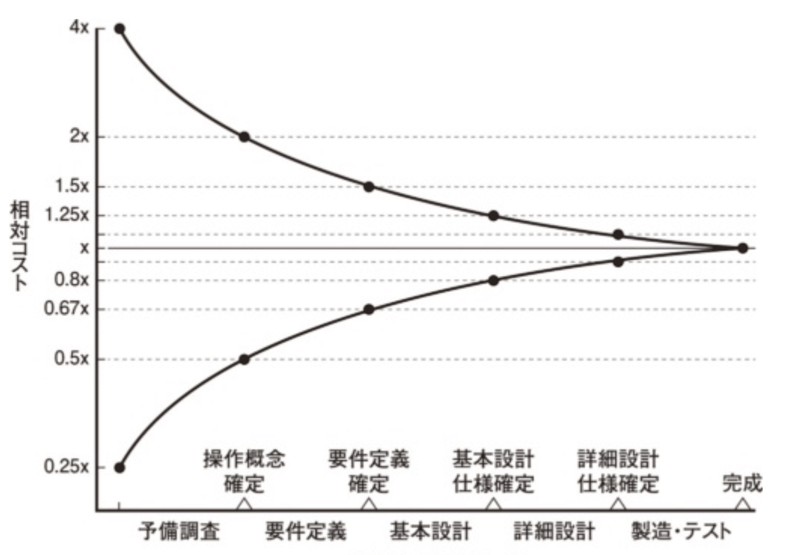
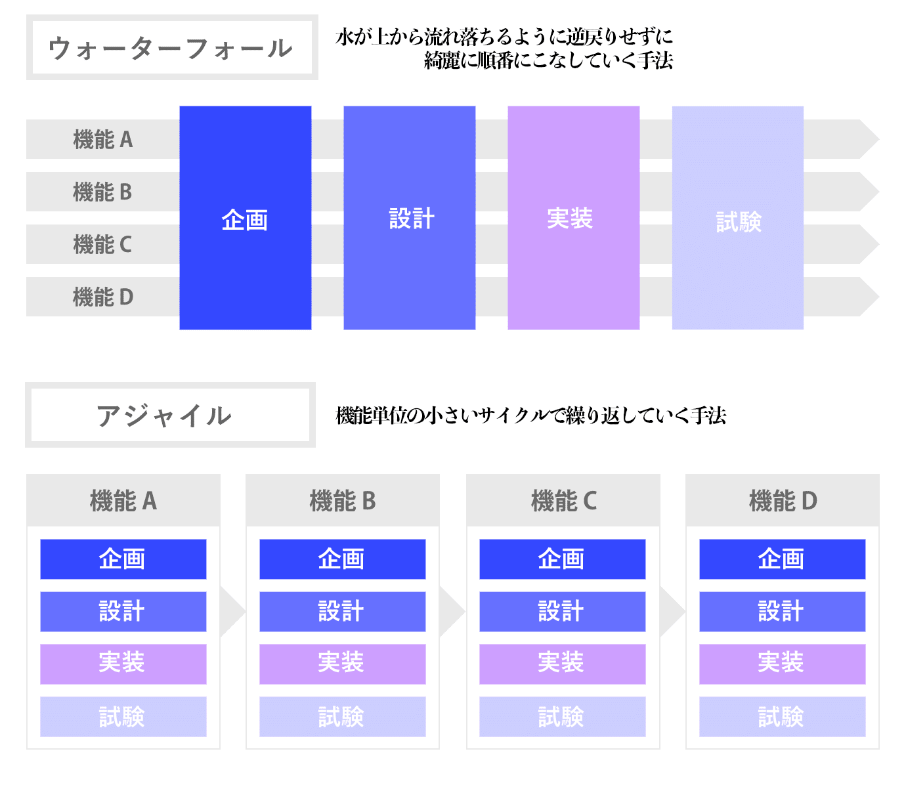

# ソフトウェア開発の見積もりの仕方- 受託・発注・SaaSのシステム開発をしてきたエンジニアの考え -

> 出典: https://note.com/mine_unilabo/n/n0d3833a6044b  
> 公開状態: publish  
> 更新: Thu, 20 Jan 2022 12:29:47 +0900  
> 区分: 公式ブログ

ソフトウェア開発（システム開発）に関わるエンジニアは、確実に開発の見積もりの依頼や相談をされます。

この「見積もり」にはいくつかの考え方があると思います。この考え方や、算出方法など、SIerでシステム開発の受託、大手ベンチャーでシステム開発の発注、SaaSシステムの社内開発をやってきたエンジニアが、自分の考えをまとめてみました。

## 自己紹介

まず、自己紹介をさせてください。
五反田にあるベンチャー企業のユニラボで[アイミツCLOUD](https://imitsu-cloud.jp/)というSaaS型のwebサービスの開発でスクラムマスター（SM）をやっています、みね＠ユニラボ（[@mine\_take](https://twitter.com/mine_take)）です。

これまでにSIer、メアベンチャー、スタートアップなどで一貫してエンジニアをやってきました。B2B、B2B2C、B2C、オウンドメディアなどwebサービスを作って運営をしてました。

スタートアップでの立ち上げでは、色々と泥臭く職種問わず必要なことを限られたメンバーでやっていました。

ソフトウェア開発に色々と関わってきた中で、私が見積るための手法や、考え方をまとめました。

## ソフトウェア開発における見積もり手法

ソフトウェア開発における見積もり手法の代表的な3つを紹介します。

### 1) トップダウン（類推見積もり）

過去の類似プロジェクトの実績を基礎に見積る方法です。

＜メリット＞
・事例を元に行うので、**スピーディな見積もり**が可能です。
・具体的な事例が参考にできるので、**見積もりの正確性**が高まります。

＜デメリット＞
・類似する事例がなければ見積もりがおこなえません。

システムの要件が既に決まっていて、似たような要件の場合、トップダウン（類推見積もり）は有効な手段です。

### 2) ボトムアップ見積もり（工数積上げ）

システムの構成・機能を先に洗い出した上で、見積る方法です。

＜メリット＞
・すべての項目を参考にするため**想定外のコストが発生しづらい**です。
・精度の高い見積もりが可能です。

＜デメリット＞
・それぞれの工数にフォーカスするため時間がかかります。
・大規模なプロジェクトなど、工数が膨大な場合には正確な把握が難しくなります。

ボトムアップ見積もりは、プロジェクトの全体像が見えている場合に利用しやすい見積もり方法です。可能な限り正確な見積もりを出してリスクを避けたい場合に使われます。

### 3) 係数モデル見積もり（パラメトリック見積もり）

工数などを目的変数として、説明変数に規模や要因などを設定し、数学的な関数に基づいてコストを算出する方法です。
ソフトウェア開発の工数や要件などを点数化し、数学的なアプローチによって見積もります。

パラメトリック法のベースとなる考え方

> 画像引用：IPA [エンタプライズ系事業/見積もり手法](https://www.ipa.go.jp/sec/softwareengineering/std/ent01-c.html)

＜メリット＞
・個人の知識や、経験に影響されずに**客観的な見積もり**の作成ができます。
・数値による論理的な見積もりができるので、**ばらつき（曖昧さ）**がなくなります。

＜デメリット＞
・見積もりに必要なデータやサンプルがないと精度が低下する傾向があります。
・ユーザビリティやデザイン性など数値化できないものの見積もりが難しくなります。

係数モデル見積もり（パラメトリック見積もり）は、新規事業に関係するデータやサンプルが充実しているときほど使いやすい見積もり方法です。

### 4) それ以外の手法

ソフトウェアの規模を表す多くのメトリクスが提案されていますが、ある程度普及していることが 必要です。 **SLOC（Source Lines Of Code）法**、**FP（Function Point）法**などがあります。SLOC法やFP法は、ソフトウエアの規模を測定して、工数や工期などを逆算することで、見積もりをおこなう工学的な手法です。

## ソフトウェア開発における見積もりの課題

ソフトウェア開発における見積もりの課題の多くは「想定外の費用がかかった」ということです。この原因は、曖昧さを残したままプロジェクトが進行することに大きな要因があります。

この課題の要因をいくつか確認します。

### ・部分的な情報からの推測する

詳細が決まっていない状況で、見積もりを依頼されるケースも多く、部分的な情報から推測する部分があるので、誤差の発生は避けられません。この推測する部分が多ければ誤差が大きくなるリスクが上がります。

部分的な情報からの見積もりの誤差

> 画像引用：IPA [エンタプライズ系事業/見積もり手法](https://www.ipa.go.jp/sec/softwareengineering/std/ent01-c.html)

### ・決めた仕様が変わっていく（膨張していく）

開発当初の想定機能は、工程が進むにしたがって膨張することを想定しておく必要があります。
例えば、 見えていなかった要件が見えてくる場合など、追加の機能が必要になります。

工程が進むにしたがって規模の膨張

> 画像引用：IPA [エンタプライズ系事業/見積もり手法](https://www.ipa.go.jp/sec/softwareengineering/std/ent01-c.html)

### 見積もり精度は後工程ほど正確になる

プロジェクトの初期段階で行う見積もりは精度的にかなりのブレがあります。 **要件定義確定時の見積もりには 60%から160%ほどの誤差が生じる**と言われています。

工数とマイルストーンの誤差

要件が一部未確定のまま工数を算出する場合や、追加作業の要請や要件の変更による工数の再見積もりが必要になることを、見積もりを作成した際に共有の認識とする必要があります。

## 工数の見積もりをお願い（依頼）されるケース

見積もりを依頼されるケースを考えてみます。
依頼者が、どの様な見積もりを求めているかにより、必要な内容が変わってくるためです。

### ・開発の規模を知りたいケース

予算作成のタイミングなどで、規模感を知りたい場合に、粒度の大きな曖昧な要件で見積もりを求まられるケースがあります。

この場合は、「**トップダウン（類推見積もり）**」を用いて、過去の似た案件の内容や、過去の案件と異なっている部分を考慮し、リスクやバッファーを上乗せした工数で規模感がわかる見積もりすることが多いです。

### ・実際に開発を想定したスケジュールを知りたいケース

実際の開発スケジュールを作成するために、見積もりをおこなう場合は、チームのコンディションや過去から現在の実績を加味して見積もります。

具体的な開発リソースがわかっているので、開発するメンバーの経験や能力、稼働工数を考慮して見積もりします。

実際に作成する見積もりには、規模がわかる工数と、実際の作業（予定）工数と、対応スケジュールを用意すると調整がしやすいです。

・規模がわかる工数：標準的なスキルのエンジニアが1人で作業をした場合の工数（相対見積もりのため、規模感を把握するため）
・実際の作業工数：実際に作業をするエンジニアを想定し、チームで取り掛かった場合の工数（おおよその作業期間）
・対応スケジュール：同時に4人で作業をすれば 、スケジュールが1/4になる訳ではないので、作業を分散できる部分と、分散ができない部分を考慮したスケジュール（現在の着手している案件の状態により、着手が可能な日がかわることも考慮するケースもある）

### 社外の開発リソースと比較したいケース

社内リソースが足りない場合や、新規開発の案件などでは、事前に社内で開発を行った場合の工数を知っておくことで、社外に開発を依頼した場合と比較することができます。

この場合は、社内の見積もりと、社外の見積もりで項目が異なる場合があり、気をつける必要があります。

具体的には、社内では「ディレクション費用」「要件定義費用」「導入費用」は、ソフトウェア開発とは別で管理していることも多いので、項目として抜けがちですが、社外と比較する場合には、その分も見積もりに含めるべきです。

また、「システム設計費用」「導入支援費用」は社内では発生しないケースも多く、項目として差分が出やすいです。

社内という特性を活かすと、その分の作業工数が削減できているといえますが、比較すると考えた場合は項目をあわせた見積もりの方が比較をしやすいことが多いです。

## アジャイル開発とウォーターフォール開発の違い

開発手法が違えば、見積もりに対する考え方も変わってきます。アジャイル開発をウォーターフォールと同じような考え方で、見積もるのは避ける必要があります。

この違いについて、説明します。

### アジャイル開発とは

アジャイル開発とは、**企画（要件定義）、設計、実装（コーディング）、試験（テスト）を短い期間で繰り返していく手法**になります。

**機能単位の小さいサイクルで繰り返すのが最大の特徴**で、優先度の高い要件から順に開発を進めていき、開発した各機能の集合体として1つの大きなシステムを形成します。「プロジェクトに変化はつきもの」という前提で進められるので**仕様変更に強く、プロダクトの価値を最大化することに重点を置いた開発手法**です。

### ウォーターフォール開発とは

ウォーターフォール開発とは、**企画（要件定義）、設計、実装（コーディング）、試験（テスト）**を、水が上から流れ落ちるように逆戻りせずに綺麗に順番にこなしていく手法です。

古くから使われている開発手法で、 品質を重視するケースや人員を大量に確保しなければいけないケースで活躍し、テストを重ねて行うため、手戻りが発生した場合はその分手間や工数が余分にかかってしまう点が特徴です。

図ウォーターフォールとアジャイルの違い

### アジャイル開発とウォーターフォール開発の開発工程の違い

『図ウォーターフォールとアジャイルの違い』の通り、ウォーターフォールは基本的に前の工程に戻る事が出来ないので、まず綿密な計画を立てます。

それに対してアジャイルは定期的に要件を話し合い、優先度の高い要件から開発します。小さなプロジェクトを何度も繰り返す手法であることから、アウトライン的な計画になります。

ウォーターフォールに比べて、アジャイルは見積もりが軽視されがちですが、大まかなスケジュール感の把握は必要です。

## アジャイル開発の見積もりとは

ここでアジャイル開発のスクラムの話を差し込みます。

スクラムというフレームワークでは、見積もりは大きな時間がかかっている部分であり大事なアプローチです。必要なコストを見積もるための単位として、ストーリーポイントを使います。

ストーリーポイントとは課題の大きさを表す数値で、これらは時間を表している訳ではなく、単純に課題の大きさを表している数値で、メンバーのスキルや経験の違いによる見積もりの差異をなくすために用いられます。

### 時間見積もりではない理由

ストーリーポイントは、時間見積もりと比較されることが多いです。
なぜ、時間見積もりをおこなわないのか、その理由を下記の通りです。

- 時間見積もりは人によって大きな差が出てしまう
- 時間見積もりは属人化を作る原因となる
- 正確な時間見積もりは不可能である

### ストーリーポイントによる相対見積もりを使う理由

ストーリーポイントによる見積もりには下記の様な特徴があります。

- 基準となるユーザーストーリーのストーリーポイントに対する相対見積もりであること
- チーム全員でズレが生じなくなるまで繰り返し議論すること
- 見積もりをしたストーリーポイントは個人の技量ではなく、ベロシティというチームの開発速度に準じてスケジューリングされること

上記の理由から、時間見積もりのような差異は発生しにくく、また、チーム内での認識のズレも起こりにくくなります。

### 「相対見積もり」の壁

アジャイル開発のスクラムを導入したばかりの頃は、「相対見積もり」や「ストーリーポイント」の考えになれずに、ウォーターフォールの様な時間見積もりの考えになってしまい、何度もやり直しをしました。
工数や期間での見積もりに慣れていると、理解も実践も難しく感じられました。

**「相対見積もり」の考え方を馴染ませる**

プロダクトバックログの内容をみた際に、開発が必要な具体的な作業内容とそれにかかる時間をセットで考えてしまう思考が染み付いてしまっているのですが、それは相対見積もりではなく、自分が作業をした場合の作業時間の見積もりになってしまっています。

相対的に見積もるには、過去に取り組んだ仕事を基準とし、その仕事との比較で考える必要があり、見積もりの度に**「基準としているストーリーと比べての同じくらい？倍くらい？半分くらい？」**という考えを持つ必要があります。

**ストーリーポイントは何を見積もるのか**

ストーリーポイントは「規模」を見積もります。ストーリーポイントを使う理由は、作業量の見積もりと期間の見積もりを別々に考えるとわかりやすくなるからです。規模＝作業量というイメージでストーリーポイントを見積もります。

## まとめ

ソフトウェア開発における見積もりについて、色々と書きました。
代表的な手法の紹介もしていますが、開発手法に寄っても考え方が異なってきますし、見積もりを欲しいケースによっても異なってきます。

正確な見積もりをすることは良いと思いますが、それがすべてではなく、どの様なケースで求められているのか、どの様な開発手法が最適なのか。それにより、考慮する項目も異なるので、依頼者とのコミュニケーションや、見積もりの前提条件の共有認識を持つことがとても大切だと感じています。
