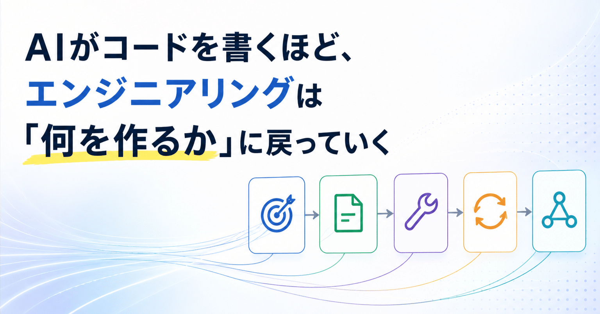
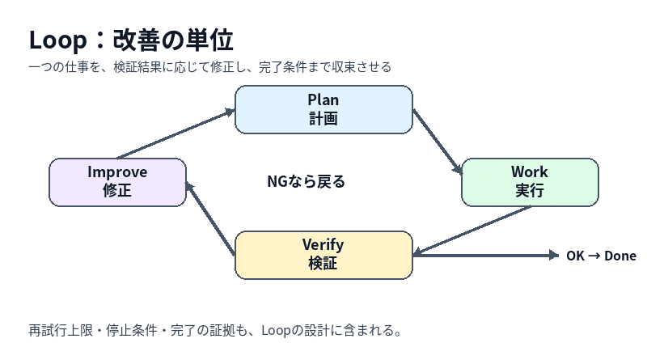

# AIがコードを書くほど、エンジニアリングは「何を作るか」に戻っていく

> 出典: https://note.com/mine_unilabo/n/n103182c44979  
> 公開状態: publish  
> 更新: Fri, 31 Jul 2026 16:48:06 +0900



最近、AIにコードを書かせる時間より、その前後を考える時間の方が長くなってきました。

何を作るのか。なぜ今なのか。どの結果をもって完了とするのか。失敗したときに、どこで止めるのか。今回の判断を、次の仕事へどう残すのか。

モデルやツールが弱いから、こうしたことを考えているわけではありません。むしろ逆です。数十分で調査や実装が進み、PRまで作れるようになると、曖昧な依頼も同じ速さで変更として固定されます。

作る速度が上がった分だけ、方向を間違えたときの損失も早く積み上がります。

AIによってエンジニアリングが不要になるのではなく、コードの奥に隠れていた判断と責任が、以前より見えやすくなった。今はそう考えています。

この記事では、AIコーディングで実装は速くなった一方、品質や判断の統制に難しさを感じているエンジニアに向けて、「何を作るか」「何を知った状態で任せるか」「どう確かめるか」「どう学びを残すか」という観点から整理します。最後に、次の依頼から使える6つの確認質問へまとめます。

先に結論を書くと、Prompt、Context、Harness、Loop、Graphは、流行の順番に古い概念を置き換えるものではありません。

- Promptは、一回の指示を設計する
- Contextは、判断時に持たせる情報を設計する
- Harnessは、道具・権限・作業環境を設計する
- Loopは、実行・検証・修正・停止を設計する
- Graphは、複数の工程・役割・分岐を設計する

これらは競合する概念ではなく、AIを実務で働かせるために、異なる部分を受け持つ設計対象です。

全体像は、次のように捉えると整理しやすくなります。

```
Problem
  ↓
Context / Contract
  ↓
Harness
  ↓
Loop
  ↓
Workflow / Graph
  ↓
Verification / Eval
  ↓
Learning
```

---

## 実装が速くなると、問題選びの精度が問われる

これまで、ソフトウェア開発では実装できる人と時間が希少でした。

作りたいものがあっても、エンジニアが足りない。優先順位を上げられない。検証用の小さな実装にも一定のコストがかかる。実装能力そのものが、事業やプロダクトの制約になっていました。

AIによって、この制約は弱まり始めています。少なくとも、調査、試作、定型的な変更、テストのたたき台を作る仕事では、以前より少ない時間で前へ進めます。

ただし、「ソフトウェアを作る仕事」全体が簡単になったわけではありません。

既存システムとの統合、データ設計、セキュリティ、運用、障害対応、法務や規制、長期的な保守は残ります。コード生成の単価が下がっても、運用責任の単価まで下がるわけではありません。

変わるのは、ボトルネックの位置です。

実装に着手できる数が増えるほど、次の問いが重くなります。

- 誰の、どの問題を解くのか
- その問題は、実際に起きているのか
- 今解く理由はあるのか
- 既存の方法では、なぜ足りないのか
- 何が変われば、解決したと言えるのか

AI時代に希少になるのは、アイデアの数だけではありません。現場から問題を見つけ、証拠を集め、解く価値があると判断し、その判断を更新し続ける力です。

間違ったものを作るコストがゼロになることはありません。AIは、間違ったものを速く作ることもできます。

---

## 課題には執着し、解決策には執着しない

「解きたい課題への熱意が重要になる」という考えには共感します。

一方で、熱意だけでは危険です。AIによって実装速度が上がると、最初に思いついた解決策へ固執したまま、開発だけが進むこともあります。

必要なのは、課題への執着と、解決策への非執着です。

困っている利用者を理解し続ける。問題が起きる状況を観察する。仮説が外れたら設計を変える。問題そのものが弱ければ、作ることをやめる。

私は、この上流の仕事を便宜上「Problem Engineering」と捉えています。ただし、新しい専門用語を増やしたいわけではありません。計画や実装の前に、問題を扱うための基本的な問いを省略しない、という意味です。

たとえば、次の情報がない状態で詳細な実装計画を作っても、その精度には限界があります。

- 影響を受けている人
- 問題が起きる場面と頻度
- 現在の回避策
- 問題の深刻さを示す事実
- 期待する変化
- 仮説を棄却する条件
- 継続しないと判断する条件

開発前にすべてを確定する必要はありません。不確実な部分を明示し、何を調べれば次の判断ができるかを決めることが重要です。

---

## AIの完了報告は、証拠ではない

AIコーディングを使い始めた頃は、指示を詳しくすれば結果が安定すると考えていました。

目的を書く。関連ファイルを指定する。実装方針と禁止事項を伝える。テストまで実行するよう頼む。これは今も必要です。

しかし、任せる範囲が広がると、プロンプトだけでは解決できない問題が増えます。

小さな変更のつもりが周辺まで書き換わる。テストは通っているが要求を取り違えている。前のセッションで失敗した方法を繰り返す。実装は終わっているが、何を根拠に完了としたのか分からない。

問題は、AIが間違えることだけではありません。間違えた状態でも作業を続けられることです。

そこで、報告と証拠を分けて考えるようになりました。

「実装しました」「テストしました」「問題ありません」は報告です。

テスト結果、差分、ビルドログ、実行画面、E2Eテスト、レビュー結果、受入条件との対応表は証拠です。

人間が見るべきなのは、AIの自信ではなく、観測できる結果です。

この経験から、モデルの能力だけでなく、事実へ到達できる道具と、途中状態を壊さない仕組みが必要だと考えるようになりました。

---

## PlanGateは、Planの前にProblemを見る必要がある

自分が作っているPlanGateも、最初は単純な仕組みでした。

AIにいきなりコードを書かせず、まず計画を作らせる。その計画を人間が確認し、承認してから実装へ進める。出発点は、実装前に一度止めることでした。

使い続ける中で、計画を承認するだけでは防げない失敗も経験しました。

Zennの記事を公開ブランチへ同期したとき、依頼したのは一つの記事の反映でした。しかし、AIはmainとの差分をブランチ単位で解消しようとし、対象記事とは無関係な4ファイルまで衝突対象に含めました。

ここで問題だったのは、AIが衝突を解消できるかどうかではありません。「変更してよい範囲」と「範囲外の差分を検知したら止まる条件」を、計画の中で固定していなかったことです。そのまま機械的に解消すれば、別の記事の公開状態を古い内容へ戻す危険がありました。

それ以来、同期対象を単一ファイルに限定し、対象外の差分が一つでも見つかった時点で停止するようにしました。完了条件も「マージできたこと」ではなく、「対象ファイルだけが更新され、対象外の差分がないこと」へ変えています。

この経験から分かったのは、良いPlanには実行手順だけでなく、変更境界、観測方法、停止条件、完了の証拠まで必要だということです。

こうした失敗を減らすには、依頼の整理、作業分解、実装、独立した検証、通過判定、学習記録まで扱う必要があります。PlanGateでは、それぞれをTriage、Conductor、Worker、Verifier、Gate、Trust Ledger（判断と結果を次の作業へ残す記録）という役割に対応させています。

ただ、実装能力が上がるほど、Planの前を強くする必要があります。

概念としては、次の流れです。

```
Problem
  ↓
Plan
  ↓
Work
  ↓
Verify
  ↓
Gate
  ↓
Learn
```

PlanGateに追加したいのは、独立した儀式ではなく、Planを承認する前のProblem Gateです。

- 誰が困っているか
- 問題を示す証拠があるか
- 現在の回避策は何か
- 期待する変化を測れるか
- 今回やらないことを決めたか
- どの結果なら仮説を棄却するか

この確認をTriageに組み込み、情報が足りなければ実装計画ではなく調査計画を作る。問題が弱ければ、詳しいPlanを作る前に止める。

PlanGateを作りながら、自分が設計していたのはコード生成の手順ではなく、AIを含む仕事の進み方だったと気づきました。

Trust Ledgerに残したいのも、成功と失敗の件数だけではありません。

どの条件で失敗したのか。何を変えたら通ったのか。人間はどこで判断を引き取ったのか。そもそも、その作業は価値につながったのか。

この記録があって初めて、次の仕事でモデル、進め方、ゲート、問題の選び方を変えられます。

---

## 設計対象を6つに分けると、流行語の関係が見える

PlanGateでの失敗と改善を振り返ると、設計している対象はコードだけではありませんでした。

AI開発の用語は増え続けていますが、それぞれを競合する手法として覚える必要はありません。私は現在、設計対象を次の6つに分けて考えています。

設計対象 中心となる問い 関連する概念 目的 何を、なぜ作るか Problem、Intent、Spec 情報と契約 何を知った状態で、何を守らせるか Prompt、Context、Contract 実行環境 どこで、何を使わせるか Tool、Harness、Runtime、Safety 進行制御 どう進め、どこへ戻し、どこで止めるか Loop、Workflow、Graph、Orchestration 品質保証 何を証拠として合格とするか Verification、Eval、Observability 学習 今回の結果を次へどう反映するか Memory、Trust、Learning、Meta-control

この分類は成熟度の階段ではありません。同じ仕事を異なる方向から見るための観点です。

### 1. Problem / Intent / Spec（何を、なぜ作るか）

誰の何を変えたいのか。なぜ今取り組むのか。何を作らないのか。何が完成したら終わりなのか。成功と撤退をどう判断するのか。

ここが曖昧なままでは、後続の設計が精密でも価値にはつながりません。AIは、曖昧な目的を補うことはできても、その判断に事業上の責任を持つことはできません。

### 2. Prompt / Contract / Context（何を依頼し、何を知った状態にするか）

Promptは今回の作業指示です。Contextは、その指示を判断するためにAIへ渡される情報全体です。Contractは、目的、制約、非対象、受入条件、出力形式を含む作業上の約束です。

たとえば「認証機能を修正して」がPromptだとしても、既存の認証設計、障害の再現条件、変更禁止範囲、受入条件がContextやContractとして渡されていなければ、AIはもっともらしい別問題を解く可能性があります。

長いプロンプトを書くことと、必要なコンテキストを設計することは同じではありません。重要なのは量ではなく、関連性、鮮度、優先順位です。

### 3. Tool / Harness / Runtime / Safety（どこで、何を使わせるか）

AIが使えるツール、ファイルや外部サービスへの権限、Sandbox、Memory、Session、承認、Traceを設計します。

AGENTS.mdやCLAUDE.mdへ「対象外のファイルを変更しない」と書くことは重要です。しかし、それは指示であり、強制ではありません。書き込み可能な範囲を制限する、対象外の差分をCIで検知する、公開や削除には承認を要求する、といった仕組みがHarnessです。

良い指示があっても、必要な事実へアクセスできなければ検証できません。逆に、権限が広すぎれば、誤った判断の影響も大きくなります。

### 4. Loop / Workflow / Graph（どう進め、どこで止めるか）

Loopは、計画、実行、観測、検証、修正を繰り返す仕組みです。Workflowは、作業をどの工程へ分けるかを定めます。Graphは、工程や役割をノードとして、順番、分岐、並列、差し戻し経路を接続したものです。

この記事で扱うGraphは、主にAIや工程の**実行グラフ**です。エンティティ同士の関係を保存するナレッジグラフとは、同じ「グラフ」という言葉でも設計対象が異なります。

LoopとGraphも対立しません。**Loopは改善の単位であり、Graphは仕事全体の流れです。Graphの中には複数のLoopを含められます。**

Loopを図にすると、次のようになります。



一つの仕事を、品質条件を満たすまで修正する循環です。

Graphは、複数の工程、役割、分岐、差し戻しを含む流れとして表します。

https://raw.githubusercontent.com/s977043/my-blog/main/articles\_note/assets/ai-engineering-graph.png

このGraphの中にも、Implement → Test → Review → ImplementというLoopがあります。

複数の調査を並列化し、結果に応じて異なる工程へ進み、重要操作だけ人間へ承認を求める段階になると、単純なLoopよりGraphとして考える方が管理しやすくなります。

再試行の上限、同じ失敗を検知する方法、完了条件、人間へ戻す条件もここに含まれます。ループを回すことより、どの状態で止めるかの方が先です。

### 5. Verification / Eval / Observability（何を証拠として合格とするか）

Verificationは、今回の変更が要求を満たしたかを確かめることです。Evalは、複数回の実行を共通基準で評価し、仕組みとしての品質を測ることです。Observabilityは、モデル呼び出し、ツール実行、判断、差し戻しなど、途中で何が起きたかを追える状態にすることです。

テストが通ったという一つの信号だけでは、要求を取り違えていないことや、対象外へ影響していないことまでは証明できません。受入条件、差分範囲、テスト、実行結果、レビューを組み合わせて判定します。

Evalが「良かったか」を測る仕組みなら、Observabilityは「何が起きたか」を説明できるようにする仕組みです。

### 6. Memory / Trust / Learning / Meta-control（何を記録し、次に変えるか）

どのモデルが、どの条件で、何に成功または失敗したのか。人間はどこで介入したのか。次はモデル、手順、ツール、ゲートのどれを変えるのかを記録します。

記録すべきなのは会話全文ではなく、次の判断を変える情報です。失敗条件、採用した根拠、未解決の不確実性、人間が介入した理由、再利用できる手順を残します。

高性能なモデルへ切り替えること、追加調査へ戻ること、作業を中止することも制御の一部です。

ここまで整理すると、Promptの時代が終わってContextへ移り、次にHarness、Loop、Graphへ進むわけではないことが分かります。一回の指示、判断材料、実行環境、反復、工程間の接続は、同じ仕事の中で同時に必要になります。

---

## 複雑なエージェントより、制御できる仕事の流れを作る

AIエージェントの話では、複数エージェントや自律実行へ関心が集まりやすくなります。

しかし、複雑な構成がそのまま良い結果につながるわけではありません。

AnthropicやOpenAIの実装ガイドでも、単純な構成から始めること、実行ループの終了条件と人間への移譲条件を決めることが重視されています。

大事なのは、自律性の高さではなく、仕事の性質に合っていることです。

- 手順が決まっている判断は、コードやルールで固定する
- 曖昧さが残る判断は、AIに候補と根拠を出させる
- 失敗を機械的に検知できる場所には、テストやセンサーを置く
- 高リスクで不可逆な操作には、承認ゲートを置く
- 同じ失敗が続く場合は、再試行ではなく人間へ戻す

AIへ自由を与える前に、どこまで自由にしてよいかを決めます。

最初から複数エージェントのGraphを作る必要はありません。一つの担当と一つの検証Loopから始め、役割を分けることで検証の独立性や待ち時間が改善すると確認できた場所だけをGraphへ拡張します。

---

## 人間は、ループに張り付くのではなくループを統治する

AIの自律性を上げる話をすると、「人間を外すか、残すか」という二択になりがちです。

実際には、人間の関わり方を変える話だと考えています。

AIへ任せやすいのは、課題候補の収集、情報整理、仮説の列挙、実装、テスト、差分確認、結果の記録です。

現時点で、人間が責任を引き受けるべきなのは、目的、価値判断、リスク許容度、優先順位、不可逆な操作の承認、継続や撤退の判断です。これらもAIによる支援は受けられますが、委譲範囲と責任主体を曖昧にはできません。

すべての手順を人間が承認すると、AIの速度を生かせません。反対に、目的も境界も渡さずに自律実行させると、速く進んでいるように見えても統制できません。

目指しているのは、Human in the LoopからHuman on the Loopへの移行です。

人間が毎回の作業に張り付くのではなく、ループの目的、境界、評価基準を設計し、例外や高リスク時に介入する。そのためには、途中経過と判断理由が観測できることが前提になります。

---

## 次にAIへ依頼する前の6問

大きな仕組みを最初から作る必要はありません。

次にAIへ作業を頼むとき、プロンプトを書く前に次の6つを確認するだけでも変わります。

1. 誰の、どの問題を解こうとしているか
2. その問題があると言える証拠は何か
3. 何が変われば成功か。今回は何をしないか
4. AIが判断するために、どの情報と道具が必要か
5. 完了を何で検証し、どの状態で止めるか
6. 次の判断に使うため、何を記録するか

この6問は、順に目的、根拠、仕様、コンテキストとハーネス、ループと評価、学習を確認しています。

AIの性能が上がるほど、これらの問いは不要になるのではなく、先に答える価値が上がります。

---

## 用語を覚えることが目的ではない

この記事で紹介した概念は、新しい専門用語を覚えること自体が目的ではありません。

重要なのは、それぞれが異なる設計対象を表していることです。

- Problemは、何を解くか
- Contextは、何を渡すか
- Harnessは、何を使わせるか
- Loopは、どう改善するか
- Graphは、仕事をどう流すか
- VerificationとEvalは、何を証拠として合格とするか
- Learningは、次の判断をどう変えるか

すべてを一度に導入する必要はありません。今困っている設計対象を見つけ、そこから改善すれば十分です。

---

## AI駆動開発で速くしたいのは、コード生成だけではない

AI時代の競争力を、生成したコード量や短縮できた実装時間だけで測ると、早い段階で限界が来ます。

本当に短くしたいのは、問題を見つけ、仮説を立て、小さく作り、証拠で判断し、学びを次へ残すまでの時間です。

コード生成は、その流れの一部です。

AIがコードを書くほど、エンジニアリングの対象はコードの外へ広がります。同時に、制約の中で価値を成立させるという、本来の仕事へ戻っていきます。

作る力が安くなるほど、何を作るか、なぜ作るか、何をもって正しいとするかを決める力の価値は上がります。

AIの成果は、モデル性能だけで決まりません。目的と仕様、コンテキスト、実行環境、検証と停止条件、安全性が組み合わさって初めて、実務で使える結果になります。

高性能なモデルでも、目的が曖昧なら間違ったものを速く作ります。長いプロンプトでも、必要な情報へ到達できなければ正しく判断できません。自律的なエージェントでも、検証と停止条件がなければ失敗を繰り返します。

重要なのは、Promptを捨てることではありません。Promptを、Context、Harness、Loop、Graphの中へ正しく組み込むことです。

---

本記事のテーマである「何を作るか」をさらに掘り下げ、Andrew Ng氏のSkills Map（Shaping the build）を踏まえて「Time to Learning」の観点から整理した続編記事を公開しました。あわせてぜひご覧ください。

（ここに後続記事のURLを貼ってブログカード/埋め込みリンクにする） <https://note.com/mine_unilabo/n/n5070e13232ce>

## 参考にした資料

- [Building Effective AI Agents - Anthropic](https://www.anthropic.com/engineering/building-effective-agents)
- [Effective harnesses for long-running agents - Anthropic](https://www.anthropic.com/engineering/effective-harnesses-for-long-running-agents)
- [A practical guide to building agents - OpenAI](https://cdn.openai.com/business-guides-and-resources/a-practical-guide-to-building-agents.pdf)
- [AI-DLC Workflows 2.0 とは何か、そしてどう実装されているか - AWS Japan](https://zenn.dev/aws_japan/articles/aidlc-workflows-v2-harness-engineering)

## 関連記事

- [AIにコードを書かせる前に、人間が承認する場所を作る](https://note.com/mine_unilabo/n/n02992266d622)
- [OpenAI Symphonyを見て、AI時代の開発組織は「Agent Loopをどこで止めるか」で差がつくと思った](https://note.com/mine_unilabo/n/n623877eceb88)
