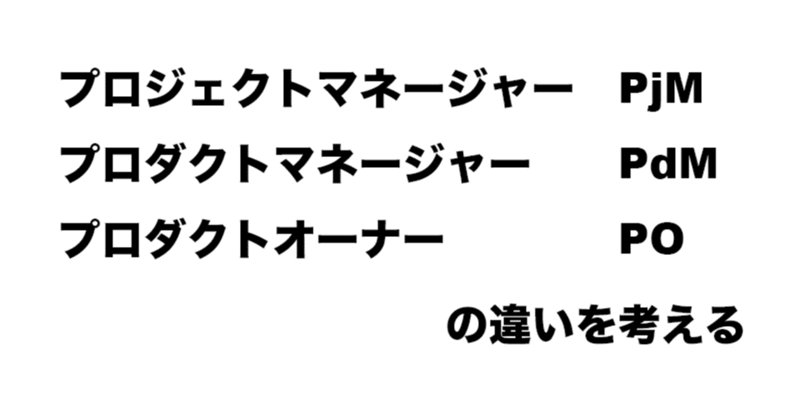
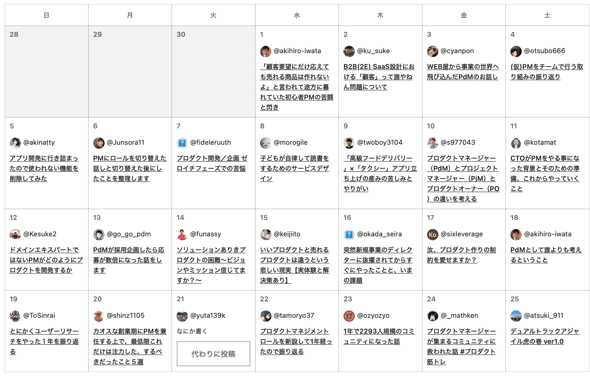
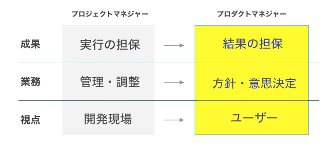
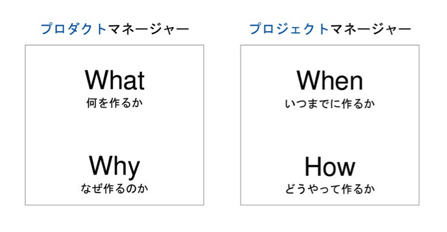

# プロジェクトマネージャー（PjM）とプロダクトマネージャー（PdM）、プロダクトオーナー（PO）の違いとは

> 出典: https://note.com/mine_unilabo/n/n23ec87da4cdb  
> 公開状態: publish  
> 更新: Thu, 09 Dec 2021 08:15:14 +0900

この記事は、プロダクト筋トレコミュニティの[アドベントカレンダー](https://qiita.com/advent-calendar/2021/product-kintore-challenge)向けの記事です。

<null>

https://qiita.com/advent-calendar/2021/product-kintore-challenge

ユニラボで[アイミツCLOUD](https://imitsu-cloud.jp/)というSaaSのプロダクト開発でスクラムマスターをやっています、みね＠ユニラボ（[@mine\_take](https://twitter.com/mine_take)）です。
※本記事は個人の活動による記事であり、会社の公式見解とは異なる場合があります。

## はじめに

最近のIT業界、webサービスやアプリではプロダクトマネージャーやプロジェクトオーナーという新しい役割がありますが、今までのプロジェクトマネージャーとの役割の違いや、概念の違いについて話したいと思います。

今まではプロジェクトマネージャー=PMと略す事が多かったのですが、最近ではプロダクトマネージャーという役割に注目されることも多くなってきたので、PdM=プロダクトマネージャー、PjM=プロジェクトマネージャーと意識的に区別する事も多くあります。実際に似た意味で使われることもありますが、役割はまったく違います。それぞれ実際にどのような役割を担っているのか考えてみました。

## 1. プロジェクトマネージャー（PjM）

プロジェクトマネージャーの役割は、思決定者、計画立案者、プロジェクトやチームのリーダー（取りまとめ役）であり、プロジェクトの責任者です。

プロジェクトを成功させる事が目標であり、そのためにプロジェクトをリードし、チームとプロジェクトを管理します。

プロジェクトマネージャーは、プロジェクトの成果物、プロジェクトの終了などのあらゆる面でプロジェクトの最終判断します。

プロジェクトマネージャーは、担当するプロジェクトに責任を持つため、プロジェクトを「いつまでに作るか（when）」「どうやって作るか（how）」を常に考え、チームを束ねることが特徴です。

## 2. プロダクトマネージャー（PdM）

一時的な期間が区切られているプロジェクトとは対照的に、プロダクトは長期的に運営していく事が考えられます。プロダクトマネジメントはプロダクトを中心に長期的な視点で行われます。

プロダクトマネージャーは、プロダクトライフサイクル（Product Life Cycle）の各段階を通して、プロダクトの成功に責任を負います。

具体的には、ビジョンの構築、戦略立案、プロダクトのビジネス、開発、UX（User Experience：ユーザー体験）のすべてのプロセスに携わり、ステークホルダーの承認を得たうえでプロダクトの意思決定に行います。

プロダクトマネージャーは、プロダクトに対して責任が伴うため、プロダクトの「何を作るか（what）」「なぜ作るのか（why）」から考えていくケースが多くあります。

プロダクトマネージャーは「プロダクトの立案」「プロダクトの生産」という役割があります。製品を開発する際に、プロダクトの価値や今後の課題を見つけ、立案や生産をしていることが特徴です。

プロダクトを成功に導くためにプロダクトマネージャーは多くの役割と広い責任範囲を持つことも多く、「ミニCEO」とよばれることがある。

実際にはプロダクトマネージャーとCEO の役割には大きな差はあるのですが、両者は、プロダクトの成功のために必要なすべてのことに責任を持ち、実行していくという所は似ている部分がある。

## 3. プロダクトオーナー（PO）

プロダクトオーナーという役割は、アジャイル開発と共に登場した役割です。多くの点でプロジェクトマネージャーと似ていますが、POはスクラムチーム（スクラムマスター、開発チーム）そして関係するステークホルダーと連携して仕事をします。

プロダクトオーナーは、タスク完了のためのストーリーを含むバックログを用意し、チームで議論しながら計画を進めていきます。

プロダクトオーナーは、開発チームおよびスクラムマスターと緊密に連携し、スクラムイベントを通じて進捗状況を確認します。スプリントの成果物（最終結果）に責任を持ち、開発チームはプロダクトオーナーに対して責任を負います。

## プロジェクトマネージャーとスクラムの関係

アジャイル開発の「スクラム」の考案者であるジェフ・サザーランド氏は、スクラムとプロジェクトマネージャーの関係について次のように述べています。

> スクラムにはプロジェクトマネージャーがいません。その代わり、チームには権限が与えられています。彼らは結果に責任を持ち、自分自身を管理できます。古典的なプロジェクトマネージャーによるチームの「ボス」は、スクラムでは必要ないのだ。

### プロジェクトマネージャーとプロジェクトオーナーの違い

プロジェクトマネージャーは何かを生産する場合、チームを作って開発作業をします。その際、チームの人員配置やスケジュールなど、実行に必要な細かいことを決めます。プロジェクトマネージャーは、プロダクトオーナーやプロダクトマネージャーから支持を受けてプロジェクトのミッションに応じて、実際に必要な人員の人数や役割、スケジュールを決めます。つまり、計画を遂行する責任つプロジェクトの責任者です。

PjMとPdMの違い図1

5W1Hでわかりやすく説明すると、主に以下のような定義をされます。

- **プロダクトマネージャー：何を作るか、なぜ作るかに責任を持つ**
- **プロジェクトマネージャー：いつまでに作るか、どう作るかに責任を待つ**

PdMとPjMの違い図2

### プロダクトマネージャーとプロダクトオーナーの違い

「プロダクトオーナー」は、アジャイル開発という開発手法において定義される役割なので、単純にプロジェクトマネージャーと比較することは難しいです。PdMとPOの両方が必要な組織の方が少ないと思います。

プロダクトオーナーは、プロダクトの戦略をもとに、プロダクトの開発を進めるための指揮をする役割です。プロダクトマネージャーが顧客や市場に寄り添ってニーズ把握し、戦略を考えます。その後、プロダクトオーナーがニーズや条件を満たす具体的なプロダクト開発について考えていきます。

プロダクトオーナーは、プロダクトの方向性や優先度を決めていきます。そして、開発チームが目的を達成できるように、導いていくのが仕事です。実際に指示を出すことは少なく、知識や経験を活かした計画立案や情報管理などをしています。

何を寄り添い、どの視点で「どんなプロダクトを作るべきか」というところまで領域が広がります。

- **プロダクトマネージャー：顧客や市場のニューズを視野に入れて、何をなぜすべきかを決める人**
- **プロダクトオーナー：ユーザーの代弁者して、そのプロダクトはどんな体験であるべきかを決める人**

## PdM、PjM、POの責任の違い

PdMとPjM、POはそれぞれ責任範囲が異なっているので、その違いをまとめます。

- PdM：商品やサービスといったプロダクトそのものに責任を持ち、開発するプロダクトを考案し、顧客や市場など外向けのベクトルが重視される。
- PjM：プロジェクトの責任者として、業務計画から進行管理、さらには実行までに責任を持ち、PdMと比較すると内向きのベクトルの仕事内容になることが多い。チームを束ねる役割も持つ。
- PO：下流工程を担当し、現場について責任を持ち、プロダクトにどのような機能を備えるべきか、何を実装するのかを管理します。

ここで話している内藤は業界がかなり限定的になってしまっているかもしれません。

## まとめ

私が過去に経験し開発プロジェクト、新規で立ち上げたプロダクトやアジャイル開発を行なった時の役割はこの様な違いがあったと、過去を振り返りまとめました。何かの参考になればと思っています。

アジャイル開発のスクラムをやっていると、プロダクトオーナーとスクラムマスターの役割の話が出たり、WEBメディアを運営していると、ディレクターやプロデューサーなど、プロダクトの運営をしていると、プロダクト”**マーケティング**”マネージャー(PMM)や新規事業責任者など、似たような役割で違う言葉で表現されることがあり、区別しづらい事も多くあります。

実際、スタートアップで働いていると、皆が足りない部分を補って成り立つ部分も多く、お互いに役割の領域を越えて助け合う事で、成立しているチームが多いと思います。

[**関連記事**]

<https://note.com/mine_unilabo/n/na6a620da56d5>

<https://note.com/mine_unilabo/n/nab0d71933f35>
