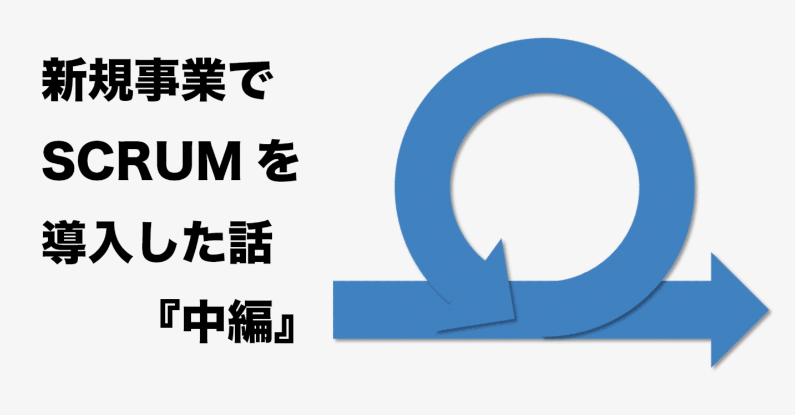

# プロダクト開発にScrumを導入した話 -導入前夜・準備したこと-

> 出典: https://note.com/mine_unilabo/n/n288c21a89778  
> 公開状態: publish  
> 更新: Tue, 14 Dec 2021 08:05:43 +0900

ユニラボで[アイミツCLOUD](https://imitsu-cloud.jp/)という新規事業のプロジェクトでエンジニアのマネージャーをやっています、みね＠ユニラボ（[@mine\_take](https://twitter.com/mine_take)）です。

前回スクラムの導入を決めた話を書きましたが、今回はその続編になります。

<https://note.com/embed/notes/nb068316a12ec>

スクラムの導入をしようと決めて、いきなり「明日からスクラムを始めます！」ということではなく、準備が必要になりますので、スクラムを始める前に準備することをまとめました。

## スクラムの導入前に必要なことまとめ

主に2軸です、スクラムの価値観をチーム内で共通すること、チーム外とのギャップを埋めるということを行いました。

### 1） スクラムを理解しチーム内で価値を共有する

エンジニアとしての経験の中で、スクラムに対する印象や考え方も個々に違うことはわかっていましたので、改めて「スクラムとは？」ということを説明し、最新の情報を共有することを行いました。

- スクラムの原則の理解
- スクラムの役割の理解
- スクラムのイベントの理解
- 自分たちのチームで「スクラムをやる意味」を考える
- スクラムの価値基準を共有する

### 2） チーム外へ開発のギャップの理解と合意を得る

新しくスクラムを導入することで、コミュニケーションの取り方や、開発の進め方が変わりますので、事前にその内容をチーム外（ステークホルダー）へ伝え、その考え方や変化を理解してもらいました。

- 事業責任者に、今までの開発手法とのギャップを理解してもらい、進め方の合意を得る
- スクラムチームは変化に柔軟に対応し、フィードバックの得た後に開発すること、優先順が変化することを理解してもらう
- ステークホルダーとの関わり方の変化・考え方の違いによるギャップを理解してもらう

## スプリント0に向けてやったこと

実際にスクラムを始める前（スプリント1の前）に、具体的に何をしたのか挙げていきます。

- アジャイルコーチの方からの「**スクラム概論**」の講義の実施（スクラムガイドの話を合わせて）
- チームの期待値を合わせるための「**ドラッカー風エクササイズ**」の**ワークショップを開催**

  1. 自分は何が得意なのか？
  2. 自分はどういうふうに仕事をするか？
  3. 自分が大切に思う価値は何か？
  4. チームメンバーは自分にどんな成果を期待していると思うか？
- 誰がどのロールを担うのかを**決定**
  プロダクトオーナー、スクラムマスターを誰がやるのか
  開発チームは誰なのか
- 開発チームに**デザイナーが参加**
  開発チームは**、**エンジニア6名、デザイナー1名というメンバー構成になりました。
- スプリントの期間を**1週間に決定**
  多くのフィードバックを得られること考え、1週間1スプリントと定めました。また、祝日が2日連続する場合はスプリントを2週間とすることも事前に決定しました。
- **スクラムイベントの日を決定！**
  木曜開始、水曜終了の1週間となりました。
  月金は祝日や有給と重なりやすいので、週の真ん中で終わるように調整しました。

  - Sprint Planning：木曜 14時〜
  - Sprint Review：水曜 14時半〜
  - ふり返り会　：水曜 17時〜
  - dailyScrum：毎日10時15分〜（15分）
  - リファインメント：毎日10時30分〜（30分）

今までも（スクラムではないですが）、プロダクト開発は行なっていたので、機能リリースのタイミングや、ステージング環境での確認フローは変更せず、スプリント0をやってみてふり返りをする様になりました。

機能リリース日を固定にし週1回とすることを当初想定していましたが、機能リリース日についてチーム内で話し合いをした際に、「開発が完了した機能は先にリリースした方が良いのではないか」という話がチームメンバーからあがりました。スクラムイベントとリリーススケジュールは本来関係のないものですし、機能をより早くリリースするという価値もあるので、レビューが完了した機能はスプリント中に機能リリースをすることに決定しました。

スクラムチームのルールはスクラムガイドに則りながら、固執し過ぎないようにチームで話し合いをしながら決めて行こうと考えた良い経験でした。

## やっておけばよかったこと

スプリントが実際に始まった後に、気がついたことなのですが、ここはスプリント0までにやっておくべきだったと思うことがいくつかあったので、挙げておきます。

- 新しくチームビルディングを行う前に、チーム内へ**タックマンモデル**の理解を促しておくべきでした。

  - チームのパフォーマンス向上の為のチームビルディングですが、タックマンモデルを事前にわかっていた方が良かったと思いました。
    特に最初の2つのフェーズである形成期・混乱期では、生産性が下がったり、見た目の活動量が落ちて見えてしまうことがあり、このフェーズの過ごし方がとても大切なので、事前にこの部分をキチンと意識できるとより良かったと感じています。
- スクラムイベント以外でスクラムの要素の認識合わせをしておくべきでした。（別の機会で記事にしてみたいと思います）

  - **プランニングポーカー**のやり方
  - **スプリントレビュー**の実施の方法（デモのやり方）
  - **ステークホルダー**は誰なのか
  - **プロダクトバックログ**の管理の方法
- プロダクトバックログを**3スプリント分**の準備をしておく

  - Readyなプロダクトバックログを事前に多く用意しておくことはとても大切です**。**3スプリント分の余裕があるから、スプリントの計画が行なえ、自分たちでコントロールが出来るということに後々気が付きます。
- 今ある課題を明確にして、プロダクトバックログに入れておく

  - スクラムを導入する前に管理していた情報や、漠然とした問題や課題は一度棚卸しをしてから、バックログの管理することで、不要なバックログや、曖昧な施策などが突然発生することを防げると思います。

やっておけば良かったというふり返りは多くありますが、次は後編で実際にスプリント0〜スプリント3までにやったこと、改善したことを書いていきたいと思います。

続きは[こちら](https://note.com/mine_unilabo/n/n79e2918aa7f4)

<https://note.com/embed/notes/n79e2918aa7f4>

**[PR]ユニラボ に興味がある方へ**

ユニラボではプロダクト開発を一緒にやってくれるメンバーを募集しています。カジュアル面談もやっているので、気軽にお問い合わせください！

<https://note.com/embed/notes/ne17b9a378f32>

<null>

<null>
