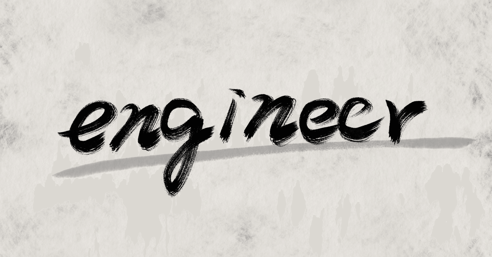

# webエンジニア採用で面接官が実際に使う質問とその意図まとめ

> 出典: https://note.com/mine_unilabo/n/n38127f1a545f  
> 公開状態: publish  
> 更新: Tue, 28 Dec 2021 17:02:07 +0900

## エンジニア採用の面接で実際に使っている質問を紹介します

EM（Engineering Manager）をしています、みね（[@mine\_take](https://www.twitter.com/mine_take)）です。
※本記事は個人の活動による記事であり、会社の公式見解とは異なる場合があります。

スタートアップでエンジニアリングマネージャー（EM）を経験し、現在はCTOとしてプロダクト開発部を率いています。今回は、エンジニア（特にミドル～シニア層）を採用する際の面接で役立つ質問リストを、私自身の経験や最新の採用事情に合わせてアップデートしました。

面接官の方、面接を受ける人、双方にとって、事前にチェックしておくと
**有用な内容**かと思います。

大前提として、限られた時間で候補者のすべてを理解することは難しいです。だからこそ、**事前に質問の意図を明確化し、複数の質問を組み合わせ**て候補者像を把握していくことが重要になります。

### 全体的な質問

まずは汎用的な質問で導入をスムーズにし、候補者のキャリア観や価値観を探っていきましょう。ここから行動面接につなげるための流れを作るのがポイントです。

- **Q：前の会社で何をやってきましたか？**

  - 過去プロジェクトの課題や問題、取り組み方をヒアリングし、行動面接へつなげる。
- **Q：転職理由はなんでしょうか。**

  - 入社後のリスクを確認し、企業とのマッチング度合いを測る。
- **Q：会社に求めるものはなんでしょうか。**

  - 候補者が重視しているポイントと、企業の提供価値が一致するかを確認する。
- **Q：どういったタイプの人と仕事をしたいと思っていますか。**

  - どんな環境や文化が合うのかを探る。チームビルディング視点でも有用。
- **Q：仕事で気をつけている点はなんでしょうか。**

  - 「気をつけている＝自分の課題意識」という場合が多い。強み・弱みを測るヒントになる。
- **（回答の後に）つまり一言で言うと？**

  - 要点をまとめる力や、抽象化のスキルをチェックできる。

### 行動に対しての質問

過去の行動・実績に注目し、考え方や行動原理を把握するために使います。ミドル～シニアクラスほど深掘りしやすいので、詳細を聞き出すのもポイントです。

- **Q：チーム/会社を良くするために主体的に行った行動はありますか。**

  - 自発的な改善・提案ができるかを確認。
- **Q：過去1年間に上司にした提案を2つ教えてください。その案の経緯と結果は？**

  - 提案力や問題意識の高さを具体的に把握できる。
- **Q：過去2年間で、仕事上で成長するためにやったことを3つ挙げてください。**

  - 勉強会参加や情報発信など、学習意欲の高さを確認する。
- **Q：技術や知識を最新に保つためにどのような努力をしていますか？**

  - 新技術に対する感度やインプット手法を探る。
- **Q：もし自分が上司ならどんな提案をしますか。**

  - リーダーシップの視点、俯瞰力の有無を探る。
- **Q：過去のプロジェクトで一番頑張ったもの・一番失敗したものは何ですか？**

  - 成功・失敗どちらも具体的に深掘りし、問題解決力や自責思考を確認する。
- **Q：その失敗に対してどう対応しましたか？ 今そのときに戻れるとしたらどうしますか？**

  - 失敗の振り返りや改善策を実行できるかをチェックする。

### 観点1. 過去の経験に対しての質問

候補者の経歴・実績をさらに具体的に掘り下げ、業務範囲やスキルセットを正確に把握します。

- **Q：どんなサービスを作ったのかを簡単に説明してもらう。**

  - サービス理解度、関連技術スタックを把握。

    - 技術選定や、リアーキテクチャの話も出来るか。
    - 具体的な数値などが出てくるのか、深堀りも。
- **Q：その中で一番自信があるプロジェクトは？ 担当した役割は？**

  - 候補者を知る、深堀りする話題を抽出ための流れつくり。
- **Q：上手く解決できた課題は？ 何が問題で、なぜそのアプローチを選んだのか？ 成果は？**

  - 解決プロセスを確認し、思考の筋道を見極める。

    - どういうプロセスで問題解決するのかを確認できる。
      例えば、課題特定→解決策検討→意思決定→実行→振り返り
    - 事業や会社の成長まで考えて動けるのか、やったことだけではなく、必要なことを考えられているかを確認できる。
- **Q：過去の意思決定で、矛盾の中でも判断しなければならなかった場面は？ どう決めたのか？**

  - 不確実性の高い状況での対処法や意思決定力を把握する。
- **Q. 組織の中のどこで能力を発揮できる人か？どのようなサポートが必要だと考えているか？**

  - 自分の能力が発揮されるポイントを理解しているかの確認ができる。
  - 環境要因とその人の成果を分けて理解ができているかを確認できる。
  - 成果で、どの様な環境要因があった深堀りができる。
- **Q. リスクを取ってみたが上手く行かなかったことは何か？何を学んだ？**

  - ふり返ることが出来ているかの確認ができる。
- **Q：最も大きな権限や責任を任されたのはどんな場面？ どのような意思決定をし、どう評価されたか？**

  - リーダーシップや裁量範囲を確認する。

    - 与えた権限の中でどのような意思決定が出来るか、どこまで任せられるかを確認できる。

### 観点2. 専門的な質問（スキル、深堀り系）

ミドル～シニアエンジニアには高度な専門性が期待されるため、具体的な設計思想や問題解決力を問う質問を用意しておきましょう。

**WEBエンジニアの場合**

- **Q：使ってきたプログラミング言語やサーバー構成は？ なぜその構成？ 現在の課題は？**

  - 技術選定の基準やシステム全体の理解度を確認。

    - 技術的な向上や理想形を考えられるかも確認。
- **Q：出てきた技術ワードについて「なぜそれが良いのか？ どんなメリット・デメリットがあるか？」を深堀りする。**

  - 設計思想や評価基準の明確さを探る。

    - どんなプロセスで判断をする人か（どれだけ任せられるか）を確認できる。
- **Q：設計・開発で大切にしている思想はあるか？ 絶対に外せないポイントは？**

  - コード品質やサービスの安定性などへのこだわりを知る。

    - 学びを体系化できるかを確認できる。
    - 思想だけじゃなくて、どこまで行動に移せているのか確認ができる。

**マネージャー・リーダー職の場合**

- **Q：プロダクトやプロジェクトマネジメントで最も重視している点は？ その理由は？**

  - 組織運営や事業を俯瞰できるかを確認。

- **Q：権限はどこまで行使できる？ KGI・KPIをどう設定し、どのように追いかける？**

  - 経営視点・事業視点をどの程度持っているかを把握する。

    - どの範囲まで任せられるのか、どこまで考えられるのかを確認ができる。
    - 思想だけじゃなくて、どこまで行動に移せているのか確認ができる。
- **Q：経営/事業/プロダクト/技術の戦略や課題をどう捉え、どう解決すべきだと考える？**

  - どの範囲まで視野を広げられるかを確認。

### 観点3. 具体的な知識を確認する質問

実務レベルでのスキルや思考プロセスを見極めるため、実技試験に近いアプローチの質問も検討します。

- **Q：xxx.jpのURLをブラウザから叩いてページが表示されるまでを説明してください。**

  - ネットワークやWebアプリケーションへの理解度を問う。

    - webサービスに関わる技術の得意領域、苦手領域の確認ができる。
- **Q：表示が遅いサイトのボトルネックを考えうる限り挙げ、解決策を提案してください。**

  - パフォーマンスチューニングや問題分析のスキルを見る。
- **Q：自社のサイトを表示し、このサイトを作る場合、データモデルとアーキテクチャなどホワイトボード上で一緒に考えましょう。**

  - 設計力や要件抽出力を確認。

    - 設計周辺の得意領域、苦手領域の確認ができる。
- **Q：自社プロダクトでこういう問題があるが、どう解決する？（必要な情報があれば質問可）**

  - 解決策の検討プロセスやコミュニケーション能力を把握できる。

    - どこまで組織やプロダクトに具体的なイメージを持てるかを確認できる。

### 観点4. 人間面に対しての質問

スタートアップではスキルだけでなく、チームビルディングをしていく上で、人間性やカルチャーフィットも大切です。スキルよりも、ここで重視している企業も多いのではないでしょうか。

- **Q：イラッとする・モチベーションが下がるときは？ どう対処しますか？**

  - 自己理解やストレスコントロールの方法を確認。
- **Q：モチベーションが上がるのはどんな時？ 具体的なエピソードは？**

  - 候補者が成果を出しやすい環境をイメージする手がかりになる。
  - 組織とのマッチングを確認できる。
- **Q. なぜ転職を考えた？今の会社はなぜ入った？今後どういう観点で企業を見ている？**

  - 仕事観の確認ができる。
  - 転職へのモチベーションの確認ができる。
- **Q：今後どんな仕事をしたい？ 逆に何はしたくない？ なぜ？**

  - キャリアの方向性と会社・ポジションとの相性を探る。
  - 組織とのマッチングの確認ができる。

## エンジニア採用にはエンジニアの関わりが必須

エンジニアにとって、どのようなチームや環境で働けるかは大きな関心事です。現場感のある会話ができるエンジニア面接官が関わることで、候補者とのミスマッチを防ぎやすくなります。ただし、エンジニアは面接のプロではないことも多いので、**「何を聞くのか」「なぜ聞くのか」**をあらかじめ整理した質問リストを共有しておくと、面接自体のクオリティが高まります。

技術的なスキルの確認は、より具体的な質問で確認を行うことが必要ですし、プロジェクトの話や、マネージメントの話も、深掘りをするためには具体的な内容の確認をする方がより良いと思いますので、ここで挙げた質問リストを参考に深掘りをしてみてください。

私自身、ミドル～シニア層の採用では「技術力の深掘り」だけでなく、「事業や組織の視点」「意思決定プロセス」も重視しています。管理職やリードエンジニアであれば、経営側との共通言語を持ち、どの範囲を委任できるのかを見極めることも重要です。

## まとめ

• **事前に質問を用意し、複数組み合わせる**ことで、短時間でも多角的な評価が可能。
• **面接官同士で「質問の目的」を共有**し、重複や抜け漏れを防ぐ。
• **ミドル～シニア層の採用**では、技術面だけでなく事業・組織面の視点を重視する。
• **エンジニアが面接に関わるメリット**は大きいが、質問リストと意図の共有が不可欠。
• どんな候補者が来ても「一次面接」「二次面接」で何を聞くか整理しておくと、面接品質が均一になる。

この記事が、面接官として質問を考える方にも、これから面接を受ける方にも役立てば嬉しいです。スタートアップでのエンジニアリングやプロダクト開発、チームビルディングの経験をこれからも発信していきますので、ぜひフォローしてください。

以上、EM（Engineering Manager）をしている、みね（[@mine\_take](https://www.twitter.com/mine_take)）でした！
