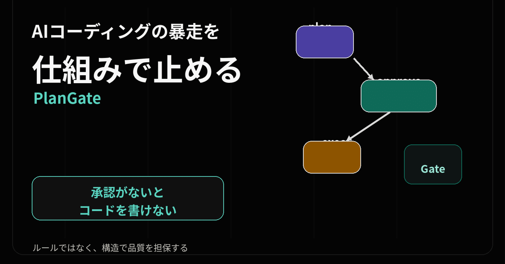
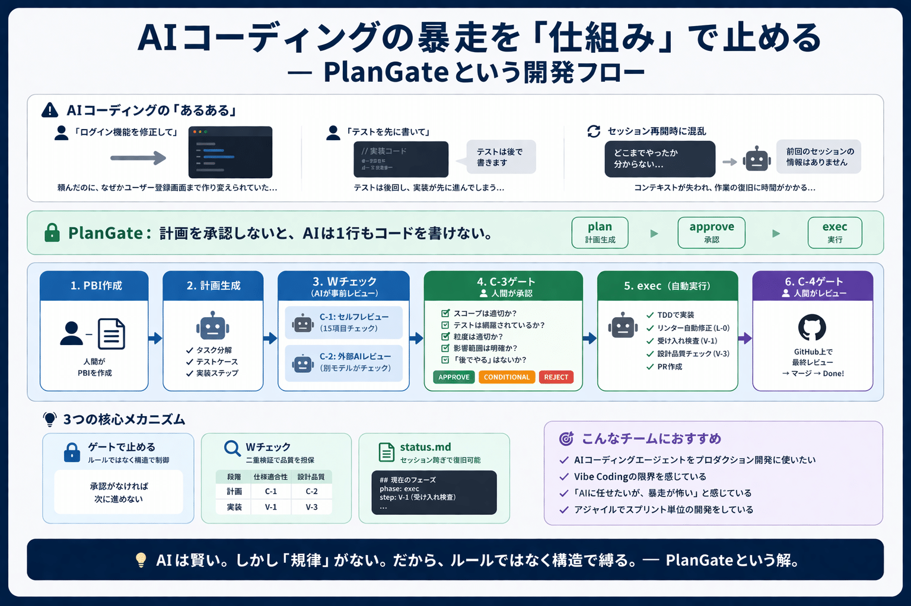
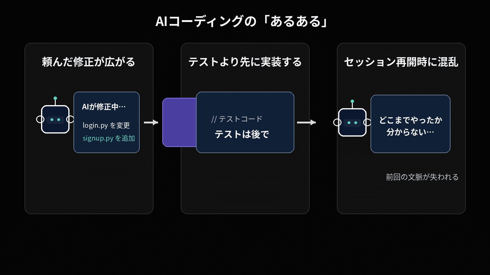
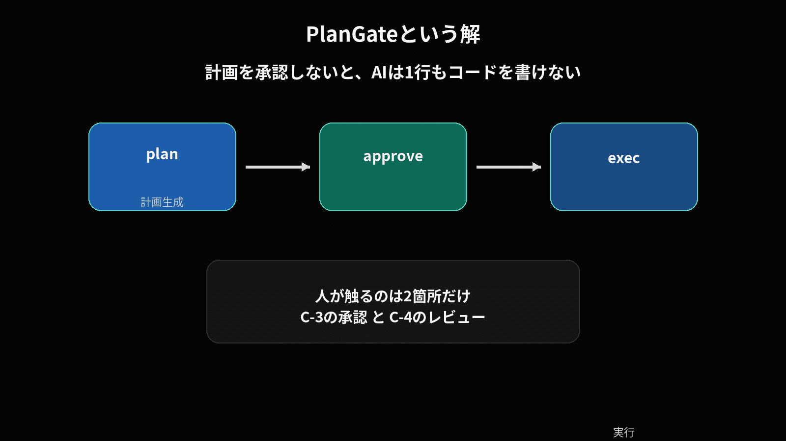
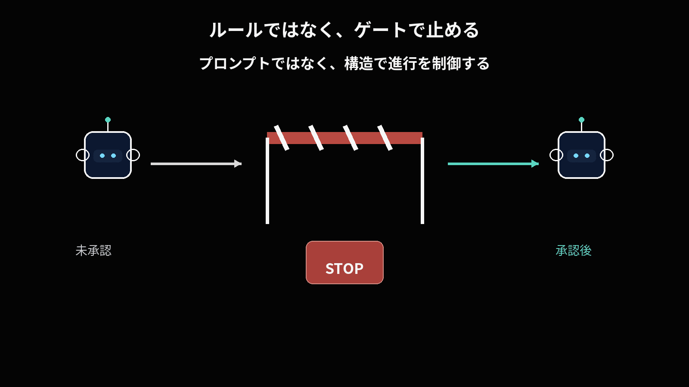
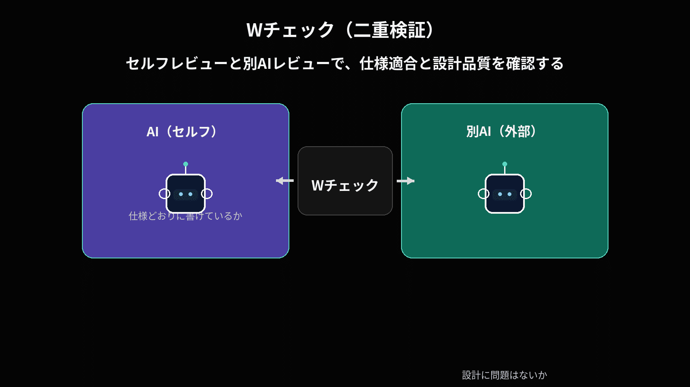
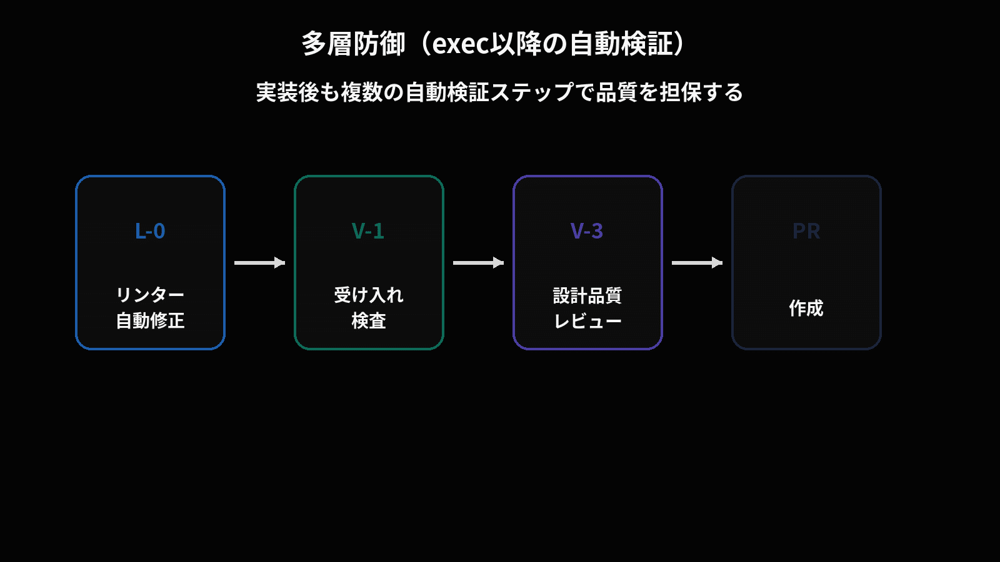
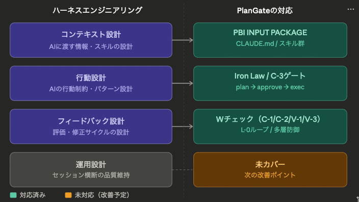
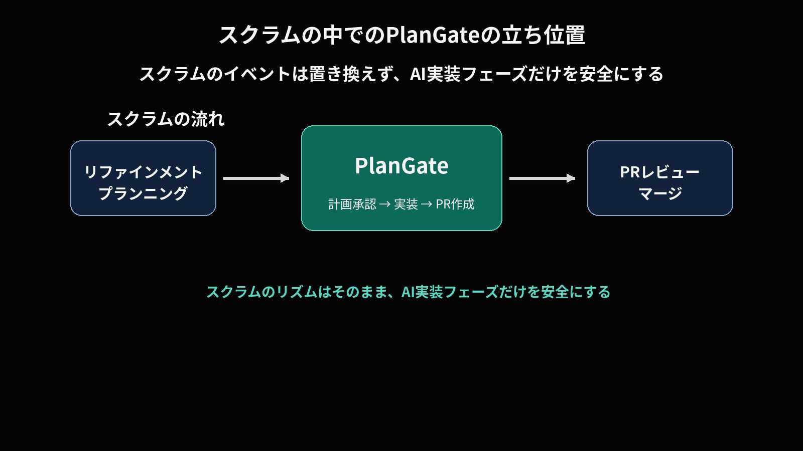
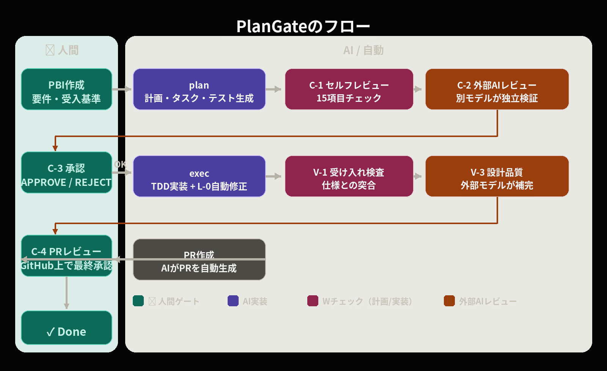

# AIコーディングの暴走を「仕組み」で止める — PlanGateという開発フロー

> 出典: https://note.com/mine_unilabo/n/n3aae6b5467b9  
> 公開状態: publish  
> 更新: Wed, 01 Apr 2026 18:16:35 +0900  
> 区分: 個人



五反田のスタートアップでプロダクト開発をしている、小峯将威（[@mine\_take](https://x.com/mine_take)）です。 ※本記事は個人の活動による記事であり、会社の公式見解ではありません

---



AIコーディングの暴走を「仕組み」で止める — PlanGateという開発フロー

## AIコーディングの「あるある」、体験しませんでしたか？

Claude CodeやCursorなどのAIコーディングエージェントを使い始めた人なら、こんな経験があるのではないでしょうか。

「ログイン機能を修正して」と頼んだら、なぜかユーザー登録画面まで作り変えられていた。

「テストを先に書いて」と言ったのに、気づけば本体コードが先にできあがっていて、テストは「後で書きます」と返ってくる。

セッションが切れて再開したら、どこまでやったのか分からない。AIに聞いても「前回のセッションの情報はありません」と返される。

最初のうちはプロトタイプを作るのに最高でした。いわゆるVibe Coding。自然言語で指示を出すだけでコードが生成される体験は衝撃的でした。

しかし、プロダクションコードをAIに書かせようとした瞬間、問題が噴出しました。あるプロダクト開発チームで、私たちはまさにこの壁にぶつかりました。



AIコーディングの「あるある」

---

## AIは賢い。しかし「規律」がない

AIコーディングエージェントの問題は、能力ではなく規律です。

スコープが勝手に膨らむ。「この修正をするなら、ついでにこちらも最適化した方が良いです」と言って、頼んでいない変更を加える。テストを合理化してスキップする。「このケースはシンプルなのでテストは不要です」と自分で判断する。失敗を隠蔽する。エラーが出ると別のアプローチに迂回して、何事もなかったかのように完了を宣言する。

最初は「CLAUDE.mdにルールを書けば守るだろう」と思っていました。「テストを先に書くこと」「スコープ外の変更をしないこと」。

守りません。

正確に言うと、守るときもあるし、守らないときもある。AIは「この場合はルールを曲げた方が効率的だ」と判断して、自ら合理化します。人間と同じです。ルールがあっても、それを破る理由を自分で作り出せてしまう。

だから、ルールではなく **構造** で縛ることにしました。

---

## PlanGateという解

PlanGate（プランゲート）。名前の由来は単純で、Plan（計画）+ Gate（関所）。

**計画を承認しないと、AIは1行もコードを書けない。**



PlanGateという解

これがPlanGateの全てです。コマンドは3つだけ。plan（計画生成）、approve（承認）、exec（実行）。

人間が触るのは2箇所だけです。計画の承認（C-3ゲート）と、PRのレビュー（C-4ゲート）。その間のAIの実装・検証・レビューは全て自動で回ります。

```
人間がPBIを書く
  → AIが計画・タスク・テストケースを同時生成
  → AIが計画をセルフレビュー（C-1: 15項目チェック）
  → 別のAIが独立レビュー（C-2: 外部AIチェック）
  → 👤 人間が承認（C-3ゲート: APPROVE / CONDITIONAL / REJECT）
  → AIがTDDで実装（exec）
  → AIがリンター自動修正（L-0）
  → AIが受け入れ検査（V-1: 仕様突合）
  → AIが設計品質チェック（V-3: 外部モデルレビュー）
  → AIがPR作成
  → 👤 人間がPRレビュー（C-4ゲート）
  → マージ → Done
```

小さなタスク（バグ修正・設定変更）では最短パスで回し、大きなタスク（機能追加・リファクタ）では全ステップを通す「フルモード」で最大限の品質保証をかけます。

その前提として、PBIが小さく、受入基準が明確であることが重要です。

---

## ルールではなく、ゲートで止める

これがPlanGateの核心です。プロンプトエンジニアリングには限界があります。どれだけ丁寧にルールを書いても、AIは「この場合は例外が合理的だ」と自己判断できてしまう。



ルールではなく、ゲートで止める

だから、ルールを守らせるのではなく、**物理的に進めない構造**にしました。承認がなければexecコマンドは動かない。それだけです。

### 4つの核心メカニズム

ここから先は、PlanGateを支える仕組みを順番に見ていきます。

1. Wチェック（二重検証）

「ゲートを置いたら、人間の承認がボトルネックになるのでは？」という疑問が当然出ます。



Wチェック（二重検証）

ここが工夫で、AIが出した計画を人間がゼロからレビューするのではなく、AI自身による15項目のセルフレビュー（C-1）と別AIモデルによる独立チェック（C-2）を先に走らせます。人間に届くころには粗い問題はフィルタ済みです。レビュー時間の目標は15分/PBI以内。

この二重検証は計画段階だけでなく、実装段階にも適用しています。「仕様に書いた通りに実装されているか」（V-1）と「仕様に書かれていない設計品質の問題はないか」（V-3）の2つの観点で、実装もWチェックにかけます。

段階 仕様適合性 設計品質 計画段階 C-1（セルフレビュー） C-2（外部AIレビュー） 実装段階 V-1（受け入れ検査） V-3（外部モデルレビュー）

2. C-3ゲート — 人間が承認するときに見るもの

C-3ゲートでの承認は感覚で判断するのではなく、以下のチェックリストで確認します。

```
[ ] スコープに含まれないファイル変更が計画に入っていないか
[ ] 受入基準の全項目がテストケースに対応しているか
[ ] 実装ステップが小さすぎず大きすぎない粒度か（1ステップ=1コミット目安）
[ ] 既存機能への影響範囲が明示されているか
[ ] 「後でやる」「一旦スキップ」という表現が含まれていないか
```

このチェックリストを通過した計画だけがexecに進めます。
AIがどれだけ流暢な計画を出してきても、このゲートを通らなければコードは1行も生まれません。
PlanGateの本質は、ここにあります

3. Iron Law（絶対ルール）

CLAUDE.mdに書くルールとは別に、「理由に関わらず例外なし」の不可侵ルールを6つ設定しています。

- 承認なしにコードを書くな
- 勝手にスコープを変えるな
- 設計なしにコードを書くな
- 2段階レビューなしにマージするな
- 証拠なしに完了と言うな
- 原因調査なしに修正するな

最初はCLAUDE.mdにルールを書くだけでした。AIが「この場合は例外にした方が効率的です」と合理化してくるたびに、ルールの書き方を工夫しました。しかし結局のところ、Iron Lawとして「理由に関わらず例外なし」と宣言してから、ようやく安定しました。

4. 多層防御（exec以降の自動検証）

execコマンド実行後、PR作成までに複数の自動検証ステップが走ります。



多層防御（exec以降の自動検証）

- **L-0（リンター自動修正）** — コード品質のベースラインを自動で揃える。autofixで直せない違反はAIが最大3回修正ループを回し、解消しなければ後工程に申し送る
- **V-1（受け入れ検査）** — 仕様通りに実装されているかを機械的に検証。FAILなら修正→再検証のループ
- **V-3（外部モデルレビュー）** — 別のAIが設計品質をチェック。V-1の盲点を補完する
- **C-4（人間レビュー）** — GitHub上での最終承認

---

## セッションが切れても復旧できる — status.mdの仕組み

Claude Codeの最大の弱点のひとつが、セッション切れによるコンテキストの喪失です。PlanGateでは status.md というファイルを作業コンテキストとして使い、セッションをまたいで状態を復旧できるようにしています。

status.md が保持するのは、「今どこにいて、何が未解決か」を再開時に即座に思い出すための情報です。たとえば、以下のような内容を持ちます。

```
## PBI情報
- チケットID: TASK-XXXX
- タイトル: ログイン機能のリファクタリング

## 現在のフェーズ
- phase: exec
- step: V-1（受け入れ検査）

## 完了済みタスク
- [x] plan生成
- [x] C-1セルフレビュー
- [x] C-2外部AIレビュー
- [x] C-3承認（APPROVE）
- [x] TDD実装
- [x] L-0リンター修正

## 未決事項
- V-1でFAILしたケース: ログアウト後のリダイレクト挙動
- 次のアクション: 修正後に再検証

## 関連ファイル
- 実装: src/auth/login.py
- テスト: tests/test_login.py
```

セッションが切れたとき、AIは status.md を読み込むだけで「どこまでやったか」「何が未解決か」を即座に把握できます。地味ですが、これがあるとClaude Codeのセッション切れに怯えなくなります。

---

## ハーネスエンジニアリングとの交差点

近年、「AIそのもの」ではなくAIが動く環境全体を設計する発想が注目されています。
その文脈で語られるのが「ハーネスエンジニアリング」です。

AIモデルの能力を上げるのではなく、AIが動く環境全体を設計する——馬の脚力ではなく馬具で方向を制御する、という発想です。

ハーネスエンジニアリングでは4つの設計領域が定義されています。



ハーネスエンジニアリング4領域のPlanGateの対応図

4領域のうち3領域はカバー済みで、残りの運用設計も改善を進めています。

---

## スクラムの中でのPlanGateの立ち位置

PlanGateは、スクラムのイベントを置き換えるものではありません。
PBI（プロダクトバックログアイテム）のDone定義の中で、「AIにコードを書かせるフェーズ」を安全に回すための仕組みです。



スクラムの中でのPlanGateの立ち位置

責務 担当 PBIの情報管理・更新 スクラムイベント（リファインメント・プランニング） Done条件の確認・判定 PO / スクラムチーム ベロシティ計測・スループット管理 スクラムチーム **AIへの計画承認 → 実装 → PR作成** **PlanGate（C-3承認ゲート以降）**

この切り分けをしたことで、PlanGateの仕組みを改善してもスクラムのリズムに影響しなくなりました。

---

## 他の手法との違い

PlanGateの立ち位置を掴みやすくするために、近い手法と比較します。

### vs Vibe Coding

プロトタイプには最強。プロダクションコードには向かない。PlanGateはその先のステージ。チーム内でVibe CodingとPlanGateを使い分けるのが現実的です。

### vs Spec-Driven Development（仕様駆動開発）

仕様を最初に固めるSpec-Drivenに対して、PlanGateはPBI単位で軽量に計画を立てます。重い仕様書を事前に用意する必要がなく、スクラムのスプリント単位で回せます。

### vs Superpowers（スキル駆動開発）

AIに規律を教え込むSuperpowersに対して、PlanGateはゲートで止める。PlanGateのIron Lawはobra/superpowersの思想を取り込みつつ、3コマンドに圧縮しました。

---

## 実際に使ってみて分かったこと

### うまくいったこと

計画フェーズに時間を使うと、実装は明らかにスムーズになります。PBIを丁寧に書く15〜30分の投資が、exec以降の手戻りを大幅に減らしました。

その結果、PBIの粒度も自然に小さくなりました。大きすぎるPBIはPlan生成の品質を落とすため、チーム全体が「小さく切る」方向に収斂していきました。

ここで起きたことは、アジャイル開発の改善サイクルとよく似ています。だからこそ、スクラムの中で改善行動を積み重ねてきた経験が、そのまま活きました。

### つまずいたこと

最初に難しかったのは、PBIをどのようにAIへ渡せばよいかの感覚をつかむことでした。何をどこまで書けば十分なのかが分からず、テンプレートは何度も改善を繰り返しました。

また、受け入れ検査（V-1）で修正ループが上限に達し、中断になるケースもありました。原因を分析すると、その大半はPBIの受入基準が曖昧なケースでした。PlanGateでは、PBIの入力品質がその後の結果を左右する。これは強い教訓でした。

---

## これからの改善

1. **決定論的フック** — プロンプトだけでは遵守が不安定なため、Iron Lawをフックで強制できる状態に引き上げることが最優先です
2. **ガベージコレクション** — 定期的にバックグラウンドでコードベースの品質をスキャンし、自動リファクタリングPRを作成する仕組み
3. **段階的ルール昇格** — 違反データに基づいてルールの強制レベルを段階的に上げる

---

## 誰に向いているか

PlanGateが効くのは、AI導入そのものよりも、AIの暴走コスト管理が重要になっているチームです。たとえば、次のようなケースです。

- AIコーディングエージェントを **プロダクション開発** に使いたい
- Vibe Codingの限界を感じている
- 「AIに任せたいが、暴走が怖い」と感じている
- アジャイルでスプリント単位のPBIを回している

向いていないのはこういう場合です。

- プロトタイプや実験的な開発（Vibe Codingの方が速い）
- 1人で完結する個人プロジェクト（PlanGateはオーバースペック）
- AI開発をまだ試したことがない（まずはVibe Codingで体験するのが先）

**EMやTechLeadの方へ：** AIの暴走コストを管理しながらチームの生産性を安定させたいなら、まずは小規模な1タスクで plan → approve の2ステップだけ試してみてください。execまで進めなくても、「計画を見てから実装させる」習慣だけでも、AIの行動が大きく変わります。

実務上の導入コストは、PBIの入力品質を上げることと、C-3承認を15分以内で回せる粒度に仕事を分けることの2点に集約されます。

---

## おわりに

PlanGate — Plan（計画）+ Gate（関所）。
計画を通さないとAIは動けない。それだけのシンプルな仕組みです。



PlanGateのフロー図

AIコーディングエージェントは、これからもっと賢くなります。
しかし、賢くなるほど「合理化」も巧みになる。だからこそ、AIの能力そのものではなく、**プロセスの構造**で品質を担保する必要があります。

AIに「やるな」と言うのではなく、やれない構造を先に置く。
PlanGateの設計思想は、ここに尽きます。

ルールを教えるのではなく、ゲートで止める。

もしあなたのチームが「AIは便利だけど、プロダクションには怖くて使えない」と感じているなら、PlanGateは一つの選択肢になるかもしれません。
いきなりフル導入しなくてもかまいません。まずは plan → approve の2ステップだけでも試してみてください。
「計画を見てから実装させる」だけでも、AIの振る舞いはかなり変わります。

---

## リポジトリ

**PlanGate**のコマンド・エージェント・スキル一式を**GitHub**で公開しています。

🔗 <https://github.com/s977043/plangate>

[CLAUDE.md](http://CLAUDE.md) の設定、/ai-dev-workflow コマンド、workflow-conductor エージェントなど、記事で紹介した仕組みをそのまま試せる形で置いています。
いきなりフル導入しなくても、まずは 計画を見てから実装させる ための plan → approve だけ試してみてください。
フィードバックやIssueも歓迎です。
