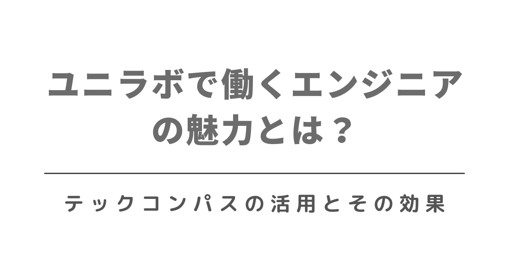
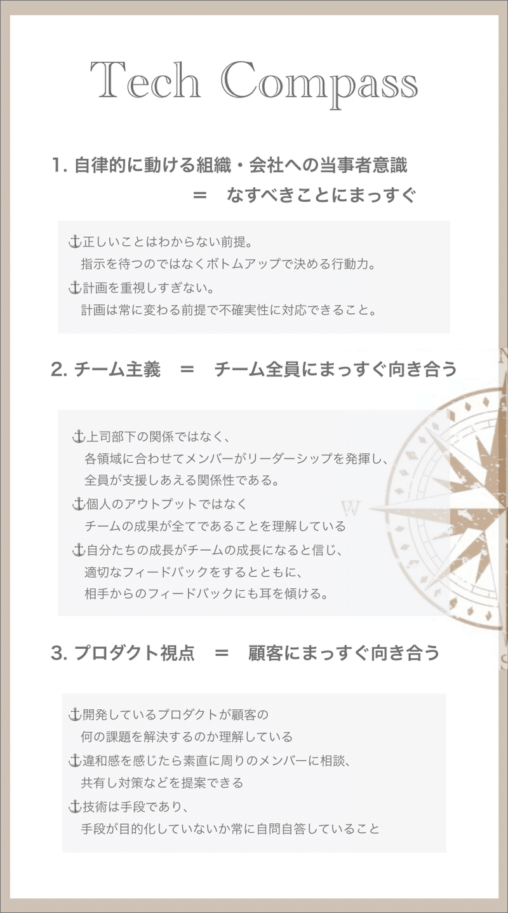
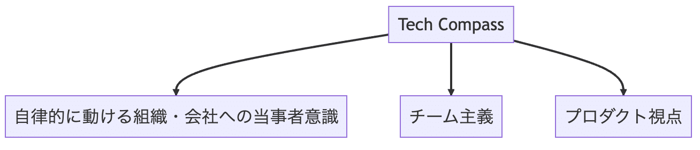

# ユニラボで働くエンジニアの魅力とは？：テックコンパスの活用とその効果

> 出典: https://note.com/mine_unilabo/n/n3ed52241292c  
> 公開状態: publish  
> 更新: Fri, 30 Jun 2023 15:21:31 +0900

---

こんにちは、ユニラボでエンジニアリングマネージャーをやっているみね＠ユニラボ（[@mine\_take](https://twitter.com/mine_take)）です。今日は、私たちユニラボのエンジニアが日々の業務で大切にしている「テックコンパス」についてお話ししたいと思います。

## テックコンパスとは？

テックコンパスは、ユニラボの組織文化を技術的視点から定義したものです。会社のバリューをエンジニア風に翻訳した概念で、エンジニアの視点を反映させた価値観を明文化し、自発的に提案してプロダクトに関与するような自律的な組織を作り上げることを目指しています。これはユニラボのエンジニアの働き方と成長を支えるための基盤となっています。

テックコンパスが作られるまでの内容は[こちら](https://note.unilabo.jp/n/n451c0ed872dc)の記事を見てください。

<https://note.unilabo.jp/n/n451c0ed872dc>

### テックコンパスの要素

私たちユニラボのテックコンパスは、三つの要素から成り立っています。

> **・自律的に動ける組織・会社への当事者意識
> ・チーム主義
> ・プロダクト視点**

ユニラボのテックコンパス

### 自律的に動ける組織・会社への当事者意識とは

私たちは、正しい答えが最初からわかるわけではないという前提を持っています。指示を待つのではなく、自分たちで考え、行動することを重視しています。また、計画は重要ですが、それが常に変わる可能性があることを理解し、不確実性に対応できる柔軟性を持つことを大切にしています。

### チーム主義とは

私たちは、上司と部下の関係ではなく、各領域に合わせてメンバーがリーダーシップを発揮し、全員が支援しあえる関係性を目指しています。個人のアウトプットではなく、チーム全体の成果が全てであると理解し、自分たちの成長がチームの成長につながると信じています。適切なフィードバックを与えることはもちろん、相手からのフィードバックにも耳を傾けることを重視しています。

### プロダクト視点とは

私たちは、開発しているプロダクトが顧客の何の課題を解決するのかを理解しています。違和感を感じたら、素直に周りのメンバーに相談し、共有し、対案を提案できる環境を大切にしています。技術は手段であり、その技術をどのように活用してプロダクトを作り上げるかが重要であると考えています。手段が目的化していないかを常に自問自答しています。

## テックコンパスの活用

これらの要素は、私たちユニラボのエンジニアが持つべき価値観を示すものであり、我々の行動を導く指針となっています。これらの価値観を持つことで、一人ひとりが自分の仕事に対する誇りと責任感を持ち、自分の仕事に責任を持つことから始まります。自分の仕事に対する誇りと責任感が、組織全体の自律性を高め、会社全体を前進させる原動力となります。

ユニラボのテックコンパスの各要素を視覚化した図

---

## スクラムの導入

ユニラボの開発スタイルは、「スクラム」の導入により大きく変わりました。スクラムはアジャイル開発の一つで、変化に素早く対応できるように設計された開発手法です。この導入により、エンジニアたちはプロダクト開発により深く関わることができ、自分で考え行動し、チームで協力してプロダクトを作り上げることが可能となりました。

この開発スタイルは、ユニラボの「テックコンパス」の理念と深くつながっています。テックコンパスでは、「自律的に動ける組織・会社への当事者意識」「チーム主義」「プロダクト視点」を大切にしています。そのため、スクラムの導入は、テックコンパスの理念を具現化するための重要な手段となっています。

### スクラム導入前の開発スタイル

スクラム導入以前は、決まった仕様に従って開発が進行していました。しかし、このスタイルでは、開発が完了した後に認識の齟齬や仕様の不備が発覚し、手戻りが発生するケースが多くありました。

### スクラム導入後の開発スタイル

スクラムの導入により、開発スタイルは大きく変化しました。現在では、施策の「Why / What」についての情報がエンジニアにも提供され、それを実現するための「How」を開発チーム全体で考えるスタイルに移行しました。これにより、エンジニアはプロダクト開発により深く関与し、より大きな責任感と満足感を得ることができるようになりました。

### スクラム導入の効果

スクラムの導入は、ユニラボの「テックコンパス」の3つの要素、「自律的に動ける組織」「チーム主義」「プロダクト視点」に深く根ざしています。エンジニアが自律的に動ける組織を形成し、チームで協力しながらプロダクト視点を持って開発を進めることが、スクラムの導入によって可能になりました。

さらに、スクラムの導入はユニラボ全体の開発プロセスを変革し、エンジニア一人ひとりがプロダクト開発により深く関与できる環境を整えました。これにより、エンジニアはプロダクト開発により深く関与し、より大きな責任感と満足感を得ることができるようになりました。

---

少し前の記事ですが、スクラムの導入に向けて考えた記事を紹介します。

<https://note.unilabo.jp/n/n1ffdeea2bb04>

## ユニラボで活躍するエンジニアの特性

ユニラボで働くエンジニアが大切にする価値観は何でしょうか？それは、自身の業務に対する誇りと責任感、チームとの協働、そしてプロダクトを最高にするための情熱です。これらは、ユニラボのテックコンパスの理念を具現化しています。

私たちは「技術は手段である」と考えています。そのため、新しい技術に対する好奇心と、その技術を活用してプロダクトを創造する能力を持つエンジニアが、ユニラボでの働き方に最適です。

ユニラボのエンジニアは、これらの価値観を持つことで、自己と組織全体の成長を促進しています。ユニラボでは、エンジニアが自己の成長とともに組織全体の成長に貢献できる環境を提供しています。自身の技術と情熱を活かして新たな価値を創造したいエンジニアの皆さん、ユニラボで一緒に働きませんか？

## ユニラボでは、エンジニアの採用を積極的に行っています

私たちユニラボでは、エンジニアの採用を積極的に行っています。私たちは、あなたのスキルと経験を最大限に活かし、一緒に新たな価値を創造することを楽しみにしています。詳細な採用情報は、ユニラボの採用ページをご覧ください。

<https://www.wantedly.com/companies/unilabo>

私たちユニラボで働くエンジニアの魅力と、テックコンパスがどのように私たちユニラボのエンジニアの働き方を形成しているかについてお話ししました。皆さんがエンジニアリングの世界で新たな挑戦をする際の参考になれば幸いです。

以上、ユニラボのエンジニアリングマネージャー、みね＠ユニラボ（[@mine\_take](https://twitter.com/mine_take)）でした。

## ▶ 【PR】ユニラボ に興味がある方へ

ユニラボではプロダクト開発を一緒にやってくれるメンバーを募集しています。カジュアル面談もやっているので、気軽にお問い合わせください！

<https://herp.careers/v1/unilabo/wJdilfnGS5XB>

<https://note.com/deliku0306/n/ne17b9a378f32>

<https://www.notion.so/Unilabo-EntranceBook-996355f875f94f0d81a80ffbad2e6c58>

<https://speakerdeck.com/unilabo/recruit-for-engineers>
