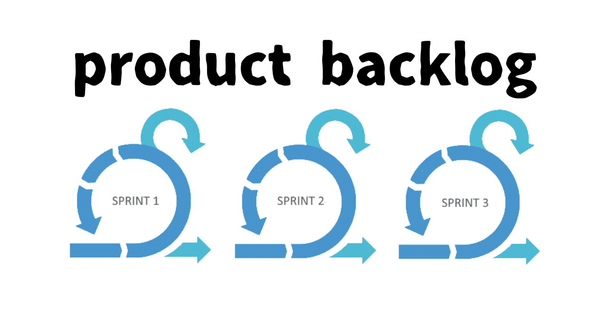
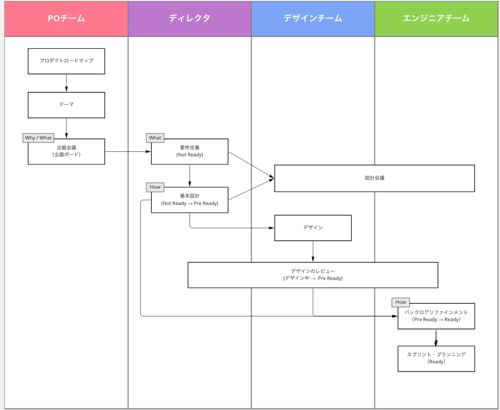
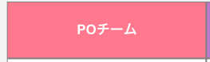
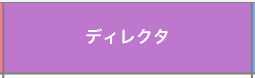
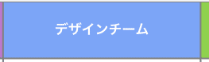
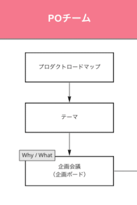
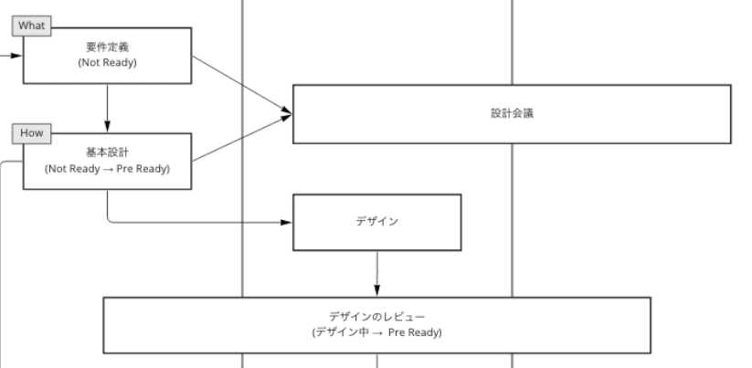
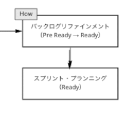

# アジャイル開発（スクラム）のバックログ管理：PBLからスプリントへのスムーズな移行法

> 出典: https://note.com/mine_unilabo/n/n40f2574d87dd  
> 公開状態: publish  
> 更新: Fri, 13 Jan 2023 06:24:57 +0900  
> 区分: 公式ブログ

スクラムで**プロダクトバックログアイテム**が作られ、**スプリントバックログ**に入るまでのフローを紹介します。これからプロダクト開発を始める方や、スクラムの改善を進める方の参考になれば幸いです。

簡単に自己紹介です。
五反田にあるベンチャー企業のユニラボでBtoB向けのSaaSを簡単・スピーディーに探すことできる[アイミツSaaS](https://saas.imitsu.jp/)というプロダクトでのEM（エンジニアリングマネージャー）をやっています、みね＠ユニラボ（[@mine\_take](https://twitter.com/mine_take)）です。

アイミツSaaSのプロダクトは事業としてはまだ小さく、スクラムも小規模ですので、部分的にフローを簡略化したり、同じメンバーで行っているミーティングは１つにまとめて会議を実施しているなどありますが、企画・施策がスプリントバックログに入るまでのフローに沿って紹介をしていきます。

開発フローを整理した図

## 登場人物・チーム

まずはここで登場する人、スクラムチームの紹介からです。
１つのプロダクトを開発するメンバー・チームになります。

スクラムチームの登場人物・チーム

### POチーム

スクラムのPO（プロダクトオーナー）とそのサポートするチーム

POチーム

> **プロダクトオーナーは、開発の方向性を定め、プロダクトの価値を最大化することに責任を持ちます。**

### ディレクタ

実際の施策のディレクションを行うメンバー

ディレクタ

> ■**Webディレクタ**は以下を実施することの結果に責任を持ちます。
> ・施策の実現方法の検討および推進、課題解決
> ・QCD（品質・コスト・納期）を計画し達成すること
> ・施策のリリース後の計測までを行います

### デザインチーム

プロダクトのデザインの担当しているメンバー

デザインチーム

弊社ではデザイナーはデザインの組織に所属していて、該当プロダクトの担当という形で参加しています。

### エンジニアチーム

エンジニアチームはプロダクトの開発を行います。得意・不得意にかかわらず、全分野の作業を担当する可能性があるため、設計、コーディング、テストの開発スキルが求められます。

エンジニアチーム

> ■**エンジニアチーム**は以下を実施することの結果に責任を持ちます。
> ・スプリントの計画（スプリントバックログ）
> ・完成の定義を忠実に守ることにより品質を守る
> ・スプリントゴールに向けて毎日計画を適応させる
> ・専門家としてお互いに責任を持つ
> ・日々、改善を行い、生産性を向上させる

スクラムマスター（SM）もエンジニアチームと行動をともにしています。スクラム開発がうまく回るように調整するのが役割ですが、開発メンバーを兼任するケースもあります。

スクラム開発では、メンバー各自が一連の開発スキルを有している状態が理想です。

## プロダクトバックログアイテムが作られるまでのフロー

プロダクトバックログアイテムがReadyになる前に、どの様にしてそのバックログアイテムが作られるのか、その流れです。

プロダクトバックログアイテムが作られるまでのフロー

POチーム内で**プロダクトロードマップ**から作られた**テーマ**を元に、企画を練ります。その企画を**企画会議**でPOと確認して、進めて良いという判断が出れば、優先度などを決めプロダクトバックログアイテムとして登録されます。

企画会議で話される内容としては、基本的に **Why** / **What** の部分に注力します。この企画で影響するKPIとその影響度（数値の規模）を含めてやる、やらないの判断と優先度を決めています。アウトプットではなく、**アウトカムを大切にしていく**ために、仮説を持って施策の影響を確認できる様に設計をしていきます。

## プロダクトバックログアイテムが「Not Ready」として登録されるフロー

プロダクトバックログアイテムが登録されるフロー

企画会議でOKが出た企画（優先度が高いものから）を改めて、**プロダクトバックログアイテム**として登録します。（記載すべき項目は別途で説明します）

企画ボードの内容を使い、**What**の内容から**How**の内容をデザイナー、エンジニアと相談して詰めていきます。

デザインが必要な内容であれば、「**Pre Ready**」の状態まで内容をまとめてデザイナーにデザインを依頼しデザインの完成・レビューまで進めます。
デザインが不要な内容であれば、「**Pre Ready**」で次のステップに進みます。

## プロダクトバックログアイテムが「Ready」となり、スプリントバックログ入るフロー

プロダクトバックログアイテムがスプリントバックログ入るフロー

「**Pre Ready**」まで進んだバックログアイテムをバックログリファインメントの場でエンジニアチームと確認・認識合わせを行います。

エンジニアもこの場で初めて確認する内容ではない（設計会議などで事前に確認はしている）ですが、このバックログアイテムに記載されている内容で、開発に着手できるのか、足りない情報・不確定な要素がないかを確認して、「**Ready**」とします。

スプリント・**プランニングで**は、「**Ready**」となっているプロダクトアイテムから、次のスプリントで対応するアイテムを選択し、**スプリントバックログ**に移動します。

## まとめ

今回はプロダクトバックログアイテムがReadyになるまでのフローについて説明をしました。

企画した内容（施策）から実際に開発するプロダクトバックログアイテムとして登録さて、内容を詰めていき**Ready**となり、スプリントバックログに入って行きます。

実際には、スプリントバックログに入ったバックログアイテムの開発・対応をし、スプリント内でリリースを行い、リリース後の計測を行っていくのですが、今回はスプリントバックログに入るところまでの説明をしました。

スプリントバックログに入った以降のフローについては別で説明したいと思います。

## [PR]ユニラボ に興味がある方へ

ユニラボではプロダクト開発を一緒にやってくれるメンバーを募集しています。カジュアル面談もやっているので、気軽にお問い合わせください！

<https://note.com/deliku0306/n/ne17b9a378f32>

<https://speakerdeck.com/unilabo/recruit-for-engineers>

<https://herp.careers/v1/unilabo/wJdilfnGS5XB>
