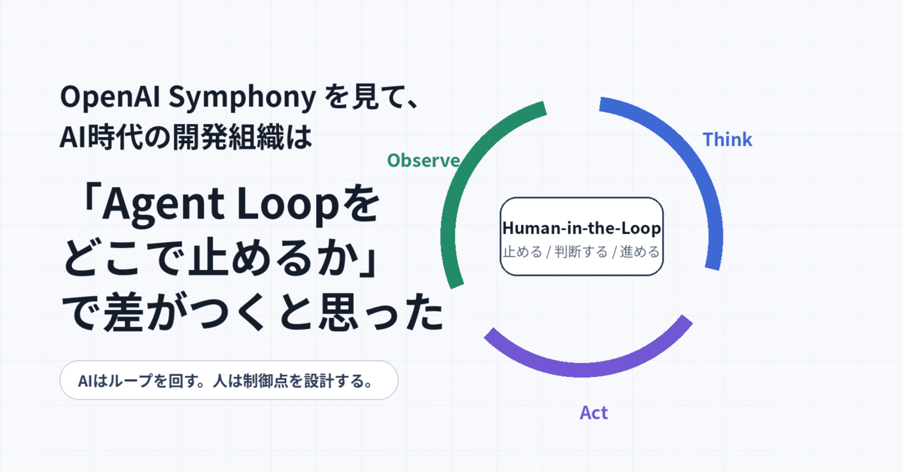
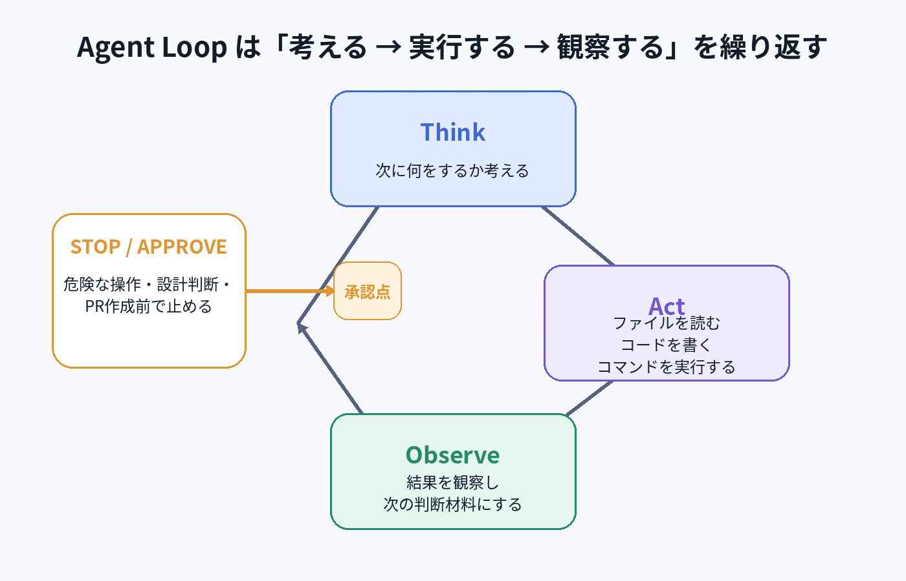
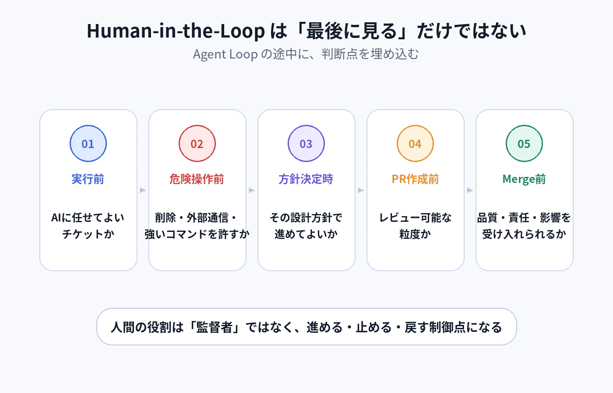
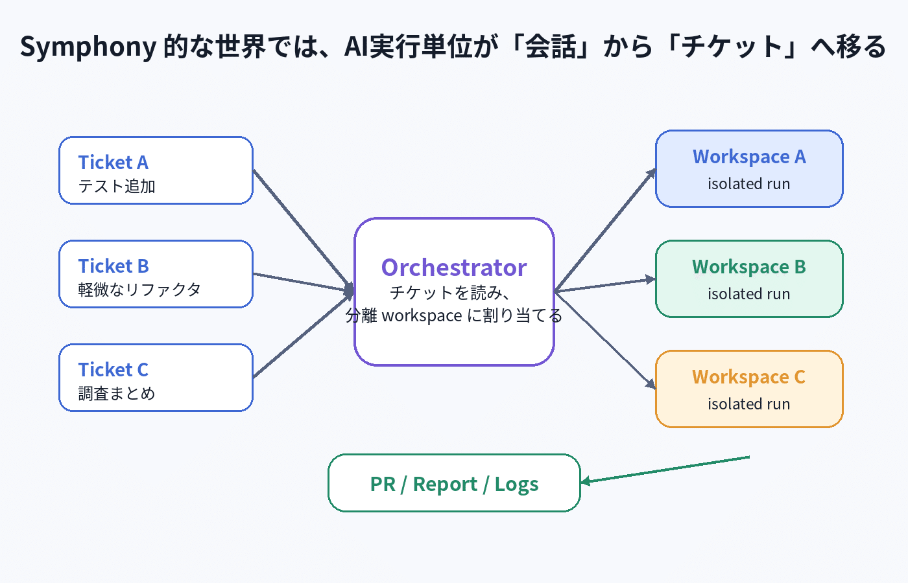
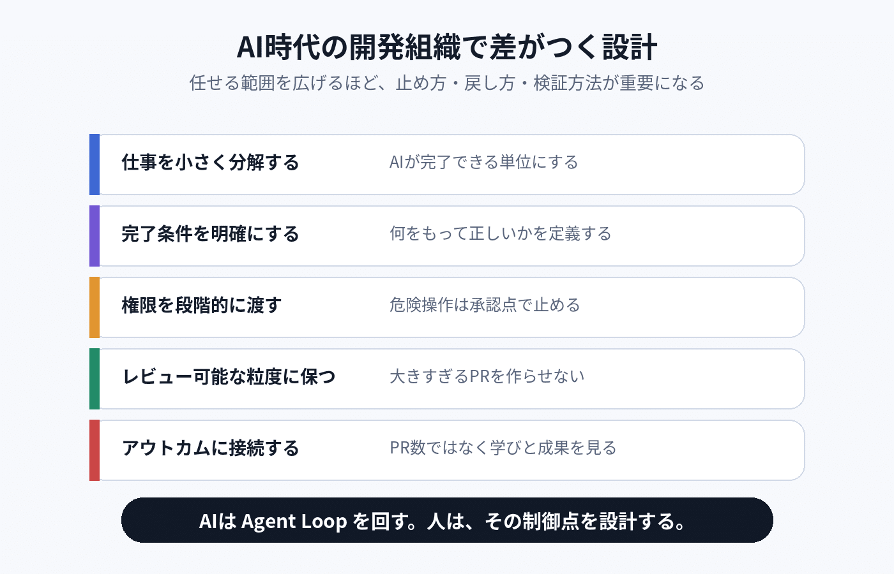

# OpenAI Symphonyを見て、AI時代の開発組織は「Agent Loopをどこで止めるか」で差がつくと思った

> 出典: https://note.com/mine_unilabo/n/n623877eceb88  
> 公開状態: publish  
> 更新: Tue, 02 Jun 2026 08:40:35 +0900

Symphony 自体は3月に発表されたもので、すでに新しいニュースではありません。
ただ、AI Coding Agent を個人利用から組織運用へ広げていくうえで、今あらためて読む価値があると感じました。

発表当初は「Codex を Linear のチケットに紐づけて、自動で実装させる仕組み」くらいに理解していました。

ただ、[OpenAI Symphony のリポジトリ](https://github.com/openai/symphony) と [SPEC](https://github.com/openai/symphony/blob/main/SPEC.md) を読んでいくと、これは単なる「AIにチケットを実装させるツール」ではないように感じました。

最初に見たときは、Codex を Linear のチケットに紐づけて、自動で実装させる仕組みなのかな、くらいに理解していました。

むしろ重要なのは、AI Coding Agent の中で回っている **Agent Loop** を、チームの開発プロセスの中でどう扱うかです。

この記事で言いたいことはシンプルです。

AI時代の開発組織で重要なのは、AIにどこまで任せるかだけではありません。

**Agent Loop のどこに Human-in-the-Loop を置くか。**

つまり、AIが自律的に進めるループを、どこで止め、どこで人間が判断し、どこからまた進めるのか。

この設計が、これからの開発組織の生産性と安全性を分けるのではないか、という話です。

---

## 最初は「AIがチケットを自動実装する話」だと思った

### Symphony は「チケット管理ツールを Agent の control plane にする」発想

OpenAI の公式記事では、Symphony は Linear のようなプロジェクト管理ボードを、Coding Agent の control plane にする仕組みとして説明されています。

ここがかなり重要です。

単に「Linear のチケットを Codex に渡す」だけではありません。
チケットの状態を見て、どの作業を開始するかを判断し、issue ごとに workspace を作り、Agent を走らせる。必要に応じて再実行し、結果を人間がレビューする。

つまり Symphony は、AI Agent を単発で呼び出すツールではなく、Agent の実行をチームの仕事の流れに接続する仕組みです。

これまで人間は、複数の Codex セッションや Claude Code の作業を見ながら、

- どの作業が進んでいるか
- どこで止まっているか
- どのPRがレビュー待ちか
- どのAgentに追加指示が必要か

を頭の中で管理していました。

でも、このやり方はすぐに限界が来ます。
AIは速くても、人間の注意力は増えないからです。

Symphony が面白いのは、この問題を「AIをもっと賢くする」ではなく、「仕事の管理単位を変える」ことで解こうとしているところです。

会話ではなくチケット。
セッションではなくissue。
個人のプロンプトではなく、チームのworkflow。

ここに、AI時代の開発組織の変化があるように感じます。

Symphony の README には、次のような説明があります。

> Symphony turns project work into isolated, autonomous implementation runs, allowing teams to manage work instead of supervising coding agents.

かなり意訳すると、Symphony はプロジェクトの仕事を、分離された自律的な実装実行に変換する仕組みです。

ポイントは、エンジニアが Codex を逐一監督するのではなく、チームが「作業そのもの」を管理できるようにする、というところです。

これまでのAIコーディングは、多くの場合、個人の作業に近かったと思います。

- ChatGPT や Codex に相談する
- Claude Code に作業を依頼する
- Cursor でコードを書いてもらう
- 生成された差分を見て、また指示する

もちろん、これは十分に便利です。

ただ、複数のタスクを並列に進めようとすると、だんだん人間側の管理が重くなってきます。

どのAIセッションが何をしていたのか。
どのブランチで何が進んでいるのか。
どのPRがレビュー待ちなのか。
どこで止まっているのか。
何を信じて、何を疑うべきなのか。

AIは速い。
でも、人間の注意力は速くならない。

ここに、AI時代の開発組織のボトルネックがあるように思います。

Symphony は、このボトルネックを「人間がAIセッションを管理する」のではなく、「チケットを起点にAI実行を管理する」ことで解こうとしているように見えます。

ただ、その前提として理解しておきたいのが Agent Loop です。

---

## AI Coding Agent の中では Agent Loop が回っている

Think / Act / Observe のループとして、AI Coding Agent は自律的に作業を進める

AI Coding Agent は、LLM に1回聞いて終わるものではありません。

中では、ざっくり次のようなループが回っています。

1. 次に何をするか考える
2. ファイルを読む、コマンドを実行する、コードを書く
3. 結果を観察する
4. 必要なら、もう一度考える

これはよく **Think → Act → Observe** のサイクルとして説明されます。

OpenAI の記事 Codex エージェントループの展開』 でも、Codex の agent loop は、ユーザー、モデル、ツールの相互作用をオーケストレーションする中核ロジックとして説明されています。

モデルは最終回答を返すこともあれば、ツール呼び出しを要求することもあります。ツール呼び出しが必要な場合、エージェントはそのツールを実行し、結果をプロンプトに追加して、もう一度モデルに問い合わせる。

この流れが、モデルがツール呼び出しをやめてユーザーへのメッセージを返すまで繰り返されます。

Acompany さんの記事 AI Coding Agent の内部構造はどうなっているのか、自作して確かめてみた』 でも、AI Coding Agent を構成する最低限の要素として、Agent Loop、LLM Client、Tool Use、Context Engineering の4つが整理されています。

この整理はとてもわかりやすいです。

特に重要なのは、AI Coding Agent の本体は「賢いモデル」そのものではなく、モデルに考えさせ、ツールを実行し、その結果をまたモデルに戻す **制御ループ** だということです。

つまり、AI Coding Agent を使うということは、単にLLMにコードを書かせることではありません。

Agent Loop を開発環境の中で回す、ということです。

---

## Agent Loop が強力だからこそ、止め方が重要になる

Agent Loop は強力です。

一度走り始めると、AIは自分で次の行動を決め、ファイルを読み、コードを書き、テストを実行し、また次の行動を決めます。

でも、強力だからこそ不安もあります。

- どこまで勝手に変更してよいのか
- 危険なコマンドを実行しないか
- 仕様を誤解したまま進まないか
- レビュー不能な大きさのPRを作らないか
- コンテキストが肥大化して判断がズレないか
- 完了したつもりで、実は壊していないか

ここで大事なのは、LLM が直接世界を操作しているわけではない、ということです。

Acompany さんの記事でも説明されている通り、Tool Use では、LLM は「どのツールをどう呼ぶか」を返します。実際にファイルを読んだり、コマンドを実行したりするのは、AI Coding Agent 側、つまりホスト側です。

これはかなり重要なポイントです。

LLMが直接ファイルを消しているのではない。
LLMが「このツールを、この引数で呼びたい」と言い、ホスト側がそれを実行している。

だからこそ、どのツールを許すか、どの操作で止めるか、どこで人間の承認を挟むかは、設計できる。

Agent Loop のリスクは、モデルの賢さだけでは解けません。

むしろ、ループをどう制御するかで決まる。

---

## Human-in-the-Loop は「最後に人が見る」だけではない

Human-in-the-Loop は、最後の確認ではなく、途中で止めるための判断点になる

ここで重要になるのが Human-in-the-Loop です。

Human-in-the-Loop というと、「最後に人間がレビューすること」と捉えられがちです。

もちろん、それも重要です。

ただ、Agent Loop の文脈では、もう少し広く捉えたほうがよいと思っています。

Human-in-the-Loop は、AIが一通り作業したあとに人間が眺めるだけではない。

**Agent Loop の途中に、人間の判断点を埋め込むこと** です。

たとえば、Mastra の記事 [Mastraで理解するAgent LoopとHuman-in-the-Loop](https://zenn.dev/condy/articles/24a81b8341fb89) では、requireToolApproval によってツール実行前に承認を挟めることや、suspend/resume によってセッションを跨いで再開できることが紹介されています。

この考え方は、開発組織にAI Coding Agentを入れるときにもそのまま使えると思います。

たとえば、Human-in-the-Loop の介入点は次のように整理できます。

介入点 人間が見るべきこと 実行前 そのチケットをAIに任せてよいか 危険なツール実行前 コマンド・外部通信・削除操作を許可してよいか 実装方針決定時 その設計方針で進めてよいか PR作成前 差分がレビュー可能な粒度か merge前 品質・責任・影響範囲を受け入れられるか

このように見ると、人間の役割は「最後に見る人」ではありません。

Agent Loop の中で、進める・止める・戻すを判断する制御点になります。

AIに任せる範囲を広げるほど、人間の役割は減るのではなく、むしろ設計寄りになる。

どの操作は自動でよいのか。
どの操作は承認が必要なのか。
どの状態になったら止めるのか。
どの粒度ならレビューできるのか。
どのログが残っていれば、あとから判断できるのか。

これらを決めることが、Human-in-the-Loop の設計だと思います。

---

## Symphony は Agent Loop をチケット単位で束ねる仕組み

Symphony は、Agentの実行単位を会話ではなくチケットに寄せる

ここで Symphony に戻ります。

Symphony の本質は、「AIがコードを書くツール」ではなく、Agent Loop をチームの仕事単位に接続するオーケストレーターだと捉えると理解しやすいです。

Symphony の SPEC では、Issue Tracker、現時点では Linear を継続的に読み取り、各 issue ごとに分離された workspace を作り、その中で coding agent session を実行する long-running automation service として定義されています。

つまり、AIエージェントの実行単位は「会話」ではなく「チケット」になります。

これは、かなり大きな変化です。

これまでAIへの依頼は、人間がその場でプロンプトを書き、チャットの中で進めることが多かった。

でも Symphony 的な世界では、仕事の入口はチケットです。

- チケットのタイトル
- 説明
- 受け入れ条件
- 優先度
- ブロッカー
- 現在のステータス
- レビューやハンドオフの状態

こうした情報をもとに、AIエージェントが作業を始める。

これは、AI活用の中心が「プロンプトの上手さ」から「仕事の設計」に移ることを意味します。

良いチケットを書けるか。
作業を小さく分割できるか。
完了条件を明確にできるか。
検証方法を書けるか。
レビュー可能な単位にできるか。

このあたりが、そのままAIエージェントの生産性に影響するようになります。

---

## チケットはAIにとってのプロンプトであり、実行条件でもある

ただし、チケットだけでAgentの振る舞いをすべて制御するのは難しいです。

チケットは「何をやるか」を伝えるものです。
一方で、Agentに「どう働いてほしいか」「どこまで進めてよいか」「どこで止まるべきか」を伝えるには、別の運用ルールが必要になります。

そこで重要になるのが [WORKFLOW.md](http://WORKFLOW.md) です。

### WORKFLOW.md は、チームとAgentの運用契約になる

Symphony の SPEC を読むと、もう1つ重要な要素があります。
それが WORKFLOW.md です。

Symphony では、リポジトリ内の WORKFLOW.md に、Agent がどう働くべきかを定義します。

たとえば、

- どのようなプロンプトでAgentを起動するか
- どの状態のチケットを対象にするか
- どのsandbox設定で動かすか
- どのくらい並列実行を許すか
- どの状態になったら人間レビューに渡すか
- 失敗時にどう扱うか

こうした運用ルールを、リポジトリの中で管理する。

これは、かなり大きい変化だと思います。

これまでAI活用は、個人のプロンプトや手元の設定に閉じがちでした。
でも、開発組織でAI Agentを使うなら、それでは足りません。

Agentにどう働いてほしいのか。
どこまで任せてよいのか。
どこで止めるのか。
どの状態なら人間に渡すのか。

それをチームで合意し、リポジトリに残し、変更履歴を持つ。

つまり WORKFLOW.md は、単なる設定ファイルではありません。
チームとAgentの間にある、運用契約のようなものです。

AI時代の開発組織では、プロンプトを書く力だけではなく、こうした運用契約を設計する力が重要になっていくはずです。

AIが働きやすいチケットは、人間にとっても働きやすいです。

これは、これまでの開発プロセス改善ともかなりつながっています。

たとえば、スクラムやFour Keysの文脈では、昔から次のようなことが大事だと言われてきました。

- タスクを小さくする
- 完了条件を明確にする
- リードタイムを短くする
- レビュー待ちを減らす
- 小さく作って小さくリリースする
- ボトルネックを見える化する

AIが入っても、この原則は変わらない。

むしろ、より重要になります。

人間だけで開発しているときは、多少チケットが曖昧でも、会話や空気で補完できました。

「このへん、いい感じにお願いします」
「前と同じ感じで」
「細かいところは実装しながら考えましょう」

こういう進め方でも、人間同士なら何とかなることがあります。

でもAIエージェントに仕事を渡すと、曖昧さはそのまま実行のブレになります。

受け入れ条件が曖昧なら、どこまでやれば完了かわからない。
検証方法がなければ、何をもって正しいと判断すればよいかわからない。
責任範囲が曖昧なら、どこまで変更してよいかわからない。
既存仕様が書かれていなければ、意図せず壊すかもしれない。

AIエージェント導入で露呈するのは、AIの限界というより、仕事の曖昧さです。

AI導入は、単なる自動化ではなく、業務や責任境界を明文化する作業でもある。

Symphony は、まさにその開発版だと思いました。

---

## 開発組織に必要なのは、Agent Loop の運用設計

Symphony 的な仕組みが進むと、エンジニアの仕事はどう変わるのか。

私は、実装がなくなるとは思っていません。

むしろ、エンジニアの仕事はより上流で、より構造的になると思っています。

これまでは、人間がコードを書き、AIが補助する形でした。

これからは、AIがコードを書く比率が増え、人間は次のような仕事により集中していくはずです。

- 何を作るべきかを決める
- なぜ今やるのかを整理する
- タスクを適切な粒度に分解する
- 完了条件を明確にする
- テストや検証方法を設計する
- どのツール実行を許可するか決める
- レビューで品質を判断する
- 失敗時に止める
- どこまでAIに任せるかを決める

つまり、手を動かす仕事から、Agent Loop の運用を設計する仕事へ重心が移る。

これは、AI時代の開発生産性を考えるうえでも重要です。

AIによってアウトプットは増えます。
PR数も増えるかもしれません。
実装スピードも上がるでしょう。

でも、それだけでは生産性が上がったとは言い切れません。

大事なのは、増えたアウトプットがアウトカムにつながっているか。
そして、そのアウトカムから次のインプット、つまり学びや仮説に戻せているか。

AIは Agent Loop を回す。
人は、そのループをどこで止め、どこで進めるかを設計する。

この役割分担が、よりはっきりしていくように思います。

---

## ただし、全部をAIに任せればよいわけではない

### Symphony の前に必要なのは Harness Engineering

ただし、Symphony のような仕組みは、いきなり入れれば効果が出るものではないと思います。

OpenAI は Symphony の前提として、Harness Engineering という考え方も示しています。
これは、Agent が安全に、再現性を持って、質の高い仕事をするための環境を整えることです。

言い換えると、AIにコードを書かせる前に、AIが迷わず働けるリポジトリを作るということです。

具体的には、次のような土台が必要になります。

- テストが整っている
- CIで品質を確認できる
- 開発手順がドキュメント化されている
- アーキテクチャの判断基準が残っている
- Agent向けの指示がリポジトリ内にある
- 小さなPRで進められる
- レビュー観点が明確になっている
- 失敗時に止められる仕組みがある

これらがない状態でAgentの自律実行だけを強めると、速くなるというより、壊れる速度が上がる可能性があります。

だから、Symphony を見て「チケットをAIに自動実装させたい」と考える前に、まず見るべきなのは自分たちの開発基盤です。

AIが働きやすいチケットになっているか。
AIが理解しやすいコードベースになっているか。
AIが検証できるテストがあるか。
AIが失敗したときに、人間が追えるログが残るか。
AIが止まるべき場所が定義されているか。

Symphony は、Agent Loop をチケット単位で束ねる仕組みです。
でも、その前提には、Agent Loop が安全に回るための環境設計があります。

この順番を間違えないことが、実務導入ではかなり重要だと思います。

一方で、こうした仕組みはかなり強力なので、安全設計なしに使うのは危ないとも感じます。

Symphony の README でも、現時点の Symphony は trusted environments でのテスト向け engineering preview とされています。

また SPEC でも、trust and safety posture を明示することや、approval、sandbox、operator-confirmation policy を実装ごとに定義する必要があるとされています。

これは当然です。

AIエージェントがチケットを読み、workspace を作り、コードを変更し、PRを作る。

この流れを自動化するなら、最低限、次のような設計が必要になります。

- どのリポジトリにアクセスできるか
- どのコマンドを実行できるか
- 外部通信を許すか
- secrets に触れられるか
- PR作成まで許すか
- merge まで許すか
- どの状態で人間レビューを必須にするか
- 失敗時にどう止めるか
- 実行ログをどこまで残すか

このあたりを曖昧にしたまま「AIが便利だから」と導入すると、後で苦しくなると思います。

AIエージェントは、強い権限を持たせるほど便利になります。
同時に、事故の影響範囲も広がります。

だからこそ、最初は小さく始めるのが現実的です。

たとえば、いきなり本番コードの大きな改修を任せるのではなく、次のような領域から始めるのがよさそうです。

- テスト追加
- ドキュメント更新
- 軽微なリファクタリング
- 型エラーやLint修正
- 影響範囲の小さいバグ修正
- 調査結果のまとめ
- 既存issueの再現手順整理

AIエージェントに任せる範囲を広げるのは、その後でよい。

まずは「安全に走らせられる最小単位」を作ることが大事です。

---

## まとめ：AI時代の開発組織で差がつく設計

Symphony は、まだ engineering preview として位置づけられているものです。

なので、今すぐすべての開発組織が同じような仕組みを入れるべきだ、という話ではありません。

ただ、方向性としてはかなり重要だと思います。

これまでのAIコーディングは、個人の生産性を上げる文脈で語られることが多かった。

でもこれからは、組織の開発フローそのものがAI前提に変わっていく。

人間がAIに都度指示するのではなく、チケットが発生したらAIが動く。

人間はAIセッションを監督するのではなく、Agent Loop の制御点を設計する。

コードを書く力だけでなく、仕事を設計する力が重要になる。

その変化の中で、開発組織の競争力は次のようなものに移っていくはずです。

- どれだけ仕事を小さく分解できるか
- どれだけ完了条件を明確にできるか
- どれだけ安全にAIへ権限移譲できるか
- どれだけHuman-in-the-Loopを適切に置けるか
- どれだけレビューと検証の仕組みを持っているか
- どれだけ試行回数を増やせるか
- どれだけアウトプットをアウトカムに接続できるか

AIはコードを書く力を底上げします。

でも、AIが安全に働けるように Agent Loop を設計するのは、まだ人間の仕事です。

AIはループを回す。人は、そのループをどこで止めるかを設計する。

一言で言えば、
「**AIは Agent Loop を回す。人はそのループをどこで止め、どこで進めるかを設計する。**」

Symphony を見て、AI時代の開発組織はこの方向に進んでいくのだろうと感じました。
