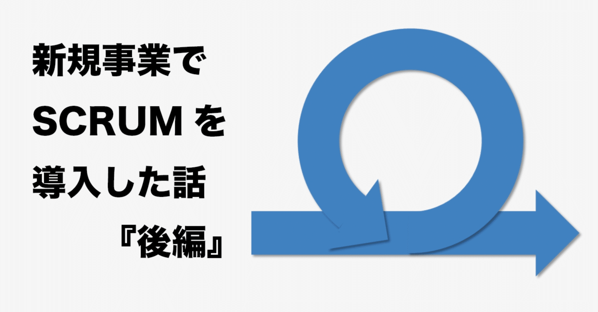
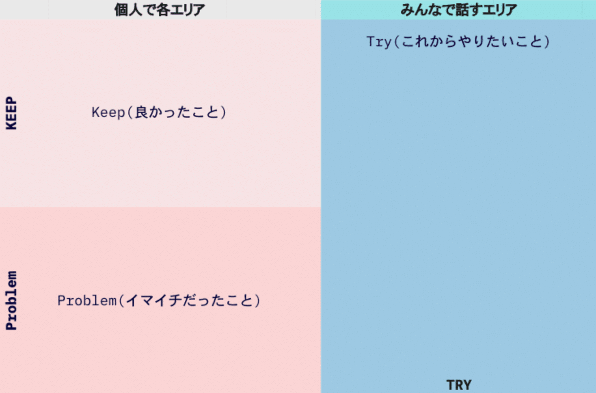
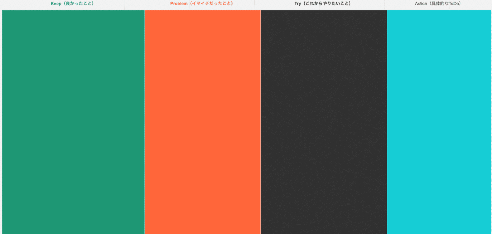
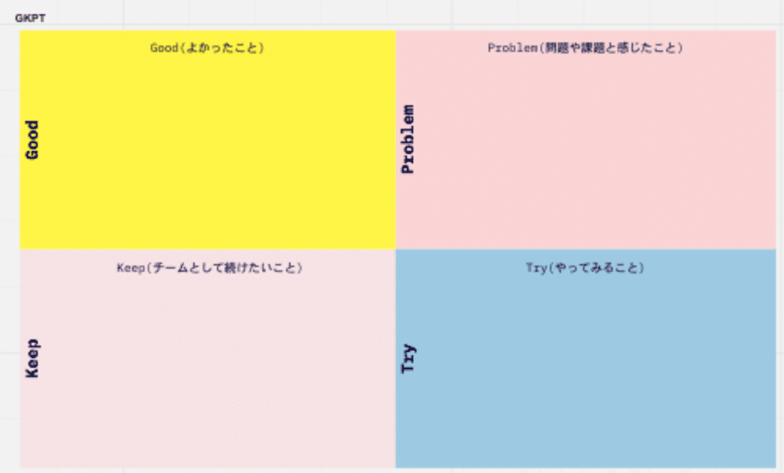

# プロダクト開発にScrumを導入した話 -スプリント0をやってみてのふり返り-

> 出典: https://note.com/mine_unilabo/n/n79e2918aa7f4  
> 公開状態: publish  
> 更新: Mon, 27 Dec 2021 10:20:43 +0900  
> 区分: 公式ブログ

五反田にあるベンチャー企業のユニラボで[アイミツCLOUD](https://imitsu-cloud.jp/)というSaaS型のwebサービスの開発でスクラムマスター（SM）をやっています、みね＠ユニラボ（[@mine\_take](https://twitter.com/mine_take)）です。

前回までにスクラムの導入を決めた話と導入するまでに行なった内容を書きましたが、今回はその続編で最終回になります。

<https://note.com/embed/notes/nb068316a12ec>

<https://note.com/embed/notes/n288c21a89778>

今回はスプリントに入る前のフェーズのスプリント0(※1)を実施した話と、現在のスプリントまで改善したことをまとめていきたいと思います。

## スプリント0をやってみて

スクラムの考え方や、スクラムイベントの説明を事前にしてきました。
ただ、実際にスプリントをやってみると、準備が足りていなかったことが明らかになりました。

起きたことを下記にあげていきます。

### スプリントプランニングの準備で起きたこと

元々アジャイル開発で、プロダクト開発を行なっていましたが、プロダクトバックログ（PBL）として管理されていませんでしたので、その準備から始める必要がありました。

### プロダクトバックログの準備

プロダクトバックログとは、プロダクトを成長させるために必要なもの、機能の修正、不具合などをプロダクトバックログアイテム（PBI）として管理している一覧になります。このプロダクトバックログアイテムは優先度順に並べられています。

優先順位は顧客要求、市場調査結果、リスク対応、機能要件、非機能要件、依存関係などを考慮して最終的にPOが決定をします。

プロダクトオーナー（PO）がプロダクトバックログアイテムの内容と優先順に責任を持ちますが、POだけがプロダクトバックログを作っていく必要はなく、スクラムチーム全員で追加を行える状態が良い状態です。

プロダクトバックログアイテムは、ユーザーストーリー形式で完了の定義とストーリーポイントを書くフォーマットが一般的です。
ユーザーストーリーは下記のような形で要求（ユーザーがやりたいこと）をまとめていきます。

> 「＜ユーザー／顧客＞ として ＜XXXを達成＞ をしたい、なぜなら ＜理由＞ だからだ」

プロダクトバックログを作成していく為に、改めてユーザーストーリーを考えていくと、**WhatとWhyが可視化**されてます。

今まで考えていた追加機能や、機能の修正も、プロダクトバックログ化し、ユーザーストーリー形式にすると、改めて優先度順や今やるべきことなのかを決定ができるようになりました。

### スプリントプランニングが失敗した理由

プロダクトバックログを1スプリント分（1週間）の準備をして、スプリント0のスプリントプランニング（計画）を行なったのですが、スプリントプランニングは見事に失敗しました。

失敗した理由はいくつもありました。

1. リファインメント(※2) が事前に十分に行えておらずに、プランニングの場で細かな確認事項が多く出てしまう状態になり、その場で確認ができずに、宿題となってしまう箇所が出てしまいました。
2. 以前にあった開発タスクをプロダクトバックログに移行したPBIは、情報が不明確であったり、WhatやWhyに違和感を覚えるものもありました。
3. ストーリーポイントの意味は伝わっていたのですが、実際にプランニングポーカーをやる際に、
   ・どう考えてポイントを付けるのか？
   ・何を規準に判断するのか？
   とチーム内で混乱が起きてしまいました。
4. 大きめのプロダクトバックログアイテムを、どの様に分割するのか、分割したスプリントバックログをどの様に管理するのか。という部分の話し合いが行えておらず、プロダクトバックログアイテムの分割と管理方法に関して、課題が発生しました。

事前に準備を行えていれば、回避できた内容もありましたので、準備不足だった為に発生した内容だったと考えています。

### スプリント0のふり返り

スプリント0をやってみた感想とふり返りをした内容です。

- 今までの開発のタスクを、そのままプロダクトバックログアイテムにしてはいけない。ユーザーストーリーを考えて作成をする必要がある。
- プロダクトバックログアイテムを作るには、最初は時間がかかる作業なのでプロダクトバックログを準備する為の時間を確保する必要がある。
- スクラムの各イベントのやり方や、フローに慣れるまでは時間が必要なので、焦ってはいけない。表面上の活動量が低下している様に思えても、コミュニケーションや、改善の行動を含めた活動量で考える。
- ふり返り（スプリントレトロスペクティブ）はスプリントの改善をする為に、とても大切なイベントである。

## スプリントの中で改善したこと

スプリント0の失敗から、スプリントを進めていく中で改善をしていった内容を挙げていこうと思います。

### リファインメントの改善

毎朝30分、デイリースクラムの後に時間を用意していましたが、プロダクトバックログの準備がギリギリになってしまった状況もあり、リファインメントは月曜に固定で時間を決めました。リファインメントで話すPBIに担当者をアサインし実施をしています。

リファインメントの参加者は、PO、SM、ディレクター、テックリード、PBI担当者でオンラインで行います。
オンラインで行うと、担当者以外のメンバーも聞くだけの参加もできる様にしています。

### ふり返りの改善

ふり返りのやり方、フレームワークはいくつか種類がありますが、実際に取り入れたフレームワークを紹介します。

**KPT**ふり返りの定番フレームワーク「KPT」です。良かったこと（Keep）・改善が必要なこと（Problem）・次に取り組むこと（Try）の3つを振り返る手法です。

KPT

**KPTA**
「KPT」にA（Action）を足した手法です。ふり返りを行うなかで、TとAを切り分けづらかったので、変更しました。

KPTA

**GKPT**「KPT」にG（Good）を足した手法です。ふり返りを行うなかで、KeepからGoodを分離すると、良かったこと、達成したことをGoodであげだし、そのGoodを継続する為のアクションをKeepにあげるという流れができました。

GKPT

**チェックインの導入**ふり返り会に入る前に、チェックインを取り入れました。
「場を設定するアクティビティ」として下記の意識しています。

> 部屋にいる全員に口を開いてもらう。最初に喋らなかったら、ずっと何も喋らなくてもいいという暗黙の了解を得たと思ってしまう。レトロスペクティブの肝はグループで考え、一緒に学んでいくことなので、全員参加が不可欠である。

実際にはふり返り会は下記の様に進めています。

1. ふり返りの時間までに、**G（good）**、**K（Keep）**、**P（Problem）**の書き出しをmiro上で行なって行ってから参加します。
   ※ふり返りでは、参加メンバーがmiro上で確認しながら行います。
2. 当日は、毎回ふり返りのグランドルール(※3)の確認からはじめます。
3. GKPTの話をする前に、チェックインを行います。
   「今のスプリントを5段階で評価すると？」と問いかけに対して、各自で評価の数値とコメントを1分程度で話します。
4. 続いて、前回の「**Try**」で上がったアクションの確認をします。
   **Try**に対して
   ・行動が行えた、達成できたは**Good**
   ・行動が行えなかった改善ができなかったは**Problem**
   として挙げていくと、フレームワークの中で正しく改善を進められます。
5. このあとは、通常のGKPTのフレームワークのフローに則って進めています。

### スプリントバックログの作成の改善

プロダクトバックログを作る為に準備が必要と書きましたが、今回のプロジェクトでは、ユーザーヒアリングをした結果を元に、ユーザーが価値として捉えていることが、今提供できている価値なのか、これから提供していく価値なのかを考え、その価値をどう提供していくのか、という戦略・戦術の練り直しから行いました。

まずは、価値を提供する為にテーマという大きな単位で考え、そのテーマを実現する為の施策を具体化し、プロダクトバックログアイテムにしていくという形でプロダクトバックログを作成しました。

この**提供する価値**を決め、**テーマ**を決めて、**プロダクトバックログ**に入れていくフローができてくると、戦略に基づいた施策とその検証までがより明確になり、**What**や**Why**で迷うことが少なくなりました。

### スプリントプランニングの改善

スプリントプランニングは2部構成で行っています

1部では、POからの**スプリントが終わった状態を伝える**、このスプリントで**作ったものはどの様な価値になるのか**、と話してもらう場としています。

2部はスクラムチームがスプリントの対象となっているPBIを実現する為に必要なタスクに分割します。そのタスクを担当者に割り当てます。

ここで決まった内容をもとに、スプリント期間中に終了できるPBIを決めて、その内容でPOと合意を得ます。

リファインメントが十分でないと、1部でPBIの詳細な内容の確認の場になってしまい、スプリントが終わった後の状態の話や、ユーザーに届けたい価値の話が十分に伝えられない場合が多かったので、リファインメントを事前にやることが、スプリントプランニングを成功させる為には大切です。

### スプリントレビューの改善

スプリントレビューはスプリントの終わりに実施されるスクラムイベントの1つです。

スプリントレビューには、プロダクトに関わるメンバー、ステークホルダー(※4)に参加をしてもらいます。参加者に対してデモを行い、**フィードバックを得る機会**と考えて実施をしています。スプリントレビューで**実演するデモは完成済の機能**が対象です。未完成のプログラムは、実演の対象に含めないようしています。

スプリントレビューの準備として下記を行います。

1. ステークホルダーを招待します。
2. スプリントの進捗状態を確認する。
3. スプリントで開発されたPBIのチェックとデモを行う機能を準備する。
4. 必要に応じて資料を作成する。

レビューの当日は下記の通り進めます。

1. 会議の目的や前提事項を共有する。
2. スプリントで完成した機能のデモを行い、ステークホルダーからフィードバックを受ける。
3. フィードバックを受けた内容をメモをし、PBLに反映していく。

## スクラムの現在

リファインメントを事前に実施ができていれば、スプリントプランニング前に懸念点を払拭ができたり、開発チームからの提案の機会が増えました。スクラムが進んでいく中で、より開発チームに任せている部分が増えています。

スプリントレビューではスプリントで作ったものをプロダクトに関わるメンバー（スクラムチーム以外）に対して、デモを行なっているので、フィードバックをもらう機会が増えました。その影響で、組織としてもプロダクトに関しての改善の話やフィードバックが増えて来ていると実感しています。

また、ふり返りの場がとても大切であると、改めて感じています。スプリントをうまく進めるためのプロセスの改善であったり、品質を向上させる為の話であったり、プログラムが抱えている問題など、ふり返りの場でメンバーから課題としてあがってきました。
その課題に対して改善行動を行うと解決することもありますし、プロダクトとしての懸念もスクラムチーム内で共有することが、重要だと考えています。

ふり返りを継続的に行い、課題の共有や改善を行えており、チームビルディングが進んでいる実感があり、その結果としてプロダクトの成長が促進できていると感じています。

## まとめ

新規事業にスクラムを導入してみて、プロダクト開発の良い流れができてきたと感じています。

スクラムの手法に則ることで、ある意味で強制的に改善が進んでいきます。

また、ユーザーストーリー形式でプロダクトバックログアイテムを作成していくので、「ユーザーが求めているものとは何か」を考えてプロダクト開発を進められていて、プランニングの際にもどの様な状態になっているのか、自分たちが達成したいことに向けてどう行動をしているのかが、理解しやすい状態になっています。

仮説検証をしながらつくるべきものを探っていくという確実性と、どう戦っていくかという状況のプロダクト開発には、スクラムという手法があっていると実感をしています。

---
※1 : スプリント0とは、スプリント1の前という意味で、スプリントに入る前の準備をするフェーズのこと
※2 : **リファインメント**とは、プロダクトバックログに含まれるアイテムに対して、詳細の追加、見積り、並び替えをすること
※3：**グランドルール**とは「参加者が安心して発言でき、ふるまうことができる「**安全な場**」を作る1つの方法です
※4：**ステークホルダー**とはプロダクトに対して利害関係を持つ**スクラム**チーム以外の人たちのこと
---

**[PR]ユニラボ に興味がある方へ**

ユニラボではプロダクト開発を一緒にやってくれるメンバーを募集しています。カジュアル面談もやっているので、気軽にお問い合わせください！

<https://note.com/embed/notes/ne17b9a378f32>

<null>

<null>
