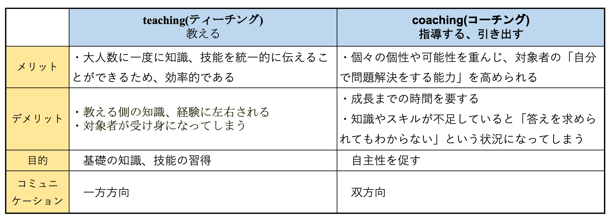
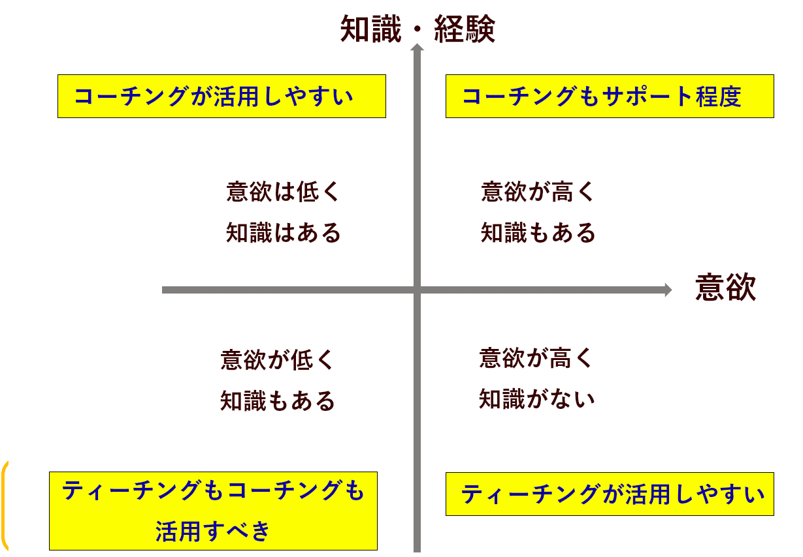

# コーチングとティーチングとトレーニングの違い

> 出典: https://note.com/mine_unilabo/n/n7d435642c054  
> 公開状態: publish  
> 更新: Mon, 03 Jan 2022 16:27:36 +0900

ベンチャー企業で新規事業のプロダクト開発でEM（Engineering Manager）をやっています、みね（[@mine\_take](https://twitter.com/mine_take)）です。
※本記事は個人の活動による記事であり、会社の公式見解とは異なる場合があります。

新規事業のプロダクト開発のPdMをやったり、アジャイル開発のスクラムでSMをやったりして来ました。主にWEB関連のプロセス開発をやって来ました。noteでは過去に経験した内容や、新たに勉強している部分の情報をまとめる形で記事にしています。

人材育成や組織開発という文脈でよく耳にするキーワードに、
**ティーチング（teaching）**、**コーチング（coaching）**、**トレーニング（training）**がありますが、似た様な場面で使われたり、ニュアンスが似ている部分もあるので、その違いをきちんと認識しておきたいと思い調べました。

## ティーチングとは？

ティーチングはその名の通り、**経験が浅い人を経験豊富な人が相手に自分の知識やノウハウを伝えるという手法**です。日本語に置き換えると、指導に近く、先生が生徒に授業を行うようなことです。

ティーチングにおけるコミュニケーションのスタイルは、**指導者から指導を受ける側への一方通行**となります。また、ティーチングは指導者側が明確な答えを持っているという前提で行われることが多いです。

### ティーチングを行うメリット

ティーチングを行うメリットは、対象者が持っている知識や経験に影響を受けず、目標を達成するために必要な答えを教えることができることです。

また、ティーチングは一方的なコミュニケーションとなるため、大人数に対して一度に行うことができます。しかも、自分で答えを考える時間は必要ないため、短期間で行うことができます。

### ティーチングを行うデメリット

一方で、ティーチングを行うデメリットは、**対象者の自主性や自律性が向上しにくく、受動的で依存傾向のある人材を育成しがちになる**ことです。

ティーチングのみを行っていると、対象は指示したとおり、言われたことしかできないという状態になってしまう可能性があります。ティーチングが必要な段階かどうかを見極め、自主性や自律性を高めたい場合には関わり方を適切に変えていくことが必要です。

また、ティーチングする指導者側の知識や経験に影響を受けやすいというデメリットもあります。ティーチングの場合、対象者に対してはティーチングする側が持っている知識や経験しか与えられないため、それ以上の目標達成を促しにくくなります。

### ティーチングが有効なケース

ティーチングが効果的なケースはどのような場合があるのでしょうか。2つの場合をご紹介します。

**対象者のスキルや経験が乏しい場合**

ティーチングでは、答えが明確に定まっている場合、たとえば新入社員研修や中途入社社員への研修など、対象者のスキルや経験が乏しい場合に効果的です。 具体的には、電話の対応方法や来客時の対応方法、社内ツールの利用方法などを教える際にティーチングが効果的です。

**対象に意欲はあるものの、能力がまだ未熟な場合**

ティーチングは、対象となる相手には意欲を持っていることが求められます。自己実現に向けて能動的に動ける状態であれば、ティーチングによって教えられた知識やスキルは行動に結びつきやすくなります。

しかし、能力に関しては、対象者が未熟なときに効果を発揮します。知識やスキルが十分に身についていなくても、ティーチングで必要な力を補うことで、目標達成へと導くことができます。

反対に、知識やスキルが十分に身についている習熟度が高い相手にティーチングを行ってしまうと、相手が物足りなさを感じたり、モチベーションが下がってしまったりすることがあるため、注意が必要です。

**緊急性の高い業務を担当している場合**

また、ティーチングは短時間で相手に情報の伝達が可能なため、緊急性の高い業務を部下が担当している際にも効果的です。 具体的には、非常時のエラーが見つかった場合や、クレーム対応などの際は緊急的な対応が求められるため、ティーチングが効果的でしょう。

## コーチングとは？

コーチングの大きな特徴は、**「目標を達成するためにどうしたらよいかの答えは、対象者の中にある」**というスタンスを取り、対話を通してコーチングの受け手が、**自ら答えを導き出せるようにサポートする**指導の手法です。

そのため、コーチングでは**答えを一方的に教えるのではなく、**コーチする側とコーチングを受ける側との**双方向の対話を重要視し、対話を重ねることを通して、対象者の中にある答えを引き出していくという手法**をとります。「頭でわかっていても、行動できない」を解決するための支援がコーチングです。

### コーチングのメリット

コーチングのメリットは、対象者の「自分で問題解決をする能力」を高められることです。

コーチングは相手のポテンシャルを引き出すため、自発性に委ねる方法です。人材育成において、育成の対象となる社員は受動的になってしまう傾向があります。特にティーチングとはその方法から大局的にあるため、コーチング中は部下がどのように学ぼうとするのか、そのプロセスを評価して中期的な育成します。その結果、ティーチングとは違って、指導者の能力以上に実力を発揮できるようになるケースもあります。

対象者ときちんと向き合って対話ができるコーチングのスキルやコミュニケーション能力を身につけていれば、どのような経験を持った人でも対象を目標達成に導くことができます。

### コーチングのデメリット

一方で、コーチングを行うデメリットも存在します。対象者の知識や経験が不十分だと目標達成のための答えが存在せず、目標達成に近づくどころか混乱を招いてしまう可能性があります。

コーチングを行う際には、答えを自分の中に見出せるか、対象者の知識や経験の度合いを正しく把握することが必要です。対象者のスキルや心情に合わせ、長いスパンで育成に取り組めなければいけません。特にコーチングによって、受け手が答えを導き出せるかどうかは、指導する側のマネジメントスキルにも影響を受けることも少なくありません。そのため、属人的になりやすく、指導者によってばらつきが出てしまいます。

また、目標達成にスピードが求められる場合には、コーチングには一定の期間がかかるということもデメリットと言えるかもしれません。ティーチングと違い、あくまで中期的な視野を持っておこなう育成のためです。

コーチングは、対象者が自分で自分の中にある答えを見つけることが求められるため、考える時間が必要になります。すぐに答えを出して前に進まなければいけない場合などでは、自分で考える時間が足かせとなりうることもあるでしょう。

### コーチングが有効なケース

メリット・デメリットを踏まえ、コーチングが効果的なケースを紹介します。

**対象者に意欲があって、能力もある程度向上している場合**

コーチングは自分で考えて答えを見出してもらう必要があるため、問題を解決し目標を達成する意欲を持って能動的に動くことが前提として求められます。意欲が低い相手や現状維持を望む相手に対してコーチングを行う必要がある場合には、まずは小さな成功体験を積ませるなどして、目標達成へのモチベーションを向上することが必要です。

自分で答えを見出すためには、問題解決や目標達成に必要な知識やスキルを持っている必要があります。基本となる知識やスキルが不足していると、先述したように「答えを求められても、考える材料がないからわからない」という状況が発生します。そのような相手にはティーチングで知識やスキルを教えてから、コーチングにギアチェンジし目標達成を支援してあげましょう。

**対象者にある程度のスキルや経験がある場合**

コーチングは、対象者の中にあるポテンシャルを引き出す指導法であるため、ある程度のスキルや経験が、対象者にすでにある場合に効果的に働きます。 具体的には、営業部の後輩に対して、どのようにすれば新規顧客を獲得し、自身の売り上げを向上させることができるかといった、答えが明確に定まっていないものを指導する際に効果的です。

**緊急性は高くないが重要な内容を教える場合**

対象者だけでなく、タスクによってもコーチングが有効な場合とそうでない場合があります。

コーチングは時間をかけて1体1でじっくりと行っていくため、コーチングが有効なタスクは、重要度が高く、緊急性が低いものです。重要度が高いタスクは、しっかりと計画して取り組もうという意欲を生み出します。具体的には、新たくチームを抱えることになった際、どうすればマネジメントがうまくいくかなどの内容を指導する際に効果的です。

## トレーニングとは？

トレーニングは、**今までできなかったことを訓練すること**であり、**指導する側が教える対象者の先頭に立ち、実際にやってみせること**で、対象者ができるようになるまで**引っ張る形で導いていく手法**です。

ティーチングやコーチングと同じく指導方法の1つですが、一方的に指導するティーチングや、相手のやる気を引き出すことで行動を促すコーチングとは異なり、指導側が主体的に引っ張り上げていくという点で異なります。

たとえば、はじめて泳ぐ子供に泳ぎを教えるのは、ティーチング、コーチングではなく、トレーニングです。基本を教え、それができるようになること、分かっていることができるようになるのが、トレーニングなのです。

## ティーチングとコーチングの違いとは？

コーチングとティーチングは、ともに対象の行動変容を促し、目標達成へと導くために行われますが、アプローチの仕方はそれぞれ違います。

### ティーチングとコーチングのメリットとデメリット、目的の違い

ティーチングとコーチングのメリットとデメリット、目的やコミュニケーションの説明をしてきました。この意味や、違いを理解した上でつかう事が重要です。この内容を表にまとめます。

ティーチングとコーチングのメリット、デメリットのまとめ

### ティーチングとコーチングの違いまとめ

これまでは人材開発といえばティーチングが一般的でした。知識や経験の豊富な人材が教えることを通して知識の習得を図り、成長を促します。

ティーチングは、基本的な知識や技能を習得することを目的としています。学習プロセスが明確で速く大勢の人に提供できる反面、やり取りが一方通行になりやすく**自主性や自分で考える力が育ちにくいというデメリット**があります。このようなことから、コーチングとティーチングは適切に使い分けを行うことが大切になります。

ティーチングとコーチングが有効なシチュエーション

コーチングは、自発的に動いてもらえるようになることを目的としています。基本的な知識、技能を持っている事が前提となります。また、対象者の話を聞く、対象者に質問をする、成長を認めるなどにより、双方向でのコミュニケーションです。

対象者の状況や与えられた仕事内容によって、上手にコーチングとティーチングを使い分けて対応していくことが大切です。

## トレーニングとコーチングの違い

トレーニングとは（training）語源がtrain（列車）と言われています。目的地まで、レールを伝って進んでいく。トレーナーが実際にやってみせ、その後トレーニーがその作業ができるまで、引っ張っていく、という形です。

コーチングとは（coaching）語源がcoach（馬車）と言われています。馬の後ろで2人並んで、その先の進み方について一緒に考えて、ゴールを目指すという形です。

目的地までの行き方は、馬車の手綱次第でどんな道を辿っても構わない。その向かう道の選択肢は自分にある（自分の意志）ということです。

トレーニングは、知識や技術の向上に焦点を当てて、行うもので、コーチングはその人のパフォーマンス（潜在能力）を引き出すことに、焦点を当てるものです。

まず相手の何に焦点をあてて、育成を行っていくか？を考え、どちらの手段を選択しようかと考えることが大切となってきます。

### スポーツのトレーニング

スポーツでトレーニングを行う人のことを、コーチやトレーナーと呼びます。

コーチは指導者のことを指す言葉で、コーチングは指導方法です。

スポーツでいうコーチングも、上記で説明したコーチングと同じ意味で使われており、すべての答えは対象者の中にあると考えています。

「目的地や目標、プロセス、手段すべて生徒の中に答えがある」という視点でフィードバックします。

たとえばコーチ（指導者）が「どんなトレーニングが必要だと思う？」「どのスキルが不足していると思う？」のような質問をします。

コーチ（指導者）は答えを引き出すサポート役です。正解を知っていても教えません。ゴールの方向は教えても、目的地への行き方は対象者が自分自身で決めていきます。

## まとめ

ティーチング、コーチング、トレーニングの理解のためにまとめました。
この言葉の違いは、語源を確認しておくことで、理解がしやすくなりました。

- teaching（ティーチング）→teach（ティーチ）：人に教える
- coaching（コーチング）→coach（コーチ）：技術指導
- training（トレーニング）→trainee（トレーニー）：訓練を受ける人

言葉の意味と定義を確認した上で、使い分けをして行きたいと思います。
