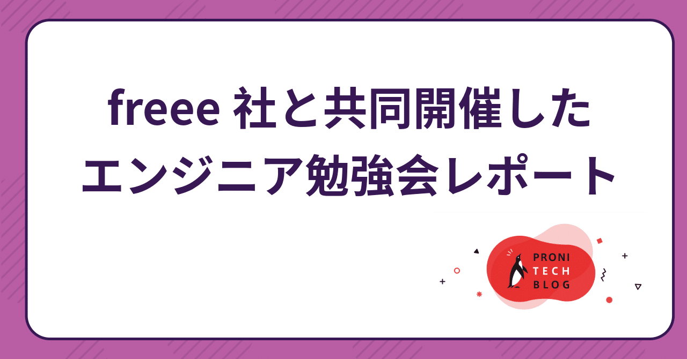
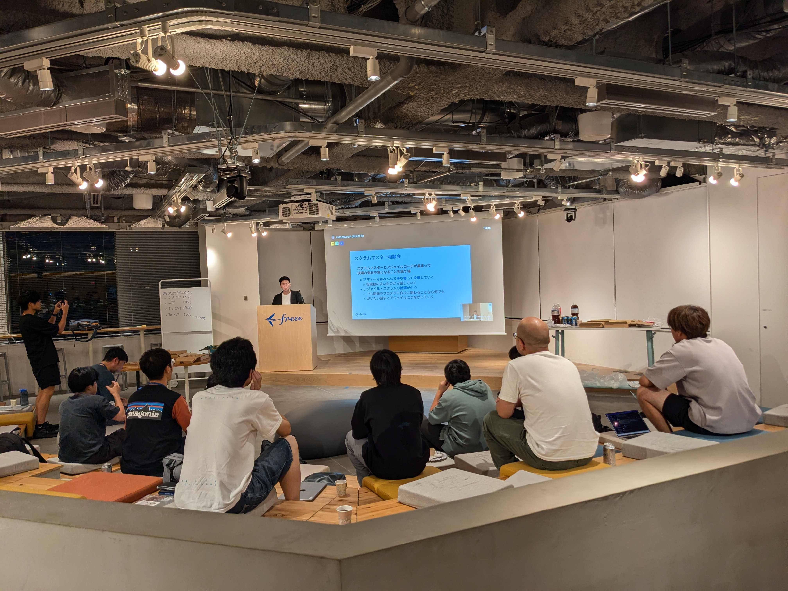
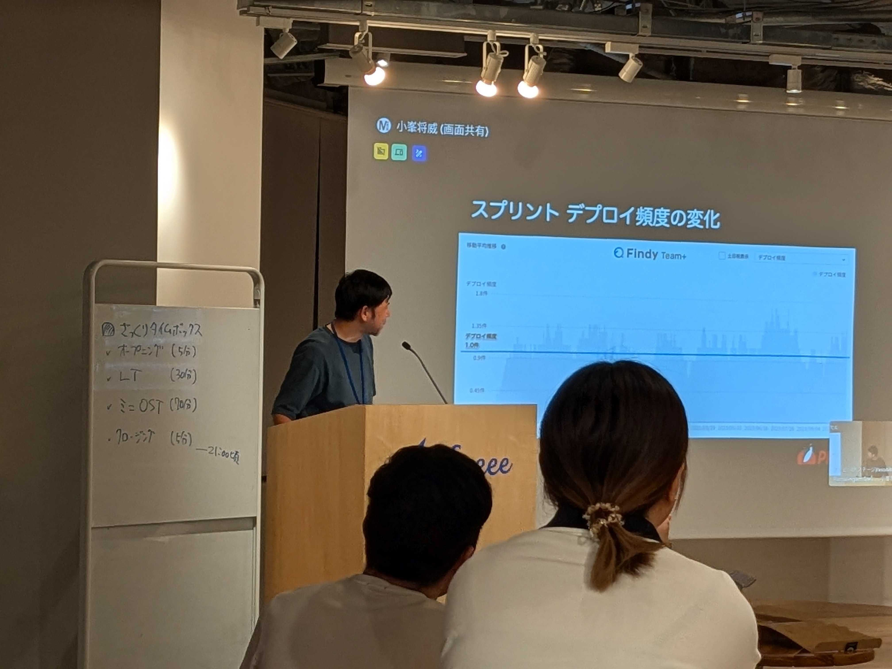
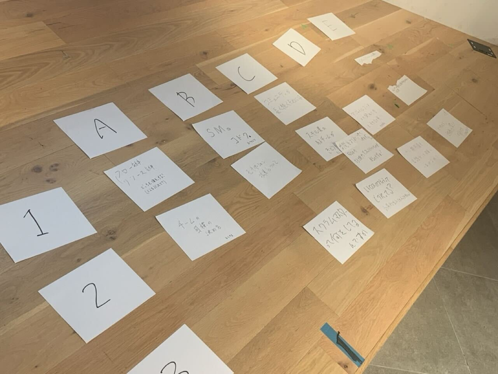
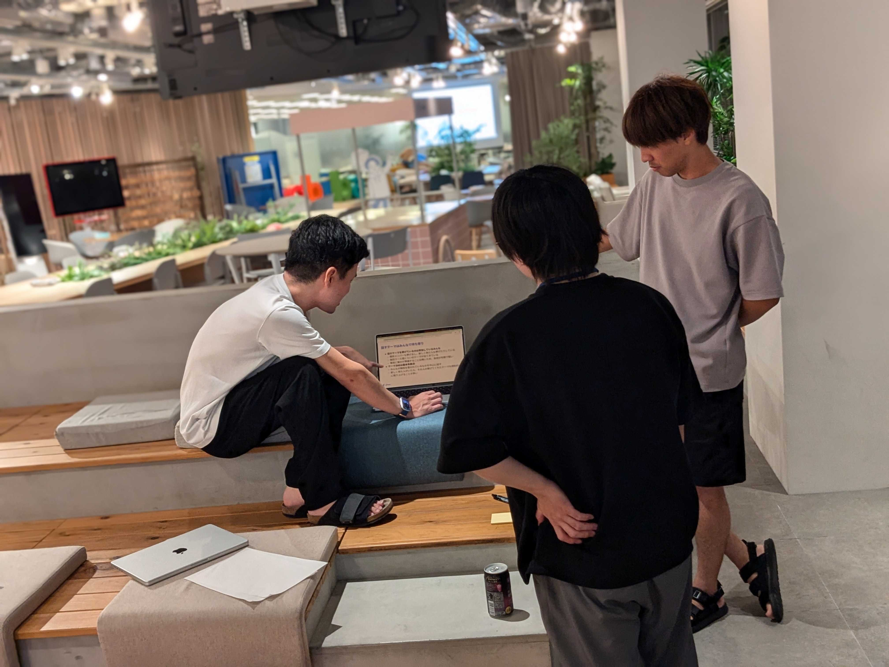
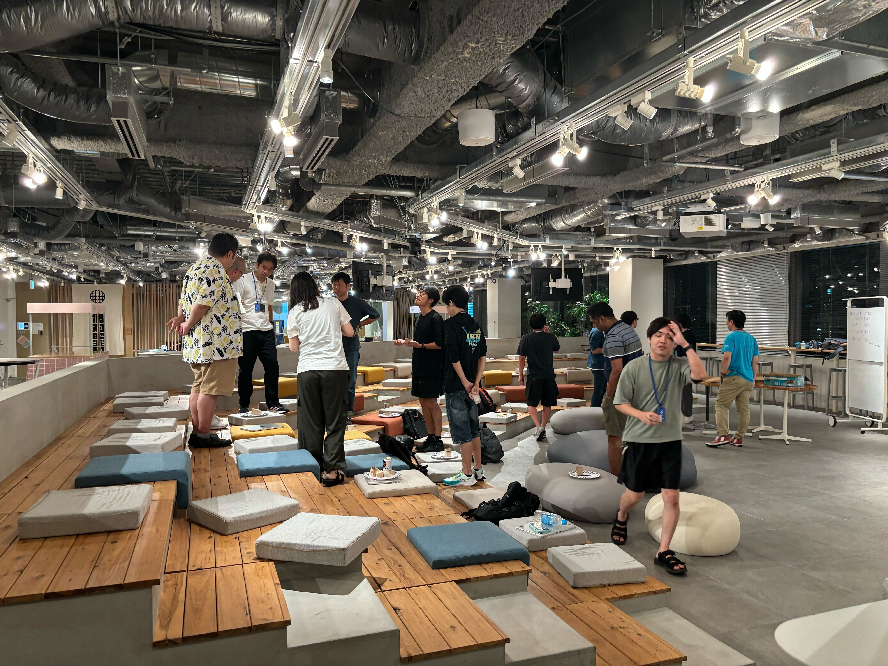
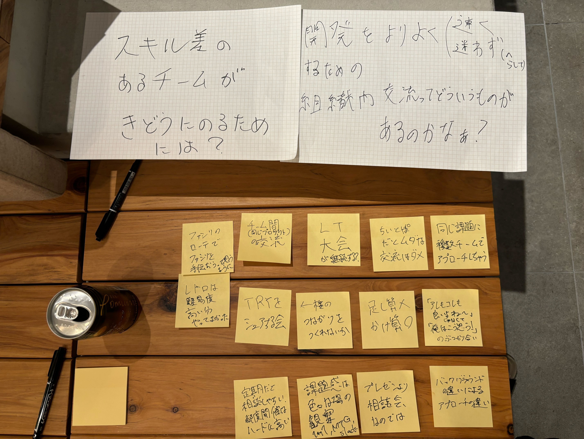
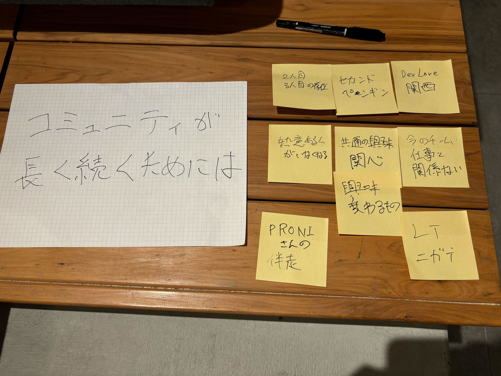

# freee社と共同開催したエンジニア勉強会レポート

> 出典: https://note.com/mine_unilabo/n/n8cec6b1f161e  
> 公開状態: publish  
> 更新: Mon, 30 Sep 2024 16:40:02 +0900

こんにちは。PRONI株式会社でCTOを務めているみね＠PRONI（[@mine\_take](https://twitter.com/mine_take)）です。

先日、弊社とfreee社が共同でエンジニア向け勉強会を開催しました。この記事では、2社での共同勉強会を開催するにあたっての準備プロセスや、そこから得られた知見を共有したいと思います。

また、当日の勉強会の雰囲気や、参加者同士の知識共有、ネットワーキングの様子もお伝えします。ぜひご一読ください。

## 1. 勉強会の目的と背景

アジャイルコーチとしてfreee社と弊社（PRONI）に関わって頂いている**株式会社レッドジャーニー**の[**中村 洋**](https://x.com/yohhatu)さんに紹介をして頂いたことがキッカケで、共同でエンジニア勉強会を開催しました。

共同勉強会の話が出てから開催まで、1ヶ月半というスピード感で実施ができました。あっという間でしたｗ

### なぜやるのか？

• お互いの現場の知見を話し合うことで、より良いやり方のヒントや現在地、課題を見つける
• 社外の様子を知る機会を提供し、新しい情報や刺激を受け取る
• 以上に関心がある人々の参加を期待し、新しい知り合いを作る

### 運営方針と進行ルール

• **半分Closedな場として設定する**
イベントページなどでオープンには募集しない
半Closedな場を想定するが、やったことの情報発信は想定しておく
• **参加人数の調整**
参加人数は20〜30人程度に抑え、ゆっくりと話せる場を提供する
2社間での共同勉強会なので、参加者が偏らないように気を付ける
• **双方向の会話の場を作る**
一方的な話だけでなく、双方向の会話の場を用意する（セミナー形式にしない）
LTの時間と、OSTの時間を用意する
**• 食事と飲み物の提供**
勉強会では、食事や飲み物（アルコールも含む）を提供し、参加者がリラックスして交流できる環境を整える
この食事や飲み物は懇親会でもそのまま利用し、参加者同士の会話を円滑に進めるサポートにつかう
• **懇親会も開催の準備をする**
可能であれば、懇親会も開催し、場所を変えずにその場の熱量を維持する
懇親会では、LTやOSTセッションで話した内容を引き続き参加者同士で話し合う場として活用します

## 2. 事前準備

事前準備として、当日までに以下の項目を用意しました。

### 開催場所と開催日の決定

今回は、参加者20〜30名が入っても十分な広さを確保したく、freee社のオフィス内のスペースを使用させていただきました。スペースにも余裕があり、リラックスした環境で進行することができました。

今回は会場を先に決めて、会場の状況に合わせて、開催日を決定しました。

### LT / OST 準備

LTは、各社2名ずつ、合計4枠としました。テーマには特に制限を設けず、「自慢できる話＝ドヤれる話」を発表してもらう形式を採用しました。

アジャイルやスクラムに焦点を当てるべきかとも考えましたが、今回はテーマを絞らず、登壇者に任せる形にしました。

OSTの準備として、テーマ提案や議論をスムーズに進めるため、付箋やペンを用意しました。会場準備と合わせて、freee社に担当して頂き、感謝しています。

参加者へのOSTの説明は洋さんにお任せし、事前に説明資料も共有していたため、特別な準備は必要ありませんでした。

OSTは事前準備があまり必要なく、運営コストが低い点が魅力で、運営側としても助かります。

### 食事、飲み物

勉強会開催にかかる主な費用は、会場費と飲食費です。今回は、freee社が会場を提供してくださったため、弊社が飲食費を多めに負担する形で調整しました。食事は、LTやOSTの間でも食べやすいように、ワンハンドで食べられる小分けの料理をデリバリーで手配しました。

この「ワンハンドで食べられる小分けの料理」は参加者から好評だったため、今回得られたノウハウとして、今後の勉強会でも積極的に活用していきたいと思います。

### タイムボックス決め

特に新しいタイプの勉強会では無いので、王道のタイムボックに組みました。
• **オープニング**（5分）
• **ライトニングトーク**（30分）
　- LT（5分） × 4人
• **ミニOST**（75分）
　- OST説明（5分）
　- テーマ出し（5分）
　- テーマ紹介（5分）
　- ミニOST本編（20分 × 3セット）
• **クロージング**（5分）
• **懇親会**

## 3. 勉強会の概要

###

### ライトニングトーク(LT)セッション

5分間のプレゼンテーション形式で進行しました。時間が過ぎると強制終了されるスタイルが、新鮮で興味深かったです。
※LTの具体的な内容は、別の機会に共有いたします。

**LTの風景**

会場は大崎のfreee社のオフィスで開催

５分で強制終了される寸前のプレゼン

5分以内に完了したLTは1つだけで、残りの3つは途中で強制終了となりました。しかし、LTで取り上げられたテーマは、その後のミニOSTセッションでも採用され、さらに議論に繋がりました。

### ミニOST(オープンスペーステクノロジー)セッション

**OSTの概要
”OST（Open Space Technology）”**は、参加者が自発的にテーマを出し合い、そのテーマについて自由にディスカッションする形式のワークショップです。参加者全員が積極的に関わり、自分の興味・関心に沿った議論を深めることができます。

**OSTの4つの原則**OSTには **「4つの原則」** があります。

- ここにやってきた人は、誰もが適任者である
- 何が起ころうと、それが起こるべき唯一のことである
- いつ始まろうと、始まった時が適切な時である
- いつ終わろうと、終わった時が終わりの時なのである

当日はOSTを始める前に、洋さんに下記の資料を使って原則や役割について説明していただきました。

<https://speakerdeck.com/takaking22/open-space-technology-introduction>

**テーマ出しと紹介**今回の参加者の大半がOSTへの参加が初めてでしたが、参加者のほとんどが自分の現場で気になっていることや話してみたいことを積極的にテーマに出していました。予想よりも多くのテーマが出たので、スペースを追加し、3セッションをA〜Eのスペースを用意して開始しました。

色々なテーマが出ました

### ディスカッション中の風景

LTで話した内容と関連したテーマを話したり

LTの内容を見ながら

移動しやすい様に立ってディスカッションする場も

立ってディスカッションする場も

**ディスカッションした内容**

スキル差があるチームが軌道にのるためには

コミニティが長く続くためには

**クロージング**勉強会全体の総括を行いました。
そして、懇親会（任意参加）への誘導を行いました。

### 懇親会の様子

懇親会では、さらに深い交流が行われ、参加者からも多くのポジティブなフィードバックをいただきました。
※懇親会は楽しく過ごせたのですが、写真撮り忘れました。。。。

## 4. 参加者の声とアンケート結果

### 参加者からのフィードバック

参加者からのポジティブな反応と改善点の一部を紹介します。

- LTというものが時間で強制的に閉じられるものだと知って、面白かった。
- 「リソース効率」と「フロー効率」の話は、他の話題が気になって聞き逃してしまったが、気になっていた。
- 楽しかったです！自分のテーマに人の集まりが悪いとちょっと寂しい。
- 「スクラムマスターの孤独」については永遠の課題だなと。
- エンジニア以外のメンバーでやってみても楽しそうだなと思いました。（PdM、企画やデザインなど）
- 参加者のEMやスクラムマスターの人が多く、見ている部分が違って背景の理解がしづらいことがあった
- 初めての社外イベント&（聞くだけでない）イベント参加で、緊張と面白そう（期待）入り混じりつつ参加しました。終わってみるとあっという間で楽しい会でした。

勉強会に参加したエンジニアが記事を書いているので、↓こちらも見てみてください。

<https://note.com/m_shimokawa/n/n93c35bbd4df8>

## まとめ

今回のfeee社との共同開催によるエンジニア勉強会は、非常に充実した内容となりました。まず、参加者同士が実務で得た知見を積極的に共有し合い、現場における課題や成功事例、そして今後の改善策について多くの学びを得ることができました。

参加者アンケートでも、OST（オープンスペーステクノロジー）で取り上げられたテーマに対する感想が多く寄せられています。OSTは、参加者が自発的にテーマを提案し、それに基づいて議論を深める形式で進行しました。初めてOSTに参加したメンバーも、自分の興味や関心に沿ったテーマで議論できる新鮮な体験に対し、高い満足度を示しました。従来のセミナー形式では得られにくい、双方向の対話が可能となり、より深い知識の共有が実現したことが、大きな成功要因の一つです。

今回の勉強会で最も大きな成果は、社内外のエンジニアが知識や経験を共有し合い、共に成長できる場を作り出せたことです。今後も、このような機会を継続して設け、エンジニア同士のコミュニケーションを促進し、組織の活性化を目指していきます。

## PRONIでは、エンジニアの採用を積極的に行っています

私たちPRONIでは、エンジニアメンバーを積極的に募集しています。今回の勉強会で取り上げたように、私たちは知識共有や技術的なチャレンジを大切にし、成長を続けるエンジニアチームを目指しています。

あなたのスキルと経験を活かし、一緒に新たな価値を創造することを楽しみにしています。詳細な採用情報は、PRONIの採用ページをご覧いただき、ぜひお気軽にお問い合わせください！

### カジュアル面談申し込みフォーム

<https://hrmos.co/pages/proni/jobs/C24-1000>

### エンジニア向け採用資料

<https://speakerdeck.com/proni/proni-for-engineer>

**■PRONIに関する情報配信登録**
PRONIに関する最新情報、イベント情報、採用情報などを配信しています。
ご希望の方は以下のフォームよりご登録をお待ちしております！

<https://app.crm.i-myrefer.jp/entry/proni/ADFeXrB2oxXRbdFu1UM1>
