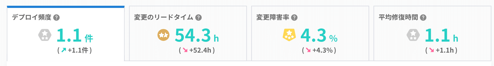
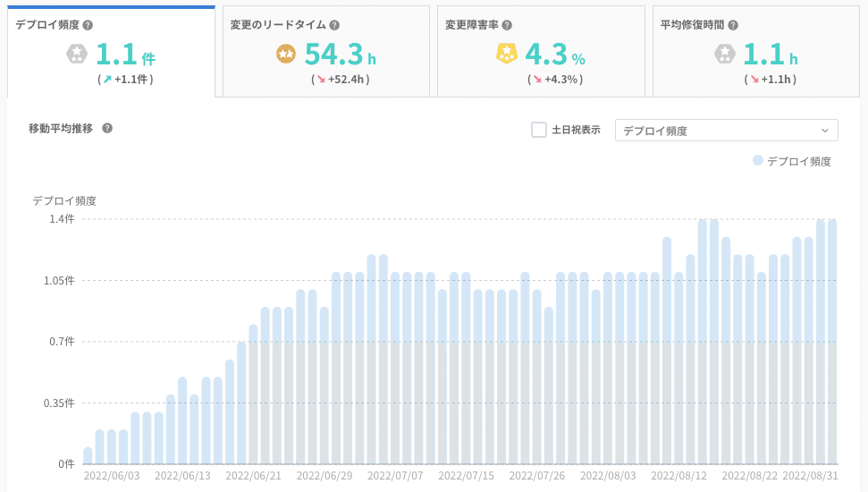
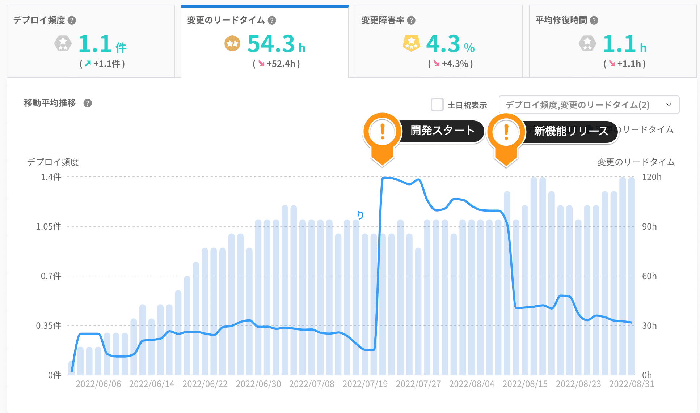
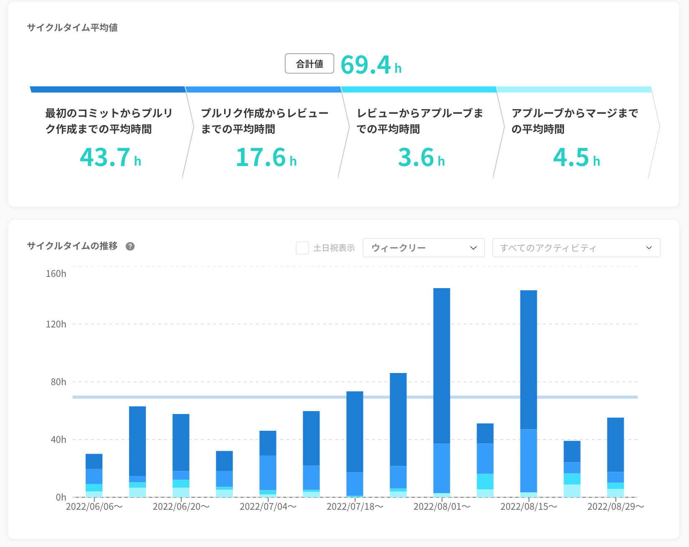
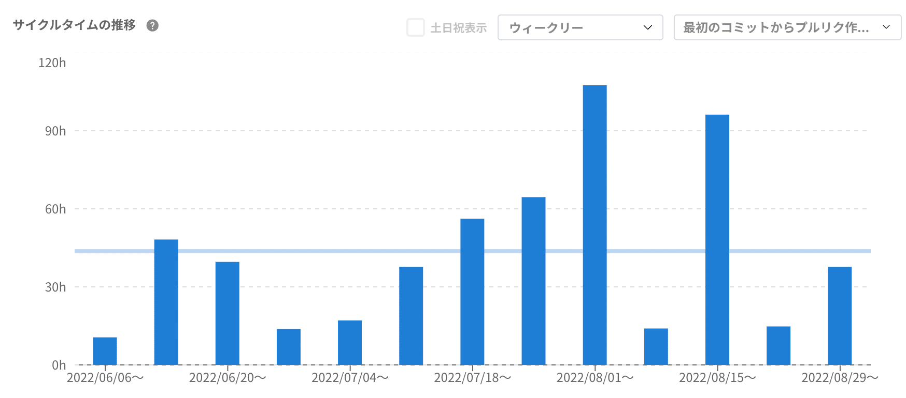
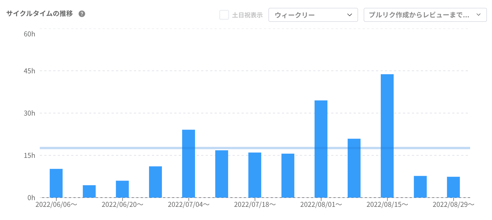

# アイミツSaaS開発チームの開発生産性を数値でふり返る -Four Keys指標-

> 出典: https://note.com/mine_unilabo/n/n926343ee80ce  
> 公開状態: publish  
> 更新: Wed, 28 Sep 2022 03:34:23 +0900

五反田にあるベンチャー企業で[PRONIアイミツ SaaS](https://saas.imitsu.jp/)というtoB向けのSaaSを簡単・スピーディーに探すことできるプロダクトの開発でのEM（エンジニアリングマネージャー）をやっています、みね＠PRONI（[@mine\_take](https://twitter.com/mine_take)）です。

5月からアイミツSaaSの担当になり、体制も新たに新チームでスタートをしましたので、新チームの3ヶ月(6月〜8月)の活動を数値でふり返りたいと思います。

※以前担当していたプロダクトのアイミツCLOUDでスクラムを導入した話の記事も書いていますので、良かったら見てください。

<https://note.com/mine_unilabo/n/nb068316a12ec>

## 開発生産性を数値でふり返る

エンジニア組織の生産性を測る要素としては、2点に集約されると考えています。 **・ソフトウェアデリバリの速度**
**・ソフトウェアデリバリの安定性**
これら2つの要素を数値化し、ふり返りをしたいと思います。

> 2つの要素は、以下の指標で観測することが可能
> ○**ソフトウェアデリバリの速度**
> 　- デプロイの頻度
> 　- 変更のリードタイム
> ○**ソフトウェアデリバリの安定性**
> 　- 平均復旧時間（MTTR：Mean Time To Restore）
> 　- 変更失敗率

書籍：LeanとDevOpsの科学

## Four Keys指標

数値のふり返りとして「findy-teams」の数値を使って行います。

「findy-teams」の内の**「DevOps分析」**を使うことで"Four Keysスタッツ"を可視化・分析することができます。

### Four Keysとは

Four Keysとは、GoogleのDevOps Research and Assessmentチームが割り出した、ソフトウェア開発チームのパフォーマンスを示す4つの指標のことです。

<https://cloud.google.com/blog/ja/products/gcp/using-the-four-keys-to-measure-your-devops-performance>

> **”Four Keys”指標**
> ・**デプロイ頻度** - 組織による本番環境へのリリースの頻度
> ・**変更のリードタイム** - commit から本番環境へのリリースまでの所要時間
> ・**変更障害率** - デプロイが原因で本番環境で障害が発生する割合
> ・**平均修復時間** - 本番環境での障害から回復するのにかかる時間

### ３ヶ月間の"Four Keysスタッツ"を確認

この３ヶ月間の数値がどうだったのか。。。。
組織のパフォーマンスをチェックができる「ランク機能」が Findy-Teamsからリリースされていたので、そのランクをチェック！

Four Keysスタッツ by Findy-Teams

> **デプロイ頻度：1.1件**High★★
> **変更のリードタイム：54.3h**Medium★
> **変更障害率：4.3%**Elite★★★
> **平均修復時間：1.1h**High★★

Four Keysスタッツランク by Findy-Teams

中々良い評価の様です。

各”Four Keys”指標の内容を詳しく見ていきます。

### デプロイ頻度 ☀

”Four Keys”指標の[**デプロイ頻度**]の数値の変化を見てみます。

デプロイ頻度 by Findy-Teams

6月の初旬から7月までがわかりやすく右肩上がりの状態でした。チームの立ち上がりの模様が数値上でもよくわかります。

7月の中旬の期間で数値が **1.05**付近で落ち着きますが、ここは大きめの機能開発があった為、通常の改善タスクの対応ができるリソースが限定的になったが為と解ります。
この大きめの機能リリース後にまた数値が上がって8月だけの数値では **1.3**となります。この数値が達成出来ているのは、リリースをほぼ自動化が出来ており、デプロイコストを下げれていることが大きな要因であると考えています。

スクラムの「小さく作り・小さくリリースを繰り返す」が実践できていたと思えます。

### 変更のリードタイム ☁

”Four Keys”指標の[**変更のリードタイム**]の数値の変化を見てみます。

変更のリードタイム by Findy-Teams

7月の中旬（7/21 - 8/9）の期間で新機能の開発を2週間かけて対応をしていた為、その影響で変更のリードタイムが長くなってしまっていました。
開発メンバーも少人数だったので、タスクを小さく分割するメリットをそこまで感じられず、大きなチケットの分割をせずに対応を進めてしまった結果です。

改めて、スクラムの原則に則ることは大切だと実感しました。
タスクをある程度の粒度で、状態の確認ができる単位（タスクが完了したときのどの様な状態になっているのかを定義できている）に分割するべきでした。

### 変更障害率 と平均修復時間 ⚡

”Four Keys”指標の[**変更障害率**]と[**平均修復時間**]の数値に関してはFindy-Team上で正しく計測するためには、**hotfixブランチ**を使う運用をキチンと定義し運用しないと行けないので、現状のこの数値は厳密に計測できていない状態でした。

## サイクルタイム分析

開発リードタイムをプロセス別に分割し、集計した数値を確認ができます。

プルリク作成までに時間がかかっているのか、レビューに時間がかかっているのか、アプルーブに時間がかかっているのか、開発プロセス上のボトルネックがないか確認できる。

サイクルタイム分析 by Findy-Teams

> 最初のコミットからプルリク作成までの平均時間：43.7h
> プルリク作成からレビューまでの平均時間：17.6h
> レビューからアプルーブまでの平均時間：3.6h
> アプルーブからマージまでの平均時間：4.5h
> 上記数値の合計値：69.4h

サイクルタイム分析 by Findy-Teams

### プルリク作成までの時間

最初のコミットからプルリク作成までの平均時間

「最初のコミットからプルリク作成までの平均時間」に変化が多いのはタスクの大きさ・粒度や、メンバーによる差が出ている様に思います。

### レビューまでの時間

プルリク作成からレビューまでの平均時間

「プルリク作成からレビューまでの平均時間」はスプリントのタスクの状況によって影響が出ている様です。大きなチケットがあった前後では、他のレビューが滞ってしまい、レビュー待ちという状況が起きてしまっていたことが原因です。
数値でふり返ると、この様な事象の確認を改めて認識できました。

## ＜まとめ＞

"Four Keys"の指標を可視化することで、チームのパフォーマンスを確認するが出来ました。
各スタッツの傾向・変化の要因を数値からふり返ることができ、改善すべき事項も見出すことができました。

また、「サイクルタイム分析」機能で作業ステップ別のリードタイムの増減を時系列で確認ができ、リードタイムの傾向や、ボトルネックの箇所を確認できるので、改善のアクションを行いやすくなりました。

この様にスプリントの活動（プロダクト開発）を数値を元にふり返ることで、改善のアクションを起こしやすくなり、その改善状況の計測も行えるので、数値を使った定期的な計測とふり返りを今後も行って行きたいと思います。

---

弊社の別開発チーム「アイミツ開発チーム」でも”Four Keys” を数値指標として使っている記事があるのでシャアさせて頂きます。

<https://note.com/deliku0306/n/n3401148c568a>

---

## [PR]PRONI株式会社 に興味がある方へ

PRONI株式会社ではプロダクト開発を一緒にやってくれるメンバーを募集しています。カジュアル面談もやっているので、気軽にお問い合わせください！

<https://note.com/deliku0306/n/ne17b9a378f32>

<https://speakerdeck.com/unilabo/recruit-for-engineers>

<https://herp.careers/v1/unilabo/wJdilfnGS5XB>
