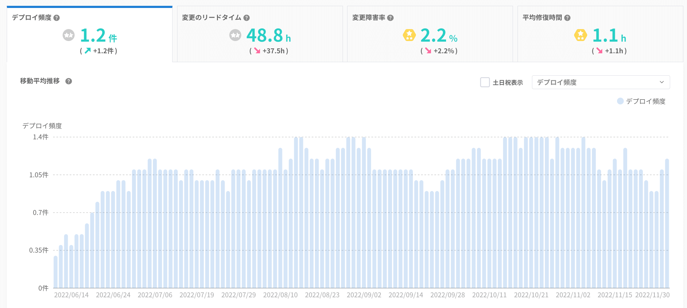
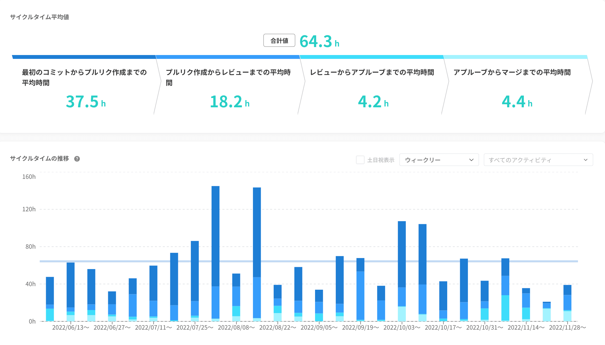
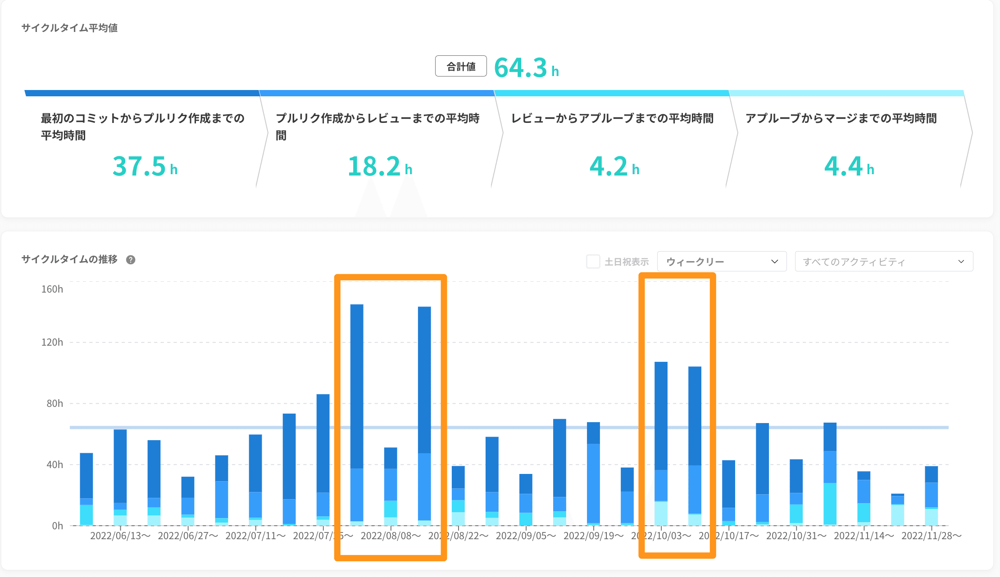
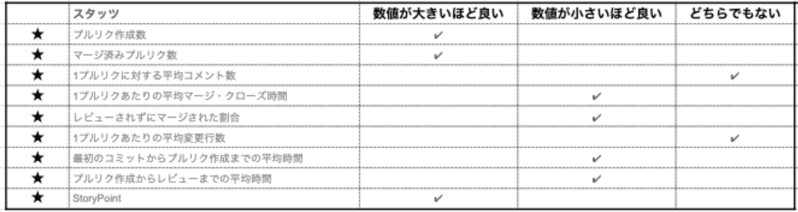
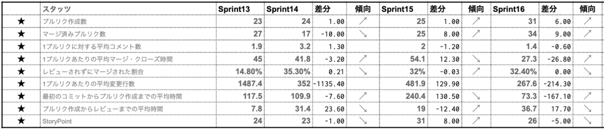

# スクラムでの開発チームの生産性の指標について -Four Keys と９つのメトリックス-

> 出典: https://note.com/mine_unilabo/n/n9ecc4957bf52  
> 公開状態: publish  
> 更新: Fri, 09 Dec 2022 05:00:28 +0900

この記事は [開発生産性 Advent Calendar 2022](https://qiita.com/advent-calendar/2022/developer-productivity) の9日目の記事です。

今回はエンジニアリングマネージャーとしてスクラムチームの生産性をどの様な指標で測っているのか、実際に計測をして得た知見を共有したいと思います。

簡単に自己紹介です。
五反田にあるベンチャー企業のPRONI株式会社でBtoB向けのSaaSを簡単・スピーディーに探すことできる[PRONIアイミツSaaS](https://saas.imitsu.jp/)というプロダクト開発チームでEM（エンジニアリングマネージャー）をやっています、みね＠PRONI（[@mine\_take](https://twitter.com/mine_take)）です。

生産性指標として使われているメトリクスは開発者のアクティビティによるものからシステムレベルも含め多々存在しているが、その中でも実際に使っているメトリクスを挙げて、どの様な観点で見ているのかを伝えていきます。

## Four Keys

もはや王道と言っても過言ではない「**Four Keys**」です。
LeanとDevOpsの科学で紹介されたState of DevOps ReportやDevOps Research and Assessment（DORA）チームの研究・調査から導き出されたソフトウェア開発チームのパフォーマンスを示す4つの指標です。（最近5つに増えたらしい）
※DORA metricsやfour core DevOps metricsと呼ばれる事もあります

> **Four Keys”指標**
> ・デプロイ頻度 - 組織による本番環境へのリリースの頻度
> ・変更のリードタイム - commit から本番環境へのリリースまでの所要時間
> ・変更障害率 - デプロイが原因で本番環境で障害が発生する割合
> ・平均修復時間 - 本番環境での障害から回復するのにかかる時間

この４つの指標の内、「**デプロイの頻度**」「**変更のリードタイム**」を主に見ています。この２つの指標をどの様に測定しているのか、この数値がどの様な意味合いを持っているのかをまとめました。

※現時点で「変更障害率」「平均修復時間」の指標については、まだ計測の準備が整っておらず今後の課題としています。

### デプロイ頻度

＜計測：本番環境へのリリースの頻度＞

本番環境への正常なデプロイの頻度です。ここはリリース数ではなく頻度の計測になり、リーン手法に則っているかを計測できます。

- リードタイムを小さく（削減させていく）
- バッチサイズ（一度に進める作業のサイズ）を小さく（削減させていく）

実際にはソフトウェアの場合はバッチサイズの測定が難しく、その代わりに**デプロイ頻度**を測定基準として選定しています。

デプロイ頻度の測定は容易であり、デプロイ頻度を上げていくと、バッチサイズが次第に小さくっていくということがわかっています。

### 変更のリードタイム

＜計測：commitから本番環境反映までの所要時間＞

リードタイムの削減はリーン手法の重要な指標です。

一般的なリードタイムと定義が異なるため注意が必要で、サイクルタイムと考えた方がよいかとおもいます。

このリードタイムは大まかに2つ要素で考えています。
・設計と検証にかかる時間
　計測をいつ始めるかが明確でなく、計測の設定をすることも難しい
・納品するための時間
　測定が比較的容易で変動も小さい
この理由から納品するための時間（＝デリバリに関する時間）を測定指標としています。

## スクラムチームの半年をふり返る

5月に新築した今のスクラムチームの数値を半年（2022/6月〜11月）で見てみます。

**デプロイ頻度**を[Findy team+]のDevOps分析を使って確認してみます。

[Findy team+]のDevOps分析

チーム立ち上げのタイミングはやはり**デプロイ頻度**は低い状態でしたが、スプリントが進むに連れてキチンと右肩上がりで改善ができてきた事がわかります。

**デプロイ頻度**は右肩上がりで上がり続ける数値では無いと考えており、立ち上げ期は右肩上がりになりますが、**安定している状態が大切**だと考えています。

8月と10月に新しいメンバーがチームに参加しましたが、オンボーディング期間でも**デプロイ頻度**は大きく下回らず、オンボーディング後には**デプロイ頻度**が上がっていることも確認ができます。

また、[Findy team+]の**サイクルタイム**で、このオンボーディング期間に生産性を示す指標が悪化していることがわかります。

[Findy team+]のサイクルタイム平均値

8月上旬、10月上旬にリードタイムが長い（多くの時間が要している）スプリントが発生していることがわかります。

8月と10月を比べることで、1回目より2回目の方がオンボーディングの準備が整ってきたことで効率的にオンボーディングが行えたのではないかと推測できます。

この**サイクルタイム**を見える化することで、より傾向がわかりやすく確認ができました。

## スプリント単位で定期的に見ているメトリクス

主な指標として定期的に確認しているのは「**デプロイの頻度**」「**変更のリードタイム**」ですが、この指標を改善するためにスクラムチーム内で定期的に見ている９つのメトリクスとその観点を紹介します。

スクラムチーム内で定期的に見ている９つのメトリクス

### プルリク作成数

- 大きく変化が無いことが好ましいと考えており、大きく減った場合、増えた場合には何かの課題が現れてくる指標と考えています

### マージ済みプルリク数

- プルリク作成数と比べることで、そのスプリント内で完結したのか、前スプリントの影響が強かったのか、次スプリントへ持ち越してしまったのか、こちらが把握できる指標と考えています

### 1プルリクに対する平均コメント数

- コメント数が多すぎる場合はプルリクもしくはレビューに課題がないかを確認、一方でコメント数が少なすぎる場合は適切なコメントやレビューができているかの確認が必要です。社内で生産性が高いとされているチームと比較してどの程度のコメント数になっているか確認することを推奨しています
- キチンとPRレビューの運用が出来ているのか、チーム内でのコミュニケーションが円滑に行えているか、１つの指標と考えています
- コメント数はPRレビューのポリシーによって変わるので（多いほど良いという数値ではなく）、平常時と比べて突発的に増えていないか、減少傾向になっていないか、と考えています

### 1プルリクあたりの平均マージ時間

- クローズまでの時間は短い方が開発の生産性が高い状態で、PRの単位が大きな粒度だと長くなる
- 時間がかかる原因として、「エンジニア数が足りない」「設計レベルに問題」「品質に問題がある」が懸念されます

### レビューされずにマージされた割合

- チーム内でレビューフローが正しく実行されていないと考えています
- レビュー担当者が足りていない可能性を考えます

### 1プルリクあたりの平均変更行数

- プルリクの粒度が大きくなっていることがわかります

### 最初のコミットからプルリク作成までの平均時間

- 開発スピードに関係する指標で、時間が長い場合はプルリクの粒度が大きくなっていることがわかります

### プルリク作成からレビューまでの平均時間

- レビュアーに負荷がかかり過ぎている、レビュアーがブロッキング要素になっている可能性があります
- プルリクの情報、設計の内容が正しく伝わっていない可能性があります

### StoryPoint

- 達成した**ストーリーポイント**を計測することでチームの**ベロシティ**が測れます
- ベロシティをチームの評価に利用します

---

## スプリント単位での計測と分析

この9つの指標をスプリント単位で計測し分析をしていました。

実際にスプリント単位で数値を計測していくと、大きく凹むタイミングや、凸むタイミングも発生してくるので、3週間単位でふり返る様に調整をして行きました。

PBIはスプリントでやりきるのが前提ですが、対応が1スプリントで終わらず、次スプリントにかかってしまうPBIなどもありますので、1スプリントの数値で一喜一憂せずに、前後のスプリントの数値も含めて把握をする様にしていますます。

## ＜まとめ＞

"Four Keys"の指標の内、「**デプロイの頻度**」「**変更のリードタイム**」を主に見ています。スクラムチームの状態を確認する為に９つのメトリクスをスプリント単位で確認しています。

スプリント単位で計測はしますが、1スプリントの数値だけを見ずに前後のスプリントと併せてと傾向をみることにしています。

スプリント内でこの**9つのメトリクス**を計測しておくことで、スプリントで起きた事象を数値の変化で確認することができます。
また、スプリントレトロスペクティブ（ふり返り）で出た課題、改善のアクションの計測もしていくことが可能となります。

この様に数値化（見える化）をする事で、現在の状況や過去からの改善の状況も把握できるのがメリットと感じています。

過去にも数値でふり返る記事を書いていますので、良かった見てみてください。

<https://note.com/mine_unilabo/n/n926343ee80ce>

---

## [PR]PRONI株式会社 に興味がある方へ

PRONI株式会社ではプロダクト開発を一緒にやってくれるメンバーを募集しています。カジュアル面談もやっているので、気軽にお問い合わせください！

<https://note.com/deliku0306/n/ne17b9a378f32>

<https://speakerdeck.com/unilabo/recruit-for-engineers>

<https://herp.careers/v1/unilabo/wJdilfnGS5XB>
