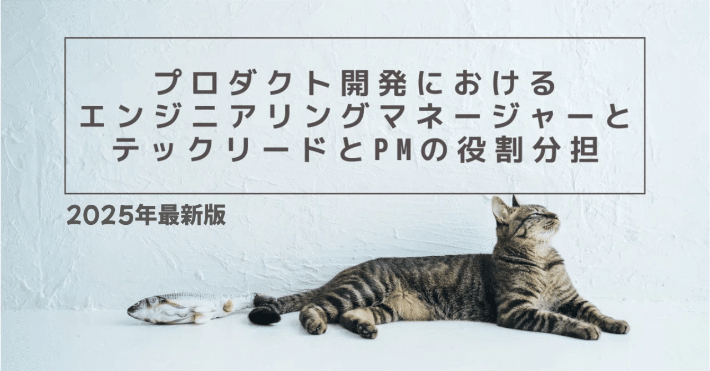

# 2025年版：プロダクト開発におけるエンジニアリングマネージャー（EM）とテックリード（TL）とPMの役割分担と進化

> 出典: https://note.com/mine_unilabo/n/na6a620da56d5  
> 公開状態: publish  
> 更新: Mon, 22 Sep 2025 13:55:13 +0900  
> 区分: 個人

ベンチャー企業でプロダクト開発をしているEMの、みね（[@mine\_take](https://twitter.com/mine_take)）です。
※本記事は個人の活動による記事であり、会社の公式見解とは異なる場合があります。

## 序論（アップデートの背景）

近年、エンジニアリング組織における **Tech Lead（テックリード）** と **Engineering Manager（エンジニアリングマネージャー）** の役割は、より明確に分化しつつも、組織のスケールや文化に応じて柔軟に解釈されるようになっている。
特に、Microsoft や Amazon など大企業が「中間管理職の削減（フラット化）」を進める中で、EM／TL の役割境界はより実践的な意味を持ち始めている。

本記事は、2022年に公開した「[プロダクト開発におけるエンジニアリングマネージャー（EM）とテックリード（TL）とPMの役割分担](https://note.com/mine_unilabo/n/nab0d71933f35)」の記事を大幅にアップデートしたものであり、2025年時点の最新知見を反映して「EM／TL／PdM の役割と未来像」を整理する。

<https://note.com/mine_unilabo/n/nab0d71933f35>

---

## 第1章：EM／TL／PdMの基本役割（オリジナル＋最新整理）

### EM（Engineering Manager）

- チームの成果とメンバーの成長に責任を持つ。
- プロセスや組織構造を整え、心理的安全性と生産性を確保する。
- **視点：WHO（誰が）／WHERE（どこで）／HOW（どう進めるか）**

### TL（Tech Lead）

- 技術設計、コードレビュー、アーキテクチャの意思決定をリードする。
- 技術品質の担保とチーム内の技術的方向性の調整を担う。
- **視点：WHAT（何を作るか）／HOW（どの技術で）／WHEN（いつまでに）**

### PdM（Product Manager）

- 顧客価値とビジネス成果に責任を持つ。
- プロダクト戦略、優先順位付け、仮説検証を推進する。
- **視点：WHY（なぜ）／WHAT（何を）／WHEN（いつまでに）**

### 最新の補足（2025年アップデート）

- **Tech Lead はシステムに責任、EM は人に責任**（LeadDev など海外事例で浸透）
- **Tech Lead grows the tech, EM grows the people**（Reddit の表現）
- 最近では **両役割を兼任**するケースも増加。ただし、組織の規模やチーム成熟度によって最適解は異なる。

---

## 第2章：テックリードとエンジニアリングマネージャーの現在

### 役割の現在地

2025年時点では、Tech Lead（TL）と Engineering Manager（EM）の役割はより明確に分かれつつも、現場では柔軟に運用されている。

- **TL** は技術的意思決定の最終責任を持ち、システム全体の設計思想をチームに浸透させ、コード品質を統一する。
- **EM** はチームビルディングやピープルマネジメントを担い、1on1・キャリア支援・心理的安全性の確保を重視する。

### PdM（Product Manager）の現在

EM・TLの変化と連動して、PdMの役割も進化している。
組織がフラット化し、EM/TLの裁量が増すことで、PdMには「意思決定のスピード」と「仮説検証の正確性」が従来以上に求められている。
市場や顧客からのフィードバックを迅速にロードマップへ反映させることが主要な責務である。

### 海外事例・議論

- LeadDev や [engineeringladders.com](http://engineeringladders.com/)：「**Tech Lead はシステムに責任、EM は人に責任**」という整理が一般化。
- Reddit：「**Tech Lead grows the tech, EM grows the people**」と表現され、キャリア選択の大きな分岐点とされている。
- 海外スタートアップ事例：小規模ではTLとEMの兼任が多く、成熟組織では役割を分ける傾向がある。

### 最新のトレンド

- **中間マネジメント層の削減（フラット化）**：Microsoft、Amazon、Intel などがマネージャー層を減らし、TL／EM の兼任や裁量拡大が進んでいる。
- **ハンズオンを維持するEM**：EMが完全にマネジメント専任になるのではなく、技術キャッチアップや軽い開発タスクを持つ事例が増えている。
- **キャリアの多様化**：「People Manager（EM志向）」と「Expert/Architect（TL志向）」のどちらを選ぶかというキャリア分岐がより意識されるようになっている。

---

## 第3章：組織フラット化トレンドと両役割の関係

### フラット化の潮流

2023年以降、Microsoft・Amazon・Intel などの大手企業が **中間マネジメント層の削減** を進めている。
背景には以下の課題がある。

- 元エンジニアがマネージャーへ異動しても十分に機能できず、非効率なレイヤーが生まれていた。
- 意思決定のスピードが遅くなり、競争力を落とすリスクが増大した。
- エンジニアにとって「マネージャーになること」が必ずしもキャリアゴールではなくなった。

こうした変化により、EM／TL の役割分担が再注目されている。

### フラット化がもたらす変化

1. **EMとTLの兼任増加**：技術と人材の両輪を回す「ハイブリッド型リーダー」が求められている。
2. **役割境界の曖昧化**：状況に応じて柔軟に役割を担うことが求められている。
3. **キャリア選択肢の広がり**：「人を育てたい」エンジニアはEMへ、「技術を極めたい」エンジニアはTLへ。両方担いたい場合は **Tech Lead Manager（TLM）** という役割も登場している。

### 追加要因（2025年視点）

- **EMの担当領域拡大**：採用・育成・評価・組織設計に加え、プロセス改善・予実管理・リスクマネジメントなど、領域が拡大している。
- **不確実性の高まり**：技術の多様化、AIの急速な普及、事業モデルの変化、分散型ワークスタイルによりマネジメント難易度が上昇。従来型の「計画と統制」では限界があり、適応型マネジメントやアジャイルな意思決定が必須である。

### PdMへの影響

フラット化によって、PdMは意思決定のボトルネックとなるリスクが高まっている。
そのためPdMは、EM・TLと補完し合いながら意思決定を分散させ、**顧客視点の一貫性**を担保する役割として重要性を増している。

### 日本の現場への示唆

- 大企業では「EM/TL分離型」、スタートアップでは「兼任型」が多い。
- いずれにせよ、役割期待値を明確化しなければ混乱を招くため、採用・評価制度への落とし込みが必須である。

---

## 第4章：EM／TL／PdMの未来図と推奨アプローチ

### EM（Engineering Manager）

- **組織設計・予実管理・事業戦略との接続**が求められる。
- 主な役割は、**チームが最大限に成果を発揮できるよう尽力すること**である。
- ピープルマネジメントだけでなく、採用・育成・評価・プロセス改善を含め、組織全体の力を最大化する責務を担う。

### TL（Tech Lead）

- 高い専門性を持ち、**技術を軸にチームや組織をリードするポジション**である。
- スペシャリストと異なり、チームの技術方向性を定め、**成果を出すために組織を技術面から導く存在**である。
- EMとは領域が異なるが、**事業・プロダクトの成果にコミットする点では一致**している。

### PdM（Product Manager）

- **事業インパクトとユーザー価値をつなぐ意思決定のハブ**である。
- EM/TLと協調し、\*\*WHY（なぜ）とWHAT（何を）\*\*を定義し、ロードマップを描く。
- 不確実性が高まる今、**仮説検証力と市場洞察力**が一層重要になっている。

---

### 推奨アプローチ

1. **役割の明文化**：EM／TL／PdMの境界を明文化し、採用・評価・キャリアに反映する。
2. **ハイブリッド型リーダー育成**：小規模組織では兼任型、大規模組織では分離型を採用し、柔軟に切り替える。
3. **不確実性への適応力強化**：EMは「人と組織」、TLは「技術」、PdMは「市場と事業」からアプローチし、三者が補完し合うことで不確実性に対応する。
4. **キャリア多様化支援**：EM（人・組織志向）、TL（技術志向）、PdM（事業・プロダクト志向）の3つのキャリアパスを公式に認め、対等に扱う。

---

## まとめ

- EMは「人と組織の成長」、TLは「技術の成長」、PdMは「顧客価値と事業」に責任を持つ。
- 不確実性の高まりにより、マネジメント難易度は増加しており、三者の連携はますます重要になっている。
- 組織は「役割の明文化」と「柔軟な運用」を両立させることで、スピードと安定性を実現できる。

## あとがき

今回改めて整理してみて、EM／TL／PdMという役割は単なる肩書きではなく、**それぞれがプロダクトの成果にどう向き合うか**を示す軸だと強く感じている。

特に、エンジニアリングマネージャーは「人」や「組織」に向き合う中で、予実管理や事業戦略との接続など責務が広がり続けている。これは決して楽な仕事ではないが、**チームが最大限の成果を出せるように尽力する**ことが何よりの使命だと考えている。

一方で、テックリードは専門性を武器にしつつ、チーム全体を技術で支える存在である。スペシャリストとの違いは「チームを導く姿勢」にあり、成果を出すというゴールはEMと変わらない。

そしてプロダクトマネージャーは、顧客価値と事業のインパクトをつなぐ立場として、三者をつなぐ重要な役割を担っている。

私自身、このテーマについてはまだ考え続けている最中である。今後も現場での実践を通じて学びを深め、またアップデートしていきたい。

---

この記事は2022年に公開した内容を大幅にアップデートした別記事である。
👉 [2022年版：EM／TL／PMの役割分担はこちら](https://note.com/mine_unilabo/n/nab0d71933f35)
