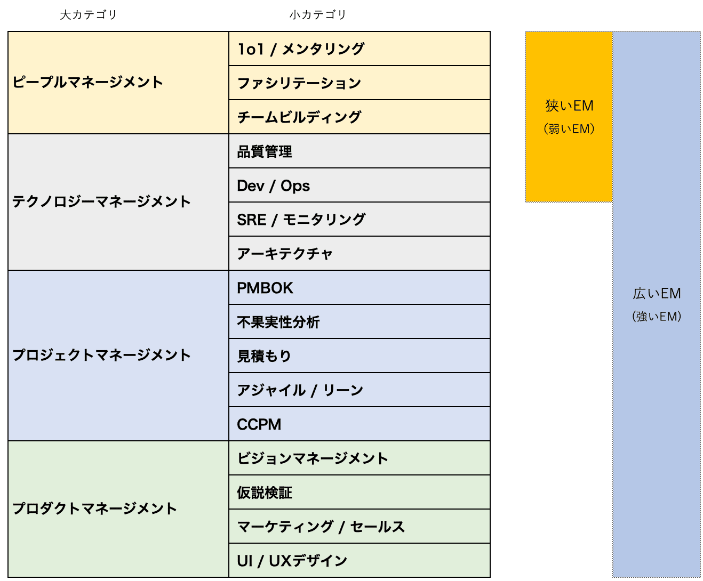

# プロダクト開発におけるエンジニアリングマネージャー（EM）とテックリード（TL）とPMの役割分担

> 出典: https://note.com/mine_unilabo/n/nab0d71933f35  
> 公開状態: publish  
> 更新: Sun, 10 Jul 2022 21:08:28 +0900  
> 区分: 個人


📌 本記事は2022年時点の内容である。
最新の知見を整理した2025年版はこちら：
👉 [2025年版：プロダクト開発におけるEM／TL／PMの役割分担と進化](https://note.com/mine_unilabo/n/na6a620da56d5)

---

ベンチャー企業でプロダクト開発をしているEMの、みね（@mine\_take）である。
※本記事は個人の活動による記事であり、会社の公式見解とは異なる場合がある。

---

## 序論

エンジニアリングに関わる内容で記事を書いています。今回はプロダクトの拡大により、エンジニア組織の拡張・拡大を考えた際に重要なポジションの、エンジニアリングマネージャー（EM）、テックリード（TL）という役割について、そしてプロダクトマネージャー（PdM）との関係について書きます。
それぞれの役割を明確に分けることは難しいが、視点の違いを理解することは重要です。

## エンジニアリングマネージャー（EM）とテックリード（TL）とプロダクトマネージャー（PM）の関係性

プロダクト開発における重要な役割として、エンジニア組織のマネジメントを手掛ける『エンジニアリングマネージャー（EM）』、高い技術力をもって開発チームを牽引する『テックリード（TL）』、エンジニア組織のマネジメントとは別の役割としてプロダクト開発の責任者を務める『プロダクトマネージャー（PM）』の3職種があります。

プロダクト開発における役割分担や評価軸、必要な視点（思考軸）を考えてみます。

```
【エンジニアリングマネージャー（Engineering Manager）】
主な役割　■強いエンジニアチームを作り育てる
　　　　　■部下のモチベーションマネジメント、キャリア構築支援
　　　　　■実装技術の選定、技術ディレクション、メンバーアサイン
　　　　　■人事考課、チームビルディングなど
評価軸　　■技術的知見、組織マネジメント力、プロジェクトマネジメント力、リーダーシップ
思考軸　　■WHO（だれが）、WHERE（どこで）、HOW（どうやって）

EMはチームの成果とメンバーの成長に責任を持ち、ピープルマネジメントやテクノロジーマネジメントを組み合わせて組織の生産性を高める。
```

```
【テックリード（Tech Lead）】
主な役割　■高い設計能力・実装能力によって開発をリードする
　　　　　■コードレビューなどでチーム開発におけるコードの品質を高め維持する
　　　　　■メンター役としてチームメンバーをサポートする
評価軸　　■技術的知見、設計力、プログラミングスキル、リーダーシップ
思考軸　　■WHAT（なにを）、HOW（どうやって)、WHEN（いつまでに）

テックリードはシステムに責任を持ち、技術的な意思決定をリードする。
エンジニアリングマネージャーと領域が重なる部分もあるが、技術面に重点を置く点が特徴である。
```

```
【プロダクトマネージャー（Product Manager）】
主な役割　■プロダクトの方針を定め、成功に責任を負う
　　　　　■ユーザー体験を設計し要求仕様を定義する
　　　　　■開発、デザイン、マーケティング、セールス、品質保証、サポートなどと連携し、
　　　　　　プロダクトの成功に尽力する
　　　　　■プロダクト面から成長戦略を考え実行する
評価軸　　■構想力、発信力、プロジェクトマネジメント力　リーダーシップ、（技術的知見）
思考軸　　■WHY（なぜ）、WHAT（なにを）、WHEN（いつまでに）

PMは顧客価値とビジネス成果に責任を持ち、組織を横断してプロダクトの方向性を示す。
```

---

エンジニアリングマネージャーとテックリードは技術面など重複している部分も多く、単純に切り分ける事が難しい境域もあります。チームによっては兼任するケースもあります。

また、開発（エンジニア）チームの上にプロダクトマネージャーが立つように捉えられるケースもありますが、エンジニアリングマネージャーとプロダクトマネージャーはあくまでも対等の立場と考えるべきです。

## エンジニアリングマーネジャーとプロダクトマーネジャーの関係性

プロダクトマネージャーは、ユーザーのために何を作るかに責任を持ち、徹底的に“What（何を）”を考え抜くことが役割です。対して、エンジニアリングマーネジャーは、**開発リソース（WhenとWho）**を考慮しながら、テックリードや開発（エンジニア）チームと共に **“How（どのように作るか）”** を考え、実行するのが仕事です。

両者は時に意見を戦わせたり、ぶつかり合ったりすることはありますが、それぞれが違う立場でプロダクト開発に貢献していきます。

↓[プロダクトマネージャー（PdM）](https://note.com/mine_unilabo/n/n23ec87da4cdb)についての記事も書いてます↓

<https://note.com/mine_unilabo/n/n23ec87da4cdb>

## EMとTLの違い

- **EM** は「人と組織」に責任を持ち、ピープルマネジメントを中心に組織を強化する。
- **TL** は「技術」に責任を持ち、設計やコード品質をリードする。

両者は領域が重なることもあり、小規模組織では兼任するケースも多い。
ただし、大規模になるほど役割を分けた方が効率的である。

---

## EMとPdMの関係

- **PdM** は「What（何を作るか）」を定義する。
- **EM** は「Who（誰が）」「When（いつまでに）」「How（どう作るか）」を考え、実行する。

両者は対等な立場であり、協力し合ってプロダクトを前進させる。
意見がぶつかることもあるが、異なる視点がプロダクトの成功につながる。

---

## エンジニアリングマネージャー（EM）の4つのマネジメント領域

1. **テクノロジーマネジメント**：アーキテクチャ、技術選定、品質管理、技術的負債のコントロール
2. **プロジェクトマネジメント**：適切な品質で、なるべく早くリリースをコントロール
3. **ピープルマネジメント**：チームマネジメント、育成・評価・採用
4. **プロダクトマネジメント**：何を作るかを考え、施策の実現可能性や費用対効果を明らかにする

「狭いEM」はピープルマネジメント中心、「広いEM」はプロダクトや事業戦略にも関わる。

### 「狭いEM（弱いEM）」と「広いEM（強いEM）」とは

多くのエンジニアリングマネージャーは、ピープルマネジメントのスキルを中心にしながらも、テクノロジーマネジメント、プロジェクトマネジメント、プロダクトマネジメントといった多岐にわたる責務を担っています。

「狭いEM」とは、「エンジニアのマネジメントスキル」としてのピープルマネジメントスキルとテクノロジーマネジメントの一部スキルを持っていることが求められています。

「広いEM」とは、ピープルマネジメントに加えて、テクノロジーマネジメントのみならず、プロジェクトマネジメントやプロダクトマネジメントの一部の能力などが求められます。



狭いEMから広いEMの知識体スキル

### エンジニアリングマネージャーに期待されていること

**エンジニアチームの生産性を最大化する**

エンジニアリングマネージャーの仕事を一言で言ってしまうと、エンジニアのマネジメントですが、求められていることは、マネジメントによって、開発（エンジニア）チームの生産性を最大化するのが、エンジニアリングマネージャーの役割と言えます。

なお、この場合、エンジニア個人のスキルも大事ですが、チームとして生産性を最大化できる仕組み作りも重要です。

**エンジニアの採用に関わる**

新しく入社したエンジニアが、チームの雰囲気に合った人であれば、チームの生産性アップに貢献できます。

そのため、求職者との採用面接に関わり、チームの雰囲気に合った方を採用するのもエンジニアリングマネージャーの重要な役割です。

そして、エンジニアの目線で求職者のスキルを的確に判断することで、エンジニアチームの生産性に貢献できる人材、または、その可能性のある人を採用できるのです。

**エンジニアを評価する仕組みを作る**

今は、極端なエンジニア不足の時代です。そのため、能力のあるエンジニアを求める企業が多く、待遇も良いことから現状に不満を持っているエンジニアは、簡単に転職してしまいます。

もし、そのエンジニアがプロジェクトのキーマンであれば、会社にとって大きな損失です。

そうならないようにエンジニアの実績を正しく評価する仕組みを作ることも、エンジニアリングマネージャーの重要な役割です。

## テックリード（TL）とは

テックリード（Tech Lead）とは、プロジェクトやプロダクトにおける技術面でのリーダーのことです。ソフトウェアの開発を進める時は、チームで行う場合が多く、そのチームを牽引するテックリードは、「リーダー」「組織の窓口」となりシステムの開発に促進する役割です。

### テックリードとリードエンジニアの違い

「リードエンジニア」「テクニカルリード」と言葉が利用されていますが、組織やプロジェクト・プロダクトで呼び方が違いますが、どちらも意味は同じものです。

実際にはどちらも**「チームをリードするエンジニア」「チームを主導するエンジニア」**を指すことが多く、概念や役割はほぼ同一です。

## テックリード（TL）の役割

テックリードには、大きく分けて「チームのリーダー」と「チームの窓口」という2つの役割があります。
前者については内部的な役割、後者については外部に対する役割です。

テックリードの役割とは、具体的には「コード品質の向上」「チームの生産性」「アーキテクチャ・設計」などです。

### 1. プログラム（コード）品質の向上

テックリードはチームで作るソフトウェアに対して、あるいはメンバーが書くプログラム（コード）の品質に対して責任を負います。高品質なコードを書けると開発のスピードが向上し十分な納期を確保できるだけでなく、メンテナンスの手間が削減されシステムの安定稼働や継続性にも寄与するのです。

コードの可読性が高いとセキュリティやパフォーマンスを担保することにもつながります。開発チームのメンバー同士がコードに対する認識を統一するには、テックリードが主体となり一貫性のあるコードを作っていく必要があります。

### 2. チームの生産性を高める

テックリードにはチームの生産性を向上させる役割もあります。エンジニアチームのメンバーが業務しやすい環境を作り、改善点がある時には対策を考えます。事前に「技術的に可能か」「実装難易度が高すぎないか」「既存機能と似ていないか」などを調べ、効率良くチームが活動できる状態を作っていきます。

### 3. アーキテクチャ・設計

アーキテクチャや設計は、テックリードを含めたさまざまなエンジニアが行います。その際、チーム内が納得して行える環境を整備するのがテックリードの役割です。最終的に決定したことは、テックリードが責任を持ちます。

## テックリードとCTOとの違い

CTOとテックリードには、ポジション面で大きな違いがあります。

基本的にテックリードは、**チームやプロダクトなど現場単位で、他のエンジニアをリードしていく役割**です。

それに対して、CTOは**会社全体をリードしていく役割**です。

技術的に関係者をリードしていくという意味で仕事内容は似ている部分がありますが、**責任範囲という観点では大きな違いがあります。**

## テックリードとエンジニアリングマネージャーとの違い

テックリードとエンジニアリングマネージャーの役割が混在している企業は非常に多いです。両者の役割には重複する部分もありますが、その焦点は異なります。テックリードはシステムに責任を持ち、エンジニアリングマネージャーは人に責任持っています。

チームの規模が小さい場合や、エンジニアのリーダーがエンジニアリングマネージャーとテックリードの両方を経験している場合は、同じ人が両方の役割を果たすこともあります。しかし、システムやチームの規模が大きくなり、複雑になってくると、それぞれの役割を別の人が担当する必要が出てくるかもしれません。

エンジニアリングマネージャーはマネジメントをメインで担う役割です。

テックリードは、**エンジニアチームの中でリーダーとして役割を担い、開発をリードしていくというミッション持つ人を指します。**

テックリードは、あくまでも**チームの窓口**＆**チームリーダー**にあたるポジションです。そのため、責任の範囲はチーム内に限定されます。

エンジニアリングマネージャーと協力し、チーム内のスキル不足のメンバーの底上げを担当するなど、補完する関係と言えるでしょう。

そのため、テックリードは技術に明るく、エンジニアリングに対して高い専門性を有していることが多いです。

### 役割の違い

役割の定義として、エンジニアリングマネージャーはメンバーアサインの部分**「WHO（だれが）、WHERE（どこで）、HOW（どうやって）」** やるのか。そしてテックリードは**「WHAT（なにを）、HOW（どうやって)、WHEN（いつまでに）」**に注力するという違いがあります。

## まとめ

プロダクト開発における重要な役割として、

- エンジニアリングマネージャー（EM）：人と組織を支える
- テックリード（TL）：技術でリードする
- プロダクトマネージャー（PM）：顧客価値と事業を推進する

の3職種がある。
それぞれの違いと補完関係を理解することで、組織はスケールしやすくなる。

## 最後に

プロダクト開発をしていく上で、重要なポジションのエンジニアリングマネージャー、テックリードという役割と違いについて、そして、プロダクトマネージャーとの関係性をまとめました。エンジニア組織の拡張・拡大を考えた際に、リーダーやマネージャーの役割が大きい状態から、役割を分担し組織がスケール（拡張・拡大）を考える際にも大切と考えています。

---

📌 本記事は2022年時点の内容である。
最新の知見を整理した2025年版はこちら：
👉 [2025年版：プロダクト開発におけるEM／TL／PMの役割分担と進化](https://note.com/mine_unilabo/n/na6a620da56d5)

## 関連記事

<https://note.com/mine_unilabo/n/na6a620da56d5>

<https://note.com/mine_unilabo/n/n23ec87da4cdb>

<https://note.com/mine_unilabo/n/n7d435642c054>
