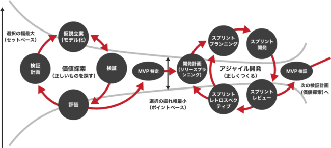

# プロダクト開発にScrumを導入した話

> 出典: https://note.com/mine_unilabo/n/nb068316a12ec  
> 公開状態: publish  
> 更新: Fri, 12 Nov 2021 08:01:46 +0900

株式会社ユニラボで[アイミツCLOUD](https://imitsu-cloud.jp/)という新規事業のプロジェクトでエンジニアのマネージャーをしています、みね＠ユニラボ（[@mine\_take](https://twitter.com/mine_take)）です。

## アイミツCLOUDのプロダクト開発にスクラムを導入

2021年9月入社して、プロジェクト開発にスクラム（Scrum）を導入した話を書こうと思います。

アイミツCLOUDがどの様な想いで作られたのかは、↓この記事を読んでください。

> [新規事業と飽くなき探究心](https://note.com/noriokuriyama/n/n28d0ed49e56d)

アイミツCLOUDは2021年4月にリリースしたwebサービスで、9月に私が入った時に、プロダクト開発の不確実性とどう戦っていくかという、戦い方の話をしている真っ最中でした。

その中で「正しいものを正しくつくる」という考え方（「正しいものとは何か？」という自問に対して、仮説検証をしながらつくるべきものを探っていく）でプロダクトの開発を行う為に、「仮説検証型アジャイル開発」という手法でプロダクト開発を進めていくという方針を固めていました。

> （仮説検証型アジャイル開発のイメージ図）
> 出典元 : <https://prtimes.jp/main/html/rd/p/000000016.000066787.html>

## 仮説検証型アジャイル開発とは

私が参加したこの時期は、初期のリリース後の混沌も落ち着き、立ち上げメンバーとバトンタッチなどもあり、チームとしての大きな変革をする良いタイミングでした。初期のプロダクト開発では「不確実性が高い」＝「分からないことが多い」という事が多くあり、仮説検証を通じて『分からないことを分かるようにしながら』進めていくという開発手法を用い、組織体制や運営方法、コミュニケーションの取り方の見直しを行いました。

## 「正しくつくる」為に

プロセスを「正しいものを探す」と「正しくつくる」を分けた場合に、「正しくつくる」為に、アジャイル開発のスクラム（Scrum）という手法が最適だと考えていたので、導入を決めました。

※「スクラム開発」という言葉がたまに使われますが、スクラムはアジャイル開発の為の１つの手法であり、スクラム開発という言葉は正しくないと常々思っています。スクラム以外にも、エクストリーム・プログラミング（XP）やユーザー機能駆動開発（FDD）という、アジャイル開発の手法があります。

## スクラムを選んだ理由

開発手法としてスクラム（Scrum）を何故、最適と考えたのかは、下記の理由からです。
・開発者が5~7人以下のチームで行うことが多く、チーム規模にあっている
・スクラムは各プロセスがわかりやすく（原理原則もスクラムガイドに示されている）、導入済みの他社事例などの情報が多くあるので開発手法について、共有認識を持ちやすい
・スプリントの期間が決まっているので、仮説に対して、定期的に検証・評価を行うタイミングがある
・多くのフィードバックを受ける機会があるので、早く問題に気が付きやすい
・プロダクトオーナー、スクラムマスター、スクラムチームと役割が決まっている

## チームに期待したいこと

また、直接的にスクラムを導入した目的ではありませんが、導入により下記の事に期待をしました。
・プロダクトの「不確実性」に取り組んでいることを意識できる
・「正しいものをつくる」為に与えられた結果ではなく、「正しいものとは何か？」をチームとして考えていく事ができる
・仮説検証に基づいて、プロダクトのあるべき姿を定義しながら、プロダクトを作っていく事を意識できる

実際に導入した話は次で書きたいと思っています。スプリント０に向けた準備と、大変だったスプリント０の話を書きたいと思います。

<https://note.com/embed/notes/n288c21a89778>

<https://note.com/embed/notes/n79e2918aa7f4>

## [PR]ユニラボ に興味がある方へ

ユニラボではプロダクト開発を一緒にやってくれるメンバー（エンジニア、PdMなど）募集しています。
カジュアル面談もやっているので、気軽にお問い合わせください！

<https://note.com/embed/notes/ne17b9a378f32>

<null>

<null>
