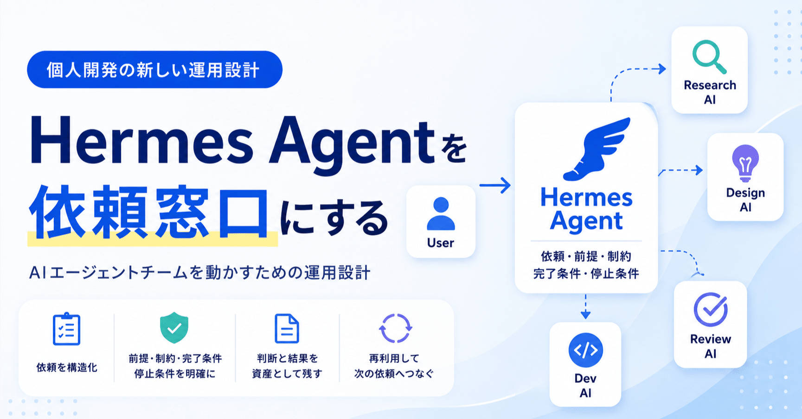

# 個人開発でAIエージェントチームを作るために、Hermes Agentを「依頼窓口」として導入し始めた

> 出典: https://note.com/mine_unilabo/n/nc1ac531190c9  
> 公開状態: publish  
> 更新: Wed, 03 Jun 2026 23:32:05 +0900



個人開発でAIエージェントを使うほど、作業は速くなります。

一方で、依頼そのものは散らかり始めます。

実装相談、レビュー依頼、調査、記事構成の相談を別々のチャットで進めているうちに、前提や判断理由を探し直す時間が増えてきました。

AIを使っている時間は増えている。けれど、AIエージェントチームとして運用できているかというと、まだ怪しい。

そう感じたので、個人開発のAIエージェント運用を整える入口として、「**Hermes Agent**」を導入し始めました。

この記事でいう「**Hermes Agent**」は、個人開発で複数のAIエージェントに依頼を出すための窓口として使おうとしている仕組みです。

ただし、ここで書きたいのは「Hermes Agent」の機能一覧ではありません。

むしろ、チャットに流れがちな依頼、前提、制約、判断理由を、あとから読み返せる形で残すための運用設計として整理したいと思っています。

## Hermes Agentを「万能な自動化ツール」として見ない

最初に、期待値を間違えないようにしておきたいです。

Hermes Agentを入れたからといって、個人開発がいきなり自動で回るわけではありません。

AIエージェントが勝手に正しい順番で調査し、設計し、実装し、レビューして、最後に安全な成果物だけを出してくれる。そんな魔法の仕組みとして見てしまうと、たぶん失敗します。

今の自分が期待しているのは、もっと地味な役割です。

**AIに何を頼むのか、どの前提で頼むのか、どこまで任せるのか、どこで止めるのか、どの結果を次のAIに渡すのか。**

この依頼の流れを、頭の中やチャット履歴だけに閉じ込めず、外に出すことです。

Hermes Agentがすべてを整えてくれるわけではありません。

むしろ、自分が依頼の型や停止条件を決め、それを置いておく場所として使うことが重要だと考えています。

## 個人開発でも、AIが増えるとチーム運用になる

個人開発は、名前の通りひとりで進めるものです。

でも、AIエージェントを使い始めると、体感としては少し変わってきます。

実装を頼むAIがいる。

レビューを頼むAIがいる。

調査を頼むAIがいる。

文章の構成を相談するAIがいる。

ロードマップや優先順位を一緒に考えるAIがいる。

もちろん、最終責任者は自分です。意思決定するのも自分です。

ただ、日々の作業は、だんだん「自分が全部やる」から「自分がAIエージェントたちに依頼を出し、結果を見て、次の判断をする」に変わっていきます。

この状態になると、個人開発でもマネジメントが必要になります。

人間のチームを管理するという意味ではありません。

自分の中にある複数のAIエージェントの役割、依頼、成果物、判断点を管理するという意味です。

## チャットに直接頼むだけだと、依頼が流れていく

AIエージェントは、チャットで直接頼むだけでも十分に便利です。

たとえば、次のような依頼はすぐにできます。

- 実装方針を相談する、既存コードを読ませる、テストを書かせる、レビュー観点を洗い出す、ドキュメントのたたきを作る。ただ、依頼が増えてくると、チャットだけでは管理が苦しくなります。

どのAIに、何を、どの前提で頼んだのか。

どの結果を採用して、どの結果を捨てたのか。

どの依頼は途中で止めたのか。

どの判断を次回も使い回せるのか。

こうした情報が、自分の頭の中とチャット履歴に散らばっていきます。

個人開発なので、誰かに説明しなくても進められます。

でも、自分ひとりだからこそ、依頼の管理が雑になりやすい。

気づくと、AIはたくさん使っているのに、AIエージェントチームとしては運用できていない状態になります。

## Hermes Agentに期待しているのは「AIエージェントチームへの依頼窓口」

今回Hermesに期待しているのは、AIそのものを賢くすることではありません。

一番期待しているのは、AIエージェントチームへの依頼窓口を作ることです。

思いついたことをその場のチャットに投げるのではなく、仕事として扱える形で依頼を出す。

依頼には、目的、前提、制約、完了条件が必要です。

そして、自分がどこで確認し、どこで止め、どこから次のAIに渡すのかも決める必要があります。

この構造がないままAIエージェントを増やすと、個人開発でも次のような問題が出ます。

- 依頼の粒度が毎回変わる
- AIが何を前提にしたのか追えない
- 完了の判断が曖昧になる
- 別のAIに引き継ぐときに背景を説明し直す
- うまくいった依頼を再利用できない

導入直後の時点では、Hermesをまず「AIに何を頼むか」を置いておく場所として使い始めています。

大きな自動化をいきなり狙うのではなく、依頼の目的、前提、制約、完了条件、停止条件を残すところから始めるつもりです。

## AIエージェントチームとして扱える条件

自分の中では、次の4つがそろったらAIエージェントチームとして扱えると考えています。

- **役割が分かれている**
- **依頼と完了条件が残る**
- **成果物を次のAIに渡せる**
- **最後に自分の判断点がある**

たとえば、調査AIが前提を整理し、設計AIが方針を出し、実装AIが差分を作り、レビューAIが確認し、最後に自分が採否を決める。

この流れが見える状態になっていれば、単に複数のAIを使っているだけではなく、AIエージェントチームとして運用し始めていると言えます。

逆に、依頼がチャットに流れ、完了条件も残らず、次のAIへ渡す材料もなく、自分の判断点も曖昧なら、それはまだチーム運用ではありません。

便利なAIを個別に使っている状態です。

## 依頼文を「仕事」として残す

チャットに直接投げる依頼は、どうしても雑になりがちです。

たとえば、こんな依頼を出してしまうことがあります。

```
このIssue進めて。
```

これでもAIは何かしら動いてくれます。

ただ、動けてしまうことが問題です。

目的、前提、制約、完了条件が曖昧なまま進むと、あとから判断できなくなります。

Hermes Agentに任せたい依頼は、もう少し仕事として扱える形です。

```
目的: Issueの実装前に、変更範囲とリスクを整理する
前提: まだコードは変更しない
制約: 既存設計を優先し、新しい依存は提案だけに留める
完了条件: 変更対象ファイル、懸念点、実装方針案が出ている
停止条件: 影響範囲が大きい変更に触れる可能性が出たら止める
引き継ぎ先: 実装方針を確認後、実装AIに渡す
人間の確認点: 変更範囲、リスク、停止条件の妥当性を確認する
```

ここまで書いておくと、AIに何を任せたのかが後から分かります。

別のAIに引き継ぐときも、背景を説明し直す量が減ります。

人間である自分が確認する場所も明確になります。

AIに仕事を渡すというより、AIに渡せる仕事の形にする。

Hermes Agentを入れる意味は、この「依頼の型」を外に出すところにあると考えています。

## まずは5ステップの最小フローで回す

導入直後から、立派なワークフローを作る必要はありません。

最初は、次の5ステップだけで十分だと思っています。

1. **思いついた依頼を、そのままAIに投げない**
2. **目的、前提、制約、完了条件、停止条件に分ける**
3. **調査、設計、実装、レビューのどこまで任せるかを決める**
4. **実行前または次のAIに渡す前に、自分が確認する**
5. **結果、判断、次に渡す材料を残す**

この流れを1回でも通すと、AIへの依頼はかなり変わります。

「とりあえず進めて」ではなく、「この前提で、ここまで整理して、ここで止めて」と頼めるようになるからです。

重要なのは、最初から全部を自動化しないことです。

まずは、AIに頼む前に依頼を整える。

次に、AIの結果をその場で終わらせず、判断と引き継ぎ材料として残す。

この小さな流れができてから、自動化やエージェント連携を増やした方がよいと思っています。

## 自分の頭の中だけで回していた司令塔を外に出す

AIエージェントチームを作るとき、最初の司令塔は自分です。

- どのAIに何を頼むか。
- どの結果を採用するか。
- どこまで任せるか。
- どこで止めるか。

これを全部、自分の頭の中で判断します。

最初はそれで十分です。

でも、依頼が増えると限界が来ます。

前に似た依頼を出した気がする。

あのときの判断理由を忘れた。

別のAIに引き継ぐために、また同じ背景を書いている。

レビュー役のAIに見せる前に、実装役のAIが何をしたのか整理し直している。

こうなると、AIが速くなった分だけ、自分の整理コストが増えていきます。

Hermes Agentでやりたいのは、この「頭の中だけで回していた司令塔」を少し外に出すことです。

自分が司令塔であることは変わりません。

ただし、依頼、前提、結果、判断を、あとから読める形で残す。

それによって、AIエージェントチームをその場限りのチャット群ではなく、継続して運用できる形に近づけたい。

## 導入時に決めておきたいこと

Hermes Agentを個人開発に入れるなら、最初に大きな自動化を狙わないほうがよいと思っています。

最初に決めるべきなのは、もっと地味な運用ルールです。

たとえば、次の5つです。

- **依頼の粒度**：1回の依頼でどこまで任せるか
- **役割分担**：調査、設計、実装、レビュー、文章化をどのAIに頼むか
- **入力情報**：依頼に必ず含める前提、制約、参照先
- **停止条件**：AIが勝手に進めず、自分が判断する場面
- **再利用**：うまくいった依頼や判断をどう残すか

この5つがないまま「**AIエージェントチームを作ろう**」とすると、たぶん失敗します。

AIは速く動けます。

だからこそ、曖昧な依頼も速く広げてしまいます。

まずは速さより、依頼の型と止め方を決める。

これは、これまで PlanGate や River Review を触ってきて感じていることともつながります。

[PlanGate](https://github.com/s977043/PlanGate) は、AIに実装させる前に計画を確認するための考え方です。

[River Review](https://github.com/s977043/river-review) は、レビュー観点や改善ループをAIに担わせるための取り組みです。

どちらにも共通しているのは、AIを自由に走らせるのではなく、人間が確認する場所を設計することです。

AIを開発に入れるときに重要なのは、「どこまで任せるか」だけではありません。

- どこで止めるか。
- どこで自分が判断するか。
- その判断を次の依頼にどう残すか。

この設計がないと、AIは便利な相棒のまま増えていき、チームとしては機能しません。

## 最初の依頼は小さくする

Hermes Agent導入の最初の依頼は、小さく始めるのがよさそうです。

いきなり大きな実装を任せるのではなく、次のような依頼から始める。

- 既存ドキュメントを読み、前提を整理する
- Issueの目的と完了条件を分解する
- 変更対象になりそうなファイルを洗い出す
- 実装前のリスクを列挙する
- レビュー観点を作る
- 別のAIに渡すための引き継ぎメモを作る

このあたりは、失敗しても被害が小さく、かつ次のAIに渡す材料になります。

最初から「コードを書いて成果物を作る」まで任せる必要はありません。

むしろ、コードを書く前の整理をAIに依頼できるだけでも価値があります。

前提がそろえば、実装役のAIにも渡しやすくなります。

実装結果をレビュー役のAIに見せるときも、依頼の背景が残っていれば判断しやすくなります。

導入初期に必要なのは、成功体験だけではありません。

任せてよい仕事と、まだ任せてはいけない仕事を見分ける経験です。

## 最初の2週間で見る項目

導入後に見たいのは、派手な生産性指標だけではありません。

まずは、次のような地味な変化を見たいです。

- AIへの依頼内容があとから読み返しやすくなったか
- 依頼の粒度がそろってきたか
- AI同士の引き継ぎが楽になったか
- 手戻りの原因が見えるようになったか
- AIに任せる前に止める判断ができたか
- うまくいった依頼を次に再利用できたか

もう少し具体的には、最初の2週間で次のような項目を見ます。

- Hermes Agent経由で出した依頼の件数
- 再利用できた依頼テンプレートの件数
- AI間の引き継ぎで説明を書き直した回数
- 人間レビューで止めた依頼の件数
- 依頼後に完了条件を修正した回数

特に見たいのは、「AIがどれだけ作業したか」よりも、「自分がどこで判断できるようになったか」です。

AI導入の成果は、生成されたコード量だけでは測れません。

自分が安心して任せられる範囲が広がったか。

危ない依頼を早めに止められるようになったか。

依頼と結果が後から読める形で残るようになったか。

このあたりを見ないと、AIエージェントチームが本当に機能しているかは判断できないと思っています。

## AIに任せない範囲も決めておく

個人開発では、最後に止める人も自分です。

だからこそ、AIに任せない範囲を先に決めておく必要があります。

たとえば、次のような作業は、AIが提案するところまでに留めます。

- 影響範囲が広い変更
- 一度進めると戻しにくい変更
- 利用者に直接影響する変更
- 公開済みコンテンツの大幅変更
- 新しい依存関係の追加

AIに一切触らせない、という意味ではありません。

調査、影響範囲の整理、レビュー観点の作成は任せてもよい。

ただし、実行や採用の判断は自分が止めて確認する。

この線引きがないと、AIエージェントチームは便利さよりも事故リスクが大きくなります。

## Hermes Agent導入は、AI活用ではなく個人開発の運用設計

ここまで考えると、Hermes Agent導入はAI活用というより、個人開発の運用設計に近いです。

AIに依頼を出すためには、仕事を小さく切る必要があります。

前提を言語化する必要があります。

完了条件を決める必要があります。

どのAIに渡すかを決める必要があります。

最後に自分が何を確認するかも決める必要があります。

つまり、AIエージェントチームを作るために、自分の仕事の渡し方を整えることになる。

これは面倒です。

でも、この面倒さを避けたままAIを増やすと、あとで別の形で苦しくなります。

チャット履歴を探す。

AIがなぜそう判断したのか追えない。

似た依頼を毎回書き直す。

実装、レビュー、文章化の流れがその場限りになる。

そういう状態を避けるために、Hermesを「依頼の置き場所」として導入する意味があるのだと思います。

## おわりに

Hermes Agent導入でやりたいのは、AIにもっと多くの作業を丸投げすることではありません。

個人開発の中に、AIエージェントチームを作ることです。

自分が司令塔になり、調査、設計、実装、レビュー、文章化を、それぞれのAIに依頼していく。

その依頼を思いつきのチャットで流さず、目的、前提、制約、完了条件を持った仕事として残す。

必要なら止め、結果を見て、次の依頼につなげる。

この流れを作れれば、AIは単発の相談相手から、個人開発を支えるエージェントチームに近づきます。

Hermes Agentは、その入口になり得るのではないか。

まずは小さな依頼から試して、どこまで任せられるかではなく、どこで止められるかを見ていきたいと思います。

実際に運用してみて、依頼の型がどこまで再利用できたか、どこで破綻したかは、あらためて整理したいです。
