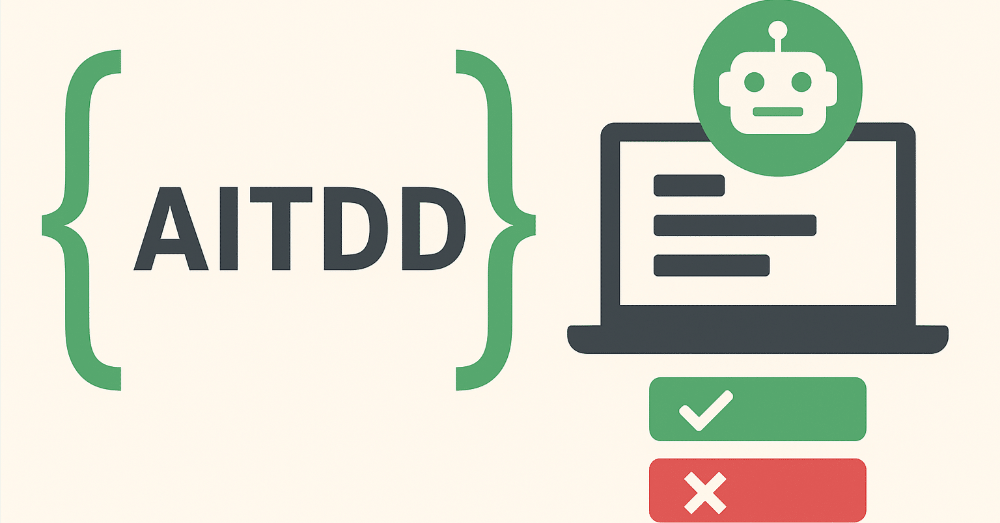
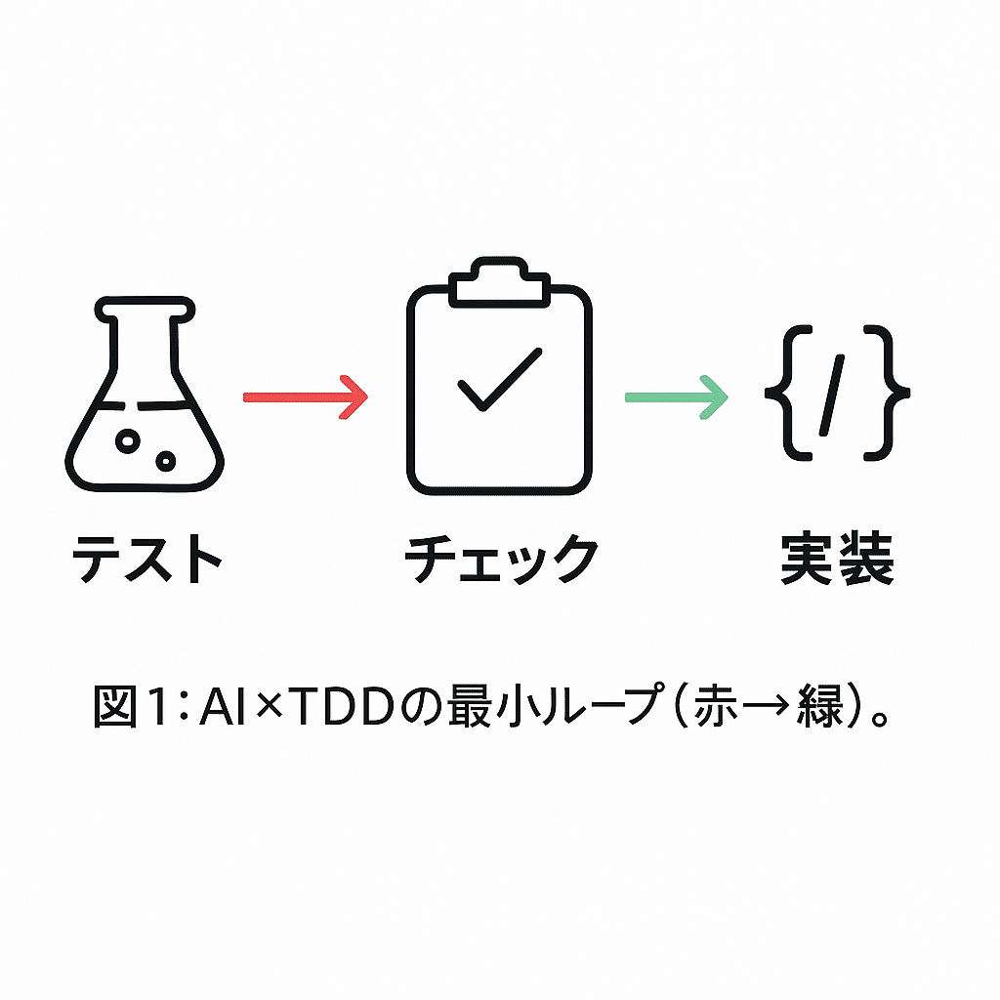
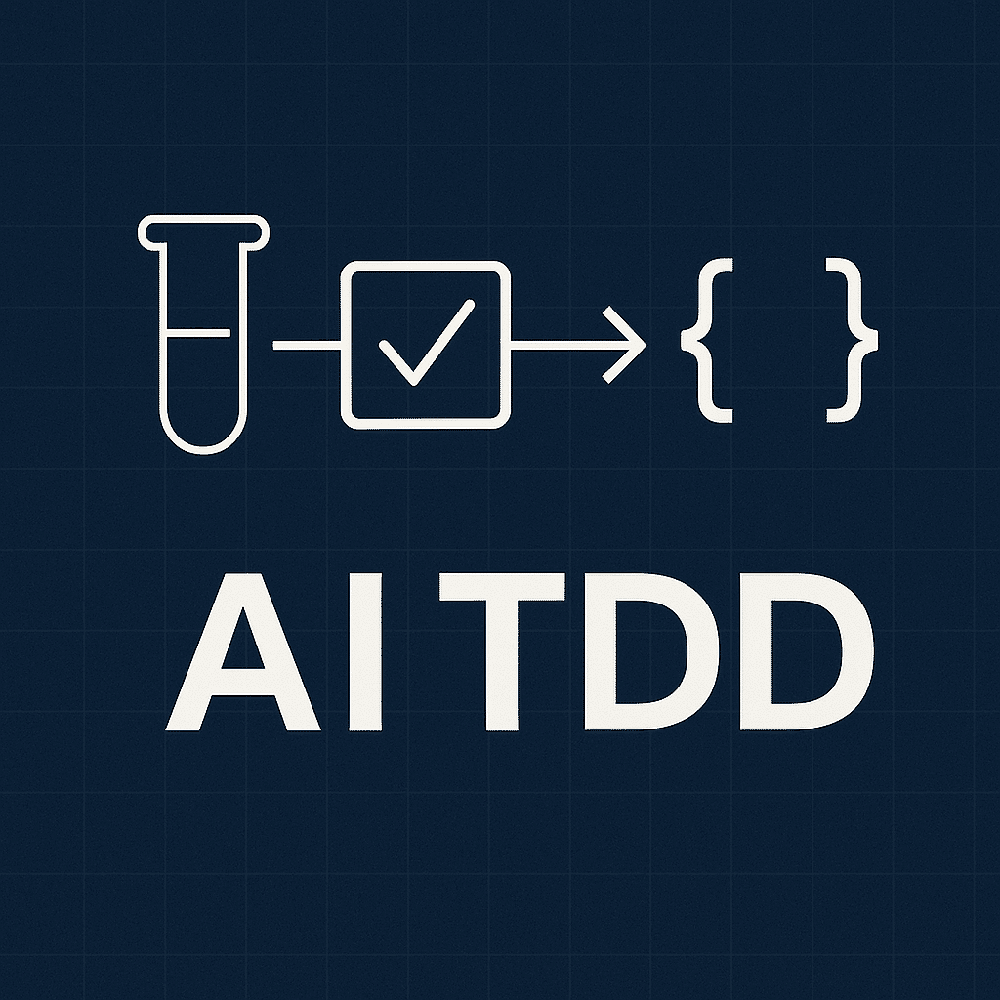

# AITDD実践録：AIエージェント(Claude Code/Gemini CLI)だから「テストが先に動く」開発を日常化する

> 出典: https://note.com/mine_unilabo/n/nc62d478194d3  
> 公開状態: publish  
> 更新: Wed, 06 Aug 2025 00:19:01 +0900



> **副題：AIとのペアプロだから、先にテストを書く！**

五反田のスタートアップでプロダクト開発をしている、みね（@[mine\_take](https://x.com/mine_take)）です。
※本記事は個人の活動による記事であり、会社の公式見解ではありません

## リード（3行要約）

AIと一緒にコードを書くと、先に実装（動くもの）を出力せたくなる。でもそれでは**動くけれど怖いコード**が増える。
本記事は、AI補助のTDD＝**AITDD**を「型（運用）」として導入し、**先にテストを書く→RedをGreenにする最小変更**を回す方法をまとめた。
成果は **修正の速さ（Lead Time）** と **変更の安全性（失敗変更率/網羅率）** に表れる。

## 目次

---

## Quick Start（3分で“Red→Green”）

対象読者：**Node.js 20**／任意のOS／エディタ自由（VS Code推奨）。
最短経路はVitestで示す（本文ではJest例も併記）。

```
# 1) プロジェクト最小セット
npm create vite@latest aitdd-sample -- --template react-ts
cd aitdd-sample && npm i -D vitest @testing-library/react

# 2) 最初のRed（テスト）
mkdir -p src/__tests__
cat > src/__tests__/sum.test.ts <<'EOF'
import { sum } from "../sum";
test("null/undefinedは0扱い", () => {
  expect(sum(undefined as any, 3)).toBe(3);
  expect(sum(null as any, 3)).toBe(3);
});
EOF

# 3) 実装（最小でGreenに）
cat > src/sum.ts <<'EOF'
export function sum(a?: number | null, b?: number | null): number {
  const A = a ?? 0; const B = b ?? 0; return A + B;
}
EOF

# 4) テスト実行
npx vitest run
```



「テスト→チェック→実装」の順序を示す抽象アイコン

---

## なぜいまTDDか（AI時代の前提）

- **AIは“説明できるが、保証しない”**：仕様遵守の担保は人とテストに帰結する。
- **テストは境界条件**：AI/人/メンバー間の前提ズレを防ぐ**自動ドキュメント**。
- **速度×安全の両立**：**先にテスト**があると、AIの出力を**合否**で即判定できる。

---

## ワークフローの型

1. **Issue定義**：受け入れ条件（AC）とテスト観点を最初に列挙。
2. **テスト作成**：Jest/Testing Library/PlaywrightでRedを作る。
3. **AI実装**：Claude Code/Gemini CLIに\*\*“Redをにする最小変更”\*\*を促す。
4. **リファクタ**：Greenのまま設計を整える（型/責務分離）。
5. **CI**：PRで自動テスト＋lint＋型チェックを通す。
6. **学びの記録**：プロンプト/失敗例/Fixをナレッジ化。



---

## ツールの役割分担

- **Claude Code**：リポジトリ文脈を読ませた**差分提案**に強い（MCP拡張）。
- **Gemini CLI**：**短サイクル生成・修正**やスクリプト化で強い（Flash/Proを使い分け）。
- **CI（GitHub Actions）**：テストを**必須のゲート**として「通らないとマージできない」**状態にし、品質基準を**自動で可視化・強制**する**自動審査レーン。

---

## 実践ステップ（テンプレ付き）

### 1) Issue テンプレ

```
## 背景
（なぜ今やるのか）

## ゴール
（ユーザー価値/完了の定義）

## 受け入れ条件（AC）
- [ ] 条件A
- [ ] 条件B

## テスト観点
- 正常系：
- 異常系：
- 端境界：
```

### 2) テスト先行（Jest/Testing-Library）

```
// __tests__/sum.test.ts
import { sum } from "../src/sum";

describe("sum", () => {
  it("正の整数の加算を行う", () => {
    expect(sum(2, 3)).toBe(5);
  });
  it("null/undefinedは0として扱う", () => {
    expect(sum(undefined as any, 3)).toBe(3);
    expect(sum(null as any, 3)).toBe(3);
  });
});
```

### 3) AIへの指示（Claude Code向け）

```
あなたはTDDで開発するペアプログラマです。
今はテストがRedの状態です。次の制約で“最小の変更”だけを提案してください。

- 既存テストを変更しない（要件の代替解釈でのすり替え禁止）
- 例外条件はテストケースを追加してから実装する
- 変更ファイルと差分説明を出力

対象: __tests__/sum.test.ts が通る実装
```

### 4) AIへの指示（Gemini CLI向け）

```
role: system
content: |
  あなたはTDDの相棒。出力は常に:
  1) 変更方針(1段落)
  2) 変更差分(patch形式)
  3) 影響範囲と追加テスト提案（箇条書き）
```

### 5) 実装（最小）

```
// src/sum.ts
export function sum(a?: number | null, b?: number | null): number {
  const A = a ?? 0;
  const B = b ?? 0;
  return A + B;
}
```

### 6) CI（GitHub Actionsの最小例）

```
name: ci
on:
  pull_request:
    branches: [ main ]
jobs:
  test:
    runs-on: ubuntu-latest
    steps:
      - uses: actions/checkout@v4
      - uses: actions/setup-node@v4
        with:
          node-version: '20'
      - run: npm ci
      - run: npm run lint --if-present
      - run: npm test -- --ci
```

### 5) 実装（最小）

```
// src/sum.ts
export function sum(a?: number | null, b?: number | null): number {
  const A = a ?? 0;
  const B = b ?? 0;
  return A + B;
}
```

### 6) CI（GitHub Actionsの最小例：mainで統一）

```
name: ci
on:
  pull_request:
    branches: [ main ]
jobs:
  test:
    runs-on: ubuntu-latest
    steps:
      - uses: actions/checkout@v4
      - uses: actions/setup-node@v4
        with:
          node-version: '20'
      - run: npm ci
      - run: npm run lint --if-present
      - run: npm test -- --ci
```

---

## 失敗パターンと回避策

- **（悪手）** 先に実装をAIに書かせてからテストを足す
  → **対策**：「テスト未作成はPRを弾く」ルール＋PRテンプレでAC必須化。
- **（悪手）** テストが仕様ではなく“実装に寄り添う”
  → **対策**：\*\*振る舞い（ユーザー視点）\*\*で書く。DOMはRole/Label、APIは入出力契約を固定。
- **（悪手）** Redが大きすぎる
  → **対策**：**1PR = 1テストのGreen化**まで刻む。AIも人も迷子にならない。

---

## 測定のしかた（最小）

- **Lead Time for Changes**：Issue作成→PRマージの経過時間（GitHub APIで週次集計）。
- **失敗変更率**：`revert` / `hotfix` ラベル付きマージ数 ÷ 総マージ数（週次）。
- **往復回数**：PRコメント数（Bot除外）。レビュー1ラウンド短縮を目標。
- **網羅率**：Linesより**クリティカルパス**のテスト有無を管理。

---

## 用語の最小辞書

- **AITDD**：AI補助のTDD。**テスト先行**でAI出力を常に**合否判定**する運用。
- **AC**：受け入れ条件。満たされればDone。
- **MCP**：Claude Codeの拡張プロトコル。外部ツールと接続する仕組み。
- **Red/Green**：テスト失敗/成功の状態。

---

## よくある質問（FAQ）

**Q. 生成AIにテストも書かせていい？**
A. OK。ただし**先にテスト**、次に実装。順序だけは崩さない。

**Q. どこから導入すべき？**
A. **幸せな経路1本**から。E2EはPlaywrightで最小、ユニットはクリティカルな純関数から。

---

## まとめ

- **AIとのペアプロこそ、先にテストを書く。** 先に“Red”を作れば、AIの出力は合否で即判定できる。
- **型で回す（Issue → テスト → 実装 → リファクタ → CI）。** 文化ではなく運用として固定化する。
- **CIは自動審査レーン。** テストを**必須のゲート**にし、「**通らないとマージできない**」を当たり前にする。
- **測って改善する。** Lead Time、失敗変更率、往復回数、クリティカルパスの網羅率を週次で見る。
- **小さく始めて広げる。** 幸せな経路1本から、「1PR＝1テストのGreen化」でサイクルを刻む。

明日やることはシンプルです。**Redを作る → AIにGreenにさせる → CIで通す**。この最小ループを日常化すれば、速さと安全は両立できます。

## まとめ

- **AIとのペアプロこそ、先にテストを書く。** 先に“Red”を作れば、AIの出力は合否で即判定できる。
- **型で回す（Issue → テスト → 実装 → リファクタ → CI）。** 文化ではなく運用として固定化する。
- **CIは自動審査レーン。** テストを**必須のゲート**にし、「**通らないとマージできない**」を当たり前にする。
- **測って改善する。** Lead Time、失敗変更率、往復回数、クリティカルパスの網羅率を週次で見る。
- **小さく始めて広げる。** 幸せな経路1本から、「1PR＝1テストのGreen化”でサイクルを刻む。

明日やることはシンプルです。**Redを作る → AIにGreenにさせる → CIで通す**。この最小ループを日常化すれば、速さと安全は両立できます。

---

## 参考リンク（公式）

- Jest（公式）：<https://jestjs.io/>
- Testing Library（公式）：<https://testing-library.com/docs/react-testing-library/intro/>
- Playwright（公式）：<https://playwright.dev/>
- GitHub Actions（公式）：<https://docs.github.com/actions>
- Gemini API（公式）：<https://ai.google.dev/gemini-api>
- Claude Code（ドキュメント）：<https://docs.anthropic.com/claude/docs/claude-code>

---

## CTA（次アクション）

- **PRテンプレ（Markdown）と**GitHub Actions CIの最小雛形を公開予定。
- 続編「E2E編：Playwrightで「ユーザーの行動」から赤を作る」を近日公開。
- 感想・質問はコメントへ。**実装で詰まった箇所**を教えてください。記事で取り上げます。
