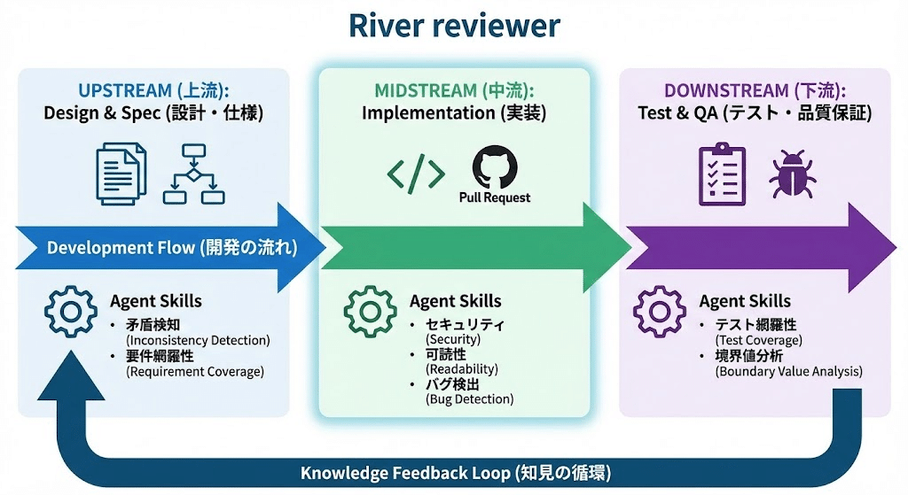
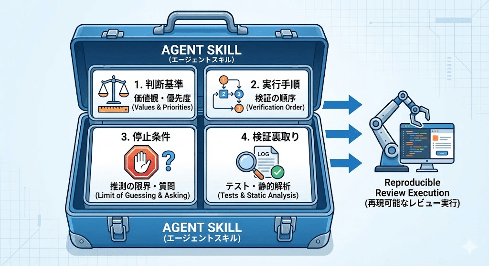
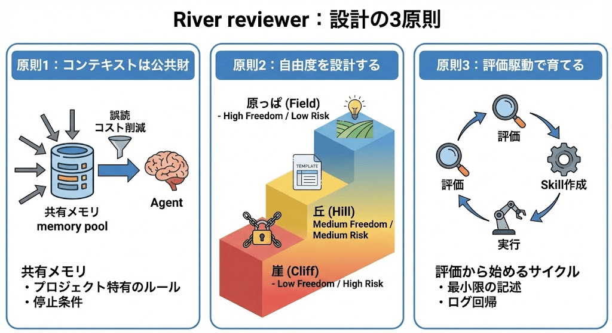
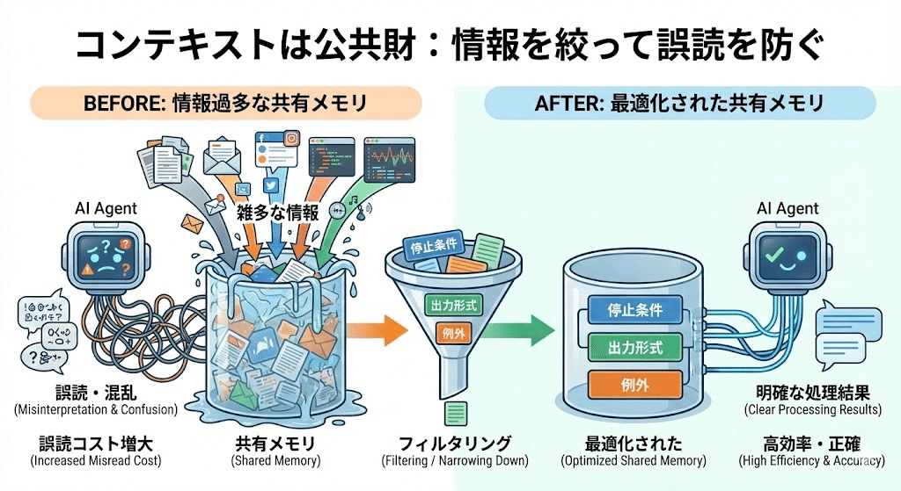
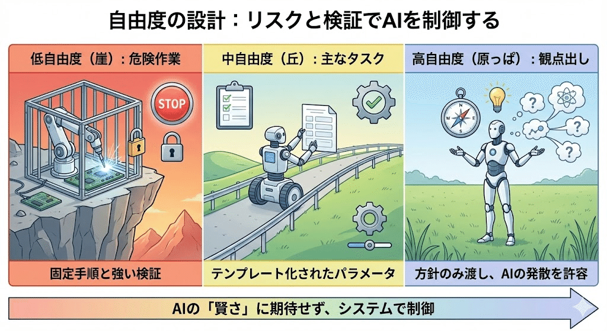
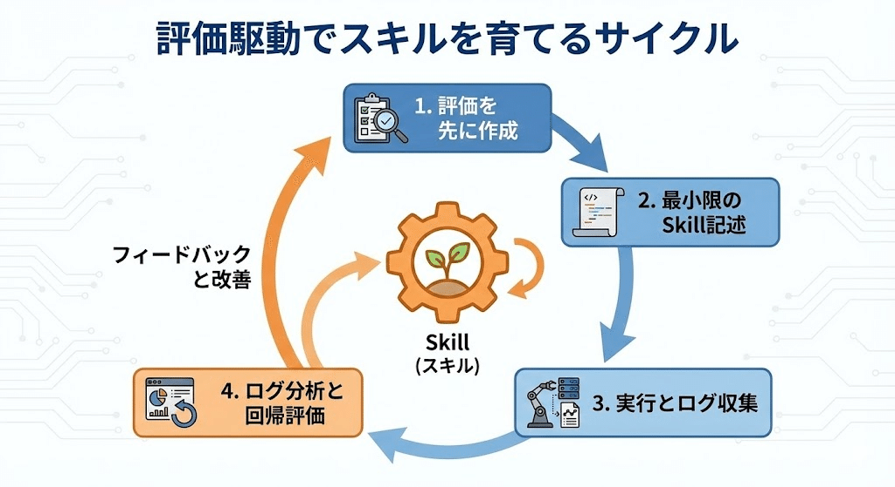
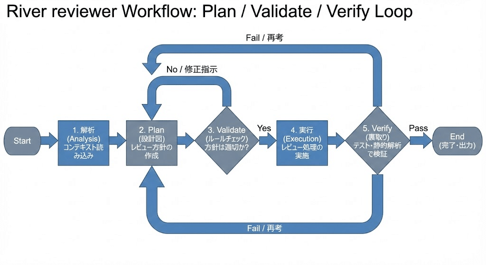
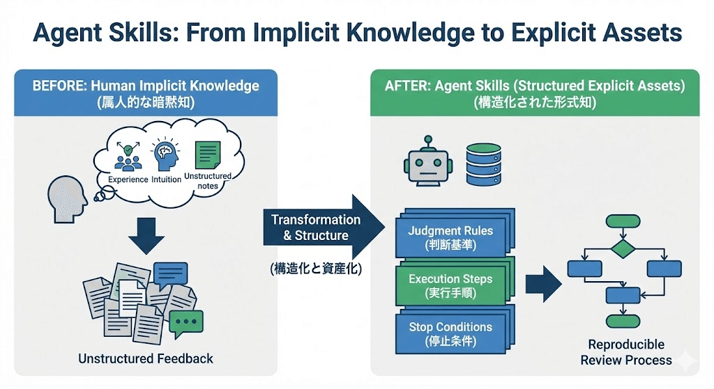

# 「プロンプトを磨けば勝てる」をやめた：AIレビューを運用に乗せる“Agent Skills”設計

> 出典: https://note.com/mine_unilabo/n/nd21c3f1df22e  
> 公開状態: publish  
> 更新: Fri, 26 Dec 2025 04:00:56 +0900  
> 区分: 個人

こんにちは、みね[@mine\_take](https://x.com/mine_take)です。 普段はベンチャー企業でEMとして働きつつ、個人開発でAIを使ったコードレビューの実験的フレームワーク「River Reviewer」を作っています。 この記事では、その開発プロセスで直面した課題と、それを乗り越えるために生まれた「Agent Skills」という設計思想の現在地を共有します。

以前は「プロンプトを磨けばAIコードレビューは勝てる」と本気で思っていました。ところが、運用に入れた瞬間に崩れました。指摘のブレ、コンテキストの多重管理、ツール連携の複雑さ――気づけば、改善しているのはプロンプトではなく“運用の手間”だけ。
そこで発想を変えて、残った課題を「レビュー判断の再現性」と捉え直しました。

## はじめに：この記事の目的

この記事の目的は、AIレビューを**職人芸のプロンプト**から解放し、チーム運用に乗る形へ近づけるための設計メモを共有することです。

具体的には、判断基準や手順を Agent Skills として外出しし、HITL（Plan / Validate / Verify）で育てていくアプローチを紹介します。なお本記事は完成形の解説ではなく、実装と検証の途中経過です。だからこそ、うまくいかなかった点（地雷）も含めて、再現できる形で残します。

> **HITL**（Human-in-the-Loop、人間参加型）における「Plan / Validate / Verify」は、AIや自動化システムの開発・運用プロセスにおいて、人間の専門的な判断と機械の効率性を組み合わせるための**継続的な品質管理サイクル**を表しています。このフレームワークは、AIシステムの精度、信頼性、安全性、および倫理的側面を確保することを目的としています。

ソフトウェア開発プロセスにおいて頻発する以下の課題に対し、**Agent Skills（AIエージェントの振る舞い）** をどう設計すれば、チームの暗黙知を再現可能な知見として定着させられるか。その設計思想の“芯”を言語化します。

- **観点のブレ**: 指摘内容が実行のたびに変わってしまう
- **説明の多重管理**: 同じ方針を複数の場所で説明・更新し続けるコスト
- **情報の風化**: 成功の要因が言語化されず、再現性が失われる

---

## 1. River Reviewerとは

レビュー工程を「上流（設計・仕様） → 中流（実装） → 下流（テスト・QA）」のストリームとして構造化し、フェーズごとに最適なレビュー観点を抽出・実行可能にする実験的フレームワークです。

単なる自動化ツールではなく、以下の3つのアプローチを検証しています。

River Reviewerの概念図

- **「面」の資産化**: 現場の判断基準や手順を Agent Skills としてパッケージ化し、組織の資産に変える
- **SDLC全域のカバー**: 各工程に点在する観点を構造化し、開発プロセス全体で一貫性を担保する
- **ログによる育成**: 実行ログを蓄積し、評価フィードバックを通じてスキルを継続的に改善する

---

## 2. Agent Skills：暗黙知を再現する「道具箱」

ここで定義する **Agent Skills** は、AIに新たな知能を授ける魔法ではなく、これまで人間が都度説明していた「判断基準」や「手順」という暗黙知を、再利用可能な形にまとめたものです。

イメージとしては、**「業務マニュアル付きの道具箱」** です。持ち運べる“仕事の筋”を定義することを目指しています。

AGENT SKILLを外出し

### 「AIを使う」から「役割を渡す」へ

開発を通じて、AIへの期待が「回答を得る」ことから「レビューの役割を担ってもらう」ことへと変化しました。

- **観点を出す**: チェックすべき観点の発散
- **優先度をつける**: 危険なものを優先的に指摘する
- **根拠を集める**: どの変更がどこに影響するかを特定する
- **検証を促す**: テストや静的解析による裏取りを求める

---

## 3. 試行錯誤から学んだ「4つの地雷」

実際に直面した失敗とそこからの教訓を整理します。

### 1) プロンプト最適化への固執

「プロンプトを磨けば勝ち」だと思っていましたが、実行のたびに指摘がブレてしまい、運用に乗らない時期がありました。

- **教訓**: 精度そのもの以上に「再現性」がないと、仕組みとして信頼されない。

### 2) プロンプトへの詰め込みすぎ

「全部任せよう」として情報を詰め込みすぎた結果、AIの精度が低下しました。

- **教訓**: 適切な分量と情報の「階層（読む順番）」の設計が必要。

### 3) 複数エージェントの個別最適

複数のAIを動かすと重要度の基準がエージェントごとにズレてしまい、意思決定を遅らせる原因になりました。

- **教訓**: 個別の観点を増やす前に「優先度の基準」や「停止条件」を共有させるべき。

### 4) プロンプトの多重管理

エージェントごとに指示を書くと更新漏れが発生し、運用負債化しました。

- **教訓**: 方針は個別に持たせず、共通資産（Skill）に寄せるのが「筋が良い」。

---

## 4. 設計の3原則

これらを踏まえ、River Reviewerでは3つの設計原則を置いています。

### 原則1：コンテキストは公共財

Agentに渡す情報は「共有メモリ」です。増やしすぎると誤読コストが増大するため、プロジェクト特有の「停止条件・出力形式・例外」に情報を絞ります。

コンテキストは公共財

### 原則2：自由度を設計する

AIの「賢さ」に期待して丸投げするのではなく、**失敗したときのリスク**と**検証のしやすさ**で“自由度（＝裁量の幅）”を先に決めます。
自由度が上がるほど発想は広がりますが、そのぶん出力のブレも増え、検証コストも上がる。だからこそ、タスクごとに自由度を三段階で設計します。

- **低自由度（崖）**

  - 事故ると困る領域。**固定手順 + 強い検証**をセットにします。
    対象例：セキュリティ／破壊的変更／規約違反など
  - やり方：入力を定型化し、許可する操作を限定する（チェックリスト、必須テスト、静的解析、承認フローなどで“落下防止柵”を作る）
  - 停止条件：情報が足りないなら推測せず質問に切り替える
- **中自由度（丘）**

  - 日常的に発生するメインのレビュー領域。**テンプレート化 + パラメータ調整**で制御します。
  - 対象例：lint／命名／一般的な設計・可読性
  - やり方：優先度（must/want）や観点（性能/保守性/可読性）をパラメータとして渡し、出力の粒度と範囲を安定させる
- **高自由度（原っぱ）**

  - 探索・発散が価値になる領域。**方針だけ渡して発散を許容**します。
  - 対象例：観点出し／問いの生成／未知のリスク洗い出し
  - やり方：背景・制約・ゴールだけ共有し、まずは広く出させてから、人間側で束ねて優先度付けする

自由度の設計：リスクと検証でAIを制御

### 原則3：評価駆動で育てる

Skillは書いて完成ではなく、運用ログで回帰させながら育てます。評価を先に作り、最小限の記述から始めるサイクルを重視します。

評価駆動でスキルを育てる

---

## 5. ワークフロー：HITL（Human in the Loop）で「手戻り」を断つ

AIエージェント開発で陥りがちなのが、指示だけ投げて結果を祈る「投げっぱなし（Fire-and-Forget）」の実装です。しかし、複雑なレビュータスクでこれをやると、的外れな指摘の山が返ってくるだけです。

River Reviewerでは、意図的に **HITL（Human in the Loop：人間が介入するループ）** を設計の中心に据えています。

特に重要なのが、AIがいきなりコードを読むのではなく、まず**「どうレビューするか（Plan）」**を人間に提案し、合意（Validate）形成するプロセスです。

1. **解析 (Analysis)**: コンテキストの読み込み
2. **Plan (設計図の提案)**: 「今回はセキュリティ重点で、ここを見ます」とAIが方針を提示
3. **Validate (HITLによる合意)**: 人間が「OK」または「いや、そこは見なくていい」と軌道修正する
4. **実行 (Execution)**: 合意された方針に基づいて実際の処理を行う
5. **Verify (裏取り)**: テストや静的解析の結果でAIの主張を検証する

Workflow：Plan / Validate / Verify

### なぜ「結果」ではなく「計画」をレビューするのか？

結果が出てから「その観点は不要だった」と修正するのは、時間とトークンの無駄です。
**「AIの思考プロセス（Plan）」** に人間が介入（HITL）することで、実行コストをかける前に認識のズレを解消できます。これにより、AIは「勝手に動くツール」から「合意形成できるパートナー」へと変わります。

## 6. 今日からできる「10行ルール」

まずは、普段チャットで長く説明している作業を1つ選び、判断基準を10行以内に削ってみてください。

**記入例：**

- **優先度**: セキュリティ > データ破壊 > 後方互換性 > 性能 > 可読性
- **禁止事項**: 仕様が不明なまま推測で断定しない
- **停止条件**: 情報が不足していれば保留して質問に切り替える
- **例外**: 認証・課金・データ移行は固定チェックを必須とする
- **Verify**: テスト結果や差分影響範囲の裏取りを要求する

---

## まとめ：「個人の言語化力」から「組織のフレームワーク」へ

『プロンプトを磨けば勝てる』をやめた結果、残った課題は「判断基準の再現性」だった。

これまでのAI活用は、プロンプトを書く個人の「言語化能力」や「暗黙知」に依存する側面が強くありました。いわば、個人スキルに寄った「ワンオフ実装」の世界です。

Agent Skills：From Implicit Knowledge to Explicit Assets

しかし、Agent Skillsのアプローチは、その優れた思考プロセスを「ライブラリ」や「フレームワーク」のように外出しし、誰もが使える共有資産に変える試みだと言えます。 「あの人が見るとバグが見つかる」という属人的な現象を、設計された思考ルートとして実装し、再現可能にする。

River Reviewerは、レビューという高度な知的作業において、この**「思考のフレームワーク化」**を検証するための実験場です。個人の才能に頼るのではなく、育て上げたSkillsという資産で、チーム全体の開発品質を底上げすることを目指しています。

---

## 宣伝：River Reviewerを開発中です

今回ご紹介した「Agent Skills」の設計思想を具現化するプロジェクトとして、River Reviewer をオープンソースで公開しています。この記事の“運用に乗せる”を、実装で試しているのが River Reviewer です。

現在はまだ一人での個人開発として試行錯誤を続けている段階ですが、この設計思想に共感いただけた方は、ぜひGitHubでの **Star** をいただけると非常に励みになります！また、同じような課題を感じている方からの **Issue** でのご意見や議論も大歓迎です。

- **GitHubリポジトリ**: <https://github.com/s977043/river-reviewer>
- **公式ドキュメント**: <https://river-reviewer.vercel.app/explanation/intro/>

AIレビューを「単なる自動化」から「組織の知見を成長させる仕組み」へと進化させるために、今後も開発を続けていきます。
